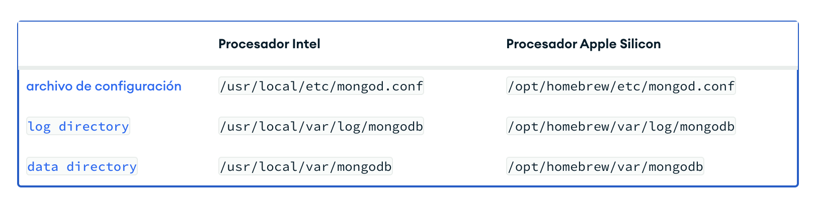

## Tema 1. Métodos de captura de información

## 1.2. Origen y calidad de los datos

**Datos, información y conocimiento**

- En situaciones informales es común usar indiscriminadamente los términos dato,
información y conocimiento. En ámbitos profesionales y académicos, es
conveniente distinguir estos conceptos para evitar malinterpretaciones durante las
distintas fases de la analítica de datos.

- La información puede distinguirse simplemente como un mensaje formado por la
composición de varios datos.

- Los datos deben ser transformados para añadirles valor y convertirlos en
información. 

- Estas transformaciones incluyen métodos como:
    - Contextualización: conocer el propósito del dato obtenido.
    - Categorización: conocer la unidad de medida y los componentes del dato.
    - Cálculo: realizar una operación matemática sobre el dato.
    - Corrección: eliminar errores del dato.
    - Agregación: resumir o minimizar un dato de forma más concisa.

- El conocimiento implica una combinación de experiencias, información contextual y
relevancia sobre cierta información. Así como la información se genera a partir de
datos, el conocimiento surge de la agregación de información. 

**Ejemplos de métodos que generan esta transformación son:**
- Comparación: relación entre información obtenida en distintas experiencias.
- Repercusión: implicación de la información en decisiones y acciones.
- Conexión: relación entre distintos tipos de información.
- Conversación: opinión de otras personas sobre la información.

## 1.3. Organización de los datos

**Ficheros planos* 
Los ficheros planos suelen ser un mecanismo utilizado para el intercambio de
información entre sistemas. Una de sus ventajas es que es posible ver y editar el
contenido del fichero con una herramienta de edición de texto.

Estos ficheros suelen ser mucho más verbosos que los ficheros en formato binario, lo
cual implica que su tamaño en el sistema de ficheros será mayor, así como las
operaciones necesarias para procesar el contenido desde un programa de software.

**Entre los formatos de fichero plano más comunes se pueden mencionar**  
- CSV 
- JSON
- XML. 

**Bases de datos**
Una base de datos es un conjunto de datos persistente utilizado por un sistema de
software. Siguiendo con las definiciones, y tal y como se menciona en la bibliografía,
un sistema de base de datos es un sistema computarizado para el almacenamiento
de registros. Se pueden mencionar cuatro componentes de un sistema de esta
categoría:

- Datos. Los datos en un sistema de base de datos pueden definirse como
integrados, en aquellos casos en que todos los datos se mantienen unificados y
comúnmente serán accedidos por una sola persona, así como compartidos, para
aquellos casos en los que se desea mantener los conjuntos de datos separados y
otorgar privilegios de acceso distintos a varias personas.

- Hardware. Como en otros métodos de almacenamiento, los componentes de
hardware que intervienen en un sistema de base de datos son los volúmenes de
almacenamiento, así como los procesadores y memoria principal.

- Software. La capa de software entre el usuario y la base de datos física se conoce
como DBMS (Database Management System o sistema gestor de la base de datos).
Usuarios. Existen tres clases de usuarios en un sistema de bases de datos:
Programadores: encargados de crear aplicaciones que permitan la interacción con
la base de datos.

- Usuarios finales: utilizan las distintas aplicaciones y herramientas para interactuar
con la base de datos.

- Administrador de base de datos: también conocido como DBA por sus siglas en
inglés, se encarga de gestionar la estructura, disponibilidad y eficiencia del sistema
de base de datos.

## Tema 2. NoSQL

## 2.1. Introducción y objetivos

**Concepto** 
>  El término NoSQL se definió en 2009 con el fin de agrupar todas aquellas bases de datos no relacionales que estaban ganando popularidad en ese momento. 
- El término NoSQL hace alusión a métodos de almacenamiento no necesariamente estructurados
- cuyo nombre se refiere al lenguaje de consulta «no es SQL» o «no solo es SQL», «Not only SQL».

**Caracteristicas** 
- No es una tecnilogia tan nueva se ideo en los 60 
- El nombre NoSQL fue utilizado por Carlo Strozzi en 1998
- En esa fecha aun seguia siendo una base datos relcional solo era una interfaz SQL por lo que formaba parte del movimiento SQL 
- El término volvió a surgir en 2009
- **Eric Evans** lo utilizo para referirse al continuo aumento de bases de datos no relacionales. 
- Aunque el nombre naciera en 2009, las bases de datos NoSQL se remontan a la época de las bases de datos de red y jerárquicas
- otras tendencias NO SQL como Las bases de datos MultiValue fueron desarrolladas por TRW en 1965.
- En 1966 se desarrolló en el Hospital Mass General un lenguaje de programación que incorpora
una base de datos jerárquica con almacenamiento de árbol B+
- IBM IMS con Rockwell y Caterpillar desarrollaron una base de datos jerárquica para
el programa espacial Apolo en 1966 
- Las bases de datos NoSQL fueron diseñadas precisamente para ser escalables y
distribuidas

## 2.2. Descripción y tipos de bases de datos NoSQL

**Categorías conocidas**

> Las bases de datos NoSQL pueden clasificarse en cuatro grandes categorías:

- Almacenes de clave-valor simples: Como su nombre indica, utilizan una clave
para acceder a un valor en específico. Los valores almacenados se manejan como
arrays de bytes, es decir, sin ningún esquema específico asignado. Su aplicación es
común en sistemas de caché. Uno de los sistemas más conocidos en esta categoría
es memcached, el cual es el sistema de facto para la gestión de caché de datos en
aplicaciones web.

- Almacenes de clave-valor sofisticados: Estos sistemas son un refinamiento de la
categoría anterior con el objetivo de permitir operaciones de lectura y escritura más
complejas, así como un modelo de datos ligeramente más elaborado. Ejemplos de
sistemas en esta categoría son Cassandra, Dynamo, Voldemort y Riak

- Almacenes de documentos: Los sistemas dentro de esta categoría permiten
almacenar estructuras de datos relativamente complejas. Las implementaciones más
conocidas en este grupo son CouchDB y MongoDB

- Almacenes de grafos: Las bases de datos que entran en esta categoría son las que
almacenan la información en estructuras de grafos, cuyos nodos representan la
información y las aristas, sus relaciones. Las bases de datos de grafos brindan la
facilidad de consultar su información aplicando teoría de grafos.

- multimodelo: entro de este tipo de bases de datos se encuentra Redis. Redis es una base de
datos NoSQL multimodelo que permite búsquedas, mensajería, transmisión, grafos y
otras capacidades más allá de las que ofrece un simple almacén de datos

## 2.3. Teorema CAP

**Concepto**
> (que pueda crecer sin mayores contratiempos) y que además trabaje en entornos distribuidos.

´´´El teorema CAP, o también llamado teorema Brewer, indica que todos los sistemas
distribuidos no pueden garantizar a la vez que haya consistencia, disponibilidad y
tolerancia a particione´´´

- Consistencia: sin importar qué servidor reciba la petición, cuando se realiza una
consulta o se hace una inserción, el sistema siempre debe devolver la misma
información de respuesta.

- Disponibilidad: la caída de uno o más nodos no debe ser un impedimento para que
los clientes puedan leer y escribir peticiones.

- Tolerancia a particiones: hace referencia al hecho de que el sistema tiene que
seguir funcionando, aunque existan fallos o caídas parciales que dividan el sistema.
La división por particiones es una característica de los sistemas distribuidos que
permite canalizar grandes flujos de peticiones.

**Según sus capacidades, es posible ver cómo las distintas bases de datos cumplen al
menos dos de los criterios indicados por el teorema CAP.** 

- CA: garantizan la consistencia y la disponibilidad en la base de datos, pero no
suelen ser óptimas al manejar la tolerancia a particiones. Para cubrir esta
deficiencia, lo que suelen hacer es replicar los datos.

- AP: garantizan la disponibilidad y la tolerancia a particiones, pero no suelen ser
buenas tratando la consistencia. Determinados motores logran una consistencia
parcial mediante técnicas de replicación y verificación.

- CP: garantizan la consistencia y la tolerancia a particiones, pero sacrifican la
disponibilidad al replicar los datos entre los distintos nodos con el fin de asegurar la
consistencia

2.4. Elección de base de datos: NoSQL vs. SQL

> Se puede decir que las bases de datos tradicionales son las bases de datos relacionales, que usan un lenguaje estándar para su manipulación y gestión. 
- Su éxito se basa en que es una solución para los problemas de gestión y estructuración de la
información de las organizaciones. 
- Se basa de usar un un fundamento matemático muy fuerte.
- Se apoya en lenguaje estandarizado con metodologías estructuradas para el diseño de los
sistemas de información
- Se rigen por el principios de diseño como la regla ACID (Atómica Consistente Aislada y Durable).

> Las NoSQL son un conjunto de bases de datos que no se ajustan al modelo de base de datos relacional y se caracterizan por no tener esquema, 
- Por no utilizar SQL ni permitir joins, por no garantizar la propiedad ACID, por escalar horizontalmente, 
- Por hacer uso amplio de la memoria principal del ordenador.
- por resolver el problema de los altos volúmenes de información y la inmensa cantidad de consultas y transacciones diarias. 

**Ejemplo**

Una de las características de NoSQL, como ya se ha dicho antes, es la flexibilidad
que proporciona para el uso de modelos de datos, la cual permite tener registros con
modelos diferentes. Se puede disponer de registro en el que el atributo «color»
aparezca o exista y de registros similares que no contengan dicho atributo, y en otros
casos que el atributo sea un array o una cadena de caracteres, sin que ocasione
ningún tipo de error en base de datos.

**Ventajas**
- Responden a la necesidad de escalabilidades horizontal demandada cada vez por más empresas y, además, de manera sencilla.
- No generan cuellos de botella.
- Permiten manejar grandes volúmenes de datos.
- Se pueden tener diferentes bases de datos NoSQL para diferentes proyectos.
- Equipos económicos para la puesta en marcha.

**desventajas**
- No ofrecen tanto soporte y nombre como lo hacen bases de datos como Oracle, IBM o Microsoft. 
- Generalmente un vendedor de código abierto no tiene el alcance global, servicios de soporte y la credibilidad de Oracle o IBM.
- No están lo suficientemente maduras para algunas empresas.
- Limitaciones de inteligencia de negocios. 

Por el momento, las bases de datos
NoSQL no tienen buena aceptación con las herramientas de BI, lo que origina que
una consulta ad hoc y su análisis implica conocimientos avanzados de
programación. Sin embargo, esta tendencia está cambiando, por ejemplo, Quest
Software ha creado Toad para bases de datos en la nube, que proporciona
capacidades de consulta ad hoc para algunas bases de datos NoSQL.

- La falta de experiencia. Debido a que NoSQL es una tecnología novedosa, no hay
una gran cantidad de desarrolladores y administradores que la dominen

- Problemas de compatibilidad. A diferencia de las bases de datos relacionales, que
comparten ciertos estándares, las bases de datos NoSQL tienen pocas normas en
común. Cada base de datos NoSQL tiene su propia API, las interfaces de consultas
son únicas y tienen peculiaridades. Esta falta de normas hace difícil el cambio de
unos proveedores a otros.

2.5. Bases de datos NoSQL

**Cassandra**
Apache Cassandra es una base de datos NoSQL distribuida de código abierto escrita
en Java. Está basada en un modelo de almacenamiento clave-valor y se caracteriza
en que los nodos que componen el sistema de datos actúan por igual agrupándose
en un anillo o clúster

**Caracteristicas**
Modelo  
- Clave-Valor

Arquitectura 
- Descentralizada 

Sistema de datos 
- Anillos o clouster
- Permite configurar un sistema de replicas 
- Tienes tablas filas y columnas 
- Las filas tienen una clave de aprticiona 
- las columnas tiene un clave valor para interactuar con los datos
- Usa CQL es una simplificacion de sql 
- Usa Shell para accder a los datos

**Neo4j**
Es un sistema de gestión de base de datos basada en grafos, desarrollado por Neo
Technology, Inc en Java lanzada en febrero del 2010. Descrito por sus
desarrolladores como una base de datos transaccional compatible con ACID con
almacenamiento y procesamiento de grafos nativos.

Un grafo se compone de dos elementos: un nodo y una relación. Cada nodo
representa una entidad (una persona, un lugar, una cosa, una categoría u otra pieza
de datos) y cada relación representa cómo se asocian dos nodos. 

Esta estructura de propósito general permite modelar todo tipo de escenarios, desde un sistema de
carreteras hasta una red de dispositivos, la historia médica de una población o
cualquier otra cosa definida por las relaciones.
Una base de datos de grafos es un sistema de gestión

**Caracteristicas**
- Estas BD estan disenadas para operaciones transaccionales
- Usa almacenamiento nativo 
- Rendimiento en mejora significativa en consultas relacionales 
- Flexibilidad se adapta rapidamente  
- Agilidad se integra con desarrollos agiles 
- usado para deteccion de fraudes, Motores de recomendaciones en tiempo real, gestion de datos maestros, gestion de identidad acceso. 
- Tiene software comunitario 

**MongoDB**

MongoDB (que proviene de humongous) es una de las bases de datos NoSQL
orientada a documentos desarrollada bajo el concepto de código abierto. Es una de
las bases de datos NoSQL más utilizadas en todo el mundo.
Es una base de datos ágil, que permite a los esquemas cambiar rápidamente cuando
las aplicaciones evolucionan, proporcionando siempre la funcionalidad que los
desarrolladores esperan de las bases de datos tradicionales, tales como índices
secundarios, un lenguaje completo de búsquedas y consistencia estricta
En MongoDB, los datos se almacenan en forma de un documento, el cual es una
estructura con pares clave-valor, muy similares a los objetos JSON, con la salvedad
de que MongoDB almacena los datos en formato BSON (representación binaria de
JSON). Un documento posee un atributo especial llamado _id, el cual indica el valor
que identifica de forma inequívoca al documento.
A su vez, los documentos se almacenan en collections, formando así un conjunto
de documentos con atributos similares. Podría decirse que una collection equivale a
una tabla en una base de datos relacional. Así, se puede definir una base de datos
en MongoDB como un conjunto de collections.

**Caracteristicas**

**Patrones de diseño en MongoDB**
Los patrones de diseño en MongoDB pueden agruparse en dos categorías. La
primera incluye aquellos patrones que soportan relaciones entre documentos:

Patrón de relación uno-a-uno con documentos embebidos: en este patrón se
embebe un documento dentro de otro con el cual tiene relación. Por ejemplo, se
puede contar con un documento de información de un usuario y embeber un
subdocumento con información de la dirección del usuario:
{ _id: "1", nombre: "Juan", direccion: { ciudad: "Madrid" } }

Patrón de relación uno-a-muchos con documentos embebidos: en este patrón
se embebe a varios documentos dentro de otro con el cual tiene relación. Siguiendo
con el ejemplo anterior, es probable que el usuario tenga más de una dirección, por
lo que se tiene una relación de uno (usuario) a varios (direcciones).
{ _id: "1", nombre: "Juan", direcciones: [ { ciudad: "Madrid" }, { ciudad:
"Toledo" } ] }

Patrón de relación uno-a-muchos con documentos referidos: este patrón se
suele utilizar para evitar repetición en aquellos casos en que un mismo documento
se desee embeber en otros varios. Un ejemplo de su aplicación es el siguiente:
{ _id: address1, ciudad: "Madrid" }, 
{ _id: address2 ciudad: "Toledo" }, 
{ _id:"1", nombre: "Juan", direcciones: [address1, address2] }

Patrón de relación uno-a-uno con documentos referidos: igual que el anterior,
pero solo a un documento. No es aconsejable su utilización, debido a que es más útil
utilizar documentos embebidos.
{ _id: address ciudad: "Toledo" }, 
{ _id: "1", nombre: "Juan", direcciones:address }

Patrón de modelo de estructura de árbol con referencias al nodo padre . Tal
como indica el nombre, se mantiene un atributo que almacena el _id del nodo padre.
A continuación, se muestra un ejemplo con documentos representando carpetas de
un sistema de ficheros.
{ _id: folder1, nombre: "Raíz", parent: null }, 
{ _id: folder2, nombre: "Folder 2", parent: folder1 } 
{ _id: folder3, nombre: "Folder 3", parent: folder1 }

El modelo de estructura de árbol con referencia a nodo hijo. Como indica el
nombre, implica una aproximación inversa al caso de referencias al nodo padre. El
ejemplo anterior se vería representado de la siguiente manera.
{ _id: folder1, nombre: "Raíz", children: [folder2, folder3] }
, { _id: folder2, nombre: "Folder 2", children: [ ] } 
, { _id: folder3, nombre: "Folder 3",children: [ ] }

**Notas Mongo DB** 
se compara como es mongo vs BD relacional 

**Capsulas**
- https://unir.cloud.panopto.eu/Panopto/Pages/Embed.aspx?id=b93f2fb1-390b-496b-9124-aca70108f754

## Tema 3. MongoDB

## 3.2. Descarga e instalación

## La instalación de MongoDB puede realizarse en el sistema operativo Windows mediante los siguientes pasos:

- Paso 1: descarga el fichero de instalación, en formato zip o msi, desde la siguiente
dirección web: http://www.mongodb.org/downloads

- Paso 2: en la pestaña Community Server habrá que descargar el archivo msi de
instalación. Si el sistema operativo que va a soportar la instalación es de 64 bits, se
recomienda elegir la versión de Windows. Esta versión funciona en casi todas las
versiones de Windows de 64 bits.

- Paso 3: en el caso de no tener un sistema operativo de 64 bits o querer una versión
anterior, en el enlace All Version Binaries se pueden encontrar todas las versiones
de la base de datos.

- Paso 4: instalar la aplicación siguiendo los pasos. Es recomendable utilizar un
directorio de instalación conocido, por ejemplo, C:/MongoDB/

- Paso 5: inicia el servidor de MongoDB ejecutando el programa mongod.exe, ubicado
en la subcarpeta bin.
Ten presente: a partir de la versión 3.x.x de MongoDB, el instalador sobre Windows
crea el servicio y lo incluye en la lista de procesos o servicios que ejecutará el
sistema operativo.

## La instalación de MongoDB puede realizarse en el sistema operativo MAC mediante los siguientes pasos:

- Paso 1: Me toco decsrgar el COMPASS GUI para gestionar datos en mongoDB y con mi cuenta online de Mongo para usar la herramienta en mac
- Paso 2: Descargra e instalar Compass GUI -> https://www.mongodb.com/try/download/compass 
- Paso 3: Me gusta usar la version Mongo enlinea por lo que tengo un clouster activo para mis ejemplos. 

## Directorios de la instalación
Una vez instalado, en el directorio de instalación podréis encontrar los siguientes
subdirectorios:
- bin: todos los programas que necesita Mongo para ejecutarse.
- data: el directorio donde por defecto se crearán las bases de datos.
- log: un fichero con todas las trazas de log del motor y de los accesos al servidor
mondodb.
- snmp: ficheros de configuración para una instancia de mongod como un subagente
SNMP. Esto es útil en la versión Enterprise.

a. mongod: Este es el demonio principal de MongoDB, encargado de gestionar la base de datos. Es esencial para el funcionamiento de cualquier instancia de MongoDB.

b. mongos: Este es el proceso que actúa como router en una configuración de sharding (particionamiento) de MongoDB. Coordina las solicitudes de lectura y escritura entre los diferentes shards.

c. mongostat: Esta es una herramienta de línea de comandos que proporciona estadísticas en tiempo real sobre el rendimiento de una instancia de MongoDB. Es muy útil para monitorear la salud y el desempeño de tu base de datos.

d. mongored: ¡Este es el que no existe! No hay ningún comando o ejecutable de MongoDB llamado "mongored". Es probable que haya sido una opción creada para confundir en una prueba o ejercicio.

## 3.3. Software de apoyo

## MongoBooster
MongoBooster es una herramienta GUI multiplataforma basada en shell para
MongoDB a partir de la versión 2.4, que permite la construcción de consultas fluidas,
soporte de sintaxis ES6, una experiencia IntelliSense y un gran número de
herramientas útiles para el manejo de la base de datos.

## MongoDB Compass
MongoDB también posee un software propio para la manipulación externa de su
base de datos a través de una GUI. Esta aplicación permite ejecutar consultas ad
hoc en segundos, interactuar con sus datos con funcionalidad CRUD completa y ver
y optimizar el rendimiento de la consulta. Está disponible para la mayoría de los
sistemas operativos. Compass permite tomar decisiones más inteligentes sobre la
indexación, la validación de documentos y mucho más.

## 3.4. Flexibilidad del modelo de datos

MongoDB tiene un esquema flexible, donde no es necesario que las colecciones
tengan una estructura idéntica para todos los documentos. Esto significa que los
documentos de la misma colección no necesitan tener el mismo número de campos
o estructura. Cada documento solo necesita contener un número relevante de
campos de la entidad u objeto que el documento representa.

## 3.5. Inserción de datos

Por ejemplo, si se desea crear un nuevo documento con información sobre un
producto en específico, dentro de la collection llamada productos, el comando sería
el
´´´
// Create a new database.
use(database);

// Create a new collection.
db.createCollection(productos);

//Insert 
db.productos.insert({nombre: “Jabón líquido”, precio: 5.50})
db.productos.save({nombre: "Mantequilla", precio: 3.50}) 

//Ten en cuenta que, a partir de MongoDB 4.2, el método db.collection.save() está en
//desuso, en versiones inferiores sí podrás seguir utilizándolo.

db.productos.find()
´´´

## 3.6. Lectura de datos

El comando utilizado en MongoDB para realizar consultas es find , con la siguiente
sintaxis:
´´´
db.<nombre de Collection>.find(<criterios de búsqueda>, <proyección>)
´´´
**Caracteristicas**
- Ambos argumentos son opcionales y, en caso de definirlos, deben seguir el formato
JSON. 
- Los criterios de búsqueda son las condiciones, que los documentos
resultantes deben cumplir. 
- Las condiciones se estructuran en pares clave-valor, donde el valor puede ser de tipo primitivo (número, cadena de texto, etc.) o un objeto para el uso de tres operadores de comparación:
- $gt, $gte, $lt, $lte, $ne: para la evaluación de condiciones «mayor que», «mayor o
igual que», «menor que», «menor o igual que» y «es diferente a».
- $in, $nin: evalúan la pertenencia y ausencia respectivamente de un atributo en un
array dado.
- $exists: evalúa que exista el atributo indicado.
- $type: evalúa que el campo sea de un tipo específico.
- $all: evalúa arrays que coincidan completamente con el parámetro dado.
- $elemMatch: permite evaluar arrays a nivel de elementos, de forma muy específica.
- Además, pueden utilizarse los operadores lógicos $or, $and, $not y $nor, los cuales
reciben un array de expresiones a evaluar en conjunto. MongoDB también brinda operadores para búsquedas de información geoespacial.
- Los resultados obtenidos a partir de una consulta pueden transformarse mediante
cualquier combinación de tres operaciones:
  - limit: indica la cantidad máxima de documentos a mostrar. 
  - skip: indica la cantidad de documentos a omitir al inicio en un inicio.
  - sort: indica, a través de pares clave-valor donde la clave es el atributo sobre el que se ordenará y el valor es 1 para un orden ascendente y -1 para un orden
descendente

Ejemplo 

´´´
db.productos.find()
db.productos.find({precio:1})
db.productos.find({precio: {$lte: 1} })
db.productos.find({precio: {$gt: 1, $lt: 2} })
db.productos.find({ $and: [{precio: {$gt: 1}}, {precio: {$lt: 2}} ]})
db.productos.find({ $and: [{precio: {$gt: 1}}, {precio: {$lt: 2}} ]},{_id: 0, nombre: 1})
db.productos.find().sort({precio: -1}).limit(2)
´´´

## 3.7. Actualización de datos

Los criterios de búsqueda del comando update siguen las reglas indicadas para el
comando find. 

Por defecto, el documento que cumpla con esos criterios se reemplaza por el documento enviado como segundo argumento. 
Si lo deseado es realizar un cambio específico, se pueden utilizar los siguientes operadores:

- $set: permite crear o cambiar un atributo en específico.
- $unset: permite eliminar un atributo.
- $inc: incrementa un número.
- $rename: cambia el nombre de un atributo.

Las opciones de modificación pueden ser dos:
- multi: por defecto, update solamente modifica un documento. Si el modificador
multi tiene el valor true , se modificarán todos los documentos que cumplan con las
condiciones de búsqueda.
- upsert: si ningún documento cumple con las condiciones de búsqueda y upsert se
define con el valor true , el comando update creará un documento.

´´´
db.productos.update({ precio: { $gte: 2}}, {$set: {precio: 3}}, {multi:true})
db.productos.updateMany({ precio: { $gte: 2}}, {$set: {precio: 7.5}})
db.productos.updateOne({ precio: { $gte: 7}}, {$set: {precio: 8.555}})
db.productos.find() 

db.inventario.deleteMany({ estado : "B" })

´´´

## 3.8. Caso práctico

db.getCollection('books').find({longDescription: {$gte: "A", $lt: "B"}}, {title: 1, longDescription: 1})

db.getCollection('books').find({status: "PUBLISH"}, {title: 1, longDescription: 1, status:1, authors:1})

title, longDescription, status y authors

db.getCollection('books').aggregate(
  [
    { $unwind: '$categories' },
    {
      $group: {
        _id: null,
        categories: { $addToSet: '$categories' }
      }
    },
    { $project: { _id: 0, categories: 1 } }
  ]
);

