# Gobierno del Dato y Toma de Decisiones

## Tema 1:  Dirección Estratégica y Gobierno de Datos 

1.1. Introducción al Gobierno de Datos  

> Dependemos de DAMA 
"DAMA es una asociación internacional sin fines de lucro que se refiere a Data Management Association, es decir, Asociación de Gestión de Datos en español. DAMA se dedica a promover y facilitar el desarrollo de la gestión de datos e información, y a brindar recursos, formación y conocimiento sobre el tema." 

**Caracteristicas**
- Maneja administra controla por medio de ISO para mejorar la gestion de datos 
- DAMA establece los pasos para una buena sistematica en los proyectos de datos

**Etapas** 
- Gestion Arquitectura de Datos: Establecer un plan de gestion para datos estrategicos 
- Modelado y diseño de Datos: Modela analizar y organizar los datos 
- Gestionar almacenamiento organizacion de datos: Se refiere a calidad de persistecia de los datos que esten bien almacenados
- Gestión de seguridad de datos: Asegurar los datos
- Gestion Documentacion y contenido: Tenr una buena documentación de los datos Diccionarios de datos y MDER
- Almacen de Datos: 
- Gestion de Metadatos: Tener buena gestion de los datos para agregar mas valor 
- Gestión de Calidad de datos: Validar la concistencia de los datos 

**Importancia** 
- Disponibilidad
- Usabilidad 
- Integridad
- Seguridad 
- Tener un lenguaje comun 

1.2. Integración de Datos en la Estrategia Empresarial 

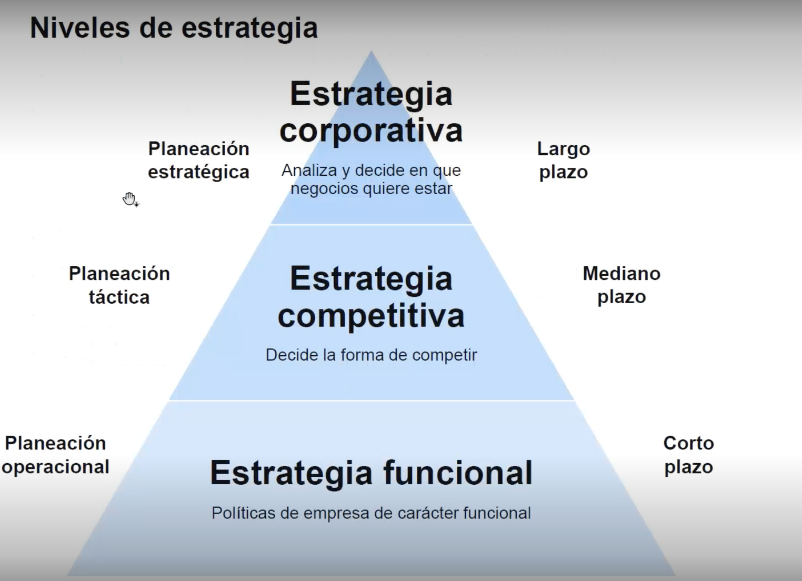

1.2. ¿Qué es la dirección estratégica (DE)?

Es una disciplina que integra las distintas estrategias y tácticas empresariales,
analiza decisiones tomadas y observa sus consecuencias o efectos durante un
período de tiempo, aparte de su pretensión de alcanzar objetivos empresariales a
largo plazo.

## 1.3. El proceso de dirección estratégica  

## Estrategia Corporativa : Analiza y decide en que negocios quieres estar  
**Concepto**
- Consiste en definir, organizar las tareas de manera sistematica para que las empresas logren alcanzar su objetivo de manera gradual, dando el paso a la planeacion de corto y largo plazo. 

- Resaltando que no intenta predecir el futuro si no tener un abanico de decisiones que impacten en el. 

**Como**
- Información: Datos que nos ayuden definir nuestras metas 
- Metodologia: Con los datos definimos el como vamos a lograr las metas 
- Pensamiento estrategico: Con el como debemos evaluar y pasar a la acción con el compromiso, llmar siempre al Call to action.   

> Podemos ver estos pasos de una forma esquemática, desde el presente al futuro de la organización 
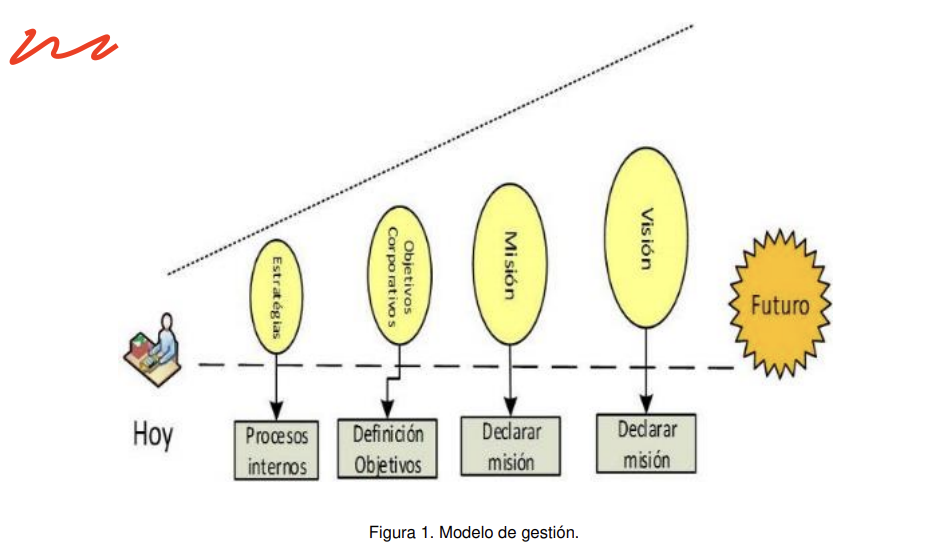

> Herramientas para definir la estrategia Corporativa 
**Análisis externo o análisis PEST/PESTE**

El análisis PEST es una herramienta de gran utilidad para entender el crecimiento o
bajada de un mercado y, como resultado, la posición, el potencial y la dirección de
nuestro negocio. Es útil para medirlo y evaluarlo. PEST es una sigla compuesta por
los siguientes aspectos: políticos, económicos, sociales y tecnológicos

En ocasiones, el análisis PEST se extiende a otros factores, como el ecológico, el
legislativo y el industrial, para convertirse en PESTELI. Algunos consideran que
esta extensión no es necesaria, dado que, si se realiza un adecuado PEST, este
debería cubrir todos estos aspectos de forma natural.

**Los objetivos del análisis PEST se centran en:**
- Conocer los factores externos que afectan a la empresa.
- Identificar los factores externos que pueden cambiar en el futuro.
- Explotar los cambios actuales para convertirlos en oportunidades.
- Identificar y analizar las posibles amenazas para buscar una pronta solución.

**Análisis DAFO** 
La matriz DAFO también se conoce como matriz FODA o análisis SWOT (siglas en
inglés de strenghts, weaknesses, opportunities y threats). Es empleada para la
formulación y evaluación de estrategias. Por lo general, se puede usar para las
empresas y las personas. Su nombre se debe a las iniciales de las siguientes
palabras:

- Debilidades.
- Amenazas.
- Fortalezas.
- Oportunidades.

Permite obtener el beneficio para revisar la estrategia, posición y
dirección de la empresa. Los elementos analizados en PEST son básicamente
externos; es recomendable efectuar dicho análisis antes del DAFO, el cual está
enfocado a factores internos (fortalezas y debilidades) y externos (oportunidades y
amenazas)

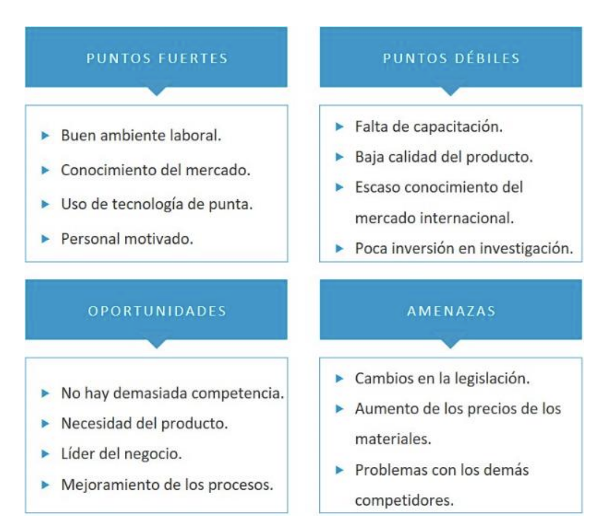

## Estrategia Competitiva: Decide la forma de competir 

**Pasos** 
- Planeacion táctica
- Mediano Plazo 

**Ejemplo** 

- Estrategia 1: Diferenciación
    - En que puede diferenciarse 
    - Poca competencia con el mismo criterio 
    - Riesgo: Imitacion de los clientes 
- Estrategia 2: Liderazgo en coste 
    - Sensible de precio 
    - Producto poco difereciales 
    - Alto poder de negociacion con los clienes 
    - Riesgo: vigilancia constante de costos 

- Estrategia 3: Movimientos anticipados 
    - llegar primero
    - Esperar imitaciones 
    - Riesgo: imitacion 

- Estrategia 4: focalizacion 
    - Seleccionar el mercado o segmento 

## Estrategia funcional: Defines politicas de la empresa de caracter funcional 

**Concepto**

Consiste en generar y definir estrategias para cada unidad o departamento de la empresa, con el proposito que todos esten alineados a la mision y vision de la organización 

## Herramientas

**Cuadro de Mando Integral (CMI)**
Es una herramienta gerencial que permite a los directivos y al personal de las
empresas en general administrar y comunicar las estrategias, monitorear
permanentemente la organización y utilizar los resultados de las medidas para la
evaluación del desempeño, lo que facilita el logro de los objetivos (Wexler et al.,
2017). Fue introducida por Robert Kaplan y David Norton

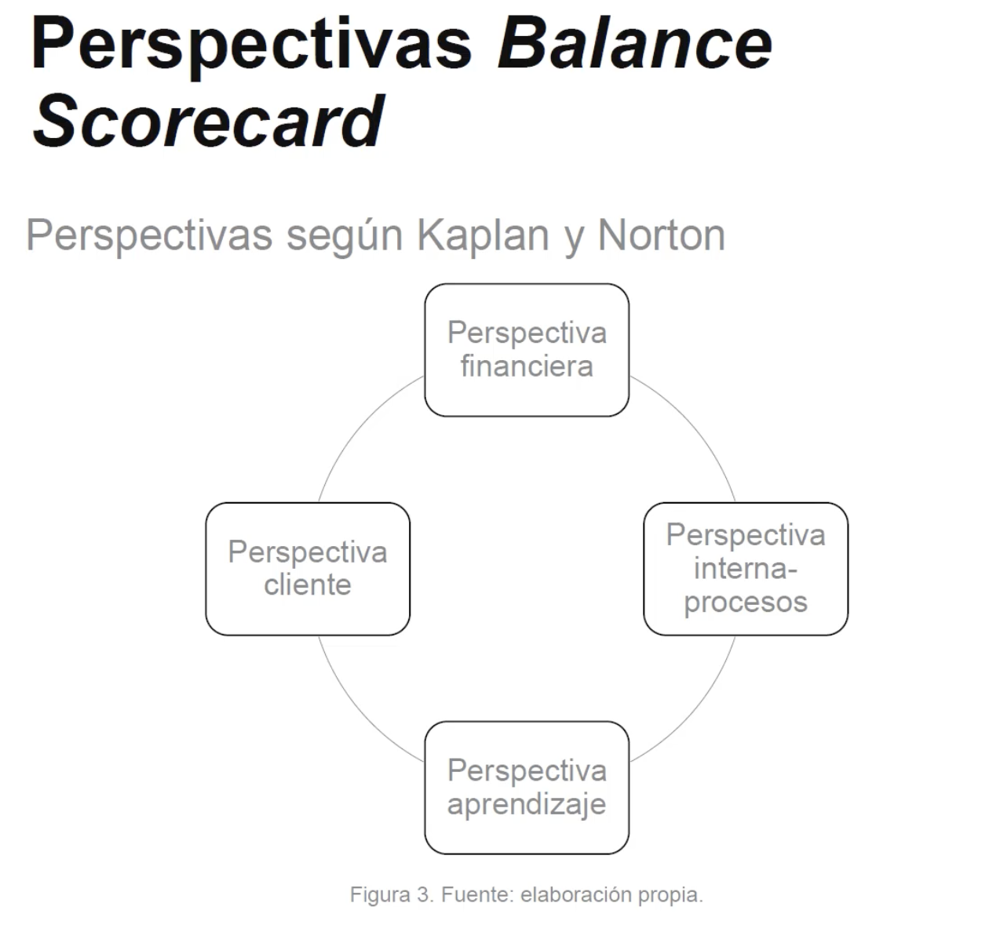

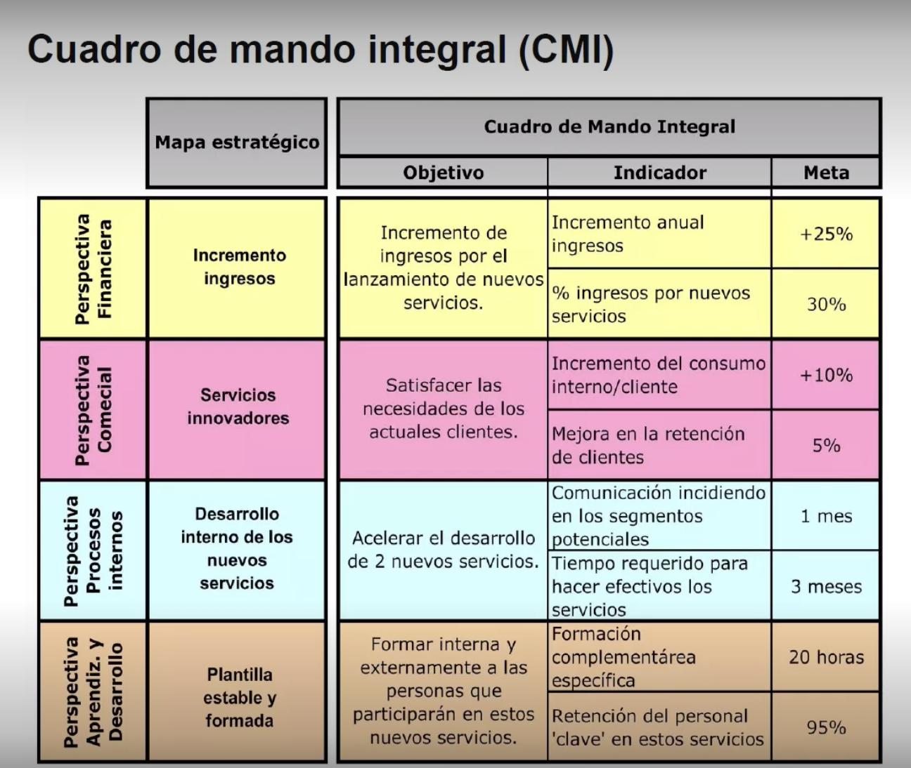

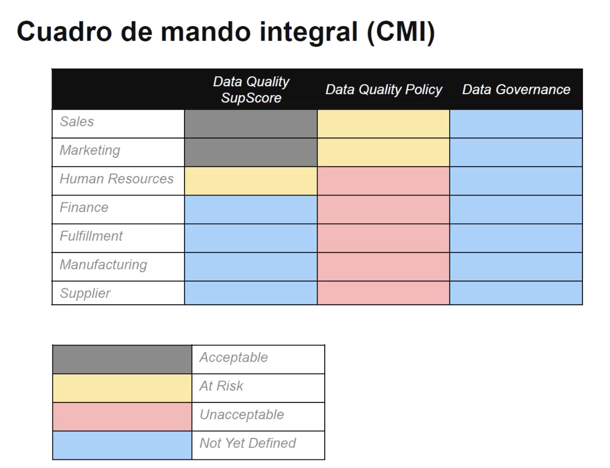

## Nota: 
- La dirección estratégica proporciona una visión integral que ayuda a la empresa a ser más competitiva, facilita la evaluación y toma de decisiones a través de una gestión integral, y permite la implementación de indicadores de desempeño clave.

- La dirección estratégica proporciona una visión integral que ayuda a la empresa a ser más competitiva, facilita la evaluación y toma de decisiones a través de una gestión integral, y permite la implementación de indicadores de desempeño clave.

- El modelo de gestión estratégica se basa en la misión y visión de la empresa, así como en los objetivos estratégicos que buscan alinear las acciones con la dirección deseada.

- La misión debe responder a "¿Quiénes somos?", "¿qué hacemos?", "¿cómo lo hacemos?", "¿para quién lo hacemos?" y "¿dónde lo hacemos?". Estas preguntas ayudan a definir el propósito y el ámbito de acción de la empresa.

- La visión se centra en el ámbito de acción y la estrategia de la empresa, definiendo hacia dónde se dirige y cómo espera llegar allí, sin incluir explícitamente la misión o los valores.

## Videoclase 1. Fundamentos de la Dirección Estratégica
## Notas 

## Videoclase 2. Elementos Clave del Gobierno de Datos
## Notas: 
- El gobierno de datos es crucial para asegurar la calidad y protección de los datos, lo que a su vez facilita la toma de decisiones informadas y estratégicas en la organización.
- El cuadro de mando integral evalúa la organización desde cuatro perspectivas clave: financiera, cliente, procesos internos y aprendizaje y crecimiento, proporcionando una visión equilibrada del desempeño.
- Los elementos fundamentales del cuadro de mando integral incluyen indicadores y metas, que miden el desempeño, así como el mapa e indicadores estratégicos, que guían la implementación de la estrategia.
- Las etapas del proceso de toma de decisiones incluyen identificar el problema, desarrollar opciones, implementar las opciones seleccionadas y evaluar los resultados para retroalimentar el proceso.
- En la toma de decisiones intervienen elementos como la información disponible, la acción a tomar y los datos que sustentan la decisión, así como la realimentación y los resultados obtenidos.

## Videoclase 3. Estrategias Competitivas y Herramientas de Análisis
## Notas: 
- Correcto. La DAMA define la gobernanza de datos como el ejercicio de autoridad y control a través de la gestión de los activos de datos.
- Correcto. Implementar un gobierno de datos facilita la disponibilidad, usabilidad, integridad y seguridad de los datos en la organización.
- Correcto. La estrategia competitiva se enfoca en cómo una empresa competirá en el mercado.
- Correcto. El análisis PESTEL se utiliza para evaluar el entorno político, económico, social, tecnológico, ecológico y legal que afecta a la empresa.
- Correcto. Una de las perspectivas del Cuadro de Mando Integral (CMI) es la perspectiva financiera, que evalúa el rendimiento financiero de la empresa.

## Tema 2. Business Intelligence y Datos Maestros 

## Videoclase 1. Importancia del Dato en BI y BA.
-  La gestión adecuada de los datos, a través de un ciclo de vida bien definido y el uso de datos maestros, es crucial para el éxito en Business Intelligence (BI) y Business Analytics (BA). Esta respuesta reconoce la importancia de los datos como un activo estratégico que, cuando se maneja adecuadamente, mejora los procesos de toma de decisiones.

- El ciclo de vida de los datos en la gestión del gobierno de datos incluye fases críticas como la creación, el uso y la eventual destrucción de los datos. Este ciclo garantiza que los datos sean manejados adecuadamente durante toda su existencia, asegurando su calidad y relevancia. 

- La creación de modelos de predicción no es un paso fundamental en la construcción de un ecosistema de BI (Business Intelligence). Los pasos clave incluyen entender los objetivos estratégicos, evaluar la madurez organizacional y definir una estrategia clara para implementar aplicaciones BI.

- La creación de modelos de predicción no es un paso fundamental en la construcción de un ecosistema de BI (Business Intelligence). Los pasos clave incluyen entender los objetivos estratégicos, evaluar la madurez organizacional y definir una estrategia clara para implementar aplicaciones BI.

- El proceso de business analytics incluye etapas como el análisis descriptivo, que examina datos históricos, y el análisis predictivo, que se enfoca en prever tendencias y patrones futuros. Estas etapas son fundamentales para extraer información útil y tomar decisiones informadas.

## Videoclase 2. Datos Maestros y su GestiónPágina

- La creación de datos maestros es vital para evitar la duplicidad de datos y mejorar la confiabilidad de la información dentro de la organización. Esto asegura que todos los departamentos trabajen con una única fuente de verdad, optimizando la eficiencia operativa y la calidad de los datos.

- Business Analytics (BA) se enfoca en el análisis predictivo y prescriptivo, proporcionando recomendaciones basadas en datos actuales y futuros. Por otro lado, Business Intelligence (BI) se centra principalmente en el análisis de datos históricos para entender el desempeño pasado.

- La afirmación "Se puede realizar un análisis descriptivo y diagnóstico de los datos" no es falsa; de hecho, es uno de los beneficios del business analytics. Sin embargo, esta opción fue marcada incorrectamente en el contexto de la pregunta, lo cual puede confundir al usuario.

- Business Intelligence (BI) es considerado reactivo, ya que se centra en analizar datos históricos para entender el rendimiento pasado y tomar decisiones basadas en lo que ya ha ocurrido. No se anticipa a eventos futuros, a diferencia de los enfoques predictivos o prescriptivos.

- El análisis prescriptivo se enfoca en recomendar acciones para manejar futuros escenarios, basándose en datos y modelos predictivos. Este tipo de análisis va más allá de predecir lo que sucederá, proporcionando recomendaciones específicas para optimizar los resultados futuros.

# Nota: 
- Actividades del gobierno de datos: 
    - Entender las necesecidades de integración de los datos 
    - Identificar fuentes y contribuyentes 
    - Definir y Mantener la Arquitectura de integración 
    - Implementar las soluciones de admin
    - Definir y mantener las reglas de coincidencia 
    - Establecer los registros de ORO
    - Definir y mantener las jerarquias 
    - Planificar e implementar 
    - Replicar y Distribuirlos 
    - Administrar los cambios de Datos Maestros y referencias. 

- Objetivos: Gestion de los datos maestros  
    - Mejorar la calidad de los datos y su integración  através de las fuentes, estrategias y las tecnologicas
    - Proporcionar una vision de 360 grados para asegurar la calidad de los reportos, 

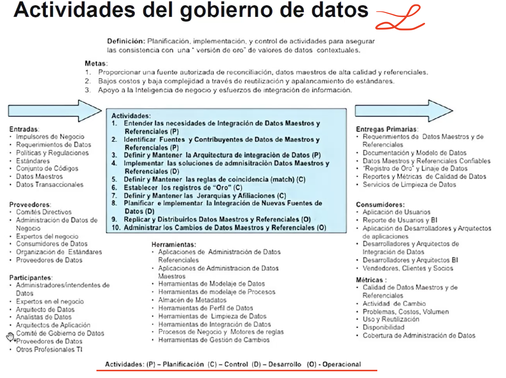

## Videoclase 3. Análisis Predictivo y Prescriptivo

## Nota:
- Correcto. Un objetivo principal del gobierno de datos es mejorar la calidad e integración de los datos.
- Correcto. Es crucial determinar quién necesita qué información para asegurar que los datos adecuados estén disponibles para las personas correctas.
- Correcto. La fase de mantener y usar se encarga de asegurar la integridad y seguridad de los datos durante su utilización.
- Correcto. Business intelligence se refiere a la integración de datos para facilitar el análisis y la toma de decisiones en una organización.
- Correcto. Los datos duplicados se refieren a la presencia de registros repetidos en una base de datos, lo cual puede afectar la calidad y precisión de la información.

## 2.2. Datos, información y conocimiento

- Los datos:  son elementos sin procesar, sacados de la realidad que a su vez generan
nuevos elementos y que por sí solos no generan nuevo conocimiento. Ejemplos de
datos: el precio de un producto, la edad, el nombre de una persona, etc.

- La información:  es el principio del conocimiento. Son datos con un significado o
función especial o el resultado de combinar diferentes datos, es decir, son datos con
contexto.

- El conocimiento: es la información analizada que hace nuevos aportes a un área específica.

## En cuanto a cómo se han generado los datos, nos podemos encontrar con los siguientes tipos de datos:

- Creados: son aquellos generados por la propia empresa a través de los sistemas de
información.

- Compilados: son aquellos que se utilizan de otras grandes bases de datos, como
censos electorales, información obtenida de las administraciones públicas en salud,
vivienda, impuestos, etc.

- Experimentales: son los generados por simulaciones o pruebas para determinar la
validez de los sistemas.

- El autor Dorian Pyle define la preparación de los datos como «la manipulación y
transformación de los mismos sin refinar para que la información contenida en el
conjunto de datos pueda ser descubierta o estar accesible de forma más fácil» (Pyle, 1999).

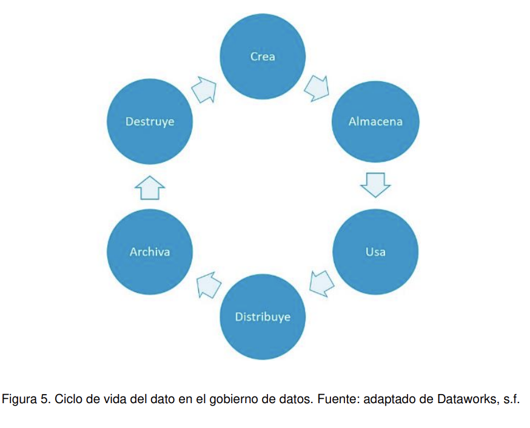

## 2.3. Datos maestros

## Concepto 
> Uno de los mayores problemas a la hora de consolidar los datos es que estos se encuentran en diferentes fuentes y pueden llegar a tener valores diferentes. Por ejemplo, un mismo cliente puede estar en dos bases de datos y tener una dirección o un teléfono diferente en cada una de ellas. La gestión de datos maestros (MDM, por sus siglas en inglés de master data management) nace como solución a este problema. El objetivo es que los datos críticos se encuentren en un solo sitio. 

## pasos más importantes a seguir para la creación de un repositorio de datos maestros

- Definición del Modelo 
- Determinación y Calidad de los datos 
- Propiedad y Responsabilidad
- Seguridad y Protección de los datos 

## La eficacia de la gestión de datos maestros se puede medir mediante varios criterios:
- Disponibilidad de datos: medido del 0 al 1, de acuerdo con lo interesantes que pueden ser los datos generados para cierta consulta.
- Calidad de los datos: rapidez, completitud y veracidad. También con una medición de 0 a 1.
- Desempeño de la consulta de datos: datos en tiempo real, incluyendo datos agregados. Medición entre 0 y 1

## 2.4. Inteligencia de negocios

## concepto 
> Si se cuenta con un repositorio de datos maestros unificados, es más fácil implementar una estrategia de inteligencia de negocios. Hasta hace algunos años estos datos maestros se construían en el proceso BI, ahora con el gobierno de datos la idea es crearlos antes de cualquier proceso BI, BA u otro que implique generación de conocimiento.

## ¿Quién necesita el business intelligence?
Todas aquellas personas de la empresa que tienen que tomar decisiones.
Dependiendo del tipo de negocio, se deben hacer las preguntas necesarias para
responder y establecer el modelo de business intelligence que mejor se adapte.

## Beneficios del business intelligence
Uno de los objetivos básicos de los sistemas de información es contribuir a la toma
de decisiones. Cuando se requiere tomar una decisión, es necesario pedir o buscar
información, que servirá para minimizar la incertidumbre

## Tipos Beneficios  

- Beneficios tangibles: son aquellos que la empresa puede cuantificar y que le aportan beneficios económicos. Ejemplo: reducción de costes de producción, generación de nuevos ingresos, reducción en tiempo de producción, evitar pérdidas
de clientes o materia prima, aumentar la rentabilidad.

- Beneficios intangibles: son aquellos que no se pueden cuantificar, pero que aportan valor agregado a los servicios o productos y mejoran la posición competitiva. Ejemplo: mejorar la atención al cliente, aumentar la satisfacción del cliente interno y
externo, tener información más actualizada.

- Beneficios estratégicos: son aquellos que facilitan la creación de nuevas estrategias, respecto a qué clientes, mercados o con qué productos encaminar los esfuerzos de la empresa. Ejemplo: mejorar la toma de decisiones, identificar clientes potenciales, etc

## Arquitectura del business intelligence

- Procesos ETL: consisten en la extracción, transformación y carga de los datos en el
data warehouse. Antes de guardarlos ahí, deben ser transformados, limpiados,
filtrados y redefinidos. Como se mencionó anteriormente, la información que tienen
las empresas en los sistemas transaccionales no está preparada para la toma de
decisiones.

- Data warehouse: también llamado almacén de datos, con el metadata o diccionario
de datos. Se busca almacenar los datos de una forma que facilite y maximice su
flexibilidad, facilidad de acceso y administración. Surge como respuesta a las
necesidades de los usuarios que necesitan información consistente, integrada,
histórica y preparada para ser analizada y apoyar la toma de decisiones.

- Herramientas OLAP: para proveer la capacidad de cálculo, consultas, funciones de
planeamiento, pronóstico y análisis de escenarios en grandes volúmenes de datos.
En la actualidad, existen otras alternativas tecnológicas al OLAP. Siguiendo el
modelo se deben analizar las tecnologías que permitirán tratar y visualizar la
información que reside en un data warehouse. En este apartado también se tratarán
las herramientas de visualización, ya que en muchas ocasiones van ligadas.

## ¿Cómo construir un ecosistema BI?

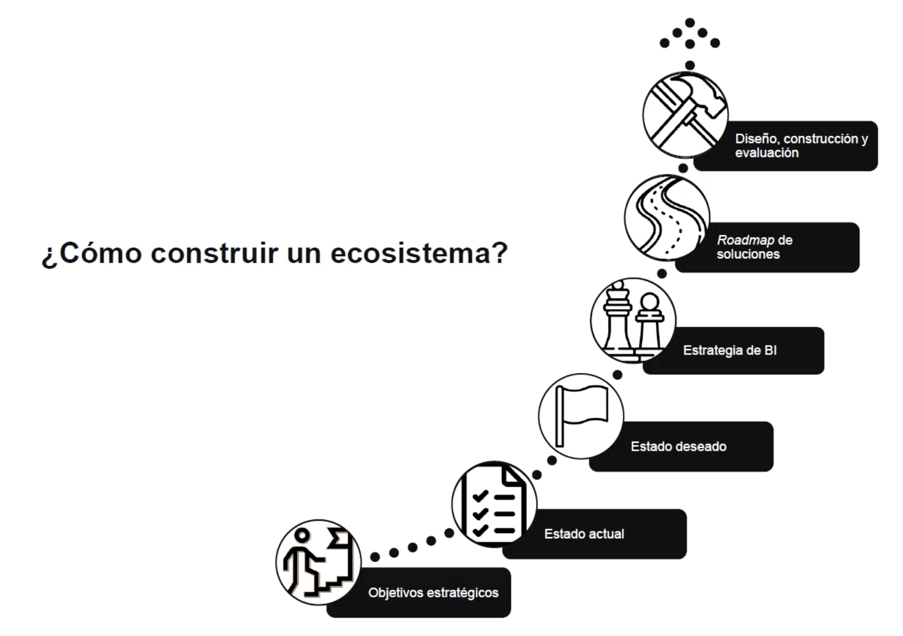

- Partimos de los objetivos estratégicos de la empresa.

- El estado actual hace referencia a si se está o no preparado para implementar una
estrategia de BI. Puede que culturalmente estemos preparados; puede que haya
empresas que estén muy evolucionadas en infraestructura, pero no en organización.

- En el estado deseado debemos hacernos la siguiente pregunta: ¿a dónde quiero
llegar, según los objetivos estratégicos? Por ejemplo, yo quiero que todas las
decisiones de la compañía se rijan por datos.

- En la estrategia BI debemos preguntarnos: ¿qué habilidades debo tener al interior de
la organización?, ¿cómo promover el uso de las herramientas?, ¿cómo implementar
el gobierno del dato? Si no definimos procesos de BI al interior de la compañía, no
llegaremos a buen término.

- En el roadmap de soluciones, tenemos que buscar iniciativas para poder llegar al
estado deseado. Priorizar iniciativas, de acuerdo con lo que la empresa tiene y puede

- Diseño, construcción y evaluación son tareas asignadas al departamento de
tecnología. Teniendo en cuenta los anteriores pasos, ya se podría pensar en qué
diseño y qué herramientas son las más adecuadas.

## 2.5. Business intelligence vs. business analytics

- **Business intelligence:** la inteligencia de negocios (BI) es un instrumento mediante
el cual diferentes organizaciones pueden apoyar la toma de decisiones basadas en
información precisa y oportuna para garantizar la generación del conocimiento
necesario que permita seleccionar la alternativa que sea más conveniente para el
éxito de la empresa (Rosado y Rico, 2010).

- **Business analytics:** es un conjunto de técnicas (entre las que se encuentran
algoritmos predictivos y modelos estadísticos) que le permiten a la organización
predecir posibles eventos o resultados. Esto es, se enfoca en el análisis futuro en
función de la información de la empresa y modelos predictivos para apoyar la toma
de decisiones y mejorar los procesos y, por ende, la competitividad del negocio
(Thorlund y Laursen, 2017).

## Diferencia 

En resumen, se puede entender el business intelligence como las técnicas de
recoger y entender datos del pasado, mientras que el business analytics permite
alcanzar una visión más clara del futuro. Ambas metodologías se pueden
complementar para construir un análisis minucioso de la actividad y futuro de la
empresa, con el propósito de mejorar la toma de decisiones.

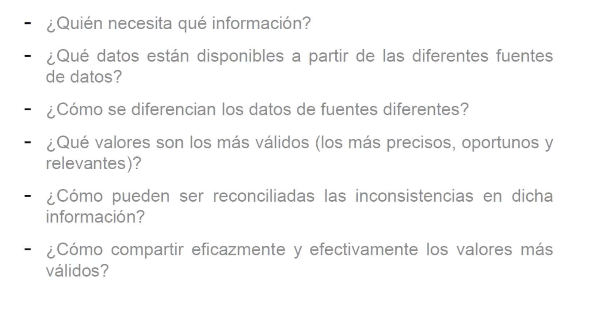

- La construcción básica de business analytics se fundamenta en los cuatro pilares de
Gartner (Popkin y Hayward, 2004), que se constituyen con cuatro componentes
básicos:
    - Los datos.
    - Las personas.
    - Los procesos.
    - La tecnología.

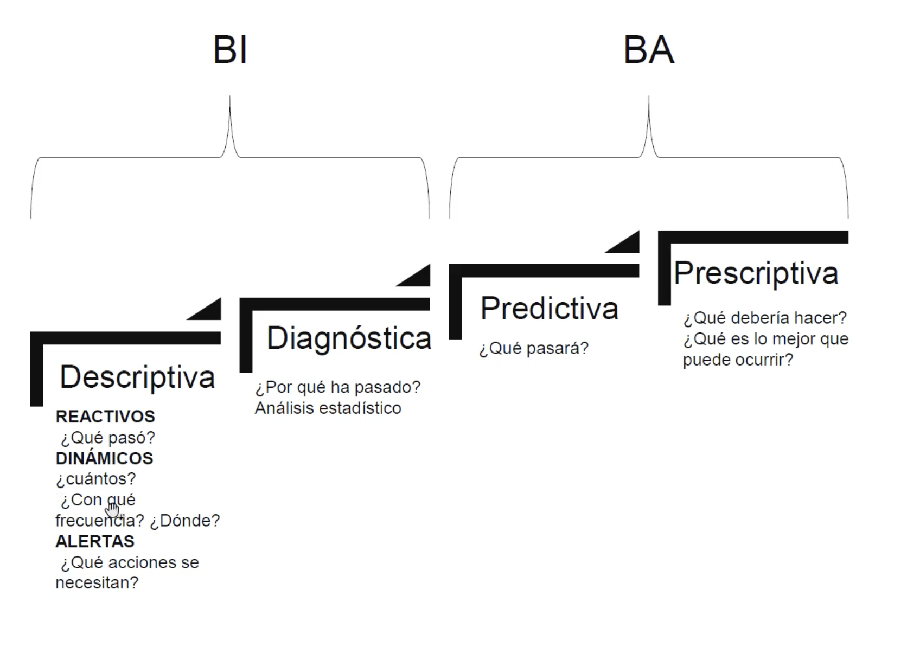

## Cuestionario 

1. Elige la respuesta correcta.
    A. Los datos no tienen relevancia, pues no tienen ningún significado si no se
    contextualizan. ->
    B. Si el dato está bien contextualizado, obtenemos información veraz y
    confiable. -> 
    C. El dato es una pieza fundamental en las empresas hoy en día, si los datos
    cumplen un ciclo de vida y se tienen maestros de datos, se garantiza el éxito
    en los procesos BI y BA. -> Esta 
    D. La información sin ser procesada genera conocimiento.

2. El ciclo de vida del dato en el gobierno de datos incluye:
    A. Creación, uso y destrucción. -> Correcta 
    B. Almacenaje, distribución y archivo.
    C. Creación, distribución y destrucción.
    D. A y B son correctas.

3. No forma parte de los pasos importantes para construir un ecosistema BI.
    A. Entender y tener en cuenta los objetivos estratégicos es fundamental para
poder dar respuesta a lo que la organización se traza como meta.
    B. Evaluar el estado actual y el estado deseado en cuanto a madurez de la
organización.
    C. Definir una estrategia BI, definir una ruta y diseñar y construir las
aplicaciones.
    D. Crear modelos de predicción.

4. ¿Cuáles son los cuatro pilares de Gartner para la construcción básica de
business analytics?
    A. Proceso, clientes.
    B. Información, personas.
    C. Procesos, tecnologías.
    D. B y C son correctas. -> Correcta 

5. Menciona dos pasos del proceso de business analytics:
    A. Predictivo, analítico.
    B. Descriptivo, transformador.
    C. Descriptivo, predictivo.-> Correcto 
    D. Ninguna es correcta.

- Descriptivo: Consiste en analizar los datos históricos para entender qué ha sucedido en el pasado. Se utilizan técnicas estadísticas y visualizaciones para describir patrones, tendencias y relaciones entre variables.

- Predictivo: Se basa en los análisis descriptivos para construir modelos que permitan predecir futuros eventos o comportamientos. Se utilizan técnicas de machine learning y estadística para identificar patrones y relaciones que pueden ser extrapolados al futuro

6. ¿Por qué es importante crear datos maestros?
    A. Evita duplicidad de datos.
    B. Aumenta la confiabilidad de los datos. -> Correcto 
    C. A y B son correctas.
    D. A y B son incorrectas.

7. Menciona una diferencia del business analytics frente al business intelligence.
    A. En el BA se realiza análisis predictivo y prescriptivo, en el BI se analizan
datos pasados.->Correcto 
    B. Uso de bases de datos NoSQL.
    C. Uso de administración de bases de datos.
    D. Integración y divulgación.

8. Identifica la afirmación falsa con respecto a los beneficios del business analytics:
    A. Las organizaciones obtienen ventaja competitiva.
    B. Se puede realizar minería de datos para detectar patrones entre datos.
    C. Se pueden simular diferentes escenarios y crear estrategias para mitigar
    riesgos. ->Todas son correctas
    D. Se puede realizar un análisis descriptivo y diagnóstico de los datos. -> Todas son correctas 

9. El análisis que da respuesta a la pregunta de cómo se manejarán futuros
escenarios es:
    A. Análisis descriptivo.
    B. Análisis predictivo.
    C. Análisis prescriptivo.-> Correcto ya que da una receta de pasos a seguir para dar solución a un problema futuro 
    D. Ninguna es correcta.

10. El business intelligence es:
    A. Reactivo. -> Correcto
    B. Proactivo.
    C. Predictivo.
    D. Ninguno de los anteriores.

## Tema 3. Data Warehouse y Data Lake 

## notas 
- OLAP : OnLine Analitical  Processing   

## Videoclase 1. Fundamentos de Data Warehouse
## Notas: 
- El proceso ETL (Extract, Transform, Load) incluye las etapas de extracción de datos de diversas fuentes y su transformación en un formato adecuado para la carga en el destino final, como un data warehouse.
- Los data marts son subconjuntos del data warehouse orientados a áreas específicas de negocio, facilitando el acceso a datos relevantes para análisis departamentales.
- Las arquitecturas de una y dos capas son comunes en la implementación de data warehouses. La arquitectura de una sola capa integra datos directamente en el almacén de datos, mientras que la de dos capas incluye una capa adicional para procesamiento o almacenamiento.
- Las fuentes de datos para un data warehouse pueden incluir bases de datos relacionales y archivos de texto plano, que proporcionan datos estructurados y semiestructurados.
- Un data lake puede almacenar datos de una variedad de fuentes, incluidos archivos de texto plano, XML, HTML, PDF y multimedia como fotos. Esta flexibilidad permite almacenar datos estructurados, semiestructurados y no estructurados.

## Videoclase 2. Metodologías para Desarrollo de DWPágina
## Notas:   

- Kimball DataWarehouse menciona que se construye de un conjunto de datasmart independientes orientado al negocios en especifico en vez de un enfonque centralizado es un desarrollo gradual y una entrega de valor mas rapida. 

- Kimbal usa mucho OLAP 
- Cubos olap, representan una forma eficiente para visualizar datos para un análisis mas profundo, se asemeja a una estructura bidimensional compuestos por dimensiones, jerarquias, medidas, la verdadera capacidad de los cubos es que permite al usuario visualizar análisis multidimensionales, permite validar datos desde multiples perspectivas. 
- Concepto de Tablas 
    - **Estrella** todo radica de una sola tabla principal y todos los demas la rodean 
    - **Copo de Nieve** todo radica de una sola tabla principal y todos los demas la rodean pero ciertas tablas tienen su tablas hijas 
    - **Constelación** ya es un esquema donde las tablas tienen sus hijos y no solo la tabla principal es el centro de atención. 
    - 

- Bill Inmon definió que un data warehouse debe ser indexado en el tiempo y no volátil, proporcionando un almacenamiento consistente y estable de datos históricos para análisis.
- Tanto los data warehouses como los data lakes están diseñados para centralizar y organizar datos, con el objetivo de facilitar la toma de decisiones basada en datos.
- En el proceso ETL, el tiempo de carga inicial puede ser considerablemente largo debido a la necesidad de transformar y limpiar grandes volúmenes de datos.
- En ELT (Extract, Load, Transform), los datos se cargan primero en el destino y luego se transforman, a diferencia del ETL tradicional. Por lo tanto, la afirmación de que se transforman en un servidor intermedio antes de la carga es falsa.
- Los metadatos actúan como un repositorio central que proporciona significado y contexto a los datos almacenados en un data warehouse. Incluyen información sobre la estructura, componentes y atributos, facilitando la comprensión y uso de los datos.
- No es lo mismo ELT que ETL notaaaaaa 

## Videoclase 3. Innovaciones y Roles en Data Management 
## Notas:  
- Data Lake: Es un sistema de almacenamiento que permite guardar una basta de cantidad de datos en su forma bruta, es mas flexible ya que permite almacenar datos no estructurados, como imagenes, audio y video y permite almacenar grandes volumes de datos, permite almacenar datos con un costo menor. 

| Concepto | ETL (Extract, Transform, Load) | ELT (Extract, Load, Transform) |
|---|---|---|
| Procesamiento | Los datos se transforman en un servidor de almacenamiento intermedio antes de subirse al Data Warehouse. | Los datos se suben al Data Lake y allí permanecen. Las transformaciones se realizan en el sistema de destino. |
| Tiempo de carga | Los datos se cargan en un almacén intermedio y luego se mueven al sistema destino objetivo. Tiempo de carga intensivo. | Los datos se cargan una sola vez. Tiempo de carga muy rápido. |
| Tiempo de mantenimiento | Altos niveles de mantenimiento. | Bajo nivel de mantenimiento. |
| Complejidad de implementación | Lo complejo es tener la estructura y los procesos que llenarán esa estructura. | Se debe tener claro qué herramientas se van a utilizar. |
| Madurez | Este proceso se utiliza desde hace más de dos décadas, bien documentado y mejores prácticas disponibles fácilmente. | Es nuevo y complejo de implementar. |

- Data Mesh: Es una arquitectura de datos distribuidas que enfatiza la descentralización del diseño y el gobierno y propiedad de los datos, promueve la idea que los datos deben ser tratados como un producto 

    - Ventajas 
        - Habilitar la agilidad y la escalabilidad empresarial.
        - Reducir el tiempo de comercialización de las iniciativas comerciales.
        - Menores costos de mantenimiento.
        - Permitir una asignación de costos interna justa y transparente.

- Correcto. Los Data Warehouses son repositorios de datos estructurados, mientras que los Data Lakes pueden almacenar datos en cualquier formato.
- Correcto. ELT permite cargar datos rápidamente en el Data Lake y realizar las transformaciones necesarias en el sistema de destino.
- Correcto. El Data Mesh promueve la descentralización y asigna la propiedad de los datos a los dominios que mejor los entienden.
- Correcto. Los cubos OLAP se utilizan para el procesamiento analítico en línea, permitiendo análisis de datos multidimensionales rápidos.
- Correcto. Las tablas de hechos en un Data Warehouse almacenan datos numéricos del negocio y se conectan con las tablas de dimensión.

## 3.2. Procesos ETL

Como sus siglas indican, consiste en la extracción, transformación y carga de los
datos, de modo que se puede afirmar que es una parte fundamental de este. Antes
de guardar los datos, deben ser transformados, limpiados, filtrados y redefinidos

El proceso de ETL consume entre el 60 y el 80 % del tiempo de un proyecto de
business intelligence, por lo que es un proceso fundamental en el ciclo de vida del
proyecto

Esta parte del proceso de construcción del data
warehouse (DW) es costosa y consume una parte significativa de todo el proceso,
razón por la que utilizan recursos, estrategias, habilidades especializadas y
tecnologías. El proceso ETL va más allá del transporte de los datos de las fuentes a
la carga dentro del DW, ya que añade un valor significativo a los datos.

## Proceso 
- Eliminar errores y corregir datos faltantes.
- Proporcionar medidas documentadas de la calidad de los datos.
- Supervisar el flujo de los datos transaccionales.
- Ajustar y transformar los datos de múltiples fuentes en uno solo.
- Organizar los datos para su fácil uso por los usuarios y las herramientas

## Etapas
## Extracción
> Este proceso extrae los datos físicamente de las distintas fuentes de información. En este momento los datos están en la forma como se almacenan, en bruto. La extracción de los datos se puede realizar de forma manual o utilizando herramientas de ETL. 

## Limpieza

> Este proceso recupera los datos de la base de datos u otro tipo de fuente y comprueba la calidad, elimina los duplicados y, cuando es posible, corrige los valores erróneos y completa los valores incompletos, etc. 

## Ejemplo de algunos errores más comunes:
- Datos duplicados: un cliente es registrado varias veces en la misma empresa.
- Inconsistencia en los datos: en la dirección de una persona, el código postal no corresponde a la ciudad donde vive.
- Inconsistencia de valores: aparece en primer lugar un valor y posteriormente aparece el mismo valor de otra forma. Por ejemplo: primero, escribir el país como USA y, luego, digitarlo completo (Estados Unidos de Norteamérica).

## Transformación
> Este proceso recupera los datos limpios y de alta calidad, los organiza y resume en los distintos modelos de análisis. El resultado de este proceso es la obtención de datos limpios, consistentes, resumidos y útiles. 

## La transformación incluye: 
- Cambios de formato, sustitución de códigos, valores derivados y agregados. 

## La carga y actualización
> Es la última etapa del proceso y valida que los datos cargados en el DW sean consistentes con las definiciones y formatos; los integra en los distintos modelos de las distintas áreas de negocio que se han definido. Estos procesos suelen ser complejos, por tanto, es necesario tener personal experto que ayude en el proceso.

## 3.3. Almacén de datos (data warehouse o DW)

A través del data warehouse, conocido también como el almacén de datos en el
diccionario de datos, se busca almacenar los datos de forma que facilite y maximice
su flexibilidad, facilidad de acceso y administración. Surge como respuesta a las
necesidades de los usuarios que necesitan información consistente, integrada,
histórica y preparada para ser analizada y poder tomar decisiones. 

## Equipo BILL 
    - las características que debe cumplir un data warehouse:
        - Orientado a un área: significa que cada parte del DW está construida para resolver
un problema de negocio
        - Integrado: la información debe ser convertida en medidas comunes, códigos y
formatos comunes para que pueda ser útil.
        - Indexado en el tiempo: significa que la información histórica se mantiene y se
almacena en determinadas unidades de tiempo
        - No volátil: esta información no es mantenida por los usuarios, como se realizaría en
los entornos transaccionales

## Equipo Kimball 
    - las características que debe cumplir un data warehouse:
        - Diseño ascendente (bottom-up): Se comienza construyendo pequeños almacenes de datos (datamarts) enfocados en áreas específicas del negocio. Luego, estos datamarts se integran en un data warehouse central
        - Modelo dimensional: Utiliza un modelo de datos basado en dimensiones y medidas. Las dimensiones proporcionan contexto (e.g., tiempo, producto, cliente) y las medidas son los valores numéricos que se analizan (e.g., ventas, costos).
        - Enfoque en el negocio: Se centra en las necesidades de los usuarios finales y en cómo los datos pueden ser utilizados para tomar mejores decisiones de negocio.
        - Agilidad y escalabilidad: Permite construir y modificar rápidamente los data warehouses para adaptarse a los cambios en los requisitos del negocio. 
        - Reducción del tiempo de comercialización: Al enfocarse en áreas específicas del negocio, se pueden obtener resultados más rápidamente.
        - Menores costos de mantenimiento: El diseño modular y escalable facilita la administración y el mantenimiento del data warehouse.

## Esquemas de un data warehouse

## Esquema estrella
Este modelo es el más sencillo. Está formado por una tabla central de «hechos» y
varias «dimensiones», incluida una dimensión de «tiempo». Lo más representativo
de la arquitectura de estrella es que solo existe una tabla de dimensiones para cada
dimensión. 

## Esquema copo de nieve
Es una variante del modelo anterior. En este modelo la tabla de hechos ya no es la
única que se relaciona con otras tablas, existen otras tablas que se relacionan con
las dimensiones y que no tienen relación directa con la tabla de hechos. El modelo
fue concebido para facilitar el mantenimiento de las dimensiones, sin embargo, esto
permite que se vinculen más tablas a las secuencias SQL. Este modelo es complejo
de mantener, ya que permite la vinculación de muchas tablas

## Esquema galaxia

Este esquema contiene varias tablas de hechos que comparten dimensiones. Es muy
común encontrar este tipo de esquema, incluso es recomendable compartir
dimensiones. El esquema se ve como una colección de estrellas, por eso su nombre.
Por ejemplo, pueden existir dos tablas de hechos: inventario y ventas que podrían
compartir las dimensiones de producto y fecha. 

## Arquitecturas
> Para la realización del data warehouse se adoptan dos clasificaciones diferentes para su arquitectura:

## Arquitectura de una sola capa: 
- No se utiliza con frecuencia en la práctica. 
- Su objetivo es minimizar la cantidad de datos almacenados. Para alcanzar este objetivo se eliminan las redundancias de datos.
-  Esto significa que un almacén de datos se implementa como una vista multidimensional de datos operacionales
- La debilidad de esta arquitectura radica en que no cumple con los requisitos de separación entre procesamiento analítico y transaccional

## Arquitectura de dos capas: 
- Aunque normalmente se nombra «arquitectura de dos capas» para destacar la separación entre las fuentes físicamente disponibles y los almacenes de datos, en realidad consta de cuatro etapas de flujo de datos
posteriores. 

    - Capa de origen: es el sistema de almacén de datos que utiliza fuentes
heterogéneas de datos. Los datos se guardan originalmente en bases de datos
relacionales corporativas o pueden provenir de sistemas de información fuera de los
muros corporativos.

    - Capa de almacenamiento de datos: los datos almacenados en las diferentes
fuentes deben extraerse, limpiarse para eliminar inconsistencias y rellenar espacios,
e integrarse para convertirlas en fuentes heterogéneas en un esquema común,
proceso ETL.

    -   Capa de depósito de datos: la información se almacena en un solo depósito
lógicamente centralizado. Se puede acceder directamente al almacén de datos, pero
también se puede utilizar como fuente para crear nuevos productos de datos, que
replican parcialmente los contenidos del almacén de datos y están diseñados para
departamentos empresariales específicos.

    - Capa de análisis: se accede de manera eficiente y flexible a los datos integrados
para emitir informes, analizar la información y representar escenarios hipotéticos de
negocios. 

## Data mart
El data warehouse es una gran estructura. En muchas ocasiones, para facilitar el
manejo de los datos, es necesario utilizar estructuras de datos más pequeñas
llamadas data mart

## Los data mart están compuestos por partes del DW primario, que en algunos casos pueden ser:

- Dependientes: utilizan los datos y metadatos del data warehouse directamente en
lugar de obtenerlos de los sistemas de producción.

- Independientes: los datos son tomados de cada área de la empresa, siempre
manteniendo los datos alineados con el DW, si este existe. Aunque los data mart no
son estrictamente necesarios, son muy útiles para los sistemas de almacenamiento. 

## Los metadatos
Un componente esencial de un data warehouse son los metadatos. Es el repositorio
central de información que abarca todos los niveles. Da el significado de cada uno de
los componentes, variables y atributos que residen en el DW o data mart. 

## 3.4. Lago de datos (data lake)

Puede definirse como un almacén de datos o un repositorio de grandes cantidades
de datos que son útiles para realizar análisis. Los datos se almacenan en una
arquitectura plana en lugar de una forma jerárquica, como se hace con los
almacenes de datos o DW. Los datos almacenados pueden ser de cualquier tipo:
datos estructurados (filas y columnas), semiestructurados (CSV, JSON, XML) y no
estructurados (PDF, documentos, fotos, vídeos, correos). Es necesario crear
metadatos para poder tener información adicional de cada dato almacenado. Si un
lago de datos no proporciona valor para los usuarios o es inaccesible, se denomina
pantano de datos.

Cuando se crea un data lake, el proceso ETL (extracción, transformación y carga)
cambia a ELT (extracción, carga y transformación). Los datos se almacenan sin
procesar

## Cuestionario 

1. ¿Cuáles son etapas del proceso ETL?
A. Extracción.
B. Transformación.
C. Subida de datos brutos.
D. A y B son correctas. -> Correcto 

2. Los data mart:
A. Son los metadatos del data warehouse.
B. Son estructuras de datos específicas para un departamento, el conjunto de
data marts compone un data warehouse. -> Correcto 
C. Permiten acceder directamente al data warehouse.
D. Son una fuente de datos.

3. Son arquitecturas para implementar un data warehouse:
A. Arquitectura mecánica.
B. Arquitectura de una sola capa.
C. Arquitectura de dos capas.
D. B y C son correctas. -> Correcto 

4. ¿Cuáles pueden ser dos posibles fuentes de datos para un data warehouse?
A. Bases de datos relacionales y archivos de texto plano. -> Correcto 
B. Archivos XML y codificación de archivos HTML.
C. Archivos PDF y documentos en papel.
D. Ninguna de las anteriores.

5. ¿Cuáles pueden ser posibles fuentes de datos para un data lake?
A. Bases de datos relacionales y archivos de texto plano.
B. Archivos XML y codificación de archivos HTML.
C. Archivos PDF y fotos.
D. Todos las anteriores. -> Correcto

6. El autor Bill Inmon definió las características que debe cumplir un data
warehouse. ¿Cuáles son?
A. Orientado a un área e integrado.
B. Portátil y fácil de manejar.
C. Indexado en el tiempo y no volátil. -> Correcto 
D. Consistente y fácil.

7. ¿Cuál es la función del data warehouse y del data lake?
A. Aumentar el trabajo de los usuarios.
B. Ayudar en la toma de decisiones.  -> Correcto 
C. Centralizar los datos para facilitar el manejo.
D. Ninguna de las anteriores.

8. Es falso si hablamos de ETL:
A. Los datos se transforman en un servidor intermedio antes de subir al DW.
B. El tiempo de carga, sobre todo la primera vez, es muy rápido. -> Correcto 
C. Altos niveles de mantenimiento.
D. Las estructuras pueden llegar a ser complejas.

9. Es falso si hablamos de ELT:
A. Los datos se cargan y se transforman en un servidor intermedio antes de
subir al DW. -> Correcto 
B. El tiempo de carga es muy rápido.
C. Bajo nivel de mantenimiento.
D. Es nuevo y complejo de implementar.

10. Es cierto si hablamos de metadatos:
A. Son un repositorio central de información.
B. Da significado a cada componente, variable y atributo que reside en el DW.
C. Contiene información sobre la estructura del data lake.
D. A y B son verdaderos. -> Correcto 

## Tema 4. Metodologías y Tendencias 

## Videoclase 1. Introducción a Metodologías de Desarrollo
## Notas: 
1. **Planificación del Proyecto**
   * Definición de requerimientos
   * Diseño arquitectónico técnico
   * Selección de productos e implementación
2. **Modelado y Diseño**
   * Modelado dimensional
   * Diseño físico
   * Diseño e implementación ETL
3. **Desarrollo e Implementación**
   * Especificaciones de soluciones BI
   * Desarrollo de soluciones BI
   * Implementación
4. **Mantenimiento**
   * Mantenimiento, administración y provisión del servicio DWH/BI

- Kimball enfatiza la importancia de centrarse en las necesidades del negocio y en la entrega de incrementos significativos durante el desarrollo de un data warehouse (DW). Estos principios garantizan que el DW sea relevante y útil para la organización.

- La metodología Kimball se centra en el diseño de procesos ETL, arquitectura técnica y la selección de herramientas, pero no incluye la creación de un maestro de datos como una tarea específica dentro de su enfoque

- El Project Management Institute (PMI) define áreas de conocimiento como costes y alcance, esenciales para la gestión de proyectos. Estas áreas no incluyen metodologías específicas como DevOps o CRISP-DM.

- ¿Cuáles son las rutas para el desarrollo del data warehouse, según la metodología Kimball? 
    - Kimball sugiere rutas como la implementación de tecnologías adecuadas y la gestión de datos efectivos para el desarrollo de un data warehouse. Estas rutas aseguran un diseño robusto y eficiente

- Los requerimientos del data warehouse se pueden obtener mediante entrevistas con stakeholders y sesiones facilitadoras. Estos métodos permiten una comprensión detallada de las necesidades y expectativas del proyecto.

## Videoclase 2. Metodología Kimball para BI
## Notas: 

- Kimball 
    - Usa entrevistas 
    - Secciones facilitadoras 
    - Se genera matriz de procesos de dimenciones tablas hechos filas dimensiones columnas 
- Se debe generar estas preguntas para crear DW 
    - ¿Cuál es el problema que quiero resolver? ¿Qué tipo de datos ayudarían?
    - ¿De dónde lo conseguiré?
    - ¿Cómo lo almacenaré y protegeré?
    - ¿Cómo lo analizaré?
    - ¿Quién será el responsable?
    - ¿Cómo se compartirá con el resto de la organización?
    - ¿Cómo se implementará en los procesos de trabajo?
- usa estrategia mas personalizadas 
- Diseño fisico y ETL 

- Bill Inmon
    - Padre de DW 
    - se enfoca en un modelo top down
        - Obtener patrocinio directivo: Es tener el apoyo de los altos mandos para tener los recursos. 
        - Evaluar lo que se tiene: Evaluar los datos existente de la organización  
        - Definir el qué será: Se define la arquitectura del DW 
        - Determinar el valor del dato: Se determina que datos son criticos y que datos son menos relevantes 
        - Planear el riesgo: Se evaluan los obstaculos para crear los DW y posibles estrategias para mitigar los riesgos 
        - Monitorear la eficacia y hacer el ciclo: Se debe evaluar la eficacia para mejorar los procesos 
- Usa estrategias mas centralizadas 

- ¿Cuántas características define Inmon para el DW?
    - Bill Inmon define cuatro características fundamentales para un data warehouse: orientado a temas, integrado, no volátil y variable en el tiempo. Estas características aseguran la consistencia y fiabilidad de los datos almacenados.
- Son nuevos roles incorporados en los últimos años
    - En los últimos años, han surgido nuevos roles como ingeniero de datos y analista de datos, que se especializan en la gestión y análisis de grandes volúmenes de datos, convirtiéndose en posiciones clave en las organizaciones modernas.
- Según el estudio publicado por el BI & Analytics Trend Monitor de BARC, son tendencias del business intelligence
    -  El desarrollo ágil de Business Intelligence es una tendencia identificada por el BI & Analytics Trend Monitor de BARC. Esta metodología permite una adaptación rápida a las necesidades cambiantes y mejora la eficiencia en la entrega de soluciones BI.
- Menciona dos etapas de la metodología PMI
    -   Dentro de la metodología PMI, las etapas de control y supervisión son fundamentales para asegurar que el proyecto se mantenga en curso y cumpla con los objetivos establecidos. Estas etapas permiten la gestión eficaz del proyecto a lo largo de su ciclo de vida.
- La metodología DevOps permite
    - La metodología DevOps está diseñada para aumentar la velocidad de entrega, confiabilidad y escalabilidad de los proyectos. Esta práctica combina el desarrollo y las operaciones para mejorar la eficiencia y la calidad de los productos tecnológicos.

## Videoclase 3. Tendencias Actuales en Business Intelligence 
## Notas:  

- Roles 
    - Director de Datos Chief Data Officer
    - Data Ownner 
    - Data steward [estiward] - Admin datos 
    - Coordinador de administracion de datos: Responsable de dirigir los datos 
    - Ejecutivos de admin Datos : 
    - Arquitecto Datos: Responsables de datos coherentes
    - Arquitecto DW: 
    - Analista de Datos : Captura de datos y validacion de datos 
    - Especialista Datos: Adminstrador del control de datos para facilitar su gestion
    - analista Calidad de datos
    - Admin Base de Datos:
    - Administrador Seguridad de datos: 
    - Arquitecto Businnes Inteligence:
    - Gerente del programa BI: 

- ¿Cuál es uno de los principios básicos de la metodología Kimball?
    - Correcto. La metodología Kimball se enfoca en el negocio y en crear una infraestructura de información completa y útil.
- ¿Cuál es uno de los pasos en la planificación de un proyecto según la metodología Kimball?
    - Correcto. Es crucial definir con precisión el alcance y los requerimientos del negocio para una planificación efectiva del proyecto.
- ¿Cuál es una pregunta clave que puede ayudar en el análisis de requerimientos?
    - Correcto. Preguntarse cómo se compartirá la información es esencial para asegurar que los datos sean accesibles y útiles dentro de la organización.
- ¿Qué rol en la estructura DAMA es responsable de la arquitectura y la integración de datos de alto nivel?
    - Correcto. El arquitecto de datos es responsable de la arquitectura y la integración de datos de alto nivel.
- ¿Qué tendencia en BI para 2022 se menciona en el documento?
    - Correcto. La encuesta de BARC destaca la importancia de entender las decisiones de compra y los beneficios comerciales a través de encuestas y estudios.

## 4.2. Metodología Kimball

La metodología de Kimball se centra principalmente en el diseño de la base de datos
que guardará la información para la toma de decisiones. El diseño se basa en la
creación de tablas de hechos, que contienen la información numérica de los
indicadores por analizar, es decir, la parte cuantitativa de la información.

La aplicación de cualquier metodología para el desarrollo del DW en las empresas
siempre va a depender de las necesidades de las organizaciones y el compromiso
institucional de quienes conforman dichas organizaciones.

La metodología se basa en lo que Kimball denomina ciclo de vida dimensional del
negocio —business dimensional lifecycle

## cuatro principios básicos:

1. Centrarse en el negocio: es necesario enfocarse hacia la tipificación de los
requerimientos del negocio y el valor que le aportará, emplear estos esfuerzos en
desarrollar relaciones sólidas con el negocio y con los encargados de implementar
las herramientas.
2. Realizar una infraestructura de información: se trata de diseñar una base de
información única, integrada, fácil de usar y de alto rendimiento, en la cual deben
verse reflejados todos los requerimientos de negocio identificados en la
organización.
3. Cumplir las entregas en incrementos significativos: define los tiempos de
creación del almacén de datos en incrementos progresivos entregables. Los plazos
están determinados por los desarrolladores del proyecto y estos pueden ser cuatro o
seis meses cada entrega (ten en cuenta que estos son tan solo ejemplos, los
tiempos de entrega se deben ajustar a las necesidades de la empresa).
4. Ofrecer la solución completa: facilitar todos los elementos necesarios para
entregar valor a todos los usuarios del negocio. Para empezar, se debe contar con
un almacén de datos sólido, bien diseñado, con calidad probada y accesible.
También se deberá entregar herramientas de consulta ad hoc, aplicaciones para
informes y análisis avanzado, capacitación, soporte, sitio web y documentación

## 4.3. Metodologías PMI

El PMI es una asociación profesional de las más grandes del mundo que cuenta con
medio millón de miembros e individuos titulares de sus certificaciones en 180 países, Las más importantes son Scrum y PMI (siglas de Project Management Institute).

La metodología del PMI de gestión de proyectos se compone de dos elementos
esenciales

Proceso
Para la Guía PMBOK (A guide to the Project Management Body of Knowledge), no
puede hablarse de proyecto si este no se concibe como un proceso, es decir, una
serie de actividades coordinadas e interrelacionadas entre sí que deben ejecutarse
con un fin específico. 

Lo realmente decisivo en
la ejecución de un proyecto es tener despejadas las etapas básicas que lo
conforman, que para el PMI son, según la PMBOK:

- Inicialización.
- Planificación.
- Ejecución.
- Control.
- Cierre

## 4.4. Metodología Inmon

Bill Inmon es considerado el padre del concepto del data warehouse y menciona que
debe cumplir con las características 

## Caracteristicas
- Orientado a temas
- Integrado 
- No volatil 
- Variante en el tiempo 
- La metodología Inmon también es conocida como top down

## Proceso para la construcción del DW
Inmon propone los siguientes pasos para la construcción del DW.
1. Reconocer los sistemas transaccionales de la empresa que van a servir como
fuentes de datos del DW.
2. Se empiezan a llenar las primeras tablas en el DW de las respectivas unidades
del negocio. Los usuarios empiezan a acceder a los datos integrados.
3. Se cargan más tablas al DW y aumentan también los usuarios que acceden al
mismo.
4. El DW es cargado con los datos correctamente, esto trae como resultado la
aparición de sistemas de apoyo a la toma de decisiones.
5. Se crean los data mart para cada unidad de negocio.
6. Si surgen nuevas necesidades, deben crearse nuevos data mart.
7. Después de todos estos pasos, finalmente la arquitectura está desarrollada. En
algunas ocasiones los usuarios prefieren acceder a los data mart, ya que su acceso
es más rápido

## Granularidad
- El aspecto más importante del diseño de un almacén de datos es la granularidad. 
De hecho, el problema de la granularidad afecta a la arquitectura que rodea el entorno
del almacén de datos. 
- La granularidad se refiere al nivel de detalle o resumen de las unidades de datos en el DW. 
- Cuantos más detalles hay, menor es el nivel de granularidad. Cuantos menos, el nivel es mayor (Inmon, 2002).

## Los beneficios de la granularidad son:
- Después de que el almacén de datos se haya construido correctamente, proporciona
a la organización una base extremadamente flexible y reutilizable para diferentes
procesos de sistemas de apoyo a la toma de decisiones.

- Los datos granulares que se encuentran en el almacén de datos son la clave para la
reutilización, ya que pueden ser usados por muchas personas de diferentes
maneras. Por ejemplo, dentro de una empresa, los mismos datos podrían ser
utilizados para satisfacer las necesidades de marketing, ventas y contabilidad.

- Todos estos tipos de información están estrechamente relacionados, aunque
ligeramente diferentes. Con un almacén de datos, las diferentes organizaciones
pueden ver los datos como lo desean.

- Visualizar los datos de diferentes maneras es solo una ventaja de tener una base
sólida. Un beneficio relacionado es la capacidad de conciliar datos, si es necesario.

## 4.5. Data-driven decision modelling

Una perspectiva data-driven (DDM) permite a las empresas examinar y organizar sus
datos con el objetivo de mejorar la atención a sus clientes y consumidores. Al usar
datos para promover sus acciones, una empresa puede contextualizar y personalizar
los mensajes a sus clientes o posibles clientes para un enfoque más centrado en el
cliente

El DDM es un método que se centra en el uso de los métodos de CI, particularmente
las máquinas de aprendizaje, para la construcción de modelos que complementan o
reemplazan los modelos «basados en el conocimiento» que describen el
comportamiento físico

## 4.6. Metodología DevOps

Combina filosofía, prácticas y herramientas que incrementan la capacidad de la
organización para desarrollar aplicaciones y servicios a gran velocidad

## 4.7. Nuevos roles

- Roles 
    - Director de Datos Chief Data Officer
    - Data Ownner 
    - Data steward [estiward] - Admin datos 
    - Coordinador de administracion de datos: Responsable de dirigir los datos 
    - Ejecutivos de admin Datos : 
    - Arquitecto Datos: Responsables de datos coherentes
    - Arquitecto DW: 
    - Analista de Datos : Captura de datos y validacion de datos 
    - Especialista Datos: Adminstrador del control de datos para facilitar su gestion
    - analista Calidad de datos
    - Admin Base de Datos:
    - Administrador Seguridad de datos: 
    - Arquitecto Businnes Inteligence:
    - Gerente del programa BI: 

## 4.8. Tendencias
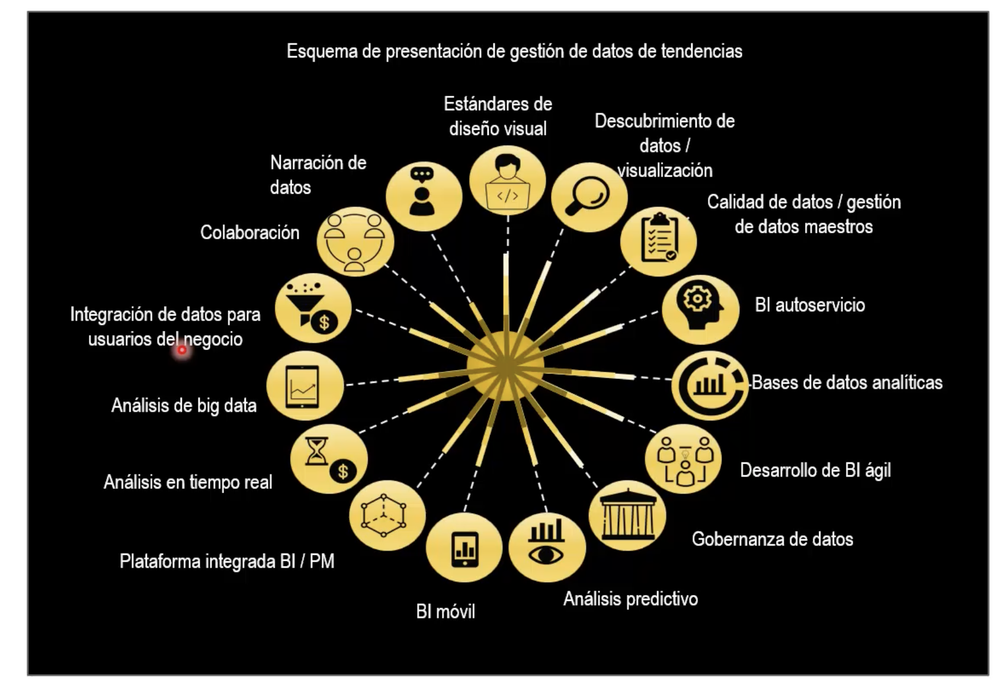

## Cuestionario 

1. Son principios básicos del desarrollo de DW según Kimball:
A. Centrarse en el negocio.
B. Incrementos significativos
C. Los datos como centro de análisis.
D. A y B son correctas. -> Correcto 

2. No es una tarea dentro de la metodología Kimball:
A. Crear el maestro de datos. -> Correcto 
B. Diseño e implementación de ETL.
C. Diseño de arquitectura técnica.
D. Selección de herramientas de implementación.

3. Son áreas de conocimiento dentro de la metodología PMI:
A. DevOps.  
B. CRISP-DM.
C. Costes.
D. Alcance. -> Correcto

4. ¿Cuáles son las rutas para el desarrollo del data warehouse según la
metodología Kimball?
A. Tecnologías.
B. Procesos.
C. Datos.
D. A y C son correctas. -> Correcto 

5. ¿Cómo se pueden obtener los requerimientos del data warehouse?
A. A través de entrevistas.
B. Por medio de sesiones facilitadoras.
C. Por los clientes externos.
D. A y B son correctas. -> Correcta 

6. ¿Cuántas características define Inmon para el DW?
A. 1.
B. 8.
C. 4. -> Correcto
D. 6.

7. Son nuevos roles incorporados en los últimos años:
A. Ingeniero de datos y analista de datos. -> Correcto 
B. Consumidor de datos.
C. Usuarios finales.
D. Consumidores de información.

8. Según el estudio publicado por el BI & Analytics Trend Monitor de BARC, son
tendencias del business intelligence:
A. Creación de grandes empresas.
B. Almacenamiento de gran cantidad de datos.
C. Desarrollo ágil de BI. -> Correcto 
D. Generación de alertas.

9. Menciona dos etapas de la metodología PMI:
A. Pretratamiento de los datos brutos.
B. Inicialización y cierre de los datos maestros.
C. Control y ejecución del proceso.
D. Control y supervisión. -> Correcto 

10. La metodología DevOps permite:
A. Aplicar velocidad a los proyectos subidos a AWS.
B. Aplicar velocidad a los proyectos subidos a Azure.
C. Entrega rápida, confiabilidad y escalado de proyectos. -> Correcto 
D. Actuar lento pero seguro en proyectos BI.

## Tema 5. Introducción al Marketing

## 5.2. Fundamentos y concepto del marketing

> Lo que sí es imprescindible es que el marketing consiga llamar la atención del usuario final para que las empresas puedan vender sus productos

El impacto del marketing en la vida diaria de las personas ha convertido esta
disciplina en una de las funciones más importantes en el actual entorno organizativo,
adoptada por todo tipo de estructura empresarial.

> Marketing no es vender lo que se tiene, es producir lo que se puede vender  

El marketing existe porque es clave para la supervivencia de la empresa al intentar
generar **una actitud hacia el mercado para conseguir unos posibles
comportamientos de compra.** De hecho, en función de cómo se va a concebir la
relación entre el intercambio y el consumidor y los principios de marketing que
aplica, la empresa adopta un método de negocio u otro.

## Ideas clase 
- Meta Maerketing = conservar y atraer nuevos clientes a la empresa.
- Misión = Crear valor agregado suficiente
- Medio = Ofrecer satisfacción por medio de la utilidad que obtienen

## Cuatro orientaciones interrelaciones:

1.- Orientación a la producción
2.- Orientación al producto
3.- Orientación a las ventas
4.- Orientación al marketing
  
## Productos, bienes, servicios e ideas
- El producto es el medio del que dispone la empresa para satisfacer una necesidad
en el consumidor, que posee un valor y es susceptible de satisfacer dicha carestía o
insuficiencia.
- El término producto se utiliza de forma genérica incluyendo también los servicios y
las ideas.

## Necesidad, deseo y demanda
- Conviene diferenciar estos tres conceptos, pues el marketing trata de satisfacer necesidades, formalizadas a través de un deseo y, para ello, actúa fundamentalmente sobre la demanda.

**Precisemos su contenido:**
- Necesidad: sensación de carencia de algo.
- Deseo: expresión de la voluntad de satisfacer una necesidad.
- Demanda: formulación expresa del deseo condicionada por los recursos disponibles.

> Distinguir claramente estos conceptos es imprescindible para asentar los principios de marketing y actuar en consecuencia

> El mecanismo progresivo que se establece en el proceso de adquisición de cualquier
producto o servicio se inicia cuando, registrada o despertada una necesidad, esta se
convierte en un deseo, que correctamente encauzado a través de las diferentes
fases del proceso de compra se convierte en una demanda específica materializada
en la obtención de un producto concreto

## 3 Evolución 
- Intercambio = Acto central del marketing, porque se obtiene un objeto deseado y satisface una necesidad a cambio de algo
- transacciones = Unidad de medida del marketing donde consiste medidas las acciones para un intercambio de valores no necesariamente ecónomico.
- Relaciones = Finalidad última del marketing que pretende construir una red de relaciones con los clientes para que perduren en el tiempo.
  

## 5.3. Concepto de sistema de información
## 5.4. Captura de datos. Sistema de datos internos
## 5.5. La investigación del marketing. Las necesidades del cliente

https://app.dremio.cloud/arctic/c146df44-4aa3-4369-a797-2ad19f7a31e1/data/main

https://desktop.webcatalog.io/es
NmkQ@$hNaCYL7K#!

## Tema 6. Introducción al Marketing (continuación) 

# Notas Clases
## Clase 1: 03 Dic 

## Clase 2: 10 Dic 

## Clase 3: 17 Dic 

**¿Por qué es importante implementar gobierno de datos?**
- Facilita la disponibilidad, usabilidad, integridad y seguridad de los datos. 
- Permite manejar un lenguaje común en la organización, mejorar la accesibilidad de los datos, asegurar la calidad e integridad de los datos y responder a las demandas actuales de ley de protección de datos.
- The Global Data Management Community (DAMA International) es una comunidad global sin ánimo de lucro que promueve los conceptos y mejores prácticas de la gestión de información y datos. 
- DAMA define prácticas bien diferenciadas

**Niveles Madurez****
- Nota: Es una buena Clave medir y conocer siempre el nivel de madurez de tu empresa en cuanto a procesos y toma de decisiones 

1. Inicial
    1. Se trata de empresas que no recopilan datos y no generan ni utilizan indicadores. Si estos existen, son en gran medida estimaciones.
    2. Se aplican pocos estándares formales relativos a los datos y se emplean pocas buenas prácticas. El manejo de datos no se planifica ya que se realiza en su mayor parte, según las circunstancias de cada caso.
    3. No existen mecanismos formales para tomar decisiones sobre la calidad de los datos. Además, la tecnología no está ampliamente disponible.

2. Gestionado
    1. A veces se recopilan datos de pocas fuentes; en general, a través de papel. 
    2. La información es poco útil debido a la mala calidad de los datos. Estos no se comparten ni se intercambian entre unidades.
    3. Algunos indicadores están definidos, se generan algunos productos de información, pero no de manera sistemática, y requieren mucho trabajo y un uso intensivo de recursos.

3. Definido
    1. Estas empresas recopilan datos de manera sistemática mediante herramientas como bases de datos, hojas de cálculo y sistemas de información.
    2. La integración de datos se realiza de manera manual y rara vez se integran para el análisis.
    3. En general, se llevan a cabo buenas prácticas y se han generado estándares para determinadas fuentes de datos. Se documentan y mantienen algunos metadatos.

4. Gestionado cuantitativamente
    1. Se recopilan datos valiosos de todas las fuentes y de forma sistemática. Hay procesos y planes de gobernanza, y se adoptan estándares formalmente.
    2. Se emplean herramientas y tecnologías que están ampliamente disponibles.

5. Optimizado
    1. Se recopilan datos de distintas fuentes, incluso no estructuradas, y se emplean distintos dispositivos. Se alcanzan grandes conjuntos de datos integrados para realizar análisis y facilitar la toma de decisiones.
    2. Las políticas, procedimientos y buenas prácticas para la gestión de datos se aplican uniformemente, lo que potencia la calidad de la información.
    3. Se establecen procesos de mejora continua para monitorear la calidad de los datos e invertir en ella. Se emplea tecnología innovadora que facilita la gobernanza y la toma de decisiones inteligentes.

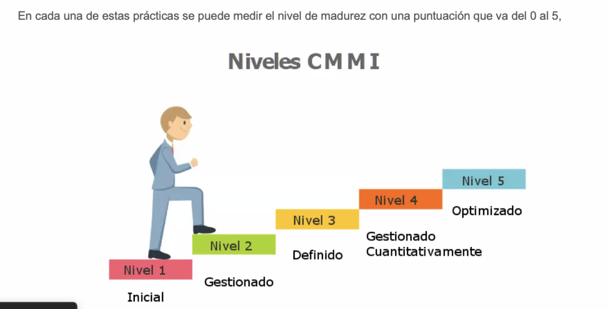

## Clase 4: 14 Enero 

>[!NOTE]
> Notas de la clase  -> El deber ser es tener el Director de TI, Director de Bases de Datos y Director de Seguridad de información, pero no podemos ser juez y parte.
> Un dato erroneo puede ser el causante de una serie de malas decisiones. 
> MDM Master Data Management 

**Datos Maestros** 

- Datos: elementos sin procesar de si solo no generan conocimiento.
- Información es un conjunto de datos con contexto.
- Conocomiento: conjunto de información ya validados y refinados. 
- Experiencia conocimiento aplicado facilitando una mejor compresion de situaciones complejas

**clasificación Datos** 
- Datos Estructurados      -> Una Base SQL
- Datos semi-estructurados -> XML, Json, scv
- Datos no estructurados   -> Videos, audio, imaganes, correo electronicos, registro de chats 
Ciclo de Vida

**El ciclo de vida del Dato:**

- Se Crea:
    - Inicio del proceso.
    - Generación de algo nuevo o original.
    - Puede referirse a la producción de bienes, servicios, ideas, etc.
- Se Almacena:
    - Guardado o conservación de lo creado.
    - Puede implicar un almacenamiento físico o digital.
    - Se asegura la disponibilidad futura del elemento.
- Se Usa:
    - Utilización del elemento almacenado.
    - Consumo o aprovechamiento de sus características o funciones.
- Se Distribuye:
    - Difusión o entrega del elemento a otros.
    - Puede involucrar la venta, el intercambio o la donación.
- Se Archiva:
    - Organización y preservación de registros o información relacionada.
    - Facilita la búsqueda y recuperación futura.
- Se Destruye:
    - Finalización del ciclo de vida.
    - Eliminación o desecho del elemento.
    - Puede ser debido a obsolescencia, daño o finalización de su utilidad.

graph LR
A(Crea) --> B(Almacena)
B --> C(Usa)
C --> D(Distribuye)
D --> E(Archiva)
E --> F(Destruye)
F --> A

 
## Datos Maestros
Los datos maestros son una solución esencial para abordar el problema de la dispersión de datos en múltiples fuentes. Al unificar la información de clientes, empleados, proveedores y productos en una única fuente de verdad, se mejora la calidad de los datos, se optimizan los procesos y se facilita la toma de decisiones.

**Beneficios clave:**

* **Unificación:** Elimina duplicidades e inconsistencias.
* **Calidad:** Garantiza la precisión y confiabilidad de los datos.
* **Eficiencia:** Agiliza los procesos y operaciones.
* **Toma de decisiones:** Proporciona una visión completa de la información.

**Implementación exitosa**

Para implementar con éxito los datos maestros, es crucial contar con una sólida gobernanza de datos que asegure la calidad, seguridad y accesibilidad de la información.

**Palabras clave:** datos maestros, unificación de datos, calidad de datos, gobernanza de datos

## Cómo implementar un sistema de gestión de datos maestros
### Pasos clave:
1. **Planificación:** Definir objetivos, alcance y datos maestros clave.
2. **Coordinación:** Involucrar a todas las partes interesadas.
3. **Modelado:** Crear modelos de datos para representar la estructura.
4. **Integración:** Consolidar datos en un repositorio centralizado.
5. **Calidad de datos:** Implementar controles para garantizar la calidad.
6. **Sincronización:** Mantener los datos actualizados en tiempo real.
7. **Gobernanza:** Establecer reglas y políticas para la gestión de los datos.

## Pasos Clave para la Creación de un Repositorio de Datos Maestros

La creación de un repositorio de datos maestros es fundamental para garantizar la consistencia y calidad de la información en una organización. A continuación, se detallan los pasos clave:

### 1. Definición del Modelo
* Identificar el escenario de aplicación y definición.

### 2. Determinar la Calidad de los Datos
* Evaluar la calidad inicial de los datos.
* Determinar y medir impactos en la operación y negocio.

### 3. Propiedad y Responsabilidad
* Definir roles y permisos de acceso.

### 4. Seguridad y Protección de Datos
* Establecer niveles de servicio.
* Implementar medidas contra amenazas externas.
* Establecer una estrategia de respaldo.

## Cómo Planificar tu Estrategia MDM

La implementación de una estrategia MDM requiere una planificación cuidadosa que considere los siguientes aspectos:

1. **Enfoque en la calidad de datos a largo plazo.**
2. **Aceptación del liderazgo.**
3. **MDM como transformación cultural.**
4. **Responsabilidades y rendición de cuentas.**
5. **Selección adecuada de la solución MDM.**
6. **Escalabilidad de la solución.**
7. **Gobernanza de datos centralizada.**
8. **Definición y medición de métricas de efectividad.**

**Flujos de Datos del gobierno de Datos**

## **Resumen Ordenado:**
> La imagen representa un flujo de datos desde sistemas productores (ERP, CRM, etc.) hasta sistemas consumidores (eCommerce, aplicaciones móviles, etc.) a través de una plataforma de Gestión de Datos Maestros (MDM).

- Los datos se extraen de diversas fuentes (bases de datos, archivos, etc.) y se cargan en un Data Lake.
- Los datos se procesan y transforman mediante ETL y reglas de gobernanza.
- Los datos maestros se almacenan en un repositorio centralizado (MDM).
- Los datos se validan y se sincronizan con los sistemas consumidores a través de API y web hooks.
- Los sistemas consumidores utilizan los datos maestros para diversas tareas, como la personalización de la experiencia del cliente, la toma de decisiones y la generación de informes.
- Se utilizan herramientas de análisis y visualización para obtener insights a partir de los datos

## Diagrama de un Sistema de Gestión de Datos Maestros (MDM)

**Descripción:**

El diagrama ilustra el flujo de datos desde sistemas de origen (productores) hasta sistemas de destino (consumidores) a través de una plataforma de Gestión de Datos Maestros (MDM).

**Componentes clave:**

* **Sistemas Productores:** ERP (Sistemas de Planificación de Recursos Empresariales), CRM (Gestión de Relaciones con el Cliente), PLM ( Gestión del Ciclo de Vida del Producto), bases de datos, archivos, activos digitales.
* **Ingestión de Datos:** API, ETL, carga de archivos.
* **Data Lake:** Almacenamiento masivo de datos en bruto.
* **MDM:** Repositorio centralizado de datos maestros.
* **Sincronización de Datos:** API, web hooks, integración de terceros.
* **Sistemas Consumidores:** eCommerce, aplicaciones móviles, sistemas de análisis, etc.
* **Otros Elementos:** Descubrimiento de datos, linaje, inteligencia artificial.

**Flujo de Datos:**
1. Los datos se extraen de diversas fuentes y se cargan en el Data Lake.
2. Los datos se procesan y transforman mediante ETL y reglas de gobernanza.
3. Los datos maestros se almacenan en el repositorio MDM.
4. Los datos se validan y se sincronizan con los sistemas consumidores.
5. Los sistemas consumidores utilizan los datos para diversas tareas.

**Beneficios del MDM:**
* Mejora de la calidad de los datos.
* Mayor consistencia de la información.
* Toma de decisiones más informada.
* Optimización de procesos.
* Mayor agilidad en la respuesta a los cambios del negocio.
* Mayor satisfacción del cliente 

## **Ejemplo**
- Paso 1

- Paso 2

- Paso 3

  
- Paso 4
Me falto esta 

- Paso 5

- Paso 6

- Paso 7

