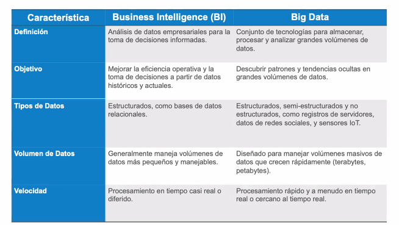
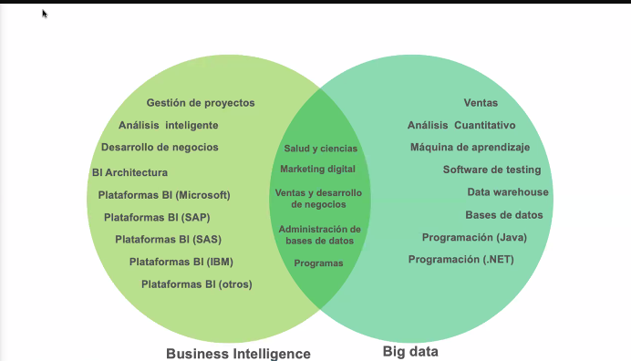
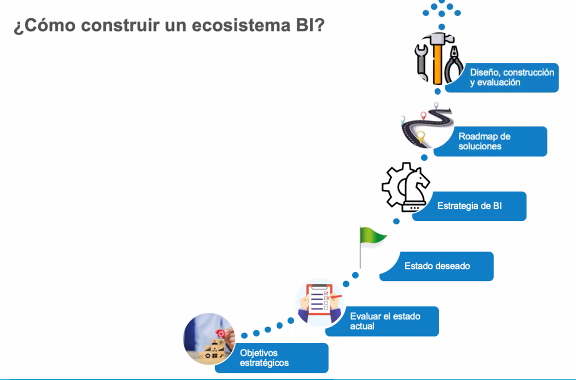
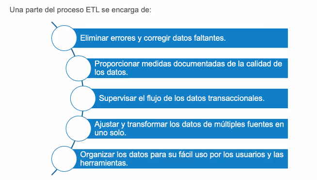
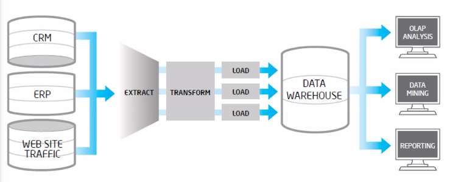
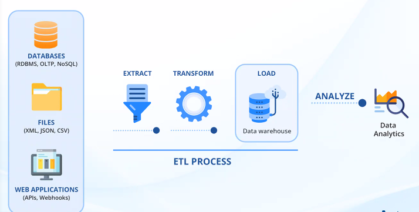
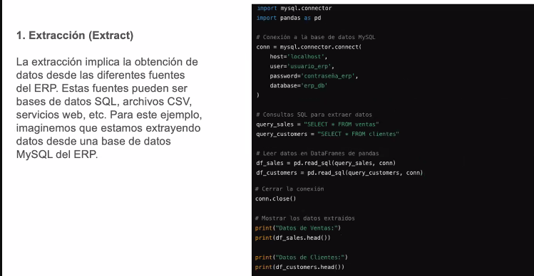
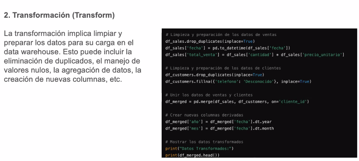
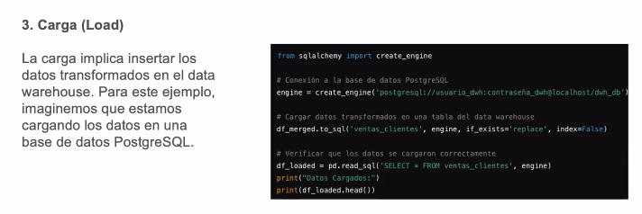

## Clase 6: 04 Febrero 2025 

>[!NOTE]
> 

## Que es BI 

## Beneficios 

## Relación BI y Big Data
- Se basa en datos estructurados 
- Data WareHouse

## Características BI y Big Data
- BI : Análisis de datos empresariales para la toma de decisiones 
- Big Data: son tecnologías para almacenar procesar grandes volumenes de datos 

## Terminos generales 

## ¿Comó construir un ecosistema de BI?

## ¿Proceso ETL?
> Es parte fundamental para BI 
    - Nos permite identificar ciertos patrones 
    - El Proceso de ETL consume el 60 y 80% del tiempo de BI 
    - Es costoso ya que usa DW y varias tecnologías 

**Resumen**

## ¿Proceso Como?
- paso 1

- paso 2

- paso 3

