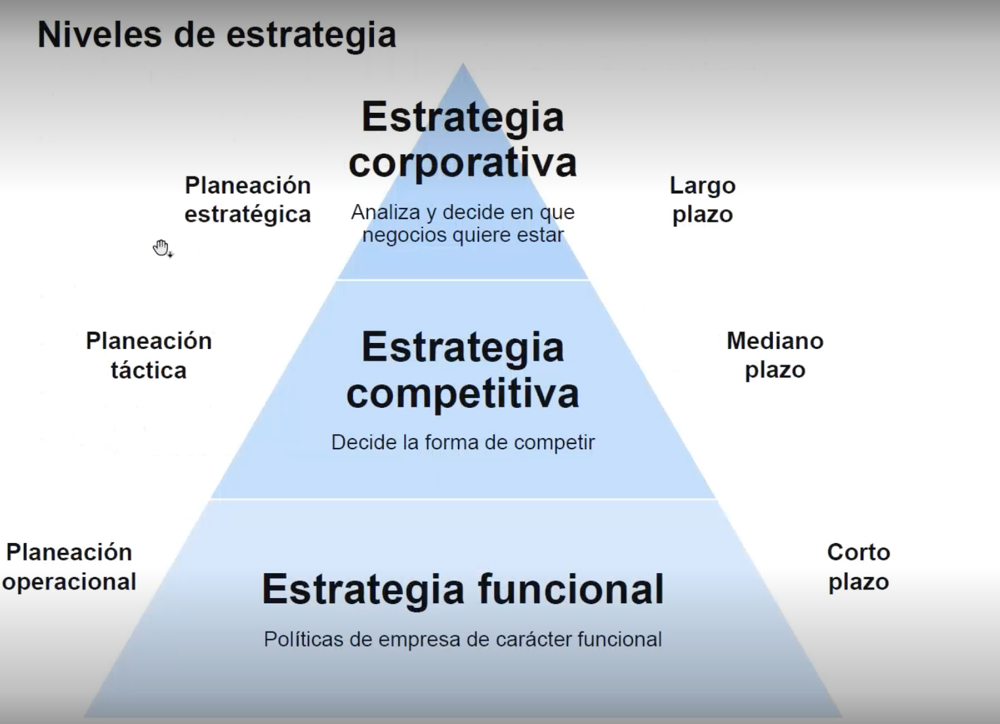
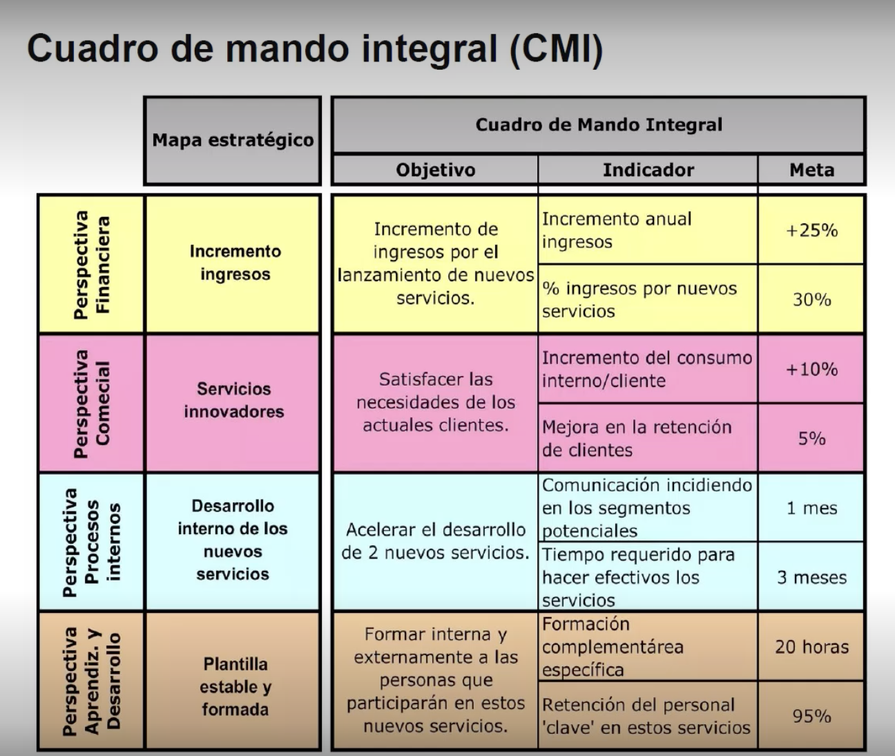
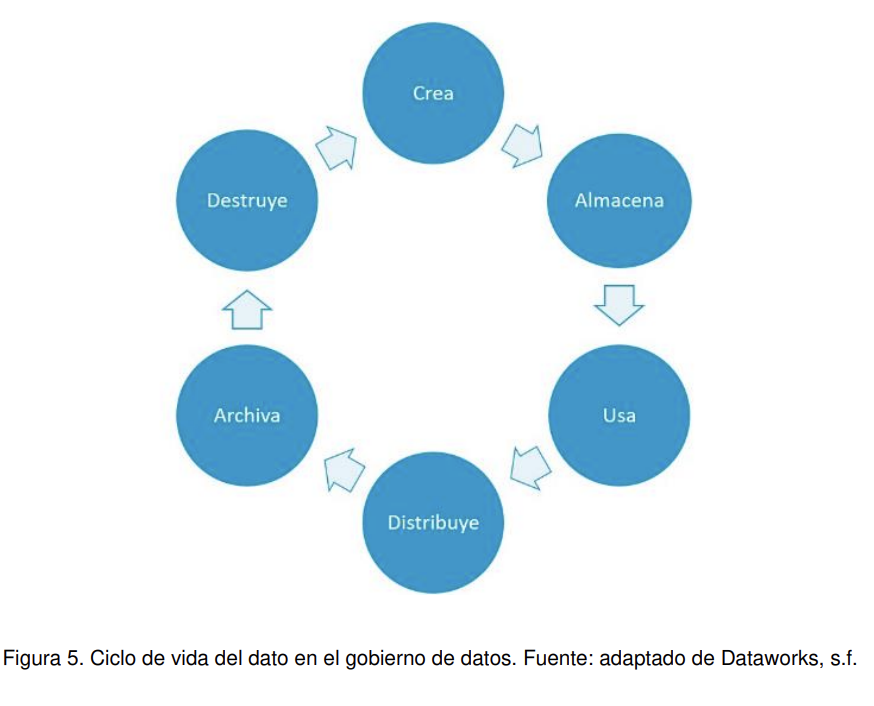

# Gobierno del Dato y Toma de Decisiones

## Tema 1:  Dirección Estratégica y Gobierno de Datos 

1.1. Introducción al Gobierno de Datos  

> Dependemos de DAMA 
"DAMA es una asociación internacional sin fines de lucro que se refiere a Data Management Association, es decir, Asociación de Gestión de Datos en español. DAMA se dedica a promover y facilitar el desarrollo de la gestión de datos e información, y a brindar recursos, formación y conocimiento sobre el tema." 

**Caracteristicas**
- Maneja administra controla por medio de ISO para mejorar la gestion de datos 
- DAMA establece los pasos para una buena sistematica en los proyectos de datos

**Etapas** 
- Gestion Arquitectura de Datos: Establecer un plan de gestion para datos estrategicos 
- Modelado y diseño de Datos: Modela analizar y organizar los datos 
- Gestionar almacenamiento organizacion de datos: Se refiere a calidad de persistecia de los datos que esten bien almacenados
- Gestión de seguridad de datos: Asegurar los datos
- Gestion Documentacion y contenido: Tenr una buena documentación de los datos Diccionarios de datos y MDER
- Almacen de Datos: 
- Gestion de Metadatos: Tener buena gestion de los datos para agregar mas valor 
- Gestión de Calidad de datos: Validar la concistencia de los datos 

**Importancia** 
- Disponibilidad
- Usabilidad 
- Integridad
- Seguridad 
- Tener un lenguaje comun 

1.2. Integración de Datos en la Estrategia Empresarial 

1.2. ¿Qué es la dirección estratégica (DE)?

Es una disciplina que integra las distintas estrategias y tácticas empresariales,
analiza decisiones tomadas y observa sus consecuencias o efectos durante un
período de tiempo, aparte de su pretensión de alcanzar objetivos empresariales a
largo plazo.

## 1.3. El proceso de dirección estratégica  

## Estrategia Corporativa : Analiza y decide en que negocios quieres estar  
**Concepto**
- Consiste en definir, organizar las tareas de manera sistematica para que las empresas logren alcanzar su objetivo de manera gradual, dando el paso a la planeacion de corto y largo plazo. 

- Resaltando que no intenta predecir el futuro si no tener un abanico de decisiones que impacten en el. 

**Como**
- Información: Datos que nos ayuden definir nuestras metas 
- Metodologia: Con los datos definimos el como vamos a lograr las metas 
- Pensamiento estrategico: Con el como debemos evaluar y pasar a la acción con el compromiso, llmar siempre al Call to action.   

> Podemos ver estos pasos de una forma esquemática, desde el presente al futuro de la organización 

> Herramientas para definir la estrategia Corporativa 
**Análisis externo o análisis PEST/PESTE**

El análisis PEST es una herramienta de gran utilidad para entender el crecimiento o
bajada de un mercado y, como resultado, la posición, el potencial y la dirección de
nuestro negocio. Es útil para medirlo y evaluarlo. PEST es una sigla compuesta por
los siguientes aspectos: políticos, económicos, sociales y tecnológicos

En ocasiones, el análisis PEST se extiende a otros factores, como el ecológico, el
legislativo y el industrial, para convertirse en PESTELI. Algunos consideran que
esta extensión no es necesaria, dado que, si se realiza un adecuado PEST, este
debería cubrir todos estos aspectos de forma natural.

**Los objetivos del análisis PEST se centran en:**
- Conocer los factores externos que afectan a la empresa.
- Identificar los factores externos que pueden cambiar en el futuro.
- Explotar los cambios actuales para convertirlos en oportunidades.
- Identificar y analizar las posibles amenazas para buscar una pronta solución.

**Análisis DAFO** 
La matriz DAFO también se conoce como matriz FODA o análisis SWOT (siglas en
inglés de strenghts, weaknesses, opportunities y threats). Es empleada para la
formulación y evaluación de estrategias. Por lo general, se puede usar para las
empresas y las personas. Su nombre se debe a las iniciales de las siguientes
palabras:

- Debilidades.
- Amenazas.
- Fortalezas.
- Oportunidades.

Permite obtener el beneficio para revisar la estrategia, posición y
dirección de la empresa. Los elementos analizados en PEST son básicamente
externos; es recomendable efectuar dicho análisis antes del DAFO, el cual está
enfocado a factores internos (fortalezas y debilidades) y externos (oportunidades y
amenazas)

## Estrategia Competitiva: Decide la forma de competir 

**Pasos** 
- Planeacion táctica
- Mediano Plazo 

**Ejemplo** 

- Estrategia 1: Diferenciación
    - En que puede diferenciarse 
    - Poca competencia con el mismo criterio 
    - Riesgo: Imitacion de los clientes 
- Estrategia 2: Liderazgo en coste 
    - Sensible de precio 
    - Producto poco difereciales 
    - Alto poder de negociacion con los clienes 
    - Riesgo: vigilancia constante de costos 

- Estrategia 3: Movimientos anticipados 
    - llegar primero
    - Esperar imitaciones 
    - Riesgo: imitacion 

- Estrategia 4: focalizacion 
    - Seleccionar el mercado o segmento 

## Estrategia funcional: Defines politicas de la empresa de caracter funcional 

**Concepto**

Consiste en generar y definir estrategias para cada unidad o departamento de la empresa, con el proposito que todos esten alineados a la mision y vision de la organización 

## Herramientas

**Cuadro de Mando Integral (CMI)**
Es una herramienta gerencial que permite a los directivos y al personal de las
empresas en general administrar y comunicar las estrategias, monitorear
permanentemente la organización y utilizar los resultados de las medidas para la
evaluación del desempeño, lo que facilita el logro de los objetivos (Wexler et al.,
2017). Fue introducida por Robert Kaplan y David Norton

## Nota: 
- La dirección estratégica proporciona una visión integral que ayuda a la empresa a ser más competitiva, facilita la evaluación y toma de decisiones a través de una gestión integral, y permite la implementación de indicadores de desempeño clave.

- La dirección estratégica proporciona una visión integral que ayuda a la empresa a ser más competitiva, facilita la evaluación y toma de decisiones a través de una gestión integral, y permite la implementación de indicadores de desempeño clave.

- El modelo de gestión estratégica se basa en la misión y visión de la empresa, así como en los objetivos estratégicos que buscan alinear las acciones con la dirección deseada.

- La misión debe responder a "¿Quiénes somos?", "¿qué hacemos?", "¿cómo lo hacemos?", "¿para quién lo hacemos?" y "¿dónde lo hacemos?". Estas preguntas ayudan a definir el propósito y el ámbito de acción de la empresa.

- La visión se centra en el ámbito de acción y la estrategia de la empresa, definiendo hacia dónde se dirige y cómo espera llegar allí, sin incluir explícitamente la misión o los valores.

## Videoclase 1. Fundamentos de la Dirección Estratégica
## Notas 

## Videoclase 2. Elementos Clave del Gobierno de Datos
## Notas: 
- El gobierno de datos es crucial para asegurar la calidad y protección de los datos, lo que a su vez facilita la toma de decisiones informadas y estratégicas en la organización.
- El cuadro de mando integral evalúa la organización desde cuatro perspectivas clave: financiera, cliente, procesos internos y aprendizaje y crecimiento, proporcionando una visión equilibrada del desempeño.
- Los elementos fundamentales del cuadro de mando integral incluyen indicadores y metas, que miden el desempeño, así como el mapa e indicadores estratégicos, que guían la implementación de la estrategia.
- Las etapas del proceso de toma de decisiones incluyen identificar el problema, desarrollar opciones, implementar las opciones seleccionadas y evaluar los resultados para retroalimentar el proceso.
- En la toma de decisiones intervienen elementos como la información disponible, la acción a tomar y los datos que sustentan la decisión, así como la realimentación y los resultados obtenidos.

## Videoclase 3. Estrategias Competitivas y Herramientas de Análisis
## Notas: 
- Correcto. La DAMA define la gobernanza de datos como el ejercicio de autoridad y control a través de la gestión de los activos de datos.
- Correcto. Implementar un gobierno de datos facilita la disponibilidad, usabilidad, integridad y seguridad de los datos en la organización.
- Correcto. La estrategia competitiva se enfoca en cómo una empresa competirá en el mercado.
- Correcto. El análisis PESTEL se utiliza para evaluar el entorno político, económico, social, tecnológico, ecológico y legal que afecta a la empresa.
- Correcto. Una de las perspectivas del Cuadro de Mando Integral (CMI) es la perspectiva financiera, que evalúa el rendimiento financiero de la empresa.

## Tema 2. Business Intelligence y Datos Maestros 

## Videoclase 1. Importancia del Dato en BI y BA.
-  La gestión adecuada de los datos, a través de un ciclo de vida bien definido y el uso de datos maestros, es crucial para el éxito en Business Intelligence (BI) y Business Analytics (BA). Esta respuesta reconoce la importancia de los datos como un activo estratégico que, cuando se maneja adecuadamente, mejora los procesos de toma de decisiones.

- El ciclo de vida de los datos en la gestión del gobierno de datos incluye fases críticas como la creación, el uso y la eventual destrucción de los datos. Este ciclo garantiza que los datos sean manejados adecuadamente durante toda su existencia, asegurando su calidad y relevancia. 

- La creación de modelos de predicción no es un paso fundamental en la construcción de un ecosistema de BI (Business Intelligence). Los pasos clave incluyen entender los objetivos estratégicos, evaluar la madurez organizacional y definir una estrategia clara para implementar aplicaciones BI.

- La creación de modelos de predicción no es un paso fundamental en la construcción de un ecosistema de BI (Business Intelligence). Los pasos clave incluyen entender los objetivos estratégicos, evaluar la madurez organizacional y definir una estrategia clara para implementar aplicaciones BI.

- El proceso de business analytics incluye etapas como el análisis descriptivo, que examina datos históricos, y el análisis predictivo, que se enfoca en prever tendencias y patrones futuros. Estas etapas son fundamentales para extraer información útil y tomar decisiones informadas.

## Videoclase 2. Datos Maestros y su GestiónPágina

- La creación de datos maestros es vital para evitar la duplicidad de datos y mejorar la confiabilidad de la información dentro de la organización. Esto asegura que todos los departamentos trabajen con una única fuente de verdad, optimizando la eficiencia operativa y la calidad de los datos.

- Business Analytics (BA) se enfoca en el análisis predictivo y prescriptivo, proporcionando recomendaciones basadas en datos actuales y futuros. Por otro lado, Business Intelligence (BI) se centra principalmente en el análisis de datos históricos para entender el desempeño pasado.

- La afirmación "Se puede realizar un análisis descriptivo y diagnóstico de los datos" no es falsa; de hecho, es uno de los beneficios del business analytics. Sin embargo, esta opción fue marcada incorrectamente en el contexto de la pregunta, lo cual puede confundir al usuario.

- Business Intelligence (BI) es considerado reactivo, ya que se centra en analizar datos históricos para entender el rendimiento pasado y tomar decisiones basadas en lo que ya ha ocurrido. No se anticipa a eventos futuros, a diferencia de los enfoques predictivos o prescriptivos.

- El análisis prescriptivo se enfoca en recomendar acciones para manejar futuros escenarios, basándose en datos y modelos predictivos. Este tipo de análisis va más allá de predecir lo que sucederá, proporcionando recomendaciones específicas para optimizar los resultados futuros.

# Nota: 
- Actividades del gobierno de datos: 
    - Entender las necesecidades de integración de los datos 
    - Identificar fuentes y contribuyentes 
    - Definir y Mantener la Arquitectura de integración 
    - Implementar las soluciones de admin
    - Definir y mantener las reglas de coincidencia 
    - Establecer los registros de ORO
    - Definir y mantener las jerarquias 
    - Planificar e implementar 
    - Replicar y Distribuirlos 
    - Administrar los cambios de Datos Maestros y referencias. 

- Objetivos: Gestion de los datos maestros  
    - Mejorar la calidad de los datos y su integración  através de las fuentes, estrategias y las tecnologicas
    - Proporcionar una vision de 360 grados para asegurar la calidad de los reportos, 

## Videoclase 3. Análisis Predictivo y Prescriptivo

## Nota:
- Correcto. Un objetivo principal del gobierno de datos es mejorar la calidad e integración de los datos.
- Correcto. Es crucial determinar quién necesita qué información para asegurar que los datos adecuados estén disponibles para las personas correctas.
- Correcto. La fase de mantener y usar se encarga de asegurar la integridad y seguridad de los datos durante su utilización.
- Correcto. Business intelligence se refiere a la integración de datos para facilitar el análisis y la toma de decisiones en una organización.
- Correcto. Los datos duplicados se refieren a la presencia de registros repetidos en una base de datos, lo cual puede afectar la calidad y precisión de la información.

## 2.2. Datos, información y conocimiento

- Los datos:  son elementos sin procesar, sacados de la realidad que a su vez generan
nuevos elementos y que por sí solos no generan nuevo conocimiento. Ejemplos de
datos: el precio de un producto, la edad, el nombre de una persona, etc.

- La información:  es el principio del conocimiento. Son datos con un significado o
función especial o el resultado de combinar diferentes datos, es decir, son datos con
contexto.

- El conocimiento: es la información analizada que hace nuevos aportes a un área específica.

## En cuanto a cómo se han generado los datos, nos podemos encontrar con los siguientes tipos de datos:

- Creados: son aquellos generados por la propia empresa a través de los sistemas de
información.

- Compilados: son aquellos que se utilizan de otras grandes bases de datos, como
censos electorales, información obtenida de las administraciones públicas en salud,
vivienda, impuestos, etc.

- Experimentales: son los generados por simulaciones o pruebas para determinar la
validez de los sistemas.

- El autor Dorian Pyle define la preparación de los datos como «la manipulación y
transformación de los mismos sin refinar para que la información contenida en el
conjunto de datos pueda ser descubierta o estar accesible de forma más fácil» (Pyle, 1999).

## 2.3. Datos maestros

## Concepto 
> Uno de los mayores problemas a la hora de consolidar los datos es que estos se encuentran en diferentes fuentes y pueden llegar a tener valores diferentes. Por ejemplo, un mismo cliente puede estar en dos bases de datos y tener una dirección o un teléfono diferente en cada una de ellas. La gestión de datos maestros (MDM, por sus siglas en inglés de master data management) nace como solución a este problema. El objetivo es que los datos críticos se encuentren en un solo sitio. 

## pasos más importantes a seguir para la creación de un repositorio de datos maestros

- Definición del Modelo 
- Determinación y Calidad de los datos 
- Propiedad y Responsabilidad
- Seguridad y Protección de los datos 

## La eficacia de la gestión de datos maestros se puede medir mediante varios criterios:
- Disponibilidad de datos: medido del 0 al 1, de acuerdo con lo interesantes que pueden ser los datos generados para cierta consulta.
- Calidad de los datos: rapidez, completitud y veracidad. También con una medición de 0 a 1.
- Desempeño de la consulta de datos: datos en tiempo real, incluyendo datos agregados. Medición entre 0 y 1

## 2.4. Inteligencia de negocios

## concepto 
> Si se cuenta con un repositorio de datos maestros unificados, es más fácil implementar una estrategia de inteligencia de negocios. Hasta hace algunos años estos datos maestros se construían en el proceso BI, ahora con el gobierno de datos la idea es crearlos antes de cualquier proceso BI, BA u otro que implique generación de conocimiento.

## ¿Quién necesita el business intelligence?
Todas aquellas personas de la empresa que tienen que tomar decisiones.
Dependiendo del tipo de negocio, se deben hacer las preguntas necesarias para
responder y establecer el modelo de business intelligence que mejor se adapte.

## Beneficios del business intelligence
Uno de los objetivos básicos de los sistemas de información es contribuir a la toma
de decisiones. Cuando se requiere tomar una decisión, es necesario pedir o buscar
información, que servirá para minimizar la incertidumbre

## Tipos Beneficios  

- Beneficios tangibles: son aquellos que la empresa puede cuantificar y que le aportan beneficios económicos. Ejemplo: reducción de costes de producción, generación de nuevos ingresos, reducción en tiempo de producción, evitar pérdidas
de clientes o materia prima, aumentar la rentabilidad.

- Beneficios intangibles: son aquellos que no se pueden cuantificar, pero que aportan valor agregado a los servicios o productos y mejoran la posición competitiva. Ejemplo: mejorar la atención al cliente, aumentar la satisfacción del cliente interno y
externo, tener información más actualizada.

- Beneficios estratégicos: son aquellos que facilitan la creación de nuevas estrategias, respecto a qué clientes, mercados o con qué productos encaminar los esfuerzos de la empresa. Ejemplo: mejorar la toma de decisiones, identificar clientes potenciales, etc

## Arquitectura del business intelligence

- Procesos ETL: consisten en la extracción, transformación y carga de los datos en el
data warehouse. Antes de guardarlos ahí, deben ser transformados, limpiados,
filtrados y redefinidos. Como se mencionó anteriormente, la información que tienen
las empresas en los sistemas transaccionales no está preparada para la toma de
decisiones.

- Data warehouse: también llamado almacén de datos, con el metadata o diccionario
de datos. Se busca almacenar los datos de una forma que facilite y maximice su
flexibilidad, facilidad de acceso y administración. Surge como respuesta a las
necesidades de los usuarios que necesitan información consistente, integrada,
histórica y preparada para ser analizada y apoyar la toma de decisiones.

- Herramientas OLAP: para proveer la capacidad de cálculo, consultas, funciones de
planeamiento, pronóstico y análisis de escenarios en grandes volúmenes de datos.
En la actualidad, existen otras alternativas tecnológicas al OLAP. Siguiendo el
modelo se deben analizar las tecnologías que permitirán tratar y visualizar la
información que reside en un data warehouse. En este apartado también se tratarán
las herramientas de visualización, ya que en muchas ocasiones van ligadas.

## ¿Cómo construir un ecosistema BI?

- Partimos de los objetivos estratégicos de la empresa.

- El estado actual hace referencia a si se está o no preparado para implementar una
estrategia de BI. Puede que culturalmente estemos preparados; puede que haya
empresas que estén muy evolucionadas en infraestructura, pero no en organización.

- En el estado deseado debemos hacernos la siguiente pregunta: ¿a dónde quiero
llegar, según los objetivos estratégicos? Por ejemplo, yo quiero que todas las
decisiones de la compañía se rijan por datos.

- En la estrategia BI debemos preguntarnos: ¿qué habilidades debo tener al interior de
la organización?, ¿cómo promover el uso de las herramientas?, ¿cómo implementar
el gobierno del dato? Si no definimos procesos de BI al interior de la compañía, no
llegaremos a buen término.

- En el roadmap de soluciones, tenemos que buscar iniciativas para poder llegar al
estado deseado. Priorizar iniciativas, de acuerdo con lo que la empresa tiene y puede

- Diseño, construcción y evaluación son tareas asignadas al departamento de
tecnología. Teniendo en cuenta los anteriores pasos, ya se podría pensar en qué
diseño y qué herramientas son las más adecuadas.

## 2.5. Business intelligence vs. business analytics

- **Business intelligence:** la inteligencia de negocios (BI) es un instrumento mediante
el cual diferentes organizaciones pueden apoyar la toma de decisiones basadas en
información precisa y oportuna para garantizar la generación del conocimiento
necesario que permita seleccionar la alternativa que sea más conveniente para el
éxito de la empresa (Rosado y Rico, 2010).

- **Business analytics:** es un conjunto de técnicas (entre las que se encuentran
algoritmos predictivos y modelos estadísticos) que le permiten a la organización
predecir posibles eventos o resultados. Esto es, se enfoca en el análisis futuro en
función de la información de la empresa y modelos predictivos para apoyar la toma
de decisiones y mejorar los procesos y, por ende, la competitividad del negocio
(Thorlund y Laursen, 2017).

## Diferencia 

En resumen, se puede entender el business intelligence como las técnicas de
recoger y entender datos del pasado, mientras que el business analytics permite
alcanzar una visión más clara del futuro. Ambas metodologías se pueden
complementar para construir un análisis minucioso de la actividad y futuro de la
empresa, con el propósito de mejorar la toma de decisiones.

- La construcción básica de business analytics se fundamenta en los cuatro pilares de
Gartner (Popkin y Hayward, 2004), que se constituyen con cuatro componentes
básicos:
    - Los datos.
    - Las personas.
    - Los procesos.
    - La tecnología.

## Tema 3. Data Warehouse y Data Lake 

## notas 
- OLAP : OnLine Analitical  Processing   

## Videoclase 1. Fundamentos de Data Warehouse
## Notas: 
- El proceso ETL (Extract, Transform, Load) incluye las etapas de extracción de datos de diversas fuentes y su transformación en un formato adecuado para la carga en el destino final, como un data warehouse.
- Los data marts son subconjuntos del data warehouse orientados a áreas específicas de negocio, facilitando el acceso a datos relevantes para análisis departamentales.
- Las arquitecturas de una y dos capas son comunes en la implementación de data warehouses. La arquitectura de una sola capa integra datos directamente en el almacén de datos, mientras que la de dos capas incluye una capa adicional para procesamiento o almacenamiento.
- Las fuentes de datos para un data warehouse pueden incluir bases de datos relacionales y archivos de texto plano, que proporcionan datos estructurados y semiestructurados.
- Un data lake puede almacenar datos de una variedad de fuentes, incluidos archivos de texto plano, XML, HTML, PDF y multimedia como fotos. Esta flexibilidad permite almacenar datos estructurados, semiestructurados y no estructurados.

## Videoclase 2. Metodologías para Desarrollo de DWPágina
## Notas:   

- Kimball DataWarehouse menciona que se construye de un conjunto de datasmart independientes orientado al negocios en especifico en vez de un enfonque centralizado es un desarrollo gradual y una entrega de valor mas rapida. 

- Kimbal usa mucho OLAP 
- Cubos olap, representan una forma eficiente para visualizar datos para un análisis mas profundo, se asemeja a una estructura bidimensional compuestos por dimensiones, jerarquias, medidas, la verdadera capacidad de los cubos es que permite al usuario visualizar análisis multidimensionales, permite validar datos desde multiples perspectivas. 
- Concepto de Tablas 
    - **Estrella** todo radica de una sola tabla principal y todos los demas la rodean 
    - **Copo de Nieve** todo radica de una sola tabla principal y todos los demas la rodean pero ciertas tablas tienen su tablas hijas 
    - **Constelación** ya es un esquema donde las tablas tienen sus hijos y no solo la tabla principal es el centro de atención. 
    - 

- Bill Inmon definió que un data warehouse debe ser indexado en el tiempo y no volátil, proporcionando un almacenamiento consistente y estable de datos históricos para análisis.
- Tanto los data warehouses como los data lakes están diseñados para centralizar y organizar datos, con el objetivo de facilitar la toma de decisiones basada en datos.
- En el proceso ETL, el tiempo de carga inicial puede ser considerablemente largo debido a la necesidad de transformar y limpiar grandes volúmenes de datos.
- En ELT (Extract, Load, Transform), los datos se cargan primero en el destino y luego se transforman, a diferencia del ETL tradicional. Por lo tanto, la afirmación de que se transforman en un servidor intermedio antes de la carga es falsa.
- Los metadatos actúan como un repositorio central que proporciona significado y contexto a los datos almacenados en un data warehouse. Incluyen información sobre la estructura, componentes y atributos, facilitando la comprensión y uso de los datos.
- No es lo mismo ELT que ETL notaaaaaa 

## Videoclase 3. Innovaciones y Roles en Data Management 
## Notas:  
- Data Lake: Es un sistema de almacenamiento que permite guardar una basta de cantidad de datos en su forma bruta, es mas flexible ya que permite almacenar datos no estructurados, como imagenes, audio y video y permite almacenar grandes volumes de datos, permite almacenar datos con un costo menor. 

| Concepto | ETL (Extract, Transform, Load) | ELT (Extract, Load, Transform) |
|---|---|---|
| Procesamiento | Los datos se transforman en un servidor de almacenamiento intermedio antes de subirse al Data Warehouse. | Los datos se suben al Data Lake y allí permanecen. Las transformaciones se realizan en el sistema de destino. |
| Tiempo de carga | Los datos se cargan en un almacén intermedio y luego se mueven al sistema destino objetivo. Tiempo de carga intensivo. | Los datos se cargan una sola vez. Tiempo de carga muy rápido. |
| Tiempo de mantenimiento | Altos niveles de mantenimiento. | Bajo nivel de mantenimiento. |
| Complejidad de implementación | Lo complejo es tener la estructura y los procesos que llenarán esa estructura. | Se debe tener claro qué herramientas se van a utilizar. |
| Madurez | Este proceso se utiliza desde hace más de dos décadas, bien documentado y mejores prácticas disponibles fácilmente. | Es nuevo y complejo de implementar. |

- Data Mesh: Es una arquitectura de datos distribuidas que enfatiza la descentralización del diseño y el gobierno y propiedad de los datos, promueve la idea que los datos deben ser tratados como un producto 

    - Ventajas 
        - Habilitar la agilidad y la escalabilidad empresarial.
        - Reducir el tiempo de comercialización de las iniciativas comerciales.
        - Menores costos de mantenimiento.
        - Permitir una asignación de costos interna justa y transparente.

- Correcto. Los Data Warehouses son repositorios de datos estructurados, mientras que los Data Lakes pueden almacenar datos en cualquier formato.
- Correcto. ELT permite cargar datos rápidamente en el Data Lake y realizar las transformaciones necesarias en el sistema de destino.
- Correcto. El Data Mesh promueve la descentralización y asigna la propiedad de los datos a los dominios que mejor los entienden.
- Correcto. Los cubos OLAP se utilizan para el procesamiento analítico en línea, permitiendo análisis de datos multidimensionales rápidos.
- Correcto. Las tablas de hechos en un Data Warehouse almacenan datos numéricos del negocio y se conectan con las tablas de dimensión.

## 3.2. Procesos ETL

Como sus siglas indican, consiste en la extracción, transformación y carga de los
datos, de modo que se puede afirmar que es una parte fundamental de este. Antes
de guardar los datos, deben ser transformados, limpiados, filtrados y redefinidos

El proceso de ETL consume entre el 60 y el 80 % del tiempo de un proyecto de
business intelligence, por lo que es un proceso fundamental en el ciclo de vida del
proyecto

Esta parte del proceso de construcción del data
warehouse (DW) es costosa y consume una parte significativa de todo el proceso,
razón por la que utilizan recursos, estrategias, habilidades especializadas y
tecnologías. El proceso ETL va más allá del transporte de los datos de las fuentes a
la carga dentro del DW, ya que añade un valor significativo a los datos.

## Proceso 
- Eliminar errores y corregir datos faltantes.
- Proporcionar medidas documentadas de la calidad de los datos.
- Supervisar el flujo de los datos transaccionales.
- Ajustar y transformar los datos de múltiples fuentes en uno solo.
- Organizar los datos para su fácil uso por los usuarios y las herramientas

## Etapas
## Extracción
> Este proceso extrae los datos físicamente de las distintas fuentes de información. En este momento los datos están en la forma como se almacenan, en bruto. La extracción de los datos se puede realizar de forma manual o utilizando herramientas de ETL. 

## Limpieza

> Este proceso recupera los datos de la base de datos u otro tipo de fuente y comprueba la calidad, elimina los duplicados y, cuando es posible, corrige los valores erróneos y completa los valores incompletos, etc. 

## Ejemplo de algunos errores más comunes:
- Datos duplicados: un cliente es registrado varias veces en la misma empresa.
- Inconsistencia en los datos: en la dirección de una persona, el código postal no corresponde a la ciudad donde vive.
- Inconsistencia de valores: aparece en primer lugar un valor y posteriormente aparece el mismo valor de otra forma. Por ejemplo: primero, escribir el país como USA y, luego, digitarlo completo (Estados Unidos de Norteamérica).

## Transformación
> Este proceso recupera los datos limpios y de alta calidad, los organiza y resume en los distintos modelos de análisis. El resultado de este proceso es la obtención de datos limpios, consistentes, resumidos y útiles. 

## La transformación incluye: 
- Cambios de formato, sustitución de códigos, valores derivados y agregados. 

## La carga y actualización
> Es la última etapa del proceso y valida que los datos cargados en el DW sean consistentes con las definiciones y formatos; los integra en los distintos modelos de las distintas áreas de negocio que se han definido. Estos procesos suelen ser complejos, por tanto, es necesario tener personal experto que ayude en el proceso.

## 3.3. Almacén de datos (data warehouse o DW)

A través del data warehouse, conocido también como el almacén de datos en el
diccionario de datos, se busca almacenar los datos de forma que facilite y maximice
su flexibilidad, facilidad de acceso y administración. Surge como respuesta a las
necesidades de los usuarios que necesitan información consistente, integrada,
histórica y preparada para ser analizada y poder tomar decisiones. 

## Equipo BILL 
    - las características que debe cumplir un data warehouse:
        - Orientado a un área: significa que cada parte del DW está construida para resolver
un problema de negocio
        - Integrado: la información debe ser convertida en medidas comunes, códigos y
formatos comunes para que pueda ser útil.
        - Indexado en el tiempo: significa que la información histórica se mantiene y se
almacena en determinadas unidades de tiempo
        - No volátil: esta información no es mantenida por los usuarios, como se realizaría en
los entornos transaccionales

## Equipo Kimball 
    - las características que debe cumplir un data warehouse:
        - Diseño ascendente (bottom-up): Se comienza construyendo pequeños almacenes de datos (datamarts) enfocados en áreas específicas del negocio. Luego, estos datamarts se integran en un data warehouse central
        - Modelo dimensional: Utiliza un modelo de datos basado en dimensiones y medidas. Las dimensiones proporcionan contexto (e.g., tiempo, producto, cliente) y las medidas son los valores numéricos que se analizan (e.g., ventas, costos).
        - Enfoque en el negocio: Se centra en las necesidades de los usuarios finales y en cómo los datos pueden ser utilizados para tomar mejores decisiones de negocio.
        - Agilidad y escalabilidad: Permite construir y modificar rápidamente los data warehouses para adaptarse a los cambios en los requisitos del negocio. 
        - Reducción del tiempo de comercialización: Al enfocarse en áreas específicas del negocio, se pueden obtener resultados más rápidamente.
        - Menores costos de mantenimiento: El diseño modular y escalable facilita la administración y el mantenimiento del data warehouse.

## Esquemas de un data warehouse

## Esquema estrella
Este modelo es el más sencillo. Está formado por una tabla central de «hechos» y
varias «dimensiones», incluida una dimensión de «tiempo». Lo más representativo
de la arquitectura de estrella es que solo existe una tabla de dimensiones para cada
dimensión. 

## Esquema copo de nieve
Es una variante del modelo anterior. En este modelo la tabla de hechos ya no es la
única que se relaciona con otras tablas, existen otras tablas que se relacionan con
las dimensiones y que no tienen relación directa con la tabla de hechos. El modelo
fue concebido para facilitar el mantenimiento de las dimensiones, sin embargo, esto
permite que se vinculen más tablas a las secuencias SQL. Este modelo es complejo
de mantener, ya que permite la vinculación de muchas tablas

## Esquema galaxia

Este esquema contiene varias tablas de hechos que comparten dimensiones. Es muy
común encontrar este tipo de esquema, incluso es recomendable compartir
dimensiones. El esquema se ve como una colección de estrellas, por eso su nombre.
Por ejemplo, pueden existir dos tablas de hechos: inventario y ventas que podrían
compartir las dimensiones de producto y fecha. 

## Arquitecturas
> Para la realización del data warehouse se adoptan dos clasificaciones diferentes para su arquitectura:

## Arquitectura de una sola capa: 
- No se utiliza con frecuencia en la práctica. 
- Su objetivo es minimizar la cantidad de datos almacenados. Para alcanzar este objetivo se eliminan las redundancias de datos.
-  Esto significa que un almacén de datos se implementa como una vista multidimensional de datos operacionales
- La debilidad de esta arquitectura radica en que no cumple con los requisitos de separación entre procesamiento analítico y transaccional

## Arquitectura de dos capas: 
- Aunque normalmente se nombra «arquitectura de dos capas» para destacar la separación entre las fuentes físicamente disponibles y los almacenes de datos, en realidad consta de cuatro etapas de flujo de datos
posteriores. 

    - Capa de origen: es el sistema de almacén de datos que utiliza fuentes
heterogéneas de datos. Los datos se guardan originalmente en bases de datos
relacionales corporativas o pueden provenir de sistemas de información fuera de los
muros corporativos.

    - Capa de almacenamiento de datos: los datos almacenados en las diferentes
fuentes deben extraerse, limpiarse para eliminar inconsistencias y rellenar espacios,
e integrarse para convertirlas en fuentes heterogéneas en un esquema común,
proceso ETL.

    -   Capa de depósito de datos: la información se almacena en un solo depósito
lógicamente centralizado. Se puede acceder directamente al almacén de datos, pero
también se puede utilizar como fuente para crear nuevos productos de datos, que
replican parcialmente los contenidos del almacén de datos y están diseñados para
departamentos empresariales específicos.

    - Capa de análisis: se accede de manera eficiente y flexible a los datos integrados
para emitir informes, analizar la información y representar escenarios hipotéticos de
negocios. 

## Data mart
El data warehouse es una gran estructura. En muchas ocasiones, para facilitar el
manejo de los datos, es necesario utilizar estructuras de datos más pequeñas
llamadas data mart

## Los data mart están compuestos por partes del DW primario, que en algunos casos pueden ser:

- Dependientes: utilizan los datos y metadatos del data warehouse directamente en
lugar de obtenerlos de los sistemas de producción.

- Independientes: los datos son tomados de cada área de la empresa, siempre
manteniendo los datos alineados con el DW, si este existe. Aunque los data mart no
son estrictamente necesarios, son muy útiles para los sistemas de almacenamiento. 

## Los metadatos
Un componente esencial de un data warehouse son los metadatos. Es el repositorio
central de información que abarca todos los niveles. Da el significado de cada uno de
los componentes, variables y atributos que residen en el DW o data mart. 

## 3.4. Lago de datos (data lake)

Puede definirse como un almacén de datos o un repositorio de grandes cantidades
de datos que son útiles para realizar análisis. Los datos se almacenan en una
arquitectura plana en lugar de una forma jerárquica, como se hace con los
almacenes de datos o DW. Los datos almacenados pueden ser de cualquier tipo:
datos estructurados (filas y columnas), semiestructurados (CSV, JSON, XML) y no
estructurados (PDF, documentos, fotos, vídeos, correos). Es necesario crear
metadatos para poder tener información adicional de cada dato almacenado. Si un
lago de datos no proporciona valor para los usuarios o es inaccesible, se denomina
pantano de datos.

Cuando se crea un data lake, el proceso ETL (extracción, transformación y carga)
cambia a ELT (extracción, carga y transformación). Los datos se almacenan sin
procesar

## Tema 4. Metodologías y Tendencias 

## Videoclase 1. Introducción a Metodologías de Desarrollo
## Notas: 
1. **Planificación del Proyecto**
   * Definición de requerimientos
   * Diseño arquitectónico técnico
   * Selección de productos e implementación
2. **Modelado y Diseño**
   * Modelado dimensional
   * Diseño físico
   * Diseño e implementación ETL
3. **Desarrollo e Implementación**
   * Especificaciones de soluciones BI
   * Desarrollo de soluciones BI
   * Implementación
4. **Mantenimiento**
   * Mantenimiento, administración y provisión del servicio DWH/BI

- Kimball enfatiza la importancia de centrarse en las necesidades del negocio y en la entrega de incrementos significativos durante el desarrollo de un data warehouse (DW). Estos principios garantizan que el DW sea relevante y útil para la organización.

- La metodología Kimball se centra en el diseño de procesos ETL, arquitectura técnica y la selección de herramientas, pero no incluye la creación de un maestro de datos como una tarea específica dentro de su enfoque

- El Project Management Institute (PMI) define áreas de conocimiento como costes y alcance, esenciales para la gestión de proyectos. Estas áreas no incluyen metodologías específicas como DevOps o CRISP-DM.

- ¿Cuáles son las rutas para el desarrollo del data warehouse, según la metodología Kimball? 
    - Kimball sugiere rutas como la implementación de tecnologías adecuadas y la gestión de datos efectivos para el desarrollo de un data warehouse. Estas rutas aseguran un diseño robusto y eficiente

- Los requerimientos del data warehouse se pueden obtener mediante entrevistas con stakeholders y sesiones facilitadoras. Estos métodos permiten una comprensión detallada de las necesidades y expectativas del proyecto.

## Videoclase 2. Metodología Kimball para BI
## Notas: 

- Kimball 
    - Usa entrevistas 
    - Secciones facilitadoras 
    - Se genera matriz de procesos de dimenciones tablas hechos filas dimensiones columnas 
- Se debe generar estas preguntas para crear DW 
    - ¿Cuál es el problema que quiero resolver? ¿Qué tipo de datos ayudarían?
    - ¿De dónde lo conseguiré?
    - ¿Cómo lo almacenaré y protegeré?
    - ¿Cómo lo analizaré?
    - ¿Quién será el responsable?
    - ¿Cómo se compartirá con el resto de la organización?
    - ¿Cómo se implementará en los procesos de trabajo?
- usa estrategia mas personalizadas 
- Diseño fisico y ETL 

- Bill Inmon
    - Padre de DW 
    - se enfoca en un modelo top down
        - Obtener patrocinio directivo: Es tener el apoyo de los altos mandos para tener los recursos. 
        - Evaluar lo que se tiene: Evaluar los datos existente de la organización  
        - Definir el qué será: Se define la arquitectura del DW 
        - Determinar el valor del dato: Se determina que datos son criticos y que datos son menos relevantes 
        - Planear el riesgo: Se evaluan los obstaculos para crear los DW y posibles estrategias para mitigar los riesgos 
        - Monitorear la eficacia y hacer el ciclo: Se debe evaluar la eficacia para mejorar los procesos 
- Usa estrategias mas centralizadas 

- ¿Cuántas características define Inmon para el DW?
    - Bill Inmon define cuatro características fundamentales para un data warehouse: orientado a temas, integrado, no volátil y variable en el tiempo. Estas características aseguran la consistencia y fiabilidad de los datos almacenados.
- Son nuevos roles incorporados en los últimos años
    - En los últimos años, han surgido nuevos roles como ingeniero de datos y analista de datos, que se especializan en la gestión y análisis de grandes volúmenes de datos, convirtiéndose en posiciones clave en las organizaciones modernas.
- Según el estudio publicado por el BI & Analytics Trend Monitor de BARC, son tendencias del business intelligence
    -  El desarrollo ágil de Business Intelligence es una tendencia identificada por el BI & Analytics Trend Monitor de BARC. Esta metodología permite una adaptación rápida a las necesidades cambiantes y mejora la eficiencia en la entrega de soluciones BI.
- Menciona dos etapas de la metodología PMI
    -   Dentro de la metodología PMI, las etapas de control y supervisión son fundamentales para asegurar que el proyecto se mantenga en curso y cumpla con los objetivos establecidos. Estas etapas permiten la gestión eficaz del proyecto a lo largo de su ciclo de vida.
- La metodología DevOps permite
    - La metodología DevOps está diseñada para aumentar la velocidad de entrega, confiabilidad y escalabilidad de los proyectos. Esta práctica combina el desarrollo y las operaciones para mejorar la eficiencia y la calidad de los productos tecnológicos.

## Videoclase 3. Tendencias Actuales en Business Intelligence 
## Notas:  

- Roles 
    - Director de Datos Chief Data Officer
    - Data Ownner 
    - Data steward [estiward] - Admin datos 
    - Coordinador de administracion de datos: Responsable de dirigir los datos 
    - Ejecutivos de admin Datos : 
    - Arquitecto Datos: Responsables de datos coherentes
    - Arquitecto DW: 
    - Analista de Datos : Captura de datos y validacion de datos 
    - Especialista Datos: Adminstrador del control de datos para facilitar su gestion
    - analista Calidad de datos
    - Admin Base de Datos:
    - Administrador Seguridad de datos: 
    - Arquitecto Businnes Inteligence:
    - Gerente del programa BI: 

- ¿Cuál es uno de los principios básicos de la metodología Kimball?
    - Correcto. La metodología Kimball se enfoca en el negocio y en crear una infraestructura de información completa y útil.
- ¿Cuál es uno de los pasos en la planificación de un proyecto según la metodología Kimball?
    - Correcto. Es crucial definir con precisión el alcance y los requerimientos del negocio para una planificación efectiva del proyecto.
- ¿Cuál es una pregunta clave que puede ayudar en el análisis de requerimientos?
    - Correcto. Preguntarse cómo se compartirá la información es esencial para asegurar que los datos sean accesibles y útiles dentro de la organización.
- ¿Qué rol en la estructura DAMA es responsable de la arquitectura y la integración de datos de alto nivel?
    - Correcto. El arquitecto de datos es responsable de la arquitectura y la integración de datos de alto nivel.
- ¿Qué tendencia en BI para 2022 se menciona en el documento?
    - Correcto. La encuesta de BARC destaca la importancia de entender las decisiones de compra y los beneficios comerciales a través de encuestas y estudios.

## 4.2. Metodología Kimball

La metodología de Kimball se centra principalmente en el diseño de la base de datos
que guardará la información para la toma de decisiones. El diseño se basa en la
creación de tablas de hechos, que contienen la información numérica de los
indicadores por analizar, es decir, la parte cuantitativa de la información.

La aplicación de cualquier metodología para el desarrollo del DW en las empresas
siempre va a depender de las necesidades de las organizaciones y el compromiso
institucional de quienes conforman dichas organizaciones.

La metodología se basa en lo que Kimball denomina ciclo de vida dimensional del
negocio —business dimensional lifecycle

## cuatro principios básicos:

1. Centrarse en el negocio: es necesario enfocarse hacia la tipificación de los
requerimientos del negocio y el valor que le aportará, emplear estos esfuerzos en
desarrollar relaciones sólidas con el negocio y con los encargados de implementar
las herramientas.
2. Realizar una infraestructura de información: se trata de diseñar una base de
información única, integrada, fácil de usar y de alto rendimiento, en la cual deben
verse reflejados todos los requerimientos de negocio identificados en la
organización.
3. Cumplir las entregas en incrementos significativos: define los tiempos de
creación del almacén de datos en incrementos progresivos entregables. Los plazos
están determinados por los desarrolladores del proyecto y estos pueden ser cuatro o
seis meses cada entrega (ten en cuenta que estos son tan solo ejemplos, los
tiempos de entrega se deben ajustar a las necesidades de la empresa).
4. Ofrecer la solución completa: facilitar todos los elementos necesarios para
entregar valor a todos los usuarios del negocio. Para empezar, se debe contar con
un almacén de datos sólido, bien diseñado, con calidad probada y accesible.
También se deberá entregar herramientas de consulta ad hoc, aplicaciones para
informes y análisis avanzado, capacitación, soporte, sitio web y documentación

## 4.3. Metodologías PMI

El PMI es una asociación profesional de las más grandes del mundo que cuenta con
medio millón de miembros e individuos titulares de sus certificaciones en 180 países, Las más importantes son Scrum y PMI (siglas de Project Management Institute).

La metodología del PMI de gestión de proyectos se compone de dos elementos
esenciales

Proceso
Para la Guía PMBOK (A guide to the Project Management Body of Knowledge), no
puede hablarse de proyecto si este no se concibe como un proceso, es decir, una
serie de actividades coordinadas e interrelacionadas entre sí que deben ejecutarse
con un fin específico. 

Lo realmente decisivo en
la ejecución de un proyecto es tener despejadas las etapas básicas que lo
conforman, que para el PMI son, según la PMBOK:

- Inicialización.
- Planificación.
- Ejecución.
- Control.
- Cierre

## 4.4. Metodología Inmon

Bill Inmon es considerado el padre del concepto del data warehouse y menciona que
debe cumplir con las características 

## Caracteristicas
- Orientado a temas
- Integrado 
- No volatil 
- Variante en el tiempo 
- La metodología Inmon también es conocida como top down

## Proceso para la construcción del DW
Inmon propone los siguientes pasos para la construcción del DW.
1. Reconocer los sistemas transaccionales de la empresa que van a servir como
fuentes de datos del DW.
2. Se empiezan a llenar las primeras tablas en el DW de las respectivas unidades
del negocio. Los usuarios empiezan a acceder a los datos integrados.
3. Se cargan más tablas al DW y aumentan también los usuarios que acceden al
mismo.
4. El DW es cargado con los datos correctamente, esto trae como resultado la
aparición de sistemas de apoyo a la toma de decisiones.
5. Se crean los data mart para cada unidad de negocio.
6. Si surgen nuevas necesidades, deben crearse nuevos data mart.
7. Después de todos estos pasos, finalmente la arquitectura está desarrollada. En
algunas ocasiones los usuarios prefieren acceder a los data mart, ya que su acceso
es más rápido

## Granularidad
- El aspecto más importante del diseño de un almacén de datos es la granularidad. 
De hecho, el problema de la granularidad afecta a la arquitectura que rodea el entorno
del almacén de datos. 
- La granularidad se refiere al nivel de detalle o resumen de las unidades de datos en el DW. 
- Cuantos más detalles hay, menor es el nivel de granularidad. Cuantos menos, el nivel es mayor (Inmon, 2002).

## Los beneficios de la granularidad son:
- Después de que el almacén de datos se haya construido correctamente, proporciona
a la organización una base extremadamente flexible y reutilizable para diferentes
procesos de sistemas de apoyo a la toma de decisiones.

- Los datos granulares que se encuentran en el almacén de datos son la clave para la
reutilización, ya que pueden ser usados por muchas personas de diferentes
maneras. Por ejemplo, dentro de una empresa, los mismos datos podrían ser
utilizados para satisfacer las necesidades de marketing, ventas y contabilidad.

- Todos estos tipos de información están estrechamente relacionados, aunque
ligeramente diferentes. Con un almacén de datos, las diferentes organizaciones
pueden ver los datos como lo desean.

- Visualizar los datos de diferentes maneras es solo una ventaja de tener una base
sólida. Un beneficio relacionado es la capacidad de conciliar datos, si es necesario.

## 4.5. Data-driven decision modelling

Una perspectiva data-driven (DDM) permite a las empresas examinar y organizar sus
datos con el objetivo de mejorar la atención a sus clientes y consumidores. Al usar
datos para promover sus acciones, una empresa puede contextualizar y personalizar
los mensajes a sus clientes o posibles clientes para un enfoque más centrado en el
cliente

El DDM es un método que se centra en el uso de los métodos de CI, particularmente
las máquinas de aprendizaje, para la construcción de modelos que complementan o
reemplazan los modelos «basados en el conocimiento» que describen el
comportamiento físico

## 4.6. Metodología DevOps

Combina filosofía, prácticas y herramientas que incrementan la capacidad de la
organización para desarrollar aplicaciones y servicios a gran velocidad

## 4.7. Nuevos roles

- Roles 
    - Director de Datos Chief Data Officer
    - Data Ownner 
    - Data steward [estiward] - Admin datos 
    - Coordinador de administracion de datos: Responsable de dirigir los datos 
    - Ejecutivos de admin Datos : 
    - Arquitecto Datos: Responsables de datos coherentes
    - Arquitecto DW: 
    - Analista de Datos : Captura de datos y validacion de datos 
    - Especialista Datos: Adminstrador del control de datos para facilitar su gestion
    - analista Calidad de datos
    - Admin Base de Datos:
    - Administrador Seguridad de datos: 
    - Arquitecto Businnes Inteligence:
    - Gerente del programa BI: 

## 4.8. Tendencias

## Tema 5. Introducción al Marketing

## 5.2. Fundamentos y concepto del marketing

> Lo que sí es imprescindible es que el marketing consiga llamar la atención del usuario final para que las empresas puedan vender sus productos

El impacto del marketing en la vida diaria de las personas ha convertido esta
disciplina en una de las funciones más importantes en el actual entorno organizativo,
adoptada por todo tipo de estructura empresarial.

> Marketing no es vender lo que se tiene, es producir lo que se puede vender  

El marketing existe porque es clave para la supervivencia de la empresa al intentar
generar **una actitud hacia el mercado para conseguir unos posibles
comportamientos de compra.** De hecho, en función de cómo se va a concebir la
relación entre el intercambio y el consumidor y los principios de marketing que
aplica, la empresa adopta un método de negocio u otro.

## Ideas clase 
- Meta Maerketing = conservar y atraer nuevos clientes a la empresa.
- Misión = Crear valor agregado suficiente
- Medio = Ofrecer satisfacción por medio de la utilidad que obtienen

## Cuatro orientaciones interrelaciones:

1.- Orientación a la producción
2.- Orientación al producto
3.- Orientación a las ventas
4.- Orientación al marketing
  
## Productos, bienes, servicios e ideas
- El producto es el medio del que dispone la empresa para satisfacer una necesidad
en el consumidor, que posee un valor y es susceptible de satisfacer dicha carestía o
insuficiencia.
- El término producto se utiliza de forma genérica incluyendo también los servicios y
las ideas.

## Necesidad, deseo y demanda
- Conviene diferenciar estos tres conceptos, pues el marketing trata de satisfacer necesidades, formalizadas a través de un deseo y, para ello, actúa fundamentalmente sobre la demanda.

**Precisemos su contenido:**
- Necesidad: sensación de carencia de algo.
- Deseo: expresión de la voluntad de satisfacer una necesidad.
- Demanda: formulación expresa del deseo condicionada por los recursos disponibles.

> Distinguir claramente estos conceptos es imprescindible para asentar los principios de marketing y actuar en consecuencia

> El mecanismo progresivo que se establece en el proceso de adquisición de cualquier
producto o servicio se inicia cuando, registrada o despertada una necesidad, esta se
convierte en un deseo, que correctamente encauzado a través de las diferentes
fases del proceso de compra se convierte en una demanda específica materializada
en la obtención de un producto concreto

## Evolución 
- Intercambio = Acto central del marketing, porque se obtiene un objeto deseado y satisface una necesidad a cambio de algo
- transacciones = Unidad de medida del marketing donde consiste medidas las acciones para un intercambio de valores no necesariamente ecónomico.
- Relaciones = Finalidad última del marketing que pretende construir una red de relaciones con los clientes para que perduren en el tiempo.

## 5.3. Concepto de sistema de información

> Pero el concepto de sistema de información que aludimos en esta materia va
más allá de la mecanización de actividades rutinarias. Hace referencia a la
gestión del conocimiento que encierran los datos disponibles y aprovechables
en la información.

- Hoy en día los datos que circulan en una empresa poseen un valor inmenso que debemos aprender a tramitar para poder ser utilizados con eficacia.
-  Una condición esencial del mundo digital en el que vivimos es una administración eficaz de la información procedente de fuentes internas y externas

## concepto SIM 
- Su objetivo es generar un flujo ordenado de datos con el proposito de procesar, almacenar datos para luego ayudar en la toma de decisiones. 

## Beneficios del SIM 

## 5.4. Captura de datos. Sistema de datos internos

- Esta clasificación responde a la imperiosa urgencia de invertir en la obtención de datos en tiempo real.
- Sea cual sea el SIM que se emplee, que dependerá del tiempo que se necesita en la respuesta, la captura empieza por la creación de un banco de datos que recoja toda la información que fluye por la empresa.
## Se Clasifica en: 
- Ocasional: Se le conoce como un estudio de mercado basado en entrevistas y encuestas a un sector 
- Preferente : Es Sistematico y resuelve el estado actual del mercado con metricas y datos

## Importancia 
- Este banco de datos actualizado al instante es el que permite a la empresa contar con la información más actual de los clientes y así tomar medidas de la forma más rápida y eficiente para responder a sus necesidades
 
## Datos 
- Los datos internos son los primeros datos que hay que aprender a fiscalizar porque están dentro de la organización y no suponen costes adicionales. Pero no son los únicos.
-  Los Datos Externos: son el entorno, el mercado, la competencia y los consumidores

  
## 5.5. La investigación del marketing. Las necesidades del cliente

> El primer paso que es necesario emprender para lograrlo consiste en observar y estudiar detenidamente el comportamiento del consumidor con sus compras reales, sus inclinaciones, sus tendencias, predisposiciones y preferencias
> La conducta del consumidor final es un indicativo de qué tipo de productos o
servicios son los que desea adquirir, debiendo decidir así la empresa a qué precios
venderlos, dónde y cómo hacerle publicidad al producto, qué canales de distribución
emplear, etc. Precisamente para conseguirlo se emplea la investigación de
marketing, cuya principal utilidad es conocer el nivel de satisfacción, el grado de
bienestar y el estado de complacencia de sus clientes con lo adquirido

## Metodos de Investigación 

# Notas Videos
## Videoclase 1. Fundamentos del Marketing
- El marketing como filosofía
    - Defiende el establecimiento de unas relaciones permanentes con los clientes. -> El marketing como filosofía busca construir relaciones duraderas con los clientes, basadas en la confianza y la satisfacción continua de sus necesidades y expectativas.
- La venta es un proceso
  - En doble sentido. -> La venta es un proceso de comunicación bidireccional donde tanto el vendedor como el comprador intercambian información y valor, con el objetivo de satisfacer necesidades y establecer relaciones comerciales.    
- El marketing como disciplina científica
  - Es reconocido como una ciencia aplicada del comportamiento que trata de comprender las relaciones entre compradores y vendedores. -> El marketing es una ciencia aplicada que estudia y analiza el comportamiento de los consumidores y las dinámicas entre compradores y vendedores, enfocándose en satisfacer necesidades y construir relaciones de valor.
- El concepto de marketing está estrechamente vinculado con la relación de intercambio.
  - Correcto.-> El marketing se basa en la relación de intercambio, donde se intercambian productos o servicios por algo de valor, generalmente dinero, para satisfacer las necesidades y deseos de las partes involucradas.
- La satisfacción de necesidades es
  - El elemento motivador que facilita el proceso de intercambio -> La satisfacción de necesidades es el principal motor detrás del proceso de intercambio. Es la razón por la que los consumidores buscan productos o servicios que cumplan con sus deseos y expectativas.
 
## Videoclase 2. Productos y Enfoque en el Cliente
- Cuando se habla de producto, desde el punto de vista del marketing, nos estamos refiriendo a
  - Los objetos tangibles e intangibles. -> En marketing, el término "producto" incluye tanto bienes tangibles como servicios intangibles. Esto abarca cualquier oferta que pueda satisfacer una necesidad o deseo del consumidor.
- Los bienes son
  - Objetos físicos y, como tales, tangibles. -> Los bienes son productos físicos que pueden ser vistos y tocados, a diferencia de los servicios, que son intangibles y no pueden ser percibidos físicamente.
- El enfoque actual del marketing hacia el mercado y en relación con el cliente
  - Solo es posible con un mejor conocimiento de las necesidades individuales del cliente. -> El enfoque moderno del marketing se centra en la personalización y en entender profundamente las necesidades individuales de los clientes para ofrecer soluciones personalizadas y crear relaciones de largo plazo.
- El sistema de inteligencia de marketing aporta información
    - Sobre los aspectos que tienen lugar en el entorno y que son más significativos para la empresa. -> La inteligencia de marketing proporciona información valiosa sobre el entorno externo, ayudando a la empresa a adaptarse a cambios y aprovechar oportunidades relevantes.
- La investigación de marketing consiste en
    - El diseño sistemático, el análisis de datos y la recogida de información relevante para resolver un problema concreto al que se enfrenta la empresa. -> La investigación de marketing se enfoca en recopilar y analizar datos para resolver problemas específicos y tomar decisiones informadas que beneficien a la empresa y sus estrategias de mercado.

## Videoclase 3. Inteligencia e Investigación de Marketing
- ¿Qué es el Sistema de Información de Marketing (SIM)?
    - Un sistema que recolecta, almacena, analiza y distribuye información de marketing para la toma de decisiones. -> Correcto. El SIM se utiliza para gestionar información relevante para la toma de decisiones en marketing.
- ¿Cuáles son algunos de los beneficios del consumo colaborativo mencionados en el documento?
    - Eliminación de intermediarios, mayor especialización y capacidad de elección. -> Correcto. El consumo colaborativo ofrece beneficios como la eliminación de intermediarios, mayor especialización y capacidad de elección.
- ¿Qué tipo de datos se consideran esenciales para el análisis de clientes?
    - Datos transaccionales y demográficos. -> Correcto. Los datos transaccionales y demográficos son esenciales para un análisis efectivo de clientes.
- ¿Cuál es uno de los objetivos principales de la creación de un buyer persona?
    - Identificar las necesidades y comportamientos de los clientes para personalizar estrategias de marketing. -> Correcto. La creación de un buyer persona ayuda a identificar y entender mejor a los clientes para personalizar las estrategias de marketing.
- ¿Qué herramienta se menciona como útil para el análisis de datos en marketing estratégico?
    - Google Analytics. -> Correcto. Google Analytics se menciona como una herramienta útil para el análisis de datos en marketing estratégico.

## Drink 

## Single 

## BOBOS 

## Geeks 

## Senior Boomers 

## como definir un persil mas personalizado 

## Tema 6. Introducción al Marketing (continuación) 

## 6.2. Principios y fundamentos

>La analítica web es la recolección, medición, análisis y reporte de los datos que se extraen de la navegación de los usuarios por un sitio web para poder comprender y optimizar su uso.

**La analítica web sirve para:**
- Conocer el comportamiento de los usuarios.
- Comparar el rendimiento de los diferentes medios de captación de tráfico (SEO,SEM…).
- Evaluar el rendimiento de nuestras páginas web y proponer mejoras.
- Analizar tendencias y comportamientos recurrentes en el tiempo.
- Tomar decisiones estratégicas a nivel de negocio, producto o precio.

**En concreto, si se desgrana su definición de forma natural podemos descifrar mejor
en qué consiste el proceso de la analítica web:** 
- 1. Recopilar información (medición y recolección)
- 2. Realizar las preguntas correctas (análisis)
- 3. Realizar los reportes adecuados (reporte)
- 4. Mejorar y optimizar un sitio web. 
- 5. Detección de errores en el sitio web.

## 6.3. Métricas básicas

**Podemos seleccionar de entre las docenas de métricas que se usan, aunque algunas de ellas son las relevantes y debemos tener claras:**

- Visitantes únicos: número de visitantes no duplicados que han accedido al sitio web. 
- Visitas: una visita es un conjunto de interacciones que tienen lugar en un sitio web durante un período determinado. 
- Páginas vistas: son las páginas a las que se accede dentro del sitio web. Las páginas están compuestas de hits, impactos o cantidad de respuestas de un servidor a la petición de un navegador o robot. 
- Páginas/visita: promedio de páginas vistas durante una visita al sitio. Este indicador
tiene que ir creciendo con el tiempo dentro de la página web. 
- Duración media de la visita: es la duración media de una sesión.
- Porcentaje de rebote: porcentaje de visitas de una sola página y en las que el usuario ha abandonado el sitio en su página de entrada. 

**Otras métricas interesantes para tener en cuenta son:**
- Porcentaje de visitas nuevas: porcentaje estimado de visitas realizadas por primera vez. 
- Sesiones: interacciones de un usuario en un sitio web.
- Tasa de conversión: es el porcentaje resultante de dividir los resultados entre los visitantes únicos. 
- Métricas para obtener el ROI.
- Medición de resultados.
- Métricas de rendimiento.
- Indicadores de eficacia.

**La analítica web se clasifica en dos tipos: la cuantitativa y la cualitativa:** 
**La cuantitativa** 
- son análitica general de las seccione de usuarios generales 

**Cualitativa**
- La analítica cualitativa nos aporta datos más visuales, relacionados con el comportamiento del usuario

**¿Qué métricas son decisivas en la analítica aplicada a la usabilidad?** 
- El tiempo en página o el porcentaje de rebote. 
- Funnels o embudos de conversión. 
- Test A/B o test
- Cuántos visitantes son nuevos y cuántos recurrentes, 
- Páginas de destino 
- Observar con detenimiento las páginas de salida 
- Páginas de salida que tengan un alto porcentaje de salidas serán las primeras que debemos comprobar.

## El comportamiento del usuario
- Hoy en día la velocidad de descarga del sitio es uno de los factores fundamentales que Google toma para el posicionamiento SERP de los sitios web. 
-  Hoy en día esto ya no solo sucede en el caso de una web, sino también del móvil, las tabletas y todo tipo de plataformas donde nuestros contenidos estén disponibles para los usuarios. 

## 6.4. Tipos de analíticas web

> La analítica web es el proceso de recopilar, medir, analizar y comprender los datos del tráfico de un sitio web. Esto se hace para optimizar el sitio web, mejorar la experiencia del usuario y alcanzar los objetivos de negocio.

1.- **Analítica de tráfico**: 
    - Se centra en el volumen y las fuentes de tráfico que recibe un sitio web. 
    - Esto incluye métricas como el número de visitantes, las páginas vistas, la duración de la visita y las fuentes de tráfico 
    - Por ejemplo, búsqueda orgánica, tráfico directo, redes sociales.

2.- **Analítica de comportamiento**: 
    - Analiza cómo interactúan los visitantes con un sitio web. 
    - Esto incluye métricas como la tasa de rebote, el porcentaje de clics, el tiempo de permanencia en la página. 
    - El recorrido del usuario a través del sitio.

3.- **Analítica de conversión**: 
    - Mide el número de visitantes que completan una acción deseada en un sitio web
    - Como realizar una compra, suscribirse a un boletín o completar un formulario de contacto. 
    - Esto ayuda a evaluar la efectividad del sitio web para lograr sus objetivos de negocio.

4.- **Analítica de contenido**: 
    - Evalúa el rendimiento del contenido de un sitio web. 
    - Evalúa artículos de blog, videos o imágenes. 
    - Esto incluye métricas como el número de visitas, el tiempo de permanencia en la página y el número de compartidos en redes sociales.

5.- **Analítica de redes sociales**: 
    - Analiza el rendimiento de las campañas de marketing en redes sociales y cómo interactúan los usuarios con el contenido compartido en estas plataformas. 
    - Esto incluye métricas como el alcance, la interacción, el número de seguidores y el sentimiento de los comentarios.

**Analíticas web según su enfoque específico**

- Analítica en tiempo real: 
    - Permite monitorizar el tráfico y el comportamiento de los usuarios en un sitio web en tiempo real. 
    - Esto es útil para identificar problemas técnicos, evaluar el impacto de campañas de marketing y tomar decisiones rápidas.

- Analítica predictiva: 
     - Utiliza modelos estadísticos y algoritmos de aprendizaje automático para predecir el comportamiento futuro de los usuarios y anticipar tendencias. 
     - Esto puede ayudar a personalizar la experiencia del usuario y optimizar las estrategias de marketing.

- Analítica de segmentación: 
    - Divide a los usuarios en grupos según sus características demográficas, comportamiento o intereses. 
    - Esto permite personalizar la comunicación y ofrecer contenido relevante a cada segmento.

## 6.5. Herramientas de medición

- Analítica de tráfico:
    - Google Analytics: La herramienta más utilizada y completa del mercado. Ofrece una gran cantidad de datos sobre el tráfico, las fuentes, el comportamiento de los usuarios, etc.
    - Adobe Analytics: Una herramienta más avanzada y completa que Google Analytics, ideal para empresas con grandes volúmenes de datos y necesidades de análisis más complejas.
    - Matomo (antes Piwik): Una alternativa de código abierto a Google Analytics, que ofrece funcionalidades similares y la posibilidad de alojar los datos en servidores propios.
    - Yandex Metrica: La herramienta de analítica web de Yandex, el buscador más utilizado en Rusia. Ofrece funcionalidades similares a Google Analytics y es gratuita.
    - StatCounter: Una herramienta sencilla y fácil de usar, ideal para obtener datos básicos sobre el tráfico de un sitio web.

- Analítica de comportamiento:*
    - Hotjar: Permite analizar el comportamiento de los usuarios a través de mapas de calor, grabaciones de sesiones y encuestas.
    - Crazy Egg: Similar a Hotjar, ofrece mapas de calor y otras herramientas para entender cómo interactúan los usuarios con un sitio web.
    - Mouseflow: Otra herramienta que ofrece mapas de calor, grabaciones de sesiones y análisis de formularios.

- Analítica de conversión:*
    - Google Analytics: También ofrece funcionalidades para medir conversiones, como el seguimiento de objetivos y el análisis de embudos de conversión.
    - Adobe Analytics: Similar a Google Analytics, permite medir y analizar conversiones de manera detallada.
    - Kissmetrics: Una herramienta especializada en el análisis de conversiones y el seguimiento del comportamiento de los usuarios a lo largo del tiempo.

- Analítica de contenido:
    - Google Analytics: Permite analizar el rendimiento del contenido de un sitio web, como las páginas más visitadas, el tiempo de permanencia en la página y la tasa de rebote.
    - Parse.ly: Una herramienta especializada en el análisis de contenido, que ofrece datos en tiempo real sobre el rendimiento de los artículos, videos e imágenes.
    - Chartbeat: Similar a Parse.ly, ofrece datos en tiempo real sobre el rendimiento del contenido y el engagement de los usuarios.

- Analítica de redes sociales:*
    - Brandwatch: Una herramienta para monitorizar y analizar las menciones de una marca en redes sociales.
    - Sprout Social: Permite gestionar y analizar las redes sociales de una empresa, incluyendo el rendimiento de las publicaciones y el engagement de los usuarios.
    - Hootsuite: Similar a Sprout Social, ofrece funcionalidades para gestionar y analizar redes sociales.

## Video 1: 
## Nota: 
- ¿Qué métrica no es básica para el análisis web?
    - Tiempo real. 
- ¿Puede un sitio web tener más páginas vistas que visitas?
    - SI -> Es posible que un sitio web tenga más páginas vistas que visitas, ya que una sola visita puede incluir múltiples página vistas durante la misma sesión de navegación.
- ¿Cuándo finaliza, en general, una sesión en Google Analytics?
    -  A los 30 minutos de iniciarse la sesión. -> En Google Analytics, una sesión finaliza después de 30 minutos de inactividad. Este es el tiempo estándar de expiración para una sesión, a menos que se configure de otra manera.
- ¿En un test A/B hay que insertar alguna etiqueta de Google Analytics en nuestra web?
    - Un código que se inserta en la página original y en la de objetivo. -> Para realizar un test A/B, es necesario insertar un código de seguimiento en ambas versiones de la página (la original y la de prueba) para rastrear y comparar el rendimiento de cada versión.
- La velocidad de un sitio es importante para
    - A y B son correctas. -> La velocidad de un sitio web afecta tanto la experiencia de navegación del usuario como el posicionamiento en los motores de búsqueda, ya que los sitios más rápidos suelen tener una mejor clasificación y proporcionan una mejor experiencia al usuario.

## Video 2
## Nota: 
- Elige la opción que corresponda a una métrica
    - Visitas. -> "Visitas" es una métrica que cuantifica el número de veces que los usuarios acceden a un sitio web. Las otras opciones, como "Usuarios en España" o "Provienen de Yahoo", son más bien segmentaciones o fuentes de tráfico.

- ¿Qué herramientas sirven para analizar la velocidad del sitio web? 
    - Herramientas como Google Webmaster Tools (ahora conocido como Google Search Console) y Yslow son útiles para analizar la velocidad de un sitio web y proporcionar recomendaciones para mejorar el rendimiento.
- Relaciona el indicador con lo que mide
    - Transacciones - numeros de venta 
    - Visitas totales -visitas web 
    - Porcentaje de rebote - visitas muy cortas 
    - Webs de referencia - paginas de procedencia 

- Las herramientas web: ¿en qué indicador basan sus datos?
    -  Las herramientas web suelen basar sus datos en cookies para rastrear usuarios y sesiones, y en el uso de código JavaScript para capturar y enviar información sobre las interacciones de los usuarios con el sitio.
      
- ¿A qué corresponde la siguiente definición? Es la medida en la cual un sitio web puede ser usado por usuarios específicos para conseguir objetivos específicos con efectividad, eficiencia y satisfacción en un contexto de uso concreto, mediante test de usuarios o directamente con la analítica web.
    - Usabilidad - La definición se refiere a la usabilidad de un sitio web, que mide cuán fácil y eficiente es para los usuarios alcanzar sus objetivos dentro de un sitio, y evalúa la satisfacción del usuario con la experiencia.

## Video 3 

- ¿Qué métrica se utiliza para medir la rentabilidad de una inversión en marketing digital?
    - Correcto. El ROI (Return on Investment) se utiliza para medir la rentabilidad de una inversión en marketing digital.
- ¿Cuál es una métrica de rendimiento comúnmente utilizada para medir el éxito de una campaña publicitaria basada en impresiones?
    - Correcto. El CPM (Coste por mil) se utiliza para medir el coste de mil impresiones en una campaña publicitaria.
- ¿Qué representa el porcentaje de rebote en el análisis web?
    - El porcentaje de visitantes que abandonan el sitio después de ver solo una página.
- ¿Cuál es el propósito de los embudos de conversión en la analítica web?
    - Seguir y analizar los pasos de los usuarios a lo largo de un proceso, como una compra, para identificar puntos de abandono.
- ¿Qué métrica se utiliza para medir la efectividad de los anuncios en términos de interacción del usuario?
    - CTR - Correcto. El CTR (Click Through Rate) mide el porcentaje de usuarios que hacen clic en un anuncio en comparación con el número total de impresiones del anuncio.   

# Tema 7. Marketing relacional y CRM

## 7.2. Introducción al marketing relacional
> En el marketing actual todo pasa por mantener las relaciones duraderas con los clientes.

**Tiempos de marketing relacional** 
- Un general victorioso, primero gana y después emprende la batalla. Un general perdedor, primero emprende la batalla y después espera ganar
- Si no sabemos qué queremos y a dónde nos queremos dirigir, difícilmente tendremos éxito en nuestro avance. 
- Porque se trata de una serie de herramientas y recursos que persiguen la relación y la vinculación con un objetivo definido que es conquitar al cliente 
- El desarrollo de esta estrategia de marketing relacional ha dado pie a un nuevo término en marketing: CRM. Este concepto es usado ahora como una estrategia global que incluye software, tecnología en Internet. 
- La razón principal del marketing relacional, es mantener y fidelizar clientes

** Cinco tipos de marketing relaciona** 
- Marketing relacional básico: la empresa se dedica a vender sin contacto alguno
con el cliente. Productos de gran consumo con bajo margen unitario. Pensemos en
agua mineral o galletas.

- Marketing relacional reactivo: la empresa anima al cliente a intercambiar opiniones
y experiencias. Es necesario, desde el punto de vista de estrategia CRM, recibir el
input de las opiniones de los consumidores.

- Marketing relacional estadístico: la empresa toma un protagonismo más activo
para estimular al consumidor. En esta etapa la respuesta del consumidor es
necesaria y el CRM persigue las opiniones de los usuarios y fomenta la repetición del
producto o servicio.

- Marketing relacional proactivo: entramos en esta fase de «verdadera relación»
con el cliente. Para ello el CRM necesitará conocer cada momento del consumidor,
sus hábitos, preferencias, etc. En definitiva, conocer para personalizar.

- Marketing relacional de socio: el máximo nivel de marketing relacional y a lo que
idealmente tienden todos los sistemas. Relación de igual a igual en la que el cliente
no se «despega» de su proveedor porque cree que es el único que le entiende. Esta
etapa del marketing no es fácil y no siempre es factible para algunas empresas llegar
a ella

## 7.3. Características y beneficios del marketing relacional

**Características** 
- Perspectiva a largo plazo.
- Mantener clientes.
- Relaciones duraderas con clientes.
- Soluciones personalizadas.
- Cooperación mutua no solo con clientes, sino también con proveedores, partners y la propia organización de la compañía a todos los niveles.
- Foco en el servicio al cliente

**beneficios** 
- Fidelidad, dado que la compañía conoce al cliente y le atiende como si fuera único.
- No es necesaria una política excesiva de descuentos, low cost, etc.; dado que lo que entendemos es una relación prolongada y no promocional.
- El coste de adquisición de clientes se optimiza y se centra ahora en el mantenimiento de aquellos productivos. 
- Costes de servicio mejorado, dado que tenemos los datos de sus necesidades, deseos, demandas y hábitos.

1. Facilitar la toma de decisiones
    - Acceso a información en tiempo real: Los CRM proporcionan una visión actualizada y completa de los datos de los clientes, lo que permite a los responsables tomar decisiones informadas y oportunas.
2. Optimizar el proceso de venta
    - Mejora de la eficiencia: Los CRM automatizan tareas repetitivas, como el seguimiento de clientes potenciales y el envío de correos electrónicos, lo que permite a los equipos de ventas centrarse en actividades de mayor valor.
    - Identificación rápida de clientes: Los CRM facilitan la identificación de clientes potenciales y la segmentación de clientes existentes, lo que permite personalizar las interacciones y aumentar las oportunidades de venta.
3. Servicio al cliente más eficiente
    - Historial de interacciones: Los CRM almacenan un registro completo de todas las interacciones con los clientes, lo que permite a los equipos de soporte ofrecer un servicio más personalizado y eficiente.
4. Aumento de la productividad
    - Automatización de tareas: Al automatizar tareas manuales, los CRM permiten a los empleados ser más productivos y centrarse en actividades que requieren de su experiencia y creatividad.
5. Incrementar la fidelidad del cliente
    - Personalización de interacciones: Los CRM permiten a las empresas personalizar las interacciones con los clientes, lo que aumenta la satisfacción y la lealtad.
6. Dirigir estrategias de marketing
    - Segmentación de clientes: Los CRM facilitan la segmentación de clientes en función de diversos criterios, lo que permite a los equipos de marketing diseñar campañas más efectivas y dirigidas.

## 7.4. CRM: definición y características
- Es el proceso general de construir y mantener relaciones beneficiosas con los clientes a través del suministro de valor y satisfacción superior al cliente. Lógicamente ligado a aspectos como la adquisición, mantenimiento y crecimiento con los clientes. 
- El CRM permite alinear las actividades de la empresa con las necesidades del cliente. 
- Toda estrategia CRM que pretenda conquistar al cliente deberá cumplir las características RATER para conseguir ese objetivo

**Características (modelo RATER)** 
- Reliabilty: habilidad para cumplir lo prometido. (fiabilidad)
- Assurance: capacidad de los empleados en dar un buen servicio. (Garantia) Achunren
- Tangibles: la presencia física del personal, material, etc. que proporciona el servicio.
- Empathy: la capacidad de suministrar atención y cuidado como a uno mismo.
- Responsiveness: disposición a atender al cliente de forma rápida y amable (Sensibilidad)

**La imagen representa el proceso de CRM como un embudo que transforma leads (contactos iniciales) en clientes.**

1. Embudo de Marketing:

- Leads: El punto de partida, son los contactos que muestran interés en tu producto o servicio.
- Leads viables: Se filtran los leads, identificando aquellos con mayor potencial de convertirse en clientes.
- Leads cultivados: Se nutren los leads con información relevante y personalizada para guiarlos en el proceso de compra.
- Leads activos: Los leads muestran una interacción más activa y un mayor interés.
- Leads cualificados por marketing (MQL): El equipo de marketing determina que estos leads están listos para ser contactados por ventas.

2. Embudo de Ventas:

- Leads verificados por ventas: El equipo de ventas valida la información de los MQL y determina si son prospectos reales.
- Oportunidades: Se crean oportunidades de venta para los leads que cumplen con el perfil de cliente ideal.
- Cliente: El lead se convierte en cliente al concretar la compra.

**Elementos clave:**
- Software de automatización de marketing: Herramienta que agiliza y automatiza las tareas de marketing en la parte superior del embudo.
- CRM: Software que gestiona la información de los clientes y leads, y permite realizar seguimiento de las interacciones.

## 7.5. Factores clave y bases para un buen CRM

- La tecnología
- Comunicación proactiva e interactiva
- Retención de clientes
- Perspectiva a largo plazo

**Bases para la gestión de un exitoso CRM**
- Identificar las expectativas del cliente: qué quiere, cómo y cuándo lo quiere.
- Comparar las características del servicio prestado y las expectativas del cliente y determinar las áreas de mejora.
- Comunicación omnicanal permanente y de valor con el cliente (si no tienes nada interesante que decir, mejor no digas nada).
- La interacción con los clientes debe ser accesible en toda la organización para fluir de forma coordinada y no repetitiva.
- La satisfacción del cliente debe de ser una prioridad de toda la compañía.
- Los problemas de los clientes son de toda la organización y deben de coordinarse para su resolución en lugar de «pasarse la pelota entre departamentos»

## Videoclase 1. Fundamentos del Marketing Relacional
## Nota 
- Según Kotler, el cuarto y definitivo paso en el proceso de marketing es
    -   La consecución de relaciones beneficiosas con los clientes. - Kotler señala que el cuarto paso del proceso de marketing es la construcción de relaciones beneficiosas con los clientes, lo cual es fundamental para lograr fidelización y satisfacción a largo plazo.
- Según el profesor Peppers, el beneficio global obtenido a través de la gestión del conocimiento, basada en una estrategia de marketing relacional es del
    - 42 %. -> El profesor Peppers indica que el beneficio global alcanzado mediante la gestión del conocimiento y estrategias de marketing relacional puede llegar a un 42%, mostrando la importancia de estas prácticas en la optimización de los resultados empresariales.
- Entre los factores clave para la implantación de un buen CRM, no se encuentra
    - Todos los anteriores son factores clave. -> Para una implantación exitosa de CRM, es crucial contar con tecnología adecuada, una comunicación efectiva con el cliente y una perspectiva a largo plazo. Estos elementos son esenciales para una gestión eficiente de las relaciones con los clientes.
- La A de assurance en el modelo RATER se traduce por
    - Capacidad de los empleados en dar un buen servicio -> En el modelo RATER, "assurance" se refiere a la competencia y cortesía de los empleados y su capacidad para inspirar confianza y seguridad a los clientes.
- Según Domínguez y Muñoz, entre las bases para un buen CRM no está
    - Todas deberían estar en un buen CRM. -> Un buen CRM debe incluir la identificación de expectativas del cliente, evaluación continua del servicio y comunicación efectiva. Estos aspectos son fundamentales para optimizar la relación con los clientes y mejorar la experiencia del usuario.

## Videoclase 2. Implementación de CRM    
## Nota 

- Una palabra clave que nos recuerde qué significa CRM puede ser
    - Cliente - La palabra "cliente" es clave en CRM (Customer Relationship Management) ya que este sistema se enfoca en la gestión de las relaciones con los clientes para mejorar su satisfacción y fidelidad.
- Según Ignasi Vidal, el máximo nivel de marketing relacional sería
    - El de socio - El máximo nivel de marketing relacional, según Ignasi Vidal, es el de "socio", donde la relación con el cliente es tan estrecha que se convierte en una asociación mutua beneficiosa, más allá de una simple transacción comercial.
- La razón principal del marketing relacional es
    - Mantener y fidelizar clientes.
- Como ejemplo de comunicación proactiva e interactiva, podemos destacar
    - Todos los anteriores son ejemplos válidos.
- La capacidad de suministrar atención y cuidado como a uno mismo es reconocida en el modelo RATER como
    -  En el modelo RATER, "empathy" se refiere a la capacidad de entender y compartir los sentimientos del cliente, proporcionando un servicio personalizado y atento que haga sentir al cliente valorado y cuidado.

## Videoclase 3. Comunicación Proactiva y Social CRM
## Nota 
- ¿Cuál es una de las características principales del marketing relacional?
    - Relaciones duraderas con los clientes
- ¿Qué tipo de marketing relacional se caracteriza por la falta de contacto con el cliente?
    - Marketing relacional básico.
- ¿Qué beneficios ofrece el CRM en la gestión de relaciones con los clientes?
    - Facilita la toma de decisiones y mejora el servicio al cliente
- ¿Cuál es uno de los factores clave del marketing relacional, según Ignasi Vidal?
    - Conocimiento profundo de los hábitos y preferencias del cliente
- ¿Cuál es una ventaja del Social CRM?
    - Mayor implicación o engagement con los clientes

# Tema 8. Introducción a la protección de datos

## 8.2. Conceptos
## 8.3. Principios generales de protección de datos en Europa
## 8.4. Licitud de tratamiento. El consentimiento informado
## 8.5. Derecho de información
## 8.6. El derecho de interesado
## 8.7. Obligaciones generales del responsable de tratamiento y encargado
## 8.8. Otros marcos internacionales
## 8.9. Protección de datos en EE. UU. y otros países
## 8.10. Transferencias internacionales de datos
## 8.11. Seguridad de la información y protección de datos

Medios consultados: 
-	Infobae. (2024, 16 de mayo). “Ashley Madison: sexo, mentiras y escándalos”: la docuserie que lidera Netlfix, https://www.infobae.com/que-puedo-ver/2024/05/16/ashley-madison-sexo-mentiras-y-escandalos-la-docuserie-que-lidera-netlfix/ 

-	BBC News Mundo. (2023, 2 de junio). ¿Peligro para la privacidad? La recolección de datos biométricos a gran escala que está haciendo furor en África. BBC. https://www.bbc.com/mundo/articles/cqln8g57lp7o

-	BBC Mundo. (28 de agosto de 2015). Ashley Madison: testimonios de quienes usaron la página de citas para infieles. https://www.bbc.com/mundo/noticias/2015/08/150828_tecnologia_ashley_madison_testimonios_mes
-	

# Tema 9. Big data y protección de datos personales

## 9.2. ¿Amenaza el big data a la privacidad?

## 9.3. Cómo cumplir con la protección de datos en el big data
## 9.4. Privacidad por diseño
## 9.5. Evaluaciones de impacto (PIA/EIPD)

# Tema 10. La disociación de datos personales y técnicas de anonimización

## 10.3. La disociación y anonimización de datos
## 10.4. Técnicas de anonimización
## 10.5. K-anonimato y sus variantes
## 10.6. Herramientas de software
## 10.7. Riesgos asociados a las técnicas de anonimización
## 10.8. Principios a la hora de construir un data warehouse

