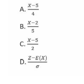
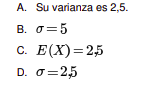
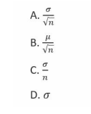
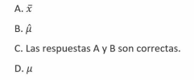

## TEMA 1: Introducción a la estadística

2. La estadística ha sido definida como:
A. El arte de manejar con rigor los números.
B. La ciencia que analiza la información y la convierte en números.
C. La ciencia del aprendizaje a partir de los datos.
D. La ciencia que produce, analiza y extrae conclusiones de los datos.
E. Las respuestas C y D son correctas. -> **Correcto**

3. Con la estadística manejamos:
A. Información en forma de datos.
B. Números contextualizados.
C. Individuos de una población.
D. Las respuestas A y B son correctas. -> **Correcto**

4. Hoy en día en España los censos…
A. Los llevaba a cabo el INE todos los años para temas muy importantes
como la Encuesta de Población Activa, El Censo de Población y Viviendas,
etc…
B. Ya no existen como tal. -> **Correcto**
C. Solo existe uno, el Censo de Población y Vivienda, que se lleva a cabo
cada diez años.
D. Las respuestas A y B son correctas.

5. Decimos que una muestra es representativa cuando:
A. Ha sido obtenida mediante métodos aleatorios.
B. Es de un tamaño cercano al de la población de la que proviene.
C. Posee una diversidad muy parecida a la de la población. -> **Correcto**
D. Las respuestas A y C son correctas.

6. Decimos que los estudios experimentales:
A. Son superiores a las observaciones, pues permiten manipular a los
individuos con la libertad que eso presupone.
B. Son junto con los observacionales los dos grandes tipos de estudios estadísticos. -> **Correcto**
C. Son más cuestionados que los observacionales pues interfieren en exceso.
D. Las respuestas B y C son correctas

7. Un pictograma representa la información:
A. En el área del dibujo. -> **Correcto**
B. En la altura del dibujo.
C. En la anchura del dibujo.
D. Todo lo anterior es falso. -> **Correcto**

8. Referente a la infraestructura requerida para llevar a cabo análisis de datos en
Big Data:
A. Es necesario poseer un clúster propio.
B. No hace falta usar infraestructuras de computación potentes.
C. La computación en la nube no es una opción.
D. Todo lo anterior es falso. -> **Correcto**

9. La aplicación de la estadística en Big Data:
A. No plantea ningún problema.
B. Se produce falta de información.
C. La información es, a veces, demasiado compleja.  -> **Correcto**
D. Todo lo anterior es cierto.

10. La estadística:
A. Es una disciplina clásica. -> **Correcto**
B. Es una disciplina reciente.
C. Engloba únicamente el apartado de extracción de información.
D. A y C son ciertas.

## Videoclase 1. Fundamentos Básicos de la Estadística

- ¿Cuál es el objetivo principal de la estadística descriptiva?
    - Resumir y organizar datos.

- ¿Qué se entiende por «población» en un estudio estadístico?
- El conjunto completo de individuos o elementos de interés

- La inferencia estadística
- Extrae conclusiones sobre una población a partir de una muestra. 

- ¿Qué se entiende por «muestra» en estadística?
- Un subconjunto de individuos seleccionados de una población.

- ¿Qué es la estadística?
- La ciencia que recolecta, organiza, analiza e interpreta datos

## Videoclase 2. Tipos de Variables Estadísticas

- ¿Cuál de los siguientes es un ejemplo de una variable cualitativa? 
- El color de los ojos.

- ¿Cuál de los siguientes es un ejemplo de una variable cuantitativa continua? 
- Peso de una persona. 

- ¿Cómo se define una variable cualitativa nominal? 
- Como una variable sin un orden específico entre sus categorías. 

- Una variable discreta
- Solo puede tomar valores enteros. 

- ¿Qué caracteriza a una variable ordinal? 
- Sus categorías tienen un orden específico. 

## Videoclase 3. Tablas de Frecuencias y su Interpretación

- ¿Cuál es el propósito principal de una tabla de frecuencias? 
- Organizar y resumir la distribución de una variable. 

- ¿Qué representa la frecuencia relativa en una tabla de frecuencias? 
- La proporción de observaciones respecto al total. 

- ¿Cuál de las siguientes afirmaciones describe mejor una tabla de frecuencias acumuladas?
-  Acumula las frecuencias a medida que se avanza en las categorías. => C es correcta porque las tablas de frecuencias acumuladas suman las frecuencias a medida que se avanza en las categorías, permitiendo ver la distribución acumulativa de los datos.

- ¿Qué representa la «frecuencia absoluta» en una tabla de frecuencias?
- El número total de veces que una categoría aparece en los datos.

- ¿Cuál es el propósito de una tabla de frecuencias relativas acumuladas?
- Indicar la proporción acumulada de observaciones en cada categoría.

# TEMA 2: Estadística computacional

1. R soporta datos de tipo numérico en sus bases de datos:
A. Verdadero. -> **Correcto**
B. Falso.
C. Solo si se introducen como tipo .txt .
D. Ninguna de las propuestas es correcta.

2. R soporta datos de tipo categórico en sus bases de datos:
A. Verdadero. -> **Correcto**
B. Falso.
C. Solo si van acompañados de algún valor numérico.
D. Ninguna de las propuestas es correcta.

3. Histogram() es la etiqueta para desarrollar una función que elabore histogramas
en un algoritmo desarrollado con R:
A. Incorrecto. -> **Correcto**
B. Correcto.
C. Falta colocar las etiquetas para completar el histograma.
D. Ninguna de las propuestas es correcta.

4. En estos momentos, R es un software que ofrece soporte ilimitado a la solución de problemas estadísticos en el entorno Big Data.
A. Sí, pero con limitaciones.
B. Nos impone la necesidad de trabajar para evitar problemas de asignación de memoria.
C. Posibilita el uso de funciones de código abierto para optimizar los recursos de memoria.
D. Todas las respuestas anteriores son correctas. -> **Correcto**

5. ¿Por qué puede ser relevante la irrupción del código R en temas de ciberseguridad?
A. Facilita el tratamiento de muchos datos.
B. Prima la lógica de los programas y la capacidad creativa del desarrollador a los mecanismos de control internos.
C. Posibilidad de paralelización de procesos al tener las estructuras modularizadas.
D. Todas las propuestas anteriores son correctas. -> **Correcto**

6. Uno de los objetivos básicos de la programación es la capacidad de desarrollar código que sea reutilizable:
A. Verdadero, pero no aplicable al contexto estadístico donde cada código debe limitarse a un problema específico.
B. Verdadero, extensible al área de la estadística donde se pretenden crear códigos generalistas que puedan ser utilizados sobre distintos escenarios. -> **Correcto**
C. Falso, siempre se debe empezar el código de cero al implementar un problema.
D. Ninguna de las anteriores.

7. Sobre el uso de la programación por módulos en R:
A. Facilita la reutilización de código.
B. Permite detectar errores (bugs) en un proceso de validación de código.
C. Hace el código más expresivo.
D. Todas las anteriores son correctas. -> **Correcto**

8. R no permite compartir librerías con otros lenguajes:
A. Verdadero, asociado a la seguridad propia del lenguaje.
B. Verdadero, en la línea de garantizar un uso matemáticamente correcto de los datos.
C. Falso, las librerías se pueden compartir con otros lenguajes de programación. -> **Correcto**
D. Ninguna de las anteriores.

9. ¿Puede R trabajar con varios tipos de ficheros de datos?
A. Sí, siempre que sean almacenables como .txt .
B. Sí, puede trabajar con varios tipos de ficheros, ejemplo .txt, .csv . -> **Correcto**

10. ¿Puede un solo código R tratar simultáneamente variables categóricas y numéricas?
A. Sí, es algo estándar. -> **Correcto**
B. No, una u otra, nunca simultáneamente. Puede dar errores en el proceso
de compilación.
C. No, deben transformase a uno u otro tipo y elegir un tipo para cada código.
D. Ninguna de las anteriores es correcta

## Videoclase 1. Introducción a la Estadística Computacional
- ¿Qué se entiende por estadística computacional?
- La estadística que utiliza técnicas computacionales para el análisis de datos.

- ¿Cuál es uno de los principales objetivos de la estadística computacional?
- Analizar grandes volúmenes de datos.

- ¿Qué diferencia a la estadística computacional de la estadística tradicional?
- La estadística computacional utiliza herramientas computacionales para el análisis de datos.

- ¿Qué tipo de problemas se pueden resolver con estadística computacional?
- Problemas complejos que requieren el análisis de grandes conjuntos de datos.

- ¿Qué campo está más relacionado con la estadística computacional?
- Ciencia de datos. => C es correcta, ya que la estadística computacional está estrechamente relacionada con la ciencia de datos, donde se aplican técnicas computacionales para el análisis de grandes volúmenes de datos.

## Videoclase 2. Técnicas Básicas de Programación para Estadística Computacional

- ¿Qué es un script en programación?
- Un conjunto de instrucciones que se ejecutan secuencialmente. => A es correcta, ya que un script es un conjunto de instrucciones o líneas de código que se ejecutan secuencialmente para realizar una tarea en programación.

- ¿Cuál es una técnica básica de programación necesaria para la estadística computacional?
- Manipulación de datos. => B es correcta porque la manipulación de datos es una técnica esencial en la estadística computacional para preparar y analizar datos.

- ¿Qué es un data frame?
- Una estructura de datos que permite almacenar tablas, donde las columnas pueden contener diferentes tipos de datos. => A es correcta porque un data frame es una estructura de datos fundamental en estadística computacional, que permite almacenar y manipular datos en forma de tabla, con columnas que pueden contener diferentes tipos de datos, como números y caracteres.

- ¿Para qué se utilizan las estructuras de control en programación estadística?
- Para dirigir el flujo de ejecución de un programa. => C es correcta porque las estructuras de control se utilizan en programación para dirigir el flujo de ejecución de un programa, como en la toma de decisiones o bucles.

- ¿Cuál es el flujo típico de trabajo en la estadística computacional?
- Carga de datos, limpieza y exploración de los datos. => B es correcta porque el flujo típico de trabajo en la estadística computacional incluye la carga de los datos, su limpieza para eliminar errores o valores atípicos, y la exploración inicial para entender la estructura y características de los datos antes de realizar análisis más avanzados.

## Videoclase 3. Introducción al Software R para Estadística Computacional

- ¿Qué es R en el contexto de la estadística computacional?
- Un lenguaje y entorno de programación para el análisis estadístico.

- ¿Cuál es la diferencia principal entre R y RStudio?
- R es un lenguaje de programación y RStudio es un entorno de desarrollo integrado (IDE) para trabajar con R.

- ¿Cuál es la principal ventaja de usar R en estadística computacional?
- Su capacidad para manejar grandes volúmenes de datos y su amplia variedad de paquetes.

- ¿Para qué sirve la ventana Environment en RStudio?
- Para mostrar el estado actual de las variables y objetos creados en la sesión.

- ¿Cuál es la función principal de la consola en R?
- Permitir la ejecución inmediata de comandos de R.

# Tema 3. Medidas que resumen la información

1. ¿Cuántos cuartiles hay en una distribución de datos?
A. Paradójicamente hay dos, puesto que son tres pero como la mediana es el
segundo se quedan en dos.

B. 4.

C. 3. -> **Correcto**

D. Depende si el conjunto de datos presenta frecuencias repetidas.

2. ¿Qué cuantiles equivalen a la mediana?
A. El quinto decil.

B. El segundo percentil.

C. El segundo cuartil.

D. Las respuestas A y C son correctas. -> **Correcto**

3. La mediana…
A. Es el valor central pero solo si el conjunto de datos es par.

B. Es el valor central pero solo si el conjunto de datos es impar.

C. Es el valor central siempre. -> **Correcto**

D. Depende si el conjunto de datos presenta frecuencias repetidas.

4. La media…
A. Se ve afectada drásticamente por los valores extremos.

B. Es una medida con una representatividad mayor que la mediana.

C. Es más útil que la mediana para las variables cualitativas.

D. No es útil ni calculable para las variables cualitativas.

E. Las respuestas A y D son correctas. -> **Correcto**

5. La medida estadística que menos se ve afectada por los valores atípicos es:
A. La desviación estadística.

B. La mediana. -> **Correcto**

C. La media aritmética.

D. La media armónica.

6. En la fórmula de la mediana para datos agrupados: ¿Qué representan las letras y
símbolos?
A. es el límite inferior del intervalo mediano. -> **Correcto**

B. corresponde con la posición que debería ocupar la mediana dentro del conjunto de datos.

C. es la altura de cada intervalo.

D. es el límite inferior del intervalo anterior al mediano.

E. Las repuestas A y B son correctas.

7. La varianza…:
A. Es parecida a la desviación típica.

B. Aporta la misma información sobre la dispersión que la desviación típica.

C. junto con la desviación típica y la desviación estándar conforman las medidas de dispersión más conocidas.

D. Es el cuadrado de la desviación típica.

E. Las repuestas B y D son correctas. -> **Correcto**

8. El diagrama de cajas se construye con:
A. Cuatro valores: La mediana, el cuartil 1, el cuartil 3 y la desviación típica.

B. Cuatro valores: La mediana, el cuartil 1, el cuartil 3 y la varianza.

C. Cinco valores: La mediana, el cuartil 1, el cuartil 3, el mínimo y el máximo.

D. Los cinco valores de C. más los valores atípicos sin los cuales no se puede
construir. -> **Correcto**

9. Una medida estadística que nos permite comparar entre diferentes poblaciones
es:
A. El coeficiente de variación. -> **Correcto**

B. La desviación estándar.

C. La puntuación tipificada.

D. Las respuestas A y C son correctas.

10. En cuanto a la asimetría…
A. Es positiva cuando la cola está a la derecha y la Moda es mayor que la
media.

B. Es negativa cuando la cola está a la izquierda y la Moda es mayor que la
media.

C. Es negativa cuando la cola está a la derecha y la Moda es menor que la
media.

D. Es positiva cuando la cola está a la derecha y la Moda es menor que la
media.

E. Las respuestas B y D son correctas. -> **Correcto**

## Videoclase 1. Medidas de Tendencia Central y Dispersión
- ¿Cuál de las siguientes es una medida de tendencia central?
- Media

- ¿Qué mide la mediana en un conjunto de datos?
- El valor central cuando los datos están ordenados.

- ¿Cuál es la principal diferencia entre la media y la moda?
- La media es el promedio de todos los valores, mientras que la moda es el valor que más se repite.

- ¿Qué mide la desviación estándar?
- La dispersión de los datos respecto a la media.

- ¿Cuál de las siguientes es una medida de dispersión?
- Rango.

# Videoclase 2. Medidas de Dispersión Robusta y Posición
- ¿Qué es la desviación absoluta mediana (MAD)?
- Una medida robusta que indica la mediana de las desviaciones absolutas respecto a la mediana del conjunto de datos.

- ¿Qué es la media truncada?
- Una media calculada después de eliminar un porcentaje de los valores más altos y más bajos del conjunto de datos.

- ¿Qué mide un percentil en un conjunto de datos?
- La posición de un valor dentro de un conjunto de datos, dividiendo este en 100 partes iguales.

- ¿Cuál de las siguientes es una característica de las medidas de dispersión robusta?
- Son menos sensibles a los valores atípicos.

- ¿Qué representa el cuartil 3 (Q3) en un conjunto de datos?
- El valor debajo del cual se encuentra el 75 % de los datos.

# Videoclase 3. Gráficos de Caja y Análisis Exploratorio de Datos

- ¿Qué muestra un gráfico de caja (boxplot)?
- La distribución de un conjunto de datos, incluyendo la mediana, cuartiles y posibles valores atípicos.

- ¿Qué indican los extremos de los «bigotes» en un gráfico de caja?
- Los valores mínimo y máximo dentro de un rango de datos sin contar los valores atípicos.

- ¿Cómo se identifican los valores atípicos en un gráfico de caja?
- Como puntos individuales fuera de los «bigotes» del gráfico.

- ¿Cuál es el propósito del análisis exploratorio de datos (EDA)?
- La mediana del conjunto de datos.

- ¿Qué información proporciona la línea central en un gráfico de caja?
- La mediana del conjunto de datos.

# Tema 4. Regresión y correlación

1. Las frecuencias marginales son:
A. Aquellas que se marginan dejándose fuera de los cálculos.

B. Aquellas que alcanzan valores atípicos.

C. Aquellas que hacen referencia a una sola variable marginando a la otra. -> **Correcto**

D. Aquellas con las que se construye un diagrama de frecuencias
bidimensional.

2. La covarianza del mismo modo que la varianza…
A. No puede tomar valores negativos.

B. Su magnitud no nos dice mucho sobre si covarían entre sí mucho o poco las dos variables. -> **Correcto**

C. Mide la dispersión entre variables.

D. A y B son correctas.

3. Un diagrama de dispersión nos permite ver:
A. Los patrones que se «esconden» en los datos.

B. Si se da algún tipo de relación lineal entre las variables

C. Si existe alguna observación atípica en los datos.

D. Las tres anteriores son correctas. -> **Correcto**

4. La causalidad entre variables…
A. Se da siempre que tengamos algún tipo de asociación entre ellas.

B. No tiene por qué deducirse de la asociación que exista entre ellas. -> **Correcto**

C. Es equivalente a la asociación que pueda haber entre ellas.

D. A y C son correctas.

5. Cuando existe un asociación aproximadamente lineal entre variables que hemos
modelado con una regresión lineal…
A. Una de las variables es la dependiente y la otra la independiente

B. Una de las variables es la explicativa y la otra la predictora.

C. La variable respuesta puede ser dependiente o independiente

D. Una de las variables es la variable explicativa y la otra la variable respuesta

E. A y D son correctas. -> **Correcto**

6. Si el coeficiente de correlación es nulo:

A. Puede estar existiendo otro tipo de relación entre las variables. -> **Correcto**

B. No existe causalidad entre ellas.

C. La asociación entre ellas es inexistente.

D. B y c son correctas.

7. El Método de los Mínimos Cuadrados sirve para…

A. Buscar la mejor asociación entre las variables.

B. Maximizar el ajuste entre los datos.

C. Hallar la ecuación de la recta que minimiza las desviaciones respecto a las
observaciones -> **Correcto**

D. Complicar el análisis estadístico, pues ya está en desuso con la aparición
de los ordenadores.

8. El coeficiente de determinación…

A. Es igual al cuadrado del coeficiente de correlación lineal.

B. Es igual a la raíz del coeficiente de correlación lineal.

C. Refleja el porcentaje de varianza explicado por las predicciones de la recta
respecto al del total de observaciones.

D. A y C son correctas -> **Correcto**

9. Los modelos lineales se emplean más en estadística porque…

A. En la vida real son más comunes los modelos donde encajan
adecuadamente.

B. Suponen una aproximación matemática sencilla a relaciones entre variables que pueden ser un tanto más complejas. -> **Correcto**

C. Otros modelos como el logístico no acaban de resultar manejables y se
dan en casos raros.

D. A y C son correctas.

10. Un scatterplot es:

A. Un diagrama de residuos

B. Un gráfico que muestra la relación entre dos variables cuantitativas. -> **Correcto**

C. Una herramienta muy útil del Excel.

D. A y C son correctas

## Videoclase 1. Fundamentos de Correlación y Regresión Lineal
- ¿Qué mide la correlación entre dos variables?
- La fuerza y dirección de la relación lineal entre dos variables. => ya que la correlación mide tanto la fuerza como la dirección de la relación lineal entre dos variables.

- ¿Qué valor de correlación indica una relación perfectamente positiva entre dos variables?
- 1 => ya que un valor de correlación de 1 indica una relación lineal perfectamente positiva entre dos variables.

- ¿Qué representa la pendiente en un modelo de regresión lineal simple?
- el cambio esperado en la variable dependiente por cada unidad de cambio en la variable independiente => a que la pendiente en un modelo de regresión lineal indica el cambio esperado en la variable dependiente

- ¿Qué suposición se hace sobre la relación entre las variables en la regresión lineal?
- Que existe una relación lineal entre la variable dependiente y la variable independiente. => ya que la regresión lineal asume que existe una relación lineal entre la variable dependiente y la independiente.

- ¿Cuál es el coeficiente de determinación ?2 en la regresión lineal?
- La proporción de la variabilidad total de la variable dependiente que es explicada por el modelo. => es correcto, ya que el coeficiente de determinación ?2 indica qué proporción de la variabilidad de la variable dependiente es explicada por la regresión.

## Videoclase 2. Análisis de Regresión: Técnicas y Evaluación
- ¿Cuál es el propósito de un análisis de regresión multivariante?
- Las diferencias entre los valores observados y los valores predichos por el modelo.

- ¿Cuál es el propósito de un análisis de regresión multivariante?
- Examinar la relación entre una variable dependiente y varias variables independientes.

- ¿Qué implica un gráfico de residuos con un patrón no aleatorio?
- Que el modelo de regresión no captura adecuadamente la relación entre las variables.

- ¿En qué se diferencia la regresión no lineal de la regresión lineal?
- La regresión no lineal modela relaciones donde la relación entre las variables no sigue una línea recta.=> ya que la regresión no lineal se utiliza cuando la relación entre las variables no puede ser modelada adecuadamente con una línea recta.

- ¿Qué se evalúa al analizar los residuos en un modelo de regresión?
- La validez de las suposiciones del modelo de regresión, como la linealidad y la homocedasticidad. => ya que el análisis de residuos permite evaluar si las suposiciones del modelo de regresión, como la linealidad y la homocedasticidad, son válidas.

## Videoclase 3. Técnicas Avanzadas
- ¿Qué es la regresión por mínimos cuadrados truncados (LTS)?
- Una técnica robusta que minimiza el impacto de los valores atípicos al ignorar un porcentaje de los residuos más grandes.

- ¿En qué casos es útil aplicar la transformación de variables en un modelo de regresión?
- Cuando la relación entre las variables no es lineal.

- ¿Qué tipo de transformación de variables es comúnmente utilizada para modelar relaciones exponenciales?
- Transformación logarítmica.

- ¿Cómo se interpreta el coeficiente ?2 en un modelo log-log?
- Cuando ? varía en un 1%, ? varía en ?2% en promedio.

- ¿Cómo se interpreta el coeficiente ?2 en un modelo lin-log?
-  Un aumento de una unidad en 1% en ? incrementa ? en ?2/100 unidades en promedio

# Tema 5. Probabilidad condicional y variables aleatorias

1. Si los tres primeros lanzamientos de una moneda han resultado cara, la
probabilidad de que obtengamos cara en el cuarto lanzamiento es:

A. 1/16

B. 1/4

C. 1/2 -> **Correcto**

D. Otro valor entre cero y uno.

2. Dos eventos se dice que son independientes cuando:

A. Siempre que ocurra A no tiene por qué ocurrir B.

B. La probabilidad de su intersección es nula.

C. El hecho de que ocurra uno no afecta a la probabilidad de que ocurra el otro. -> **Correcto**

D. Las respuestas B y C son correctas.

3. F(xi) es

A. La función de redistribución.

B. 1 - P(X > xi )

C. P(X > xi )

D. Las respuestas A y B son correctas. -> **Correcto**

4. Si tiramos dos dados y sumamos sus puntuaciones. La probabilidad de obtener
un 6,7 o un 8 es:

A. La mitad.

B. Más de la mitad.

C. 0,44. -> **Correcto**

D. F(8) – F(6)

5. La V(X+Y) es igual a:
A. V(X)+V(Y)+2ρσXσy

B. V(X)+V(Y)

C. V(X)+V(Y)+2Cov(X,Y)

D. Las respuestas A y C son correctas. -> **Correcto**

6. En una distribución binomial el parámetro «q» es:

A. 1-P(éxito)

B. La probabilidad del fracaso.

C. 1/p

D. Las respuestas A y B son correctas. -> **Correcto**

7. La distribución normal está caracteriza por dos parámetros que son:

A. u y ρ

B. σ
2
 y ρ

C. μ y p

D. La media y la desviación típica.  -> **Correcto**

8. Si X∼N (5,2) entonces la variable tipificada Z la obtenemos como…

**Respuesta C:* 

9. Si tenemos un variable aleatoria que se distribuye como una :

10. En una distribución normal a mayor sigma:

A. Mayor altura de la función de densidad.

B. Más probable es encontrarse datos más dispersos que sigan tal distribución.

C. La forma de la campana será más achatada.

D. Las respuestas B y C son correctas. -> **Correcto**

## Video 1: Fundamentos de probabilidad 

- ¿Qué es un experimento en el contexto de la probabilidad?
- Un proceso que genera resultados aleatorios.

- ¿Qué se entiende por evento en probabilidad?
-  Un subconjunto de los posibles resultados de un experimento.

- ¿Qué valor puede tomar la probabilidad de un evento?
- Un valor entre 0 y 1.

- ¿Cuál es el principio básico de la probabilidad clásica?
- La probabilidad de un evento se define como el número de resultados favorables dividido por el número total de resultados posibles.

- ¿Qué es el espacio muestral en probabilidad?
- El conjunto de todos los posibles resultados de un experimento.

## Video 2: Principios básicos y Probabilidad condicional

- ¿Cuál es el principio básico de la probabilidad total?
- La suma de las probabilidades de todos los eventos mutuamente excluyentes es igual a 1. => A es correcta, ya que la probabilidad total se refiere a la suma de las probabilidades de todos los eventos mutuamente excluyentes, que debe ser igual a 1.

- ¿Qué es la probabilidad condicional?
- La probabilidad de que ocurra un evento dado que otro evento ya ha ocurrido. 

- ¿Cómo se expresa matemáticamente la probabilidad condicional de A dado B?
- P(A∣B) = P(A∩B)/P(B). => D es correcta, ya que la fórmula de la probabilidad condicional es P(A∣B) = P(A∩B)/P(B).

- ¿Qué implica si dos eventos A y B son independientes?
- P(A∣B) = P(A), es decir, la ocurrencia de B no afecta a la probabilidad de A. => B es correcta, ya que, si dos eventos son independientes, la ocurrencia de uno no afecta la probabilidad del otro.

- ¿Cuál es la fórmula de la probabilidad conjunta de dos eventos independientes A y B?
- P(A∪B) = P(A)×P(B). => C es correcta, ya que, para eventos independientes, la probabilidad conjunta P(A∩B) se calcula multiplicando las probabilidades de los eventos individuales.

## Video 3: Fundamentos de la Distribución en el Muestreo

- ¿Qué es una función de probabilidad?
- Una función que asigna probabilidades a los posibles valores de una variable aleatoria discreta. 

- ¿Qué es una función de probabilidad acumulada?
- Una función que asigna la probabilidad de que una variable aleatoria tome un valor menor o igual a un valor dado.

- ¿Cuál es la característica principal de una función de probabilidad para variables aleatorias discretas?
- La suma de las probabilidades de todos los posibles valores es igual a 1.

- ¿Qué indica la probabilidad acumulada en una función de distribución acumulativa?
- La probabilidad de que una variable aleatoria sea menor o igual a un valor dado.

- ¿Qué propiedad debe cumplir una función de probabilidad acumulada?
- debe ser una función no decreciente.

# Tema 6. Distribución en el muestreo

1. Para poder hablar propiamente de distribución muestral de un determinado
estadístico…
A. Tendremos que recoger una muestra de una población cualquiera.

B. Las observaciones que se recojan habrán de ser independientes.

C. Las observaciones recogidas deben seguir la misma distribución que es la
de la población de donde provienen.

D. **Las respuestas B y C son correctas** => **Correcto**

2. El arco circunflejo lo empleamos en estadística inferencial para…
A. Designar un estadístico cualquiera que provenga de la muestra.

B. Diferenciar el estadístico del parámetro poblacional.

C. Indicar que es un estimador del parámetro.

D. **Las respuestas B y C son correctas.** -> **Correcto**

### Explicación 🤓
En estadística inferencial, el arco circunflejo (^), también conocido como "sombrero", se coloca sobre el símbolo de un parámetro poblacional para indicar que no estamos hablando del valor real (y a menudo desconocido) de la población, sino de una estimación de ese valor.

Esta estimación se calcula a partir de los datos de una muestra.

Por lo tanto:

Indica que es un estimador del parámetro (C): Esta es su función principal. Por ejemplo, p̂ (se lee "p sombrero") es el estimador de la proporción poblacional p.

Diferencia el estadístico del parámetro poblacional (B): Como consecuencia directa de lo anterior, el uso del circunflejo nos permite distinguir claramente entre el valor estimado a partir de la muestra (el estadístico, ej. p̂) y el valor verdadero de la población (el parámetro, ej. p).
--- 

3. p>
A. El estimador de la probabilidad.

B. El estimador de la proporción muestral.

C. **El estimador de la proporción poblacional.** -> **Correcto**

D. Un parámetro de cierto tipo de variable aleatoria

### Explicación 🤓
En estadística, distinguimos entre los parámetros de una población y los estimadores de una muestra.

Parámetro poblacional (p): Es el valor verdadero y generalmente desconocido de una proporción en toda la población. Por ejemplo, el porcentaje real de todos los votantes de un país que apoyan a un candidato.

Estimador muestral (p̂): Es la proporción que se calcula a partir de una muestra de esa población. Por ejemplo, el porcentaje de votantes que apoyan al candidato en una encuesta de 1,000 personas.

4. ¿Por qué hay tantas variables en la naturaleza que se distribuyen normalmente?
A. **Porque según el TCL la suma de muchos efectos aleatorios independientes
se comporta normalmente.** -> **Correcto**

B. En realidad no hay tantas, es más la visión alterada del matemático que
trata de que la realidad se parezca a las matemáticas y no a la inversa.

C. En realidad es por las binomiales que son las que abundan más y como su
suma es normal acaba apareciendo que hay más normales.

D. Se debe a un misterio estadístico todavía por resolver.

5. La desviación típica de la media muestral es:

6. Si multiplicamos por cuatro el tamaño de una muestra:

Ox

A. **Se reduce a la mitad.**-> **Correcto**
B. Se duplica.
C. Se multiplica por 4.
D. Se mantiene igual pues no le afectan cambios de n

---
NOTA: 

Aunque la pregunta está incompleta, es un problema clásico de estadística que se refiere al **error estándar**. El error estándar mide la precisión de la media de una muestra como una estimación de la media de la población.

---
### Explicación 🤓

La fórmula del error estándar (E) es:

$$E = \frac{\sigma}{\sqrt{n}}$$

Donde:
* **σ** (sigma) es la desviación estándar de la población.
* **n** es el tamaño de la muestra.

Veamos qué sucede si multiplicamos el tamaño de la muestra **n** por 4:

1.  **Tamaño original de la muestra:** `n`
    * Error estándar original: $E_{original} = \frac{\sigma}{\sqrt{n}}$

2.  **Nuevo tamaño de la muestra:** `4n`
    * Nuevo error estándar: $E_{nuevo} = \frac{\sigma}{\sqrt{4n}}$

Al simplificar la nueva fórmula, podemos separar la raíz cuadrada:

$$E_{nuevo} = \frac{\sigma}{\sqrt{4} \times \sqrt{n}} = \frac{\sigma}{2\sqrt{n}} = \frac{1}{2} \times \left( \frac{\sigma}{\sqrt{n}} \right)$$

Como puedes ver, el nuevo error estándar es exactamente la mitad del original.

**En resumen:** Al cuadruplicar el tamaño de la muestra, el error estándar se reduce a la mitad. Esto significa que muestras más grandes tienden a producir estimaciones más precisas de la media de la población.

7. El error estándar es…
A. Un error típico que se comete cuando estimamos.

B. **La desviación típica de la media**. -> **Correcto**

C. Proporcional al ancho de la curva de la distribución muestral de la media.

D. Las respuestas B y C son correctas.

8. Señala la frase correcta.
A. Todo estadístico es un estimador.

B. **Todo estimador es una variable aleatoria función de la muestra**. -> **Correcto**

C. Todo estimador es un parámetro de la muestra.

D. Todo estadístico es un parámetro de la muestra.

9. ¿Cuál es un estimador insesgado de la media poblacional?

10. ¿En qué se diferencian los dos tipos principales de estimación?
A. Una estima con un solo valor mientras que la otra con varios.

B. **Un tipo de estimación da intervalos posibles para el parámetro mientras que la otra solo da un valor.** -> **Correcto**

C. Una es confidente y la otra puntual.

D. Depende del parámetro a estimar tendremos que usar una u otra.

## Videoclase 1. IFundamentos de la Distribución en el Muestreo

- ¿Qué es una muestra en estadística?
- Un subconjunto de la población seleccionado para análisis.

- ¿Qué es la proporción muestral?
- La proporción de individuos en la muestra que tienen una característica específica. =>  porque la proporción muestral indica el porcentaje de individuos en la muestra que presentan una característica particular.

- ¿Cómo se define la distribución muestral de una estadística?
- Como la distribución de los valores de una estadística calculada en todas las posibles muestras de una población =>  ya que la distribución muestral se refiere a la distribución de una estadística (como la media o la proporción) calculada a partir de todas las posibles muestras extraídas de una población.

- ¿Qué se entiende por error estándar en la distribución muestral?
- La desviación estándar de la distribución de una estadística muestral. => ya que el error estándar mide la variabilidad de una estadística (como la media o la proporción) en diferentes muestras de una población.

- ¿Qué sucede con el error estándar si el tamaño de la muestra aumenta?
- Disminuye. => ya que al aumentar el tamaño de la muestra, el error estándar disminuye, indicando que la estadística muestral se aproxima más a la verdadera estadística poblacional.

## Video 2: Teorema Central del Límite

- ¿Qué establece el Teorema Central del Límite (TCL)?
- Que la distribución de la media muestral se aproxima a una distribución normal a medida que el tamaño de la muestra aumenta, independientemente de la distribución de la población. =>  ya que el Teorema Central del Límite establece que la media muestral sigue una distribución normal cuando el tamaño de la muestra es lo suficientemente grande, independientemente de la distribución de la población original.

- ¿Cuál es una implicación clave del Teorema Central del Límite (TCL)?
- Permite el uso de la distribución normal para realizar inferencias sobre la media de una población. => ya que una de las implicaciones clave del TCL es que permite utilizar la distribución normal para hacer inferencias sobre la media de una población, incluso si la población original no sigue una distribución normal.

- ¿Cómo afecta el tamaño de la muestra al Teorema Central del Límite?
- Un tamaño de muestra mayor asegura que la distribución de la media muestral sea más cercana a la normal. => ya que mientras mayor sea el tamaño de la muestra, más cercana será la distribución de la media muestral a una distribución normal.

- ¿Para qué se utiliza el Teorema Central del Límite en la estadística inferencial?
- Para aproximar la distribución de una media muestral a una distribución normal, facilitando la inferencia estadística => ya que el TCL se utiliza en la inferencia estadística para aproximar la distribución de la media muestral a una normal, lo que permite hacer inferencias sobre la población.

- ¿Qué tipo de distribuciones poblacionales puede manejar el Teorema Central del Límite?
- Cualquier tipo de distribución poblacional, siempre que el tamaño de la muestra sea suficientemente grande => ya que el Teorema Central del Límite se aplica a cualquier tipo de distribución poblacional, siempre que el tamaño de la muestra sea lo suficientemente grande.

## Videoclase 3. Estimación y Propiedades de los Estimadores

- ¿Qué es la estimación puntual?
- Es un solo valor estimado que se utiliza para aproximar un parámetro poblacional. => La estimación puntual es el proceso de calcular un único valor (un solo número) a partir de los datos de una muestra para que sirva como la "mejor suposición" o aproximación de un parámetro desconocido de toda la población.

- ¿Qué es la estimación por intervalos?
-  Un rango de valores dentro del cual es probable que se encuentre el parámetro poblacional. => es un rango de valores calculado a partir de los datos de una muestra, dentro del cual es probable que se encuentre el verdadero valor de un parámetro poblacional.

- ¿Cuál es una propiedad deseable de un buen estimador?
- Insesgadez  => Un buen estimador en estadística es aquel que nos da una aproximación precisa y confiable del verdadero valor de un parámetro en una población (como la media o la varianza). La insesgadez es una de las propiedades más importantes que buscamos.

- ¿Qué mide la consistencia de un estimador?
- => La consistencia de un estimador es una propiedad que describe su comportamiento a medida que el tamaño de la muestra se hace más grande. Un estimador es consistente si, al aumentar el tamaño de la muestra (n), el valor del estimador se acerca cada vez más al valor real del parámetro que se está tratando de estimar en la población.

- ¿Qué es un estimador insesgado?
- Un estimador cuyo valor esperado es igual al verdadero valor del parámetro poblacional. => Un estimador insesgado es aquel cuyo valor esperado (la media de todos los posibles valores que puede tomar el estimador) es exactamente ig

# Tema 7. Intervalos de confianza

1. ¿Qué es un valor crítico en términos de inferencia?
A. Un valor sumamente importante en los IC que depende de la muestra.

B. Es el valor de una distribución que acumula cierta probabilidad.

C. Se trata de un concepto fundamental cuando manejamos distribuciones
normales.

D. Las respuestas A y C son correctas.

2. Empleamos intervalos de confianza entre otras razones porque…
A. La estimación puntual se queda corta en el sentido de que no sabemos
cuán bueno es una estimación puntual.

B . Es una buena manera de aproximarnos al parámetro poblacional tanto
como deseemos o podamos.

C. Si no podemos realizar la estimación puntual que es más exacta nos
conformamos con el IC.

D. Las respuestas A y B son correctas.

3. ¿Qué es o a qué es igual « »?
A. Al estimador, que también puede ser anotado como .

B. Al margen de error.

D. Un parámetro de cierto tipo de variable aleatoria.

4. Si hemos calculado el IC para y resulta: . ¿Cuánto vale
«E»?
A. 0,025

B. 0,25

C. 0,050

D. No se puede calcular con esta información

5. Al IC que marca con un 95% de confianza la estatura
media de un equipo de la NBA lo interpretamos como…
A. De cada 100 jugadores, 95 estarán contenidos en dicho intervalo.

B. De cada 100 muestras de jugadores, 95 tendrán la media contenido en ese IC.

C. Tenemos una confianza del 95% de que la media de los jugadores de un
equipo de la NBA está contenida entre 188cm y 209cm.

D. Las respuestas B y C son correctas.

6. ¿Qué fórmula es la correcta para hallar el IC de una media poblacional conocida
su varianza?

[Respusta ](../03_Analisis_Interpretacion_datos/info/info_007.png)

7. Cuando no es conocida, en el cálculo de los valores críticos para construir los
IC empleamos:
A. La T-Student.

B. La Chi Cuadrada.

C. La Normal Z.

D. La Normal (0,1).

8. La T-Student es…
A. Una distribución similar a la Normal, de hecho se aproxima a ella a medida que aumenta el «n».

B. Es diferente de la Normal y la Chi Cuadrada.

C. Es simétrica.

D. Las respuestas A y C son correctas.

9. ¿Qué es una muestra piloto?
A. Un tipo de encuestas muy empleadas en aviación (por temas de
seguridad).

B. Una muestra que se recoge antes de hacer un estudio para tantear las
características de la población.

C. Todo estudio estadístico bien hecho debe constar de una muestra
preliminar llamada «piloto» para posteriormente recoger la muestra definitiva.

D. Es una muestra enorme que no siempre es posible recogerla, pero es lo ideal.

10. ¿En un IC que porcentaje de las veces éste no contendrá al parámetro?
A. (1-a)% de las veces.

B. (1-a)x100% de las veces.

C. a x 100% de las veces.

D. Depende de la suerte que hayamos tenido con la muestra concreta que
cojamos

## Video 1: Fundamentos y Aplicaciones Básicas de los Intervalos de Confianza

- ¿Qué es un intervalo de confianza?
- Un rango de valores que tiene una alta probabilidad de contener el parámetro poblacional verdadero.

- ¿Qué representa el nivel de confianza en un intervalo de confianza?
- La probabilidad de que el intervalo contenga el parámetro poblacional. =>  ya que el nivel de confianza indica la probabilidad de que el intervalo de confianza contenga el verdadero valor del parámetro poblacional.

- ¿Cómo se comporta el intervalo de confianza cuando el nivel de confianza aumenta?
- El intervalo se vuelve más amplio.. => ya que al aumentar el nivel de confianza, el intervalo de confianza se vuelve más amplio para abarcar un rango mayor de posibles valores del parámetro.

- ¿Qué fórmula se utiliza para calcular un intervalo de confianza para la media cuando la varianza es conocida?
-   Media ± z * (desviación estándar / raíz de n). => ya que cuando la varianza es conocida, se utiliza la distribución normal y se emplea la desviación estándar para calcular el intervalo de confianza.

- ¿Qué diferencia hay en el cálculo de un intervalo de confianza para la media cuando la varianza es desconocida?
- Se utiliza la distribución t de Student en lugar de la distribución z => ya que cuando la varianza es desconocida, se utiliza la distribución t de Student en lugar de la distribución z para calcular el intervalo de confianza.

## Video 2: Intervalos de Confianza para Proporciones y Varianza

- ¿Cómo se calcula un intervalo de confianza para una proporción?
-  Proporción ± z * (raíz de [p(1-p) / n]). => ya que el intervalo de confianza para una proporción se calcula utilizando la fórmula Proporción ± z * (raíz de [p(1-p) / n]), donde p es la proporción muestral y n el tamaño de la muestra.

- ¿Qué implica un intervalo de confianza estrecho para una proporción?
- Mayor precisión en la estimación de la proporción poblacional. => ya que un intervalo de confianza más estrecho implica que la proporción estimada es más precisa y tiene menos variabilidad.

- ¿Qué distribución se utiliza para calcular intervalos de confianza para la varianza de una población normal?
- Distribución chi-cuadrado. =>  ya que la distribución chi-cuadrado se utiliza para calcular los intervalos de confianza para la varianza en una población normal.

- ¿Cómo afecta el tamaño de la muestra al intervalo de confianza para una proporción?
- Un tamaño de muestra mayor reduce la amplitud del intervalo. => ya que al aumentar el tamaño de la muestra, el intervalo de confianza se estrecha, lo que aumenta la precisión de la estimación de la proporción.

- ¿Qué sucede con el intervalo de confianza de la varianza si la muestra es pequeña?
-  El intervalo será más amplio debido a la mayor incertidumbre. = >ya que para muestras pequeñas, el intervalo de confianza de la varianza tiende a ser más amplio, reflejando la mayor incertidumbre en la estimación.

## Video 3: Tamaños de muestra

- ¿Qué es necesario para calcular el tamaño de la muestra en un estudio?
-  El nivel de confianza, la variabilidad de los datos y el margen de error deseado. =>  ya que para calcular el tamaño de la muestra es necesario conocer el nivel de confianza, la variabilidad en los datos y el margen de error que se desea alcanzar.

- ¿Qué sucede con el tamaño de la muestra si se desea un intervalo de confianza más estrecho?
- Se necesita un tamaño de muestra mayor. =>  ya que para obtener un intervalo de confianza más estrecho (mayor precisión), es necesario aumentar el tamaño de la muestra.

- ¿Cómo se calcula el intervalo de confianza para la diferencia de medias de dos muestras independientes?
-  Diferencia de medias ± z * (raíz de [s1^2/n1 + s2^2/n2]). => ya que el intervalo de confianza para la diferencia de medias se calcula utilizando la diferencia de las medias muestrales más un margen de error basado en la desviación estándar de ambas muestras.

- ¿Cómo afecta la variabilidad de los datos al cálculo del tamaño de la muestra?
-  Mayor variabilidad requiere un tamaño de muestra más grande. => ya que a mayor variabilidad en los datos, se requiere un tamaño de muestra mayor para obtener estimaciones precisas con intervalos de confianza estrechos.

- ¿Qué se debe considerar al calcular el intervalo de confianza para la diferencia de proporciones?
- Tanto las proporciones muestrales como los tamaños de las muestras. => ya que para calcular el intervalo de confianza para la diferencia de proporciones, se deben tener en cuenta tanto las proporciones muestrales como los tamaños de las muestras de cada grupo

# Tema 8. Contrastes de hipótesis

1. ¿Para qué sirve un contraste de hipótesis?
A. Para saber a ciencia cierta si una afirmación es verdadera.
B. Para saber con rigor matemático si una afirmación es falsa.
C. Para contrastar si una afirmación sobre una población parece cierta o no
en base a los datos.
D. Las respuestas A y B son correctas.

2. Generalmente el orden que seguimos en un contraste de hipótesis es…
A. Establecer primero la para que quede delimitada aproximadamente la
.
B. Plantearnos la hipótesis de rechazo para posteriormente fabricar su
complementaria que es la hipótesis nula.
C. Negar la hipótesis alternativa para que surja la hipótesis nula.
D. Las respuestas B y C son correctas.

3. ¿Cuántos diferentes planteamientos tenemos para la ?
A. Solo tenemos una opción de , ya que está totalmente delimitada por la
hipótesis nula.
B. Generalmente consideramos tres clases, donde una viene asociada al
contraste bilateral y las otras dos a los laterales izquierdo y derecho
respectivamente.
C. Cuatro, correspondiendo a los tres casos indicados en B) más un bilateral
del tipo (que por cierto es un tanto atípico).
D. Las respuestas B y C son correctas.

4. ¿Con que tipo de frases interpretamos un contraste de hipótesis?
A. «…tras realizar el contraste se demuestra la falsedad de la Ho…».
B. «…se han encontrado evidencias claras de que es la Ho es verdadera…».
C. «… se han encontrado evidencia estadísticas aplastantes en favor de…».
D. «… no logramos encontrar evidencias estadísticamente significativas…»

5. ¿Quién tiene que caer en la región crítica para que rechacemos la Ho?
A. El estadístico de contraste que estemos empleando.
B. El parámetro.
C. El valor que se contrasta del parámetro (por ejemplo ).
D. Las respuestas B y C son correctas.

6. ¿Qué es 1-B?
A. La probabilidad de que cometamos uno de los errores más graves que se
pueden cometer.
B. La potencia del contraste.
C. El otro gran error en los contrastes de hipótesis junto con .
D. Las respuestas B y C son correctas.

7. La P(rechazar | siendo Ho verdadera) es equivalente a:

[Respuesta](../03_Analisis_Interpretacion_datos/info/info_008.png)

8. La regla del p valor para decidir un contraste de hipótesis es:

[Respuesta](../03_Analisis_Interpretacion_datos/info/info_009.png)

9. ¿Cómo decidimos un contraste de hipótesis a través de un IC?
A. Si pertenece al IC construido para µ se acepta, de lo contrario
rechazamos .
B. Para empezar ha de ser bilateral y luego se procede como en .
C. Si no pertenece al IC construido para µ se acepta, de lo contrario se
rechaza .
D. Para empezar ha de ser unilateral y luego se procede como en .

10. Cuando en un contraste de hipótesis desconocemos la varianza de la población
de la que provienen los datos empleamos
A. La distribución T-Student como estadístico de contraste.
B. La distribución normal si tenemos suficientes observaciones.
C. La distribución Ji Cuadrada de Pearson.
D. Si comparamos medias empleamos la Normal si son proporciones la TStuden

## Video 1:  Fundamentos de los Contrastes de Hipótesis

- ¿Qué es una hipótesis nula (?0) en un contraste de hipótesis?
- Es una afirmación que se asume verdadera hasta que se demuestre lo contrario mediante un test estadístico. => ya que la hipótesis nula (?0) es la afirmación que se asume verdadera a menos que se encuentre suficiente evidencia para rechazarla.

- ¿Qué es la hipótesis alternativa (?1) en un contraste de hipótesis?
- Es una afirmación que se acepta si se rechaza la hipótesis nula. => ya que la hipótesis alternativa (?1) es la que se acepta si los datos proporcionan suficiente evidencia para rechazar la hipótesis nula.

- ¿Qué es el nivel de significancia (α) en un contraste de hipótesis?
- La probabilidad de cometer un error de tipo I. => ya que el nivel de significancia (?) es la probabilidad de cometer un error de tipo I, es decir, rechazar la hipótesis nula cuando es verdadera.

- ¿Qué es un error de tipo I en un contraste de hipótesis?
- Rechazar la hipótesis nula cuando en realidad es verdadera. => ya que un error de tipo I ocurre cuando se rechaza la hipótesis nula siendo esta verdadera.

- ¿Qué es un error de tipo II en un contraste de hipótesis?
- No rechazar la hipótesis nula cuando en realidad es falsa. => ya que un error de tipo II ocurre cuando no se rechaza la hipótesis nula cuando en realidad es fals

## Video 2: Contrastes de Hipótesis para Medias, Proporciones y Varianzas.

- ¿Qué estadístico se utiliza para realizar un contraste de hipótesis sobre la media de una población cuando se conoce la varianza?
- D =<mal>

- ¿Qué estadístico se utiliza para realizar un contraste de hipótesis sobre una proporción?
- B =<mal>

- ¿Qué estadístico se utiliza para contrastar la varianza de una población?
- B =<mal>

- ¿Cuándo se utiliza la distribución ? de Student en un contraste de hipótesis sobre la media?
- Cuando la varianza es desconocida y el tamaño de la muestra es pequeño. => ya que la distribución ? de Student se utiliza cuando la varianza es desconocida y el tamaño de la muestra es pequeño.

- ¿Qué implica rechazar la hipótesis nula en un contraste sobre una proporción?
- Que la proporción muestral es significativamente diferente de la proporción poblacional => ya que al rechazar la hipótesis nula en un contraste de proporciones, se concluye que la proporción muestral difiere significativamente de la proporción poblacional.

## Videoclase 3. Contrastes Paramétricos para Dos Muestras

- ¿Qué se evalúa en un contraste de hipótesis aplicado a los parámetros de regresión?
- Si los coeficientes de los parámetros son significativamente diferentes de cero. => ya que en un contraste de hipótesis aplicado a los parámetros de regresión, se evalúa si los coeficientes son significativamente diferentes de cero para determinar la relevancia de las variables independiente

- ¿Qué representa el valor ?1 en un modelo de regresión simple?
- La pendiente de la relación entre la variable independiente y la dependiente. => a que ?1 representa la pendiente de la relación entre la variable independiente y la dependiente en un modelo de regresión simple.

- ¿Qué hipótesis se contrasta típicamente para los parámetros de regresión?
-  ?0:?1=0 contra ?1:?1≠0 => ya que la hipótesis nula más común en un contraste de parámetros de regresión es que el coeficiente de la variable independiente es igual a cero, lo que indicaría que no hay relación entre las variables

- ¿Qué indica un valor p menor que el nivel de significancia (?) en un contraste de parámetros de regresión?
- Que se rechaza la hipótesis nula y el parámetro es significativamente diferente de cero. => ya que un valor p menor que ? indica que se rechaza la hipótesis nula y el parámetro es significativamente diferente de cero.

- ¿Cuál es la interpretación de un coeficiente de regresión que es estadísticamente significativo?
-  Que la variable independiente tiene un efecto significativo sobre la variable dependiente. => ya que un coeficiente de regresión estadísticamente significativo indica que la variable independiente tiene un efecto significativo sobre la variable dependiente.

# Tema 9. Regresión

1. El modelo de regresión lineal se supone...
A. Aleatorio, curvilíneo y apolíneo.
B. Carente de errores en la medida de lo posible.
C. No heterocedástico.
D. Con una Tde student no muy elevada (de lo contrario se rechaza).

2. ¿Qué es lo que se contrasta en un modelo de regresión lineal?
A. Si hay constante.
B. Si la pendiente es nula o no.
C. Si el error es mínimo respecto a la recta.
D. B y C son correctas.

3. ¿Con que Test o pruebas podemos constrastar el modelo de 
regresión?
A. Con el y la T de Student.
B. Con la T-de Student y la Normalidad de la variable.
C. Con el ANOVA.
D. A y C son correctas.

4. R2 equivale a:
A. SCM entre la SCR.
B. La SCM entre la SCT.
C. B y D son correctas.
D. 1 menos la SCR/SCT

5. Si el IC para B1 contiene al 0 esto querrá decir que: D B y C son correctas.
A. La regresión no es significativa.
B. La regresión es altamente significativa.
C. Con una probabilidad del 95% la regresión no será significativa.
D. B y C son correctas.

6. ¿Qué es alfa en el modelo de regresión?
A. El complementario de Beta.
B. La potencia del contraste.
C. La constante.
D. A y C son correctas.

7. En el ejemplo visto en el capítulo sobre las películas:
A. Las puntuaciones de IMDB eran la variable dependiente.
B. Las puntuaciones de Filmaffinity eran la variable predictora.
C. Las películas eran las variables dependientes.
D. A y B son correctas.

8. Si al graficar los errores estos presentar una forma de embudo:
A. Es buena señal para el modelo.
B. Indicaría una falta de homocedasticidad.
C. Indicaría una falta de heterocedasticidad.
D. Ninguna de las anteriores

9. Los errores del modelo conviene que sean casi todos elevados.
A. Sean casi todos positivos.
B. Sean casi todos elevados.
C. Que se alternen lo mejor posible los positivos y los negativos sin grandes
saltos ni patrones.
D. Que presenten claros patrones.

10. El modelo de regresión lineal consta de tres parámetros.
A. Alfa, gamma y el error.
B. Beta cero, beta uno y alfa.
C. Alfa, beta y sigma.
D. No es cierto, consta de dos

## Video 1: Análisis de Varianza (ANOVA) en Regresión

- ¿Cuál es el propósito del ANOVA en el contexto de la regresión?
- Evaluar si el modelo de regresión explica una cantidad significativa de la variabilidad total en la variable dependiente. => ya que el ANOVA en regresión se utiliza para evaluar si el modelo de regresión explica una cantidad significativa de la variabilidad en la variable dependient

- ¿Qué mide el estadístico ? en un ANOVA de regresión?
- La relación entre la variabilidad explicada por el modelo y la variabilidad residual.

- ¿Qué sugiere un valor p bajo en el estadístico ? de un ANOVA de regresión?
- Que el modelo de regresión explica una cantidad significativa de la variabilidad en la variable dependiente. => ya que un valor p bajo en el estadístico ? sugiere que el modelo de regresión explica una cantidad significativa de la variabilidad total.

- ¿Cómo se calcula la suma de cuadrados en un ANOVA de regresión?
- Sumando los cuadrados de las diferencias entre los valores observados y los valores ajustados por el modelo. => ya que la suma de cuadrados en un ANOVA de regresión se obtiene sumando los cuadrados de las diferencias entre los valores observados y los valores ajustados por el modelo.

- ¿Qué indica un ?2 alto en un ANOVA de regresión?
- Que una gran parte de la variabilidad en la variable dependiente es explicada por el modelo. => ya que un ?2 alto indica que el modelo de regresión explica una gran parte de la variabilidad de la variable dependiente.

## Video 2: Análisis de Varianza (ANOVA) en Regresión

-
- 

-
- 

-
- 

-
-

-
-

## Video 3: Uso de R para Contrastes de Hipótesis en Regresión

-
- 

-
- 

-
- 

-
-

-
-

# Tema 10. Análisis de componentes principales

1. ¿Para qué sirve el análisis de componentes principales?
A. Para obtener información de los datos.

B. Para reducir la dimensión de los datos. -> **Correcto**

C. Para aumentar la dimensión de los datos.

D. Todo lo anterior es falso.

2. Los vectores de componentes principales:
A. Se obtienen agregando los valores de las variables del modelo.

B. Se obtienen utilizando datos externos al modelo.

C. Sirven para aumentar la dimensión de los datos.

D. B y C son correctas.

NOTA: El Análisis de Componentes Principales (PCA) es una técnica estadística que se utiliza principalmente para reducir la dimensionalidad de un conjunto de datos, es decir, disminuir el número de variables conservando la mayor cantidad de información posible.

3. ¿Cuándo es una variable representativa del vector de componentes?
A. Cuando el valor asociado es cercano a 1.

B. Cuando el valor asociado es cercano a -1.

C. Cuando el valor asociado es cercano a 0.

D. A y B son ciertas.  -> **Correcto**

4. ¿Qué componentes son las que representan el ruido en una imagen?
A. Las cercanas a PC1.

B. las cercanas al último PC. -> **Correcto**

C. Todas.

D. Ninguna.

5. Para detectar cambios en un modelo de datos…
A. Necesitamos distintos modelos de datos hechos en distintos tiempos o bajo
distintas circunstancias. -> **Correcto**

B. Solo necesitamos un único modelo de datos.

C. Es necesario conocer la media.

D. Todo lo anterior es falso.

6. ¿Qué sucede si reducimos el número de componentes principales a utilizar en
nuestro modelo reducido?
A. Perdemos precisión en los datos.

B. Reducimos la dimensión.

C. A y B son ciertas. -> **Correcto**

D. A y B son falsas.

7. ¿Cómo calculamos el modelo de datos reducido a partir del vector de
componentes?:
A. Multiplicando cada individuo por la suma de los valores del vector de
componentes principales.

B. Multiplicando cada valor de la variable de cada individuo por la derivada del
vector de componentes.

C. Generamos el valor agregado asociado a cada individuo multiplicando
cada valor del vector de componentes por la variable asociada y sumando el
resultado.  -> **Correcto**

D. Aplicando A y luego B.

8. Si nos atenemos al número de variables a representar, ¿qué gráfica de dispersión es más fácil de entender e interpretar?:
A. Una con 2 dimensiones. -> **Correcto**

B. Una con 3 dimensiones.

C. Una con 4 dimensiones.

D. Ninguna de las anteriores.

9. ¿Qué función de R hemos utilizado para poder calcular el vector de análisis de
componentes?
A. matrix.

B. prcomp. -> **Correcto**

C. plot.

D. Ninguna de las anteriores.

10. ¿Si tenemos un modelo de datos con 5 variables, ¿cuántos vectores de
componente principal generará el algoritmo?
A. 5.
B. 6.
C. 7. -> **Correcto**
D. 2.

## Video 1: 

-
- 

-
- 

-
- 

-
-

-
-

## Video 2: 

-
- 

-
- 

-
- 

-
-

-
-

## Video 3: 

-
- 

-
- 

-
- 

-
-

-
-