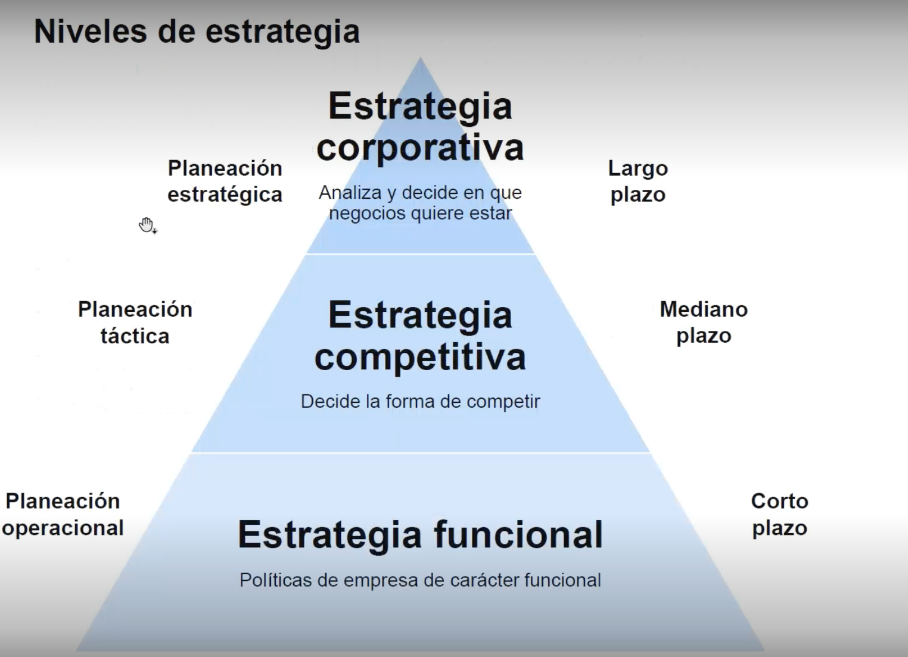

# Gobierno del Dato y Toma de Decisiones

## Tema 1:  Dirección Estratégica y Gobierno de Datos 

1.1. Introducción al Gobierno de Datos  

> Dependemos de DAMA 
"DAMA es una asociación internacional sin fines de lucro que se refiere a Data Management Association, es decir, Asociación de Gestión de Datos en español. DAMA se dedica a promover y facilitar el desarrollo de la gestión de datos e información, y a brindar recursos, formación y conocimiento sobre el tema." 

**Caracteristicas**
- Maneja administra controla por medio de ISO para mejorar la gestion de datos 
- DAMA establece los pasos para una buena sistematica en los proyectos de datos

**Etapas** 
- Gestion Arquitectura de Datos: Establecer un plan de gestion para datos estrategicos 
- Modelado y diseño de Datos: Modela analizar y organizar los datos 
- Gestionar almacenamiento organizacion de datos: Se refiere a calidad de persistecia de los datos que esten bien almacenados
- Gestión de seguridad de datos: Asegurar los datos
- Gestion Documentacion y contenido: Tenr una buena documentación de los datos Diccionarios de datos y MDER
- Almacen de Datos: 
- Gestion de Metadatos: Tener buena gestion de los datos para agregar mas valor 
- Gestión de Calidad de datos: Validar la concistencia de los datos 

**Importancia** 
- Disponibilidad
- Usabilidad 
- Integridad
- Seguridad 
- Tener un lenguaje comun 

1.2. Integración de Datos en la Estrategia Empresarial 

1.2. ¿Qué es la dirección estratégica (DE)?

Es una disciplina que integra las distintas estrategias y tácticas empresariales,
analiza decisiones tomadas y observa sus consecuencias o efectos durante un
período de tiempo, aparte de su pretensión de alcanzar objetivos empresariales a
largo plazo.

1.3. Estructuras y Procesos en el Gobierno de Datos

1.3. El proceso de dirección estratégica  

**Concepto**
- Consiste en definir, organizar las tareas de manera sistematica para que las empresas logren alcanzar su objetivo de manera gradual, dando el paso a la planeacion de corto y largo plazo. 

- Resaltando que no intenta predecir el futuro si no tener un abanico de decisiones que impacten en el. 

> Podemos ver estos pasos de una forma esquemática, desde el
presente al futuro de la organización 

**Como**
- Información: Datos que nos ayuden definir nuestras metas 
- Metodologia: Con los datos definimos el como vamos a lograr las metas 
- Pensamiento estrategico: Con el como debemos evaluar y pasar a la acción con el compromiso, llmar siempre al Call to action.   

1.4. Toma de Decisiones Estratégicas Basadas en Datos  

## Tema 2. Business Intelligence y Datos Maestros 

## Tema 3. Data Warehouse y Data Lake 

## Tema 4. Metodologías y Tendencias 

## Tema 5. Introducción al Marketing

## Tema 6. Introducción al Marketing (continuación) 