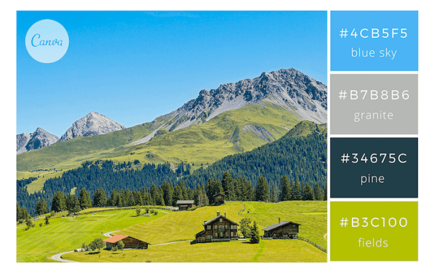

# Estructura del proyecto

```
/mi-dashboard
│
├── node_modules/         <-- (Carpeta creada por npm install)
│
├── package.json          <-- (¡Muy importante! Revisa el Paso 2)
├── package-lock.json
│
├── server.js             <-- (Tu servidor Express)
│
└── /public               <-- (La carpeta que servirá Express)
    │
    ├── index.html
    │
    ├── app.js            <-- (Este será nuestro "orquestador" principal)
    │
    ├── /js
    │    ├── google-chart.js
    │    └── d3-chart.js
    └── /css
         ├── global.css      <-- Archivo de limpieza css
         └── dash_venta.css  <-- Archivo genera los estilos del dashboard
```

# Pasos para iniciar un proyecto en Node.js


1. **Instalar Node.js**:
   - Descarga e instala Node.js desde su [sitio oficial](https://nodejs.org/).
   - Verifica la instalación ejecutando:
     ```bash
     node -v
     npm -v
     ```

2. **Inicializar el proyecto**:
   - Abre una terminal en el directorio del proyecto y ejecuta:
     ```bash
     npm init -y
     ```
     Esto creará un archivo `package.json` con la configuración básica del proyecto.

3. **Instalar dependencias**:
   - Para instalar dependencias necesarias, usa:
     ```bash
     npm install <nombre_paquete>
     ```
     Por ejemplo, para instalar Express:
     ```bash
     npm install express
     ```

4. **Crear el archivo principal**:
   - Crea un archivo principal, como `server.js`, y escribe el código inicial del servidor o aplicación.

5. **Ejecutar el proyecto**:
   - Ejecuta el archivo principal con Node.js:
     ```bash
     npm run dev 
     ```

6. **Configurar un archivo `.gitignore`**:
   - Asegúrate de incluir un archivo `.gitignore` para excluir archivos y carpetas innecesarias como `node_modules/`.


7. **Instalar herramientas adicionales**:
   - Instala nodemon para reiniciar automáticamente el servidor durante el desarrollo:
     ```bash
     npm install --save-dev nodemon
     ```
   - Ejecuta el proyecto con nodemon:
     ```bash
     npx nodemon index.js
     ```


# **Documentar el proyecto**:
   
   1. Descripción de la Actividad 
    - Esta actividad consiste en generar un mini dashboard para aplicar los conocimientos adquiridos en la materia de visualización de datos. 
    - Objetivos: 
            - 1. 
            - 2. 
            - 3.
            - 4.  
    - Desarrollo Front - Diseño Interfaz Dashboard 
            - Para el proyecto usaré colores Frescos y Energeticos de una paleta de colores imagen adjunta muestra colores: 
            - 
            - #4cb5f5 
            - #B7B8B6
            - #34675C
            - #B3C100

    - Desarrollo Bak - Codificación  
        - Descripción: 
        - Paradigma: 
        - Patron de Diseño: