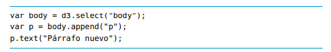

# Herramientas de Visualización

# Tema 1. Introducción a las herramientas de visualización

1. Para explicar una historia basada en datos debemos:
- A. Entender los datos disponibles.
- B. Ser capaz de representarlos gráficamente con las herramientas adecuadas.
- C. Comprobar que los destinatarios entiendan el mismo mensaje que pretendes explicar.
- D. Todas las anteriores. **CORRECTA**

2. Los datos y sus relaciones no son siempre algo fácil de entender:
- A. Correcto y por ello las herramientas de visualización nos pueden ayudar a tratar con información compleja. **CORRECTA**
- B. Correcto porque los datos siempre requieren simplificar su complejidad.
- C. Incorrecto si estamos tratando con datos de carácter personal.
- D. Incorrecto si estamos tratando con datos numéricos.

3. Todas las herramientas de visualización requieren de conocimientos de programación:
- A. Incorrecto. **CORRECTA**
- B. Correcto. Tableau es un ejemplo de ello.
- C. Correcto. Google Chart es un ejemplo de ello.
- D. Correcto. D3.js y Carto son un ejemplo de ello.

4. ¿Cuáles de estas herramientas están orientadas a usuarios no desarrolladores?
- A. Tableau.
- B. Qlik.
- C. Carto.
- D. Todas las anteriores. **CORRECTA**

5. ¿Cuáles de estas herramientas están orientadas a usuarios desarrolladores?
- A. Google Chart. **CORRECTA**
- B. Carto.
- C. Qlik.
- D. Todas las anteriores. 

6. En la actualidad las principales plataformas modernas de analítica e inteligencia de negocio...
- A. Se diferencian especialmente por sus capacidades en la visualización de datos.
- B. Ya no se diferencian especialmente por sus capacidades en la visualización de datos. **CORRECTA**
- C. Requieren de usuarios avanzados en programación 

7. Enumera, según Gartner, 3 características de las herramientas modernas de visualización de datos la actualidad:
- A. Análisis avanzado, insights automatizados y catálogo automático.
- B. Seguridad, cloud y conectividad a fuentes de datos.
- C. Seguridad, soporte a la preparación de los datos y consulta mediante búsquedas en lenguaje natural.
- D. Todas son correctas. **CORRECTA**

```
Seguridad: capacidades que permiten la seguridad de la plataforma, la
administración de los usuarios, la auditoría del acceso a la plataforma y la
autenticación.
Capacidad de gestión: capacidades para rastrear el uso, gestionar cómo se
comparte la información y por quién, realizar análisis de impacto y trabajar con
aplicaciones de terceros.
Cloud: la capacidad de apoyar la construcción, despliegue y gestión de análisis y
aplicaciones analíticas en la nube.
Conectividad de la fuente de datos: capacidades que permiten a los usuarios
conectarse e ingerir datos, estructurados y no estructurados, contenidos en varios
tipos de plataformas de almacenamiento.
Preparación de datos: soporte para la combinación de datos de diferentes fuentes,
por medio de arrastrar y soltar, y realizable por los usuarios de negocio, así como la
propia creación de modelos analíticos.
Complejidad del modelo: soporte para modelos de datos complejos, incluyendo la
capacidad de manejar múltiples tablas e interoperar con otras plataformas analíticas.
Catálogo: la capacidad de generar y agregar automáticamente un catálogo que
permita la búsqueda de los objetos creados y utilizados por la plataforma.
Insights automatizados: un atributo fundamental de la analítica aumentada es la
capacidad de aplicar técnicas de machine learning e inteligencia artificial para
generar automáticamente conocimientos para los usuarios finales (por ejemplo,
identificando los atributos más importantes de un conjunto de datos).
```


8. Una página web se construye con base en los siguientes niveles:
- A. HTML y CSS.
- B. HTML y editores de código.
- C. Captura de datos y visualización.
- D. Estructura, contenido, apariencia y comportamiento **CORRECTA**

9. Se dice que HTML es un lenguaje de marcas porque:
- A. Permite las llamadas a APIS o servicios externos de terceros.
- B. Señaliza todas las líneas de código haciéndolas más legibles. 
- C. Es compatible con otros lenguajes como JavaScript.
- D. Codifica con base en etiquetas. **CORRECTA**

10. Brackets es un editor de código:
- A. Compatible con HTML, CSS y JavaScript
- B. Que incorpora un servidor web local.
- C. Que permite ver en tiempo real las modificaciones que realicemos en el código fuente.
- D. Todas son correctas. **CORRECTA**

--- 
## Videoclase 1. Generalidades

- ¿Cuál de las siguientes opciones es un objetivo principal de las herramientas de visualización de datos?
- Simplificar la complejidad de los datos y destacar información relevante. => Las herramientas de visualización buscan simplificar datos complejos, resaltando la información más relevante y permitiendo identificar patrones que no serían evidentes de otra manera.


- Entre las herramientas de visualización para usuarios no desarrolladores, ¿cuál permite integrar datos tabulares con mapas de forma sencilla?
- Carto. => Carto es ideal para trabajar con datos tabulares y convertirlos en mapas interactivos, ofreciendo una experiencia intuitiva para usuarios no desarrolladores.

- ¿Qué característica distingue a las herramientas de visualización para usuarios desarrolladores?
- Altas capacidades de personalización de gráficos. => Las herramientas para desarrolladores permiten un control detallado y una personalización avanzada de las visualizaciones, aunque requieren conocimientos en programación

- ¿Cuál es una característica clave de la analítica aumentada en herramientas ABI según Gartner?
- Generación automática de insights utilizando inteligencia artificial. => La analítica aumentada utiliza inteligencia artificial para identificar patrones automáticamente, lo que facilita el descubrimiento de insights sin intervención manual.

- ¿Cuál de las siguientes librerías utiliza HTML, CSS y JavaScript para crear gráficos avanzados con datos complejos?
- D3.js. => D3.js es una poderosa librería que utiliza HTML, CSS y JavaScript para crear visualizaciones avanzadas y personalizables, especialmente útiles para gráficos vectoriales en formato SVG.

--- 
## Videoclase 2. Herramientas y librerías para la visualización de datos

- Cuál de las siguientes opciones describe correctamente la estructura de un documento HTML básico?
- <body> contiene el contenido visible, y <head> contiene los metadatos y enlaces externos.

- ¿Cuál de las siguientes opciones utiliza correctamente un selector de clase en CSS?
- .highlight { background-color: yellow; } => Falto el punto .

- ¿Qué hace el siguiente código JavaScript? 
document.getElementById(‘demo’).innerHTML = ‘Hola, Mundo!’;
- Reemplaza el contenido HTML del elemento con id demo por el texto «Hola, Mundo!».

- ¿Cuál de los siguientes es un ejemplo de selector de ID en CSS?
- #menu { font-size: 14px; }

- ¿Cómo se conecta un archivo CSS externo a un documento HTML?
- <link rel="stylesheet" type="text/css" href="styles.css">

--- 

## Videoclase 3. Brackets: editor especializado para desarrollo web frontend

- ¿Cuál es una característica clave que distingue a Brackets de otros editores de código?
- La vista previa en vivo que refleja los cambios en tiempo real. => La vista previa en vivo es una de las características más destacadas de Brackets. Permite a los desarrolladores ver cambios en HTML, CSS y JavaScript en tiempo real, lo que mejora la eficiencia en el desarrollo front-end.

- ¿Qué sucede en Brackets si una etiqueta HTML no está bien cerrada?
- Se marca en rojo junto con las etiquetas posteriores afectadas.

- ¿Cómo se puede editar un estilo CSS asociado a una etiqueta HTML en Brackets sin abrir el archivo CSS correspondiente?
- Presionando «Ctrl» + «E» sobre la etiqueta para desplegar el estilo asociado.

- ¿Qué lenguaje de programación no está orientado al uso principal de Brackets?
- Python.

- ¿Cuál es una ventaja de la interfaz de Brackets según la descripción?
- Utiliza una interfaz sencilla con ayudas en la escritura y organización del proyecto.


# Tema 2. Historia de la visualización de datos

1. Necesita ser instanciada con un new para crear un objeto:
- A. Sí. **CORRECTA**
- B. No, solo cuando le asignas valores directamente.
- C. No, solo cuando trabajas la primera vez con la gráfica.
- D. No.


2. ¿Qué función tiene?
- A. Carga el propio cargador de librerías. **CORRECTA**
- B. Importa la librería jQuery.
- C. Carga los diferentes paquetes de la librería.
- D. Carga la última versión de Google Charts.

3. La primera variable que recibe la función de JQuery es:
- A. La URL a la que se dirige la petición.  **CORRECTA**
- B. El evento que ha generado la visualización.
- C. El nombre de función destino donde se pasan los valores.
- D. El array de datos a visualizar.

````javascript 
$.get("https://docs.google.com/spreadsheet/pub?
key=0AhNdznUnSazTdElCVTRT
YzF6Zm9DSmlUQkx1NE5DY1E&output=csv", function(csvString) {
// transform the CSV string into a 2-dimensional array
var arrayData = $.csv.toArrays(csvString, {onParseValue:
$.csv.hooks.castToScalar});
...
});

//En cierta manera, cuando vemos el símbolo $ es equivalente al de JavaScript
// estándar. Quiere decir que vamos a hacer algo con el documento HTML.
````

4. añade una columna a nuestra tabla de datos:
- A. Sí, tantas veces como aparezca esta línea de código.
- B. Sí, aunque no admite valores iguales.
- C. No, porque la tabla ya viene con las columnas definidas.
- D. No.

5. Existen librerías en JQuery que nos facilitan la transformación de archivos CSV a datos comprensibles por la librería de Google Charts:
- A. Sí.
- B. No, porque jQuery no incorpora dichas funciones.
- C. No, porque CSV no es un formato compatible con Google Chart.
- D. Sí, aunque depende de que las versiones sean compatibles.  **CORRECTA**

6. nos dibujará bar charts verticales:
- A. Sí, admite tanto barras verticales como horizontales. **CORRECTA**
- B. Sí, hace lo mismo que colum chart.
- C. Sí, tanto barras independientes como apiladas.
- D. No.

7. ¿Qué hace el código cuando contiene ?
- A. Comprueba si el evento generado por otra visualización tiene el formato correcto.
- B. Comprueba si ha habido algún error con la petición http.
- C. Comprueba si ha habido algún problema en la generación de la visualización.
- D. Comprueba si los datos del archivo son coherentes

8. se utiliza para escuchar eventos que generan las visualizaciones:
- A. Sí. **CORRECTA**
- B. No, solo aplica los eventos del ratón.
- C. No, se encarga de los eventos del sistema operativo.
- D. No

9. Todas las visualizaciones de Google Chart generan los mismos tipos de eventos:
- A. Sí, porque todas funcionan de la misma forma.
- B. Sí, porque de esta forma el código es escalable.
- C. Sí, porque ello permite cambiar la gráfica sin tener que cambiar los eventos.
- D. No. **CORRECTA**


10. ¿Incluiremos el paquete para visualizar un mapa?
- A. Sí, para mostrar un país, un continente o una región. **CORRECTA**
- B. Sí, para mostrar incluso direcciones de calles.
- C. No, porque no existe dicha librería.
- D. No

--- 
## Videoclase 1. Funcionalidades principales

- ¿Cuál es la principal función de google.charts.load() en el código de Google Charts?
- Cargar la librería de Google Charts y sus paquetes específicos. => a función google.charts.load() es crucial porque carga la librería de Google Charts junto con los paquetes específicos necesarios, como ‘corechart’ o ‘geochart’. Sin esta línea, las funciones de la librería no estarían disponibles.

- ¿Cuál es el propósito de la estructura google.visualization.DataTable()?
- Proveer una estructura de datos estándar para almacenar las entradas del gráfico. => La estructura DataTable se utiliza para organizar y almacenar datos en un formato compatible con Google Charts, lo que permite que el gráfico pueda leerlos y representarlos visualmente.

- ¿Qué sucede si la función drawChart() se ejecuta antes de que la librería esté completamente cargada?
- Se lanza un error porque los paquetes no están disponibles aún. =>  La ejecución prematura de drawChart() genera un error porque los paquetes de la librería aún no están disponibles. Por eso es importante usar google.charts.setOnLoadCallback(drawChart).

- ¿Cómo se personalizan los colores de un gráfico circular en Google Charts?
- Especificando una lista de colores en la opción colors. => La opción colors permite asignar colores específicos a cada sección del gráfico, lo que es útil para mejorar la estética y la claridad de la visualización.
 
- ¿Cuál es la diferencia principal entre un gráfico tipo GeoChart y un PieChart?
- GeoChart utiliza ubicaciones geográficas para visualizar datos mientras que PieChart representa proporciones. => GeoChart está diseñado para mostrar datos en un mapa basado en ubicaciones geográficas (como países o regiones), mientras que PieChart representa datos en forma de proporciones o secciones circulares.


--- 
## Videoclase 2. Integración de Google Chart con Spreadsheets y CSV

- ¿Qué paso es necesario para usar una hoja de Google Spreadsheet como fuente de datos en una visualización?
- Asignar permisos de lectura públicos o para cualquier persona con el enlace. => Para conectar una visualización con Google Spreadsheets, es necesario asegurarse de que la hoja tenga permisos de lectura adecuados. Esto permite que el archivo sea accesible desde el código, sin necesidad de modificar constantemente el JavaScript.

- ¿Qué sucede si se utiliza una URL incorrecta de Google Spreadsheet en el código?
- Aparece un error reportado por la función handleQueryResponse. => La función handleQueryResponse gestiona los errores y si la URL es incorrecta, reporta el problema mediante un mensaje de error que indica la causa específica. Esto ayuda a depurar el código.

- ¿Qué método de jQuery se utiliza para obtener el contenido de un archivo CSV?
- $.get() => El método $.get() realiza una solicitud HTTP para obtener el contenido del archivo CSV desde una URL. Es un formato común para manejar datos externos con jQuery.

- ¿Qué parámetros son necesarios al llamar a la función google.visualization.Query?
- headers y gid => Al usar google.visualization.Query, los parámetros headers (para indicar cuántas filas son cabecera) y gid (para identificar la hoja de trabajo específica) son esenciales para una configuración precisa del gráfico.

- ¿Cuál es el propósito de la función $.csv.toArrays al trabajar con un archivo CSV?
- Transformar el contenido del archivo CSV en un array bidimensional. => La función $.csv.toArrays convierte el contenido del archivo CSV en un array bidimensional que puede ser interpretado fácilmente por bibliotecas como Google Charts. Esto facilita la manipulación de los datos para visualizaciones.

--- 

## Videoclase 3. Manejo de fuentes de datos y eventos en Google Chart
- ¿Qué función de Google Charts se utiliza para escuchar y gestionar eventos generados por las visualizaciones?
- google.visualization.events.addListener => La función google.visualization.events.addListener permite registrar un evento en una visualización, ejecutando una función cuando dicho evento ocurre. Por ejemplo, en el código de muestra se utiliza para detectar cuando un usuario ordena una tabla.

- ¿Qué ocurre cuando el evento sort de una tabla es detectado por el listener en el ejemplo de código?
- Se ordenan los datos en el objeto data y se actualiza el gráfico de barras. => En el ejemplo proporcionado, cuando el evento sort es detectado, se ejecuta el método data.sort para reordenar los datos. Posteriormente, se llama al método chart.draw para actualizar el gráfico de barras con el nuevo orden.

- ¿Cuál es el propósito del método google.visualization.DataView en el ejemplo de código?
- Filtrar y seleccionar las columnas que se mostrarán en las visualizaciones. => 

- ¿Qué efecto tiene aplicar el método formatter.format(data, 1) al objeto de datos?
- Aplica un prefijo de formato a la columna especificada, como $. => l método formatter.format aplica un formato específico a una columna del objeto DataTable. En este caso, añade el prefijo $ a los valores de la columna de salarios (columna 1).

- ¿Qué función es responsable de actualizar el gráfico de barras cuando se ordenan los datos de la tabla?
- chart.draw. => La función chart.draw(view) es la encargada de redibujar el gráfico de barras después de que los datos de la tabla se hayan ordenado. Esto ocurre dentro del listener que detecta el evento sort. El gráfico se actualiza con la nueva visualización de los datos ordenados.


# Tema 3. D3.js. Introducción y funcionalidades

1. ¿Qué significa el concepto chaining en D3?
- A. Las funciones se pueden concatenar una detrás de otra separándolas con un punto.  **CORRECTA**
- B. Las funciones dependen unas de otras, y solo puedes llamarlas de una manera seguida.
- C. Las funciones permiten crear elementos HTML.
- D. Ninguna de las anteriores.

2. Si ejecutamos la sentencia :
- A. Seleccionamos el elemento p con identificador target en el HTML y añadimos el texto indicado entre comillas.
- B. Seleccionamos el elemento p con identificador target en el HTML y reemplazamos el texto existente con el indicado entre comillas.
- C. Seleccionamos el elemento target con identificador p.
- D. Ninguna de las anteriores.

3. Si ejecutamos la sentencia
- A. Seleccionamos el elemento del HTML, añadimos un elemento p y le asignamos el texto entre comillas.
- B. Seleccionamos el elemento del HTML, con identificador y le asignamos el texto entre comillas.
- C. No tiene una sintaxis correcta y no funciona.
- D. Ninguna de las anteriores.

4. Con D3, ¿podemos modificar las clases CSS de los elementos HTML?
- A. Sí.**CORRECTA**
- B. No, porque figuran un fichero independiente.
- C. No, porque D3 solo me permite trabajar con los datos.
- D. No, porque solo puedo modificar el código HTML

5. Con D3, ¿podemos modificar el estilo de un elemento HTML como, por ejemplo, el tamaño de la fuente, con una sentencia tipo ?
- A. Sí.**CORRECTA**
- B. No, porque las características de los objetos residen en las hojas de estilo.
- C. No, porque no existe una forma de modificar solo un identificador de estilo.
- D. No, porque los elementos de las hojas de estilo no son accesibles por D3.

6. ¿Qué hace la siguiente sentencia: ?
- A. Devuelve todos los elementos div del HTML con el atributo clase que contenga .
- B. Asigna a todos los elementos div del HTML la clase .
- C. Asigna a un elemento div del HTML la clase .
- D. Ninguna de las anteriores.

7. D3 permite trabajar tanto con los datos a visualizar como con elementos HTML:
- A. No, solo con datos.
- B. No, solo con elementos HTML.
- C. No, porque los elementos u objetos HTML deben codificarse antes de su visualización por el navegador.
- D. Sí. Es una de sus principales ventajas como herramienta de visualización **CORRECTA**

8. ¿Qué hace la siguiente sentencia: ?
- A. Itera por todos los elementos y les añade un elemento con el texto , donde es el contador de la iteración.
- B. Itera por todos los elementos y les añade un elemento con el texto , donde es el texto que el elemento HTML contiene.
- C. Itera por todos los elementos y les añade un elemento con el texto , donde es una constante fija previamente definida.
- D. Ninguna de las anteriores


9. Identifica si obtenemos el mismo resultado con la sentencia que con el siguiente código:



- A. Sí.
- B. No, porque la primera sentencia no es correcta.
- C. No, porque aunque la primera sentencia es correcta, el código siguiente no lo es.
- D. No, porque tanto la línea de código individual como el grupo de código son incorrectos.

10. ¿Qué hace la sentencia d ?
- A. Le asigna vacío al elemento con identificador .
- B. Devuelve el contenido del elemento con identificador .
- C. Devuelve el contenido del elemento , siendo este de formato texto.
- D. Le asigna un texto al elemento .
---
## Videoclase 1. Introducción a D3.js

- ¿Cuál de las siguientes afirmaciones sobre D3.js es incorrecta?
-  D3.js se limita a crear gráficos estáticos y no soporta interactividad. => 

- ¿Cuál de los siguientes conceptos es central en D3.js y se refiere a la vinculación de datos a elementos del DOM?
- Binding. => El binding es el proceso fundamental en D3.js que conecta los datos a elementos visuales en el DOM, permitiendo que la visualización se actualice automáticamente cuando cambian los datos

- ¿Cuál de las siguientes opciones no es una ventaja de utilizar D3.js para crear visualizaciones de datos?
- Facilidad de uso para principiantes. => Si bien D3.js es una herramienta muy poderosa, su curva de aprendizaje puede ser más pronunciada que otras bibliotecas, lo que la hace menos amigable para principiantes.

- ¿Cuál de las siguientes afirmaciones sobre SVG es falsa en el contexto de D3.js?
- SVG es la única opción para renderizar gráficos en D3.js. => Aunque SVG es el formato más común utilizado por D3.js, también es posible utilizar Canvas para renderizar gráficos.

- ¿Cuál de las siguientes opciones describe mejor el concepto de data-driven documents en D3.js?
- La vinculación de datos a elementos del DOM para generar visualizaciones dinámicas. => La definición más precisa de data-driven documents es la vinculación de datos a elementos del DOM, lo que permite que la visualización se actualice dinámicamente en respuesta a cambios en los datos.

## Videoclase 2. Manipulación y mejores prácticas en D3.js y HTML

- ¿Cuál de las siguientes no es una ventaja de utilizar D3.js para la visualización de datos?
- Facilidad de uso para principiantes sin conocimientos de programación. => Si bien D3.js es una herramienta poderosa, requiere un sólido conocimiento de iiJavaScript y programación en general para aprovechar al máximo sus capacidades. La curva de aprendizaje puede ser relativamente empinada para aquellos sin experiencia previa en programación.

- ¿Cuál es el concepto clave que permite enlazar datos a elementos HTML en D3.js y crear visualizaciones dinámicas?
- Binding. => El binding es el concepto central en D3.js que permite vincular datos a elementos HTML, creando una conexión entre los datos y la visualización. Esto es lo que hace que las visualizaciones sean dinámicas y responsivas a los cambios en los datos.

- ¿Qué función de D3.js se utiliza para añadir un nuevo elemento HTML a un elemento existente?
- append(). => La función append() en D3.js se utiliza específicamente para añadir nuevos elementos a un elemento existente en el DOM.

- ¿Cuál de las siguientes afirmaciones sobre D3.js es incorrecta?
- D3.js requiere de plugins adicionales para funcionar en diferentes navegadores. => D3.js utiliza estándares web como HTML, CSS y SVG, por lo que funciona de forma nativa en la mayoría de los navegadores modernos sin necesidad de plugins adicionales.

- ¿Cuál es la principal razón por la que el siguiente código crea un nuevo párrafo con el texto «Párrafo nuevo» dentro del elemento <body>? 
<d3.select(“body”).append(“p”).text(“Párrafo nuevo”);>
- La función select() selecciona el elemento body y la función append() añade un párrafo. => Este es el flujo correcto del código. Primero se selecciona el elemento body del documento HTML, luego se utiliza append() para agregar un nuevo elemento p (párrafo) como hijo del elemento body y, finalmente, se establece el texto del párrafo utilizando text().


## Videoclase 3. Integración de HTML con D3.js para visualizaciones dinámicas

- ¿Cuál de las siguientes funciones de D3.js se utiliza principalmente para seleccionar múltiples elementos HTML?
- d3.selectAll().

- ¿Qué hace la función each() en D3.js?
- Itera sobre cada elemento de una selección y ejecuta una función.

- ¿Cuál es la función de d3.style() en el siguiente código: d3.select(“p#target”).style(“font-size”, “40px”);?
- Establece el tamaño de la fuente.

- ¿Cuál de las siguientes opciones es la forma correcta de seleccionar un elemento div dentro de un elemento section con ID “section1”?
- d3.select(“#section1 > div”).

- ¿Qué hace el siguiente código?
```
d3.selectAll("div")

  .attr("class", "red box")

  .each(function(d, i) {

    d3.select(this).append("h1").text(i);

  });
```
- Selecciona todos los elementos div, les asigna la clase red box y añade un encabezado h1 con el índice de cada elemento.


# Tema 4. D3.js. Datos, SVG y gráficas


## Videoclase 1. 

-
-

-
-

-
-

-
-

-
-

## Videoclase 1. 

-
-

-
-

-
-

-
-

-
-

## Videoclase 1. 

-
-

-
-

-
-

-
-

-
-


# Tema 05. 


--- 

## Videoclase 1. 

-
-

-
-

-
-

-
-

-
-

## Videoclase 1. 

-
-

-
-

-
-

-
-

-
-

## Videoclase 1. 

-
-

-
-

-
-

-
-

-
-

# Tema 06. 


--- 
## Videoclase 1. 

-
-

-
-

-
-

-
-

-
-

## Videoclase 1. 

-
-

-
-

-
-

-
-

-
-

## Videoclase 1. 

-
-

-
-

-
-

-
-

-
-

# Tema 07. 

--- 
## Videoclase 1. 

-
-

-
-

-
-

-
-

-
-

## Videoclase 1. 

-
-

-
-

-
-

-
-

-
-

## Videoclase 1. 

-
-

-
-

-
-

-
-

-
-


# Tema 08. 


--- 
## Videoclase 1. 

-
-

-
-

-
-

-
-

-
-

## Videoclase 1. 

-
-

-
-

-
-

-
-

-
-

## Videoclase 1. 

-
-

-
-

-
-

-
-

-
-

# Tema 09. 


--- 
## Videoclase 1. 

-
-

-
-

-
-

-
-

-
-

## Videoclase 1. 

-
-

-
-

-
-

-
-

-
-

## Videoclase 1. 

-
-

-
-

-
-

-
-

-
-

# Tema 10. 


--- 
## Videoclase 1. 

-
-

-
-

-
-

-
-

-
-

## Videoclase 1. 

-
-

-
-

-
-

-
-

-
-

## Videoclase 1. 

-
-

-
-

-
-

-
-

-
-
