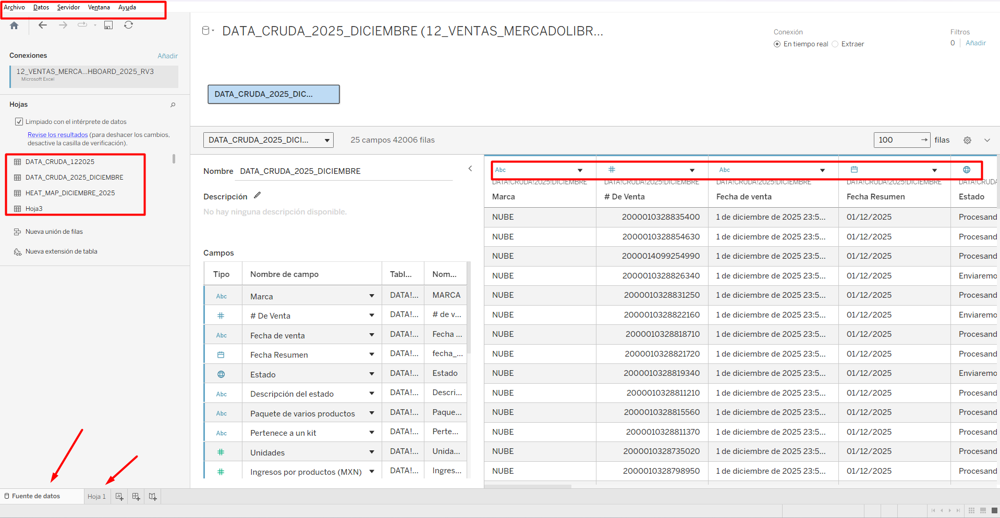
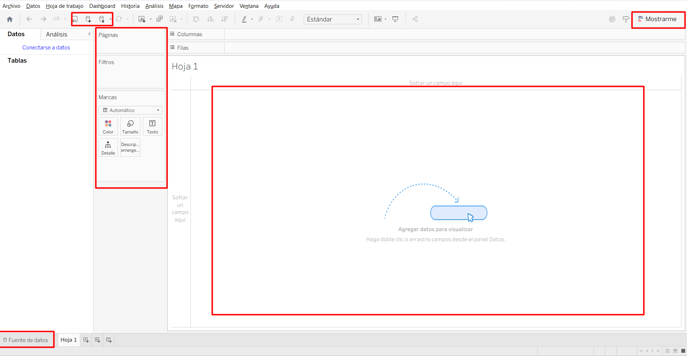
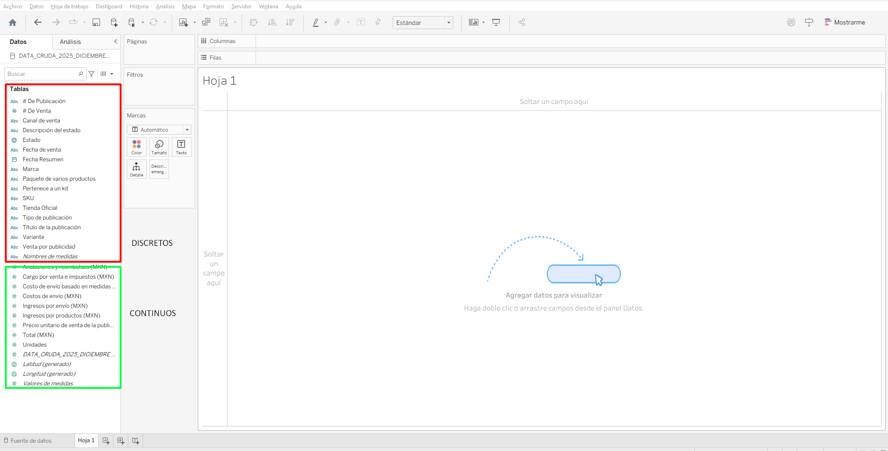
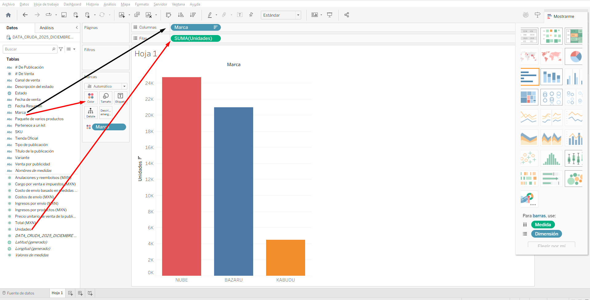
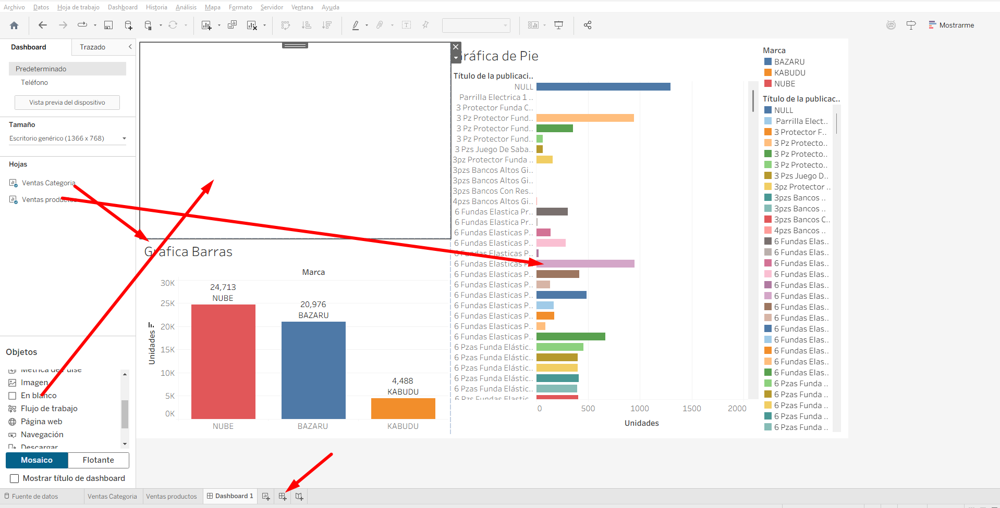
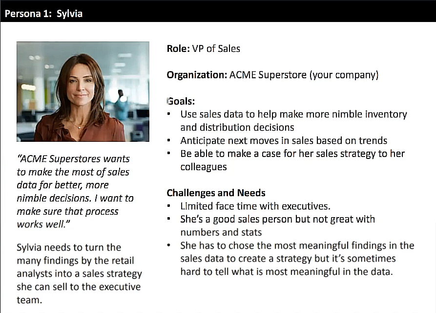
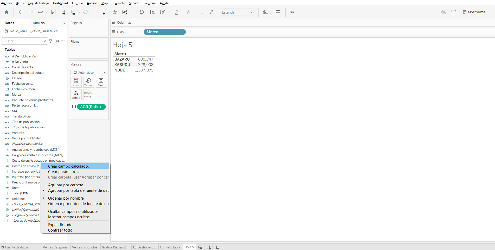
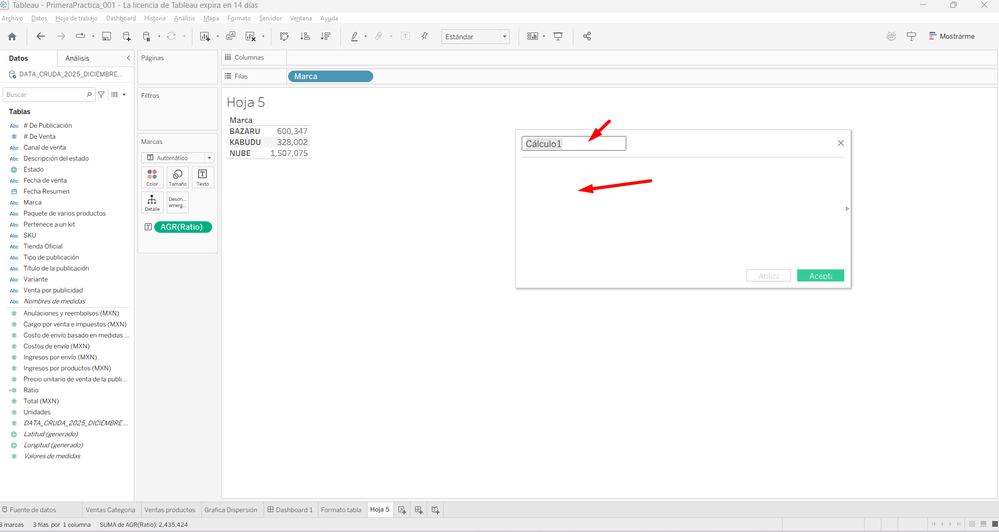
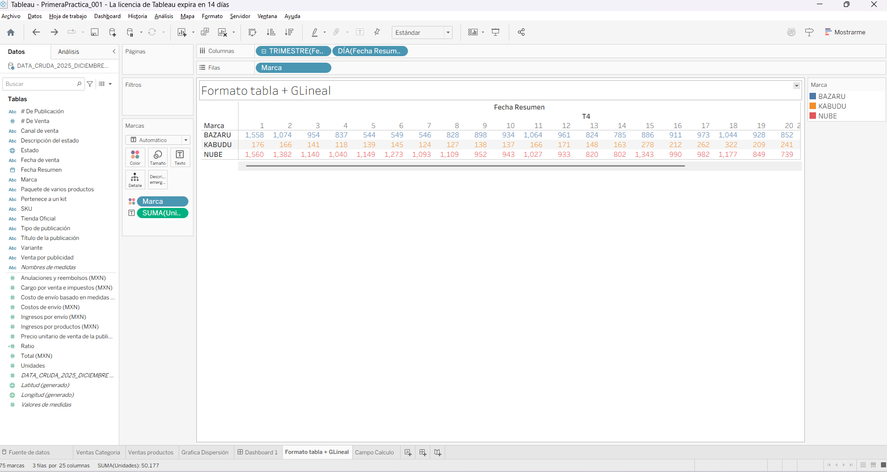
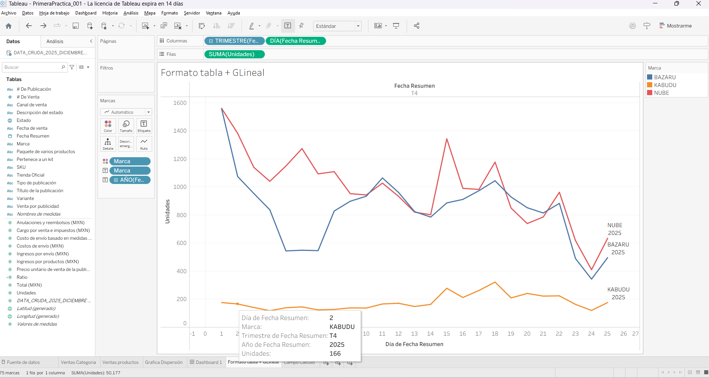

| Detalle | Información |
| :--- | :--- |
| **Publicado el** | Publicado el 05 de Marzo de 2021 |
| **Profesor** | Luis Martinez |
| **Fecha de Inicio** | 12/01/2026 |
| **Fecha de Fin** |  |

> Visualiza y cuenta historias de datos empresariales con Tableau. Aprende a crear gráficos, dashboards y narrativas impactantes para comunicar insights claros y tomar mejores decisiones. Transforma datos complejos en visualizaciones comprensibles y atractivas
---
<div align="center">
  
</div>


| Curso | Certificado |
| :--- | :---: |
| Curso de Tableau: Visualización de Datos y Storytelling para Negocios | [Ver PDF]() |

--- 


# Clase 1: Visualización de Datos para Negocios con Tableau


> La visualización de datos nos ayudará a encontrar la información pertinente y relevante, así como a la organización de la información.

> Es una representación gráfica de la información, y esta puede ser dividida en dos partes:

- Input: La parte que inicia el proceso, en nuestro caso los datos a graficar
- Output: El producto, en este caso las visualizaciones, o DataViz

**Visualización de datos**

- La visualización de datos no es algo reciente, sino que se remonta al pasado de la humanidad, es casi tan antigua como el Ábaco.

- Gracias a las tecnologías actuales se genera infinidad de datos a cada momento, de todo tipo de temáticas.

**Infografía sobre la marcha de Napoleón**
- Esta infografía es considerada la mejor visualización de la historia.
- Muestra la transición de la marcha del ejército de Napoleón, hacia la conquista de Moscú
- Representa el tamaño del ejército de Napoleón a lo largo de la marcha
- Indica la ubicación geográfica a lo largo de la marcha
- Muestra la temperatura que hubo en diferentes etapas de la marcha
- Señala los ríos que se cruzaron en el trayecto de la marcha

# Clase 2: Visualización de Datos con Tableau y Otras Herramientas Clave

## Excel
La primera herramienta que normalmente se conoce, muy usada en el mundo corporativo
Forma parte de la suite de Microsoft Office
Con un poco de trabajo puedes construir dashboards

## Power BI
La transición natural de Excel hacia el Business Intelligence
Al ser un producto de Microsoft es compatible con la suite de Microsoft Office
Viene en dos versiones: de escritorio y web (aunque la versión web viene con limitaciones), además de que tiene versión gratuita
Te permite fácilmente hacer reportes, usando dashboards

## Google Analytics
Utilizada principalmente en Marketing Digital
Útil para ver el comportamiento de campañas, anuncios o costo por clic
Es más complicado de generar visualizaciones personalizadas, siendo el tablero predeterminado la única forma de visualizar

## Tableau
Te permite generar dashboards, pero además generar una narración de historia
Tiene una gran comunidad que se apoya entre sí, además de que realiza eventos como IronViz o Makeover Monday (en Twitter)
Cuenta con tres versiones:
Desktop (de paga)
Public (gratuita)
Server (para empresas)

# Clase 3: Anatomía y uso de Tableau Public: guía práctica para principiantes


Al abrir Tableau Public observaremos la Pantalla de Bienvenida, dividida en tres secciones:

1. Conexiones: Conectar Tableau a un servidor o a un archivo (lado izquierdo).
2. Archivos Recientes: Archivos anteriormente editados en la nube (parte media).
3. Descubra más: Novedades, noticias, datasets públicos, capacitaciones y visualizaciones recientes en 

**Tableau Public (lado derecho).**
Para salir de la Pantalla de Bienvenida, oprime Escape Esc. Ahora podrás ver la Hoja de Trabajo.

- Hoja de Trabajo
- Aquí podremos ver los valores de los datos, asignar los valores de las filas, columnas, filtros y las marcas que son muy importantes para agregar cosas como:
- Etiquetas
- Descripciones emergentes
- Tamaños y detalles
- Colores
- Además de generar dashboards (conjunto de visualizaciones de datos), Historias y hasta muestra sugerencias para nuestros dashboards.




# Clase 4: Importación de Bases de Datos Excel en Tableau Public

En Tableau podemos importar archivos con datos en diferentes formatos:

Excel
Texto
JSON
Access
PDF
Archivos espaciales
Archivos estadísticos
En la pantalla inicial seleccionamos el tipo de archivo con el que trabajaremos y lo importamos a Tableau.

Preparación de los datos
Primero descargaremos el archivo de ejemplo en la sección de recursos, y lo importaremos a Tableau como un archivo de Excel.

Ahora aparecerán a la izquierda las Hojas y Tablas que vienen dentro del archivo, para seleccionar la hoja con la que trabajarás, debes dar clic en la hoja y arrástrala al área que dice “Arrastrar tablas aquí”.

A continuación te aparecerán todos los datos de manera ordenada, los datos pueden ser de tipo:

Numérico (decimal o entero)
Fecha
Cadena de caracteres
Booleano
Una vez te entres en la Hoja de Trabajo, a la izquierda se mostrarán las columnas, los valores de las columnas pueden ser:

Discretos (mostrados en azul)
Continuos (mostrados en verde)
Tu primera visualización
Tableau es muy fácil de utilizar, ya que funciona arrastrando y soltando los datos que necesites para tu visualización.

Puedes arrastrar los valores a las columnas y filas que quieras mostrar.

En el botón mostrarme (arriba a la derecha) elige el tipo de gráfica con la que desees visualizar tus datos.

Puedes intercambiar filas y columnas usando el botón Intercambiar (en la sección de Herramientas).

Recomendaciones
Muestra los datos de forma descendente.
Cambia el color de cada elemento arrastrando los datos seleccionados a la opción color, en la sección marcas. Tableau respetará los colores, en caso de que hagas más de una DataViz usando los mismos datos.
También puedes agregar etiquetas, mensaje emergente, etc. Desde la sección marcas, así como modificar el ancho de las barras.

**Pasos**
- Paso 1: Como puedes ver en la imagen, se muestra la hoja de trabajo con los datos importados. señalo cada elemento que indica  tipos de valores. área de trabajo, esta imagen es solo el indicador que muestra los tipos de valores, y los datos que vienen en el archivo, en este caso excel 
- 

- Paso 2: Aqui podemos validar nuestros valores divididos en dos tipos, discretos y continuos. 
- 

- Paso 3: Tableau usa la tecnica de draw and drop, casi todo es por medio de arrastrar y soltar en esta imagen indica como se hace la visualizacion
- 

- Paso 4: 
- 


# Clase 5:  Creación de Dashboards en Tableau: Visualización y Análisis de Datos

**Tu primer dashboard**
- Antes de generar un dashboard es necesario crear las visualizaciones necesarias.
- Es importante nombrar cada visualización apropiadamente.
- Haz un duplicado de cada visualización. Esto evitará que pierdas los avances ya hechos.
- Dar clic en Nuevo Dashboard (parte inferior).
- En la parte izquierda encontrarás todas las visualizaciones hechas.
- Se recomienda establecer el tamaño del dashboard como Automático, para que se expanda a toda la pantalla.
- Arrastra las visualizaciones (drag and drop), utilizando el posicionamiento que Tableau proporciona.
- Tableau también proporciona distintos objetos para ayudarte a mejorar la visualización de tu dashboard.

**Pasos**
- Paso 1: Podemos ver en la imagen que indico donde se encuentra el boton para crear un dashboard y el nombre de la hoja de trabajo y los datos importados ya generados como gráficas previmente que estan en las hojas de trabajo


# Clase 6: Participación en la Comunidad de Tableau y Makover Monday

Resumen
Una de las partes más importantes y que también puedes aprovechar es la comunidad, es una de las comunidades más importante dentro de la visualización de datos.

Makeover Monday
Evento que sucede cada lunes en Twitter (#MakeoverMonday). Es una excelente forma para obtener visualización dentro de la comunidad de Tableau.

Viz of the Day
Es la visualización más votada del día por la comunidad. Puedes encontrarla desde tu perfil de Tableau Public.

Iron Viz
Para participar debes haber recibido una nominación general de parte de la comunidad. Los participantes de Iron Viz antes participaron en Makeover Monday.

Kaggle
Una comunidad en la que se comparte todo tipo de datasets públicos, y en donde puedes compartir proyectos, visualizaciones y análisis de los datasets.

**Enlace**
- https://makeovermonday.co.uk


# Clase 7: Buenas prácticas de diseño en Tableau: ejemplos y correcciones

**Mejores prácticas de diseño**
- Agrupar las visualizaciones relacionadas
- Mantener la percepción de las visualizaciones en los ejes x y y (sesgo de la percepción visual)
- Respetar los colores de cada elemento y evitar reusarlo
- Ordenar los valores de manera descendente
- Colorear las barras de forma que las más grandes tengan un color más saturado, y las más pequeñas un color con menor saturación
- Resaltar un elemento cuando haya información relevante (ej. pérdidas en producción)
- Debe haber continuidad en los valores, a menos que esto represente algo (ej. inicio del año)
- Dependiendo si tu dashboard es dinámico o estático, usa o evita el uso de visualizaciones que necesiten scroll o hover
- Evitar el empleo de elementos que confundan


# Clase 8: Creación de Perfiles de Audiencia para Visualización de Datos

**Objetivo de tu visualización**
- ¿Qué mensaje queremos dar?
- ¿Qué DataViz es el mejor para nuestros datos?
- ¿Cuáles son las preguntas que vamos a responder?

**¿La DataViz será dinámica o estática?**

**Define tu audiencia**
- ¿Quiénes son?
- ¿Qué lenguaje hablan?
- ¿Con qué DataViz están acostumbrados?
- Define un Perfil Persona (nombre, rol, organización, metas, retos y necesidades)
- Define cuáles son las preguntas, dudas y preferencias que el Perfil Persona tiene

**Ética en la visualización de datos**
- No hay lugar para nuestras preferencias personales
- Debemos dejar que los datos hablen por sí mismos
- Una vez perdamos nuestra credibilidad, es difícil recuperarla

**Ejemplo de Perfil Persona** 



**Ejemplo**

```html

Nombre: Natalia

Edad: 35 años

Situación personal: soltera sin hijos

· Situación laboral: Team Leader de Instore regional de una multinacional

· Objetivos: Natalia le interesa conocer cómo se está desenvolviendo su marca en los puntos de venta donde se comercializa. A ella le interesa saber si el markting de punto de venta está ayudando a que las ventas incrementen, pero también a que su marca se exhiba en los mejores sitios de una manera limpia y que impacte a los clientes.

· Personalidad: Es una persona tranquila, controlada, decidida, conoce su trabajo muy bien, enfocada, amable, le gusta llevarse bien con sus proveedores y clientes, exigente.

· Retos: Lograr que todos los puntos de venta en todos los formatos cumplan con los lineamientos y estándares de visualización del producto. Además, tiene inconvenientes con el tiempo ya que la carga de trabajo es mucha y existen tiempos de entrega, revisión y generación de reportes para poder analizar con tiempo suficiente la información generada. Siguen prefiriendo métodos tradicionales para recolectar y generar la información importante.

· Cómo solucionamos su problema?: Una de las soluciones es usar la tecnología avanzada para la recolección de información y generación de reportería.

· Posibles objeciones: El precio del servicio, el equipo que la acompaña prefiere los métodos tradicionales porque son los que conocen y confían en ellos

· Preguntas que se haría: cómo funciona, en cuanto tiempo se puede implementar
```

El conocer el mensaje que vamos a dar es muy importante para saber que tipo de data viz vamos a usar. Para diferentes mensajes diferentes data viz
Es importante conocer a la audiencia para usar un lenguaje que ellos entiendan
Es importante definir un perfil de persona con las preguntas que podría tener, preferencias y sus conocimientos para la visualización de datos
Hay que definir si la visualización va a ser estática o dinámica
La ética en la data viz es muy importante ya que la audiencia va a creer en todo o casi todo lo que les digamos
--- 

Es por ello que debemos dejar hablar a los datos por medio de las visualizaciones
📌 RESUMEN: Es muy importante conocer a la audiencia para realizar las visualizaciones o reportes, nos podemos ayudar creando un perfil de cada persona. De igual manera la ética es primordial ya que la audiencia va a creer en los resultados que les presentamos

# Clase 9: Visualización de Datos en Tablas y Cálculos Personalizados

## Creando nuestra tabla
Para facilitar la visualización de datos, en el apartado de “Color” asignar los valores de “Profit”, y en la configuración “Editar color” asignar “Color escalonado”, y que esté dividido por dos, rojo y verde

Si las celdas de la tabla están todas del color, basta con arrastrar la misma propiedad a la que le agregamos color al texto, para que el color se aplique al texto
Crear tabla con campo calculado

**Primero creamos otra visualización de datos**

Para crear una nueva columna: “Valor calculado”, hacemos clic derecho en las “Tablas”, seleccionar “Crear campo calculado”
Le asignamos el nombre de “Profit to sales ratio”, y agregamos la operación que hará esta nueva columna: SUM([Profit])/SUM([Sañes]), también puedes hacer drag and drop para seleccionar las propiedades
Para cambiar la presentación de los valores de un valor calculado, clic derecho en el campo “Propiedades predeterminadas” -> “Formato de número”, y seleccionamos “Porcentaje” con dos decimales

# Clase 10: Visualización de Datos en Tablas y Cálculos Personalizados


## Creando nuestra tabla
Para facilitar la visualización de datos, en el apartado de “Color” asignar los valores de “Profit”, y en la configuración “Editar color” asignar “Color escalonado”, y que esté dividido por dos, rojo y verde
Si las celdas de la tabla están todas del color, basta con arrastrar la misma propiedad a la que le agregamos color al texto, para que el color se aplique al texto

## Crear tabla con campo calculado
Primero creamos otra visualización de datos
Para crear una nueva columna: “Valor calculado”, hacemos clic derecho en las “Tablas”, seleccionar “Crear campo calculado”
Le asignamos el nombre de “Profit to sales ratio”, y agregamos la operación que hará esta nueva columna: SUM([Profit])/SUM([Sañes]), también puedes hacer drag and drop para seleccionar las propiedades
Para cambiar la presentación de los valores de un valor calculado, clic derecho en el campo “Propiedades predeterminadas” -> “Formato de número”, y seleccionamos “Porcentaje” con dos decimales

**Pasos**:
- Paso 1: Podemos dar clic derecho del lado izquierdo del sidebar donde este vacio y al dar clic derecho nos muestra el siguiente menu escogemos crear campo calculado
- 
- Paso 2: Podemos dar un nombre al campo calculado y agregar la operación que hará esta nueva columna: SUM([Profit])/SUM([Sañes]), también puedes hacer drag and drop para seleccionar las propiedades 
- 
- Paso 3: podemos usar en nuestra hoja ese valor calculado. 


# Clase 11: Visualización de Líneas Temporales en Tableau: Ventas y Utilidades 

**Crear nuestras gráficas lineales**
Arrastramos el dato que queramos ver a las filas, en el ejemplo “Sales” y “Profit”
Agregamos a la columna “Order date”
Para dividir los valores de fechas en trimestres, basta con hacer clic al recuadro al lado del nombre, en el apartado de columnas
Podemos agregar colores, y detalles para hacer más sencilla la visualización de los datos.

**Agregar varias gráficas en un dashboard**
Creamos un nuevo dashboard, haciendo clic en la parte de abajo, a la izquierda de donde creamos una nueva hoja de trabajo
Configuramos el dashboard para que se adapte automáticamente al tamaño de la pantalla
Arrastramos las hojas de trabajo con las gráficas que necesitemos
También es buena práctica tener las mismas cantidades en los ejes de ambas gráficas, para tener una correcta correlación


**Pasos**:
- Paso 1: Para poder usar la gráfica lineal debemos primero tener la hoja de trabajo con los datos que queremos visualizar como lo muestra la imagen, una tabla sencilla con las categorias en este caso las marcas y luego las ventas diarias   
- 

- Paso 2: Damos clic en la parte superior derecga "Mostrarme" y nos desplegará el tipo de gráfica que queremos usar en este caso la gráfica lineal
- 


# Clase 12: 


# Clase 13: 


# Clase 14: 


# Clase 15: 


# Clase 16: 


# Clase 17: 


# Clase 18: 


# Clase 19: 


# Clase 20: 


# Clase 21: 


# Clase 22: 


# Clase 23: 


# Clase 24: 


