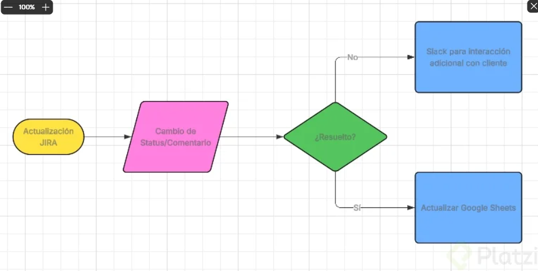

Curso de Automatizaciones con n8n

| Detalle | Información |
| :--- | :--- |
| **Publicado el** | Publicado el 21 Agosto 2025 |
| **Profesor** | Idir Ouhab |
| **Fecha de Inicio** | 12/01/2026 |
| **Fecha de Fin** |  |

> Aprende a identificar, diseñar y ejecutar workflows en n8n Cloud usando un enfoque low-code, optimizando procesos y reduciendo tareas repetitivas en entornos profesionales.
---

  

| Curso | Certificado |
| :--- | :---: |
| Curso de Automatizaciones con n8n | [Ver PDF]() |

--- 

## Clase 1: Automatización de workflows sin programar con IA

¿Qué es la automatización sin programar y por qué importa?
La automatización consiste en decirle al ordenador que repita por ti lo que ya sabes hacer. El valor está en liberar tu tiempo, reducir errores y evitar tareas tediosas que no aportan.

Definición práctica: “decirle al ordenador: ‘haz esto que yo ya lo he hecho mil veces’”. .
Beneficios clave: lo hace sin errores y sin darte la lata. .
Regla de oro: si algo se repite una y otra vez, se puede automatizar. .
Sin necesidad de programar: accesible para cualquier perfil. .
Tareas típicas a automatizar: revisar correos, copiar datos, enviar respuestas, actualizar hojas de cálculo. .
¿Qué tareas reales puedes automatizar hoy?
Existen casos claros y cotidianos que ya funcionan en empresas y equipos no técnicos. Son ejemplos simples que generan impacto inmediato.

Marketing: automatizar correos de bienvenida. .
Administración: guardar facturas sin abrir el correo. .
Personas no técnicas: ya lo hacen en su día a día. .
¿Cómo potencia la inteligencia artificial tus workflows?
La inteligencia artificial lleva la automatización más allá del simple movimiento de datos. Permite entender el contenido y actuar con criterio para mejorar la experiencia.

Entender datos: interpretar información, no solo trasladarla. .
Clasificar contenido: ordenar y etiquetar automáticamente. .
Responder a clientes: dar respuestas personalizadas sin intervención. .
Resultado: automatizaciones inteligentes que resuelven problemas del día a día. .
¿Quién te guía y con qué herramienta?
Iliro Guap, Senior Solutions Engineer en N8N, ayuda a clientes a automatizar procesos de negocio y te acompañará a crear tus propios workflows automatizados. .

¿Qué vas a lograr paso a paso?
Construir tus workflows automatizados con claridad y confianza. .
Sumarlos con IA para entender, clasificar y responder. .
Aplicarlos a problemas reales de tu día a día. .
Sorprenderte con lo que puedes crear sin programar. .

## Clase 2: Flujos de soporte 

¿Qué es n8n y por qué facilita la automatización sin programar?
Con n8n diseñas un flujo visual que se ejecuta cada vez que ocurre algo: alguien rellena un formulario o llega un mensaje de soporte. Tú conectas los pasos y n8n orquesta las acciones: guardar datos, enviar email, notificar por Slack y crear seguimientos. La ventaja clave es no tener que programar: solo arrastrar bloques y configurar.

Diseñas flujos con bloques visuales y condiciones.
Se ejecutan automáticamente cuando hay un evento.
Integras email, Slack y tu sistema de datos.
Aceleras soporte, clasificación y seguimiento.
¿Cómo se enruta el soporte con seis pasos en n8n?
Un flujo práctico para soporte distribuye mensajes al departamento correcto con seis pasos encadenados. La precisión depende de un buen filtrado con inteligencia artificial y de verificar si el cliente está pagando antes de enrutar.

¿Qué pasos componen el flujo de soporte con IA?
Recepción del mensaje: entrada única para nuevos casos.
Filtrado del mensaje con inteligencia artificial: clasificación por departamento.
Verificación de cliente: comprueba si el cliente está pagando.
Enrutamiento a departamentos: envía el email al área correcta.
Registro en el sistema: guarda el mensaje para trazabilidad.
Notificación al equipo: confirma recepción y estado por Slack.
Claves que aprenderás aquí: clasificar por intención, enrutar según reglas y notificar automáticamente. Esto reduce tiempos de respuesta y evita errores manuales.

¿Cómo se gestionan formularios, intención y seguimiento del cliente?
Otro flujo, muy cercano a lo que construirás, parte de un formulario enviado y termina con un seguimiento al cliente. Entre medias, preparas y clasificas datos para personalizar el mensaje final.

¿Qué etapas siguen los datos desde el formulario hasta el envío?
Recepción de información del formulario: punto de inicio del flujo.
Preparación de datos: normaliza campos y estructura la información.
Clasificación de la información e intención del usuario: determina qué necesita.
Envío del mensaje y seguimiento: comunica y deja trazado el contacto.
Esto refuerza habilidades como limpieza de datos, detección de intención y automatización del envío y seguimiento.

¿Dónde encontrar ejemplos reales de la comunidad?
Para inspirarte y entender el alcance, visita n8n.io/workflows. Verás workflows reales creados por la comunidad que muestran cómo combinar pasos, integrar apps y resolver casos comunes.

Ideas listas para adaptar a tus necesidades.
Buenas prácticas de clasificación y enrutamiento.
Casos de uso con formularios, email y Slack.

## Clase 3:  Símbolos de diagramas de flujo y su aplicación práctica

¿Cómo diseñar un workflow que capta leads y decide acciones?
Para empezar, se define el objetivo: recibir un lead interesado en el producto [01:00]. El flujo inicia con un inicio/fin y continúa con la entrada de datos que el cliente envía por formulario.

Inicio: óvalo llamado lead [01:00].
Entrada/salida: paralelogramo para recoger nombre, email y mensaje [01:15].
Decisión: rombo para evaluar si el mensaje contiene la palabra “demo” [01:30].
Acciones: rectángulos con dos caminos posibles [01:45].
La lógica es binaria y directa: si el mensaje contiene “demo”, se notifica al equipo de ventas por Slack [01:45]. Si no, se envía un email de agradecimiento [01:50]. Habilidad clave: mapear entradas, formular una decisión clara y conectar acciones sin ambigüedades.

¿Qué pasos prácticos ayudan a construirlo en un software?
Usa un software de diagramas para arrastrar y conectar bloques [00:10]. Nombra cada símbolo con precisión y revisa la dirección de las flechas para evitar conexiones invertidas [01:05].

Copiar y renombrar el óvalo: lead [01:00].
Añadir paralelogramo: datos del formulario [01:15].
Arrastrar rombo: ¿mensaje contiene “demo”? [01:30].
Duplicar rectángulos: notificar por Slack o enviar email [01:45].
¿Qué habilidades se entrenan al modelar este flujo?
Conceptualización de procesos: traducir un caso real a bloques conectados [00:05].
Uso correcto de símbolos: inicio/fin, acción, decisión, entrada/salida [00:20].
Pensamiento condicional: sí/no con efectos visibles en acciones [01:30].
Claridad operativa: cada camino termina en una acción concreta [01:50].
¿Qué significan los símbolos del diagrama y cuándo usarlos?
Los símbolos básicos guían la lectura y evitan confusiones. En pantalla se presentan cuatro fundamentales que cubren el caso base.

Óvalo: inicio o fin del flujo, como cuando alguien envía un formulario [00:20].
Rectángulo: acción operativa, como enviar un email o editar un archivo [00:25].
Rombo: decisión binaria, por ejemplo: ¿el email contiene la palabra “demo”, sí o no? [00:28].
Paralelogramo: entrada o salida de datos, como el nombre o el mensaje recibido [00:32].
Consejo práctico: en el panel lateral del software hay más bloques para otros casos. Tómate tiempo para explorarlos y elegir el que mejor represente tu necesidad [00:40].

¿Cómo se conectan correctamente los bloques?
Asegura que las flechas salgan de la salida de un bloque y entren a la entrada del siguiente [01:05]. Si un enlace queda al revés, corrígelo antes de continuar para no distorsionar el flujo.

¿Qué datos mínimos pedir al lead para decidir?
Nombre: identifica al contacto [01:15].
Email: canal de respuesta [01:15].
Mensaje: campo a evaluar para localizar “demo” [01:15].
¿Cómo comprobar que tu diagrama está bien compuesto?
Un buen diagrama responde cuatro preguntas esenciales. Si las contestas con tu flujo, la lógica está completa y las acciones son ejecutables.

¿Qué inicia el flujo?: un formulario enviado por el cliente [02:10].
¿Qué decisión se evalúa?: si el mensaje contiene la palabra “demo” [02:12].
¿Qué resultado esperamos?: una de dos salidas, notificar por Slack o enviar email [02:20].
¿Qué acciones se ejecutan?: envío del mensaje a Slack o email según la condición [02:25].

## Clase 4:  Configuración paso a paso de tu primer flujo en n8n

**Enlace**
- https://n8n.io

¿Cómo crear y preparar tu espacio en n8n?
Comienza por abrir cuenta en n8n.io y completar el onboarding básico. La configuración inicial sienta las bases del flujo y evita confusiones luego.

Crea la cuenta y haz clic en Get Started. 
Completa el formulario según tu perfil: dónde conociste n8n (ej.: Google) y para quién es la cuenta (para mí). 
Pulsa Submit, omite invitaciones con Skip y continúa con Start Automating. 
Inicia un workflow con Start from Scratch y cambia el nombre en la esquina superior izquierda (por ejemplo, mi flujo). 
Recuerda el concepto de trigger: el evento que inicia el flujo; aquí, un lead. 
¿Qué trigger conviene para testear el workflow?
Añade el primer paso con Add First Step y selecciona un trigger manual para pruebas. 
Más adelante, cámbialo por un formulario para recoger datos reales del usuario. 
¿Qué nodos y condiciones definen el flujo de leads?
El diseño gira en torno a tres piezas: nodo set para simular datos, nodo if para decidir según el texto y ejecución para validar ramas.

¿Cómo configurar el nodo set con datos estáticos?
Agrega un segundo nodo y busca set para crear campos. 
Define nombre, email y mensaje desde “drag input fields”. 
Escribe un mensaje de prueba, por ejemplo: “quiero una demo”. 
Ejecuta con Execute workflow y verifica que el nodo set muestra el mensaje configurado. 
¿Cómo evaluar texto con el nodo if y ramas true/false?
Añade un nodo if. Arrastra el campo mensaje al primer cuadro. 
Elige el tipo string y la condición “contiene”. 
En el último campo, escribe “demo” para detectar intención de demo. 
Ejecuta el flujo: observa las ramas true branch y false según contenga o no “demo”. 
Prueba borrando “demo” en el set y vuelve a ejecutar para ver la rama false activa. 
¿Qué tipos de datos admite la condición string?
Usa string para texto. 
number para números. 
date and time para fechas y tiempos. 
Hay otros tipos más complejos que ahora no necesitas. 
¿Cómo conectar acciones en Slack y Gmail sin credenciales aún?
Aunque los nodos estén en rojo por falta de credenciales, puedes avanzar con campos clave y dejar las acciones definidas: Slack si es “sí” y Gmail si es “no”.

¿Qué configurar en Slack cuando la condición es true?
En la rama true, agrega el nodo Slack con la acción send message. 
Define el destinatario en channel o user; elige channel. 
Selecciona el canal “by name” y usa el grupo “#sellers”. 
Escribe el mensaje, por ejemplo: nuevo lead. 
¿Qué enviar por Gmail cuando la condición es false?
En la rama false, agrega email y usa Gmail con send message. 
Arrastra el campo email del set al campo “to”. 
Asunto: “gracias”. Mensaje: “gracias por su interés”. 
¿Qué falta para operar en producción con credenciales?
Conecta tus credenciales de Slack y Gmail para habilitar el envío real. 
Aun sin credenciales, tu flujo ya toma forma y puedes probar la lógica. 

## Clase 5:  Tipos de nodos en N8N para automatizar flujos de trabajo

**¿Qué es N8N y cómo se estructura un workflow?**
Un flujo en N8N se crea conectando nodos, cada uno con una función específica. La lógica es sencilla: sin un trigger, no hay workflow . Desde ahí, las acciones se encadenan, las decisiones se toman con condiciones y los datos se preparan para su uso.

N8N conecta nodos con funciones concretas .
Un trigger inicia el flujo de forma automática .
El resto de nodos ejecutan, deciden, transforman y controlan tiempos .
Combinar nodos te da flexibilidad total para automatizar tareas .

**¿Cuáles son los tipos de nodos clave en N8N?**
Dominar estos tipos acelera tu aprendizaje. Cada uno responde a una pregunta: cuándo iniciar, qué hacer, por dónde seguir.

**¿Cómo funcionan los nodos trigger?**
Su rol es iniciar el flujo sin intervención manual. Detectan eventos y arrancan el proceso .

Formularios enviados: inicio automático cuando alguien lo envía .
Correos recibidos: arranque al llegar un email .
Hora específica: ejecución programada a una hora concreta .

**¿Qué hacen los nodos de acción?**
Ejecutan tareas concretas una vez iniciado el flujo. Realizan la operación que necesitas .

Enviar un correo a una persona o equipo .
Crear una fila en una hoja de cálculos .
Enviar un mensaje a Slack para notificar avances .

**¿Cómo deciden los nodos de condición?**
Permiten bifurcar caminos según reglas. Con nodos como IF y SWITCH tomas decisiones lógicas .

Si el mensaje dice “demo”, sigue por la ruta A .
Si el correo contiene “@miempresa.com”, aplica la regla interna .
Usa IF para verdadero/falso y SWITCH para múltiples casos .

**¿Cómo transformar, controlar y esperar en tus flujos?**
Antes de ejecutar o decidir, muchas veces hay que preparar datos y gestionar tiempos. Aquí entran los nodos de transformación y control.

**¿Cómo transformar datos con nodos especializados?**
Sirven para limpiar, adaptar y estandarizar información. El más usado es edit fields .

Renombrar campos para mantener consistencia .
Cambiar formatos de fechas o números .
Dejar datos listos para pasos posteriores .
Habilidades que ejercitas: normalización de datos, mapeo de campos y preparación para integración.

**¿Cómo controlar tiempos, repeticiones y errores?**
Gestiona cuándo y cuántas veces ejecutar, y qué hacer si algo falla. Usa wait, loop over items y error trigger .

Esperar un día antes de realizar una acción con wait .
Repetir una acción para cada elemento de una lista con loop over items .
Capturar errores y reaccionar con error trigger .

## Clase 6: Configuración de formularios y filtros en n8n

¿Cómo crear un formulario con el form trigger de n8n?
Crear un punto de entrada claro asegura que tu workflow reciba datos reales desde el inicio. La clave: usar el form trigger nativo y preparar el lienzo sin errores.

Desactiva nodos en rojo para evitar fallos antes de agregar el trigger.
Añade el form trigger de n8n desde la búsqueda de nodos.
Usa la URL de test para probar y la de production para clientes.
Da título y descripción al formulario: por ejemplo, “lead” y “quiero comprar tu producto”.
Crea campos obligatorios con tipos adecuados: nombre como texto, email como correo, mensaje como textarea.
Define placeholder para guiar al usuario.
Guarda, reordena en el canvas y elimina el trigger manual anterior.
¿Qué campos configurar para captar datos clave?
Nombre: tipo texto, obligatorio.
Email: tipo email, obligatorio.
Mensaje: tipo textarea, obligatorio.
¿Cómo probar el formulario con datos reales?
Abre la URL de test y llena nombre, email y mensaje.
Pulsa submit y verifica que el trigger cambia a verde.
Confirma que la información quedó registrada correctamente.
¿Cómo mapear y validar datos en el workflow?
Para que el flujo use datos reales, reemplaza valores estáticos por referencias dinámicas. Así, cada envío alimenta nodos posteriores sin intervención manual.

Abre el nodo set y elimina valores estáticos previos.
Arrastra nombre, email y mensaje desde el trigger a sus campos correspondientes.
Ejecuta de nuevo, envía datos de ejemplo y valida en el nodo if.
Verifica la ruta verdadera (rama “true”) cuando el criterio se cumpla.
¿Por qué usar set e if con datos dinámicos?
set: mapea campos del formulario a variables del flujo.
if: comprueba condiciones y enruta el workflow según el resultado.
Beneficio: datos actualizados en tiempo real y decisiones automáticas.
¿Cómo filtrar leads por dominio con el nodo filter?
Evita procesar contactos internos o no deseados añadiendo un filtro entre nodos. Esto protege la calidad del pipeline y ahorra recursos.

Inserta el nodo filter entre conexiones del flujo.
Arrastra el campo email al filtro.
En “value 2”, define el dominio a bloquear, por ejemplo, @platzi.com.
Elige condición de texto: categoría string y opción does not contain para que no contenga ese dominio.
Ejecuta el workflow y verifica que los leads con ese dominio sean descartados.
¿Qué ventajas aporta este filtro?
Bloqueo de leads internos o de prueba.
Datos más limpios para análisis y automatización.
Menos ruido en integraciones posteriores como Slack o Gmail.

## Clase 7: Configuración de credenciales OAuth 2 en N8n para Slack y Gmail

¿Qué es una credencial en N8n y por qué importa para Slack y Gmail?
Una credencial en N8n es el permiso para conectarse con aplicaciones de terceros, como Slack o Gmail, y poder enviar mensajes con autorización segura . La plataforma guarda esa autorización y la reutiliza en cada flujo, evitando configuraciones repetidas .

Credencial: autorización que habilita conexiones externas en N8n .
OAuth 2: método recomendado para autenticar con seguridad y gestionar permisos .
Activar nodos: requisito previo para que cada integración funcione en el flujo .

**¿Por qué usar OAuth 2 en N8n para autenticar?**

Es la opción más recomendada por su seguridad y control de permisos .
Permite iniciar sesión y aprobar permisos con Allow de forma guiada .
Muestra estados de conexión como Successful y “conectado” en N8n .
¿Qué habilidades prácticas se aplican aquí?
Activar nodos con clic derecho y doble clic para abrir credentials .
Crear credenciales con Create new credentials y seleccionar OAuth 2 .
Verificar resultados: “OK, true”, mensajes en Slack y correos recibidos .

**¿Cómo conectar Slack con OAuth 2 y elegir el canal dinámicamente?**
Primero se habilita el nodo de Slack: clic derecho, “activar”, doble clic y acceso a credentials . Si no hay credencial, se crea con OAuth 2, se aprueban permisos con Allow y, si todo va bien, aparece Successful; N8n muestra estado “conectado” .

Iniciar conexión: Connect y aprobar permisos en la cuenta correcta de Slack .
Confirmar estado: pantalla Successful y sin errores en el nodo .
Elegir canal dinámico: en “lista”, Select a channel muestra canales disponibles y permite escoger “Sellers” .

**¿Cómo validar que el mensaje se envió a Slack?**
Ejecutar el flujo con Execute workflow y abrir el formulario .
Completar datos: nombre “Idir”, correo “idir.idir.com”, mensaje “quiero una demo”, y presionar submit .
Revisar nodo Slack: estado “OK, true” tras la ejecución .
Verificar en la app: en el grupo “Sellers” aparece el mensaje “nuevo lead” .
¿Qué palabras clave debes recordar aquí?
Slack, credentials, OAuth 2, Allow, Successful, Select a channel, “Sellers”, “nuevo lead”, Execute workflow, submit .

**¿Cómo conectar Gmail con OAuth 2 y comprobar el envío del correo?**
Con el nodo de Gmail, el proceso es el mismo: activar, doble clic, Create new credentials, OAuth 2, y autenticación con Sign in with Google . Si hay varias cuentas, se elige la correcta, se marcan los permisos y se continúa; N8n mostrará que está “conectado” .

Autenticar con Google: seleccionar cuenta y aprobar todos los permisos necesarios .
Confirmar conexión: vuelta al flujo con estado “conectado” y sin errores .
Preparar prueba: ingresar un correo donde puedas verificar la llegada .

**¿Cómo testear dos escenarios: lead y no lead?**
Escenario 1 (lead): “Idir”, “idir.idir.com”, “quiero una demo”. Resultado: mensaje en Slack con “nuevo lead” .
Escenario 2 (no lead): “Idir”, “promptandplay@gmail.com”, “no quiero su producto”. Resultado: correo recibido con asunto “gracias por su interés” .
Evidencias de éxito: estado “OK, true” y mensaje de confirmación en la bandeja de entrada .
¿Qué datos confirman que el flujo es productivo?
Ambos nodos activados y conectados con OAuth 2 .
Canales listados automáticamente desde Slack y envío validado en “Sellers” .
Correo de “gracias por su interés” recibido en Gmail .

## Clase 8: Integración de agentes de IA en N8N para clasificar leads automáticamente

¿Cómo integrar un agente de IA en N8N para clasificar leads?
Configura un nodo de agente de IA después del filtro para que entienda el mensaje del lead sin depender de palabras clave explícitas. La clave es usar el AI agent y definir un system message que estandarice la salida.

Inserta el nodo de IA tras el filtro usando el botón sumar en la línea verde.
Selecciona el AI agent y conecta la entrada con el mensaje del lead desde source o prompt eligiendo define below.
Añade un mensaje de sistema en add options > system message para orientar la tarea.
Conecta un modelo dando clic al botón de modelo y elige OpenAI.
¿Qué instrucción usar en el system message para categorías consistentes?
Especifica el objetivo y el formato de salida para evitar ambigüedades.

Indica: “cataloga este mensaje en una de estas opciones: info, demo y soporte. La respuesta debe ser una categoría en minúscula.”
Beneficio: salida uniforme y fácil de enrutar.
¿Cómo conectar OpenAI con credentials y API key?
Activa el modelo desde OpenAI con credenciales seguras.

Ve a credentials y crea una nueva si no existe.
Desde el dashboard de OpenAI, entra a API keys y presiona create new secret key.
Copia la API key y pégala en N8N.
Elige el modelo: GPT-4-1 mini es suficiente para clasificar leads.
¿Cómo probar el workflow con un lead real?
Ejecuta el workflow y usa mensajes naturales que impliquen intención.

Prueba con: “muéstrame tu producto” para validar la ruta de demo.
Guarda, ejecuta y verifica que el nodo ya no esté en rojo.
¿Cómo depurar nodos en rojo y corregir referencias?
Tras incorporar el agente, es común que el if y Gmail queden en rojo por referenciar campos antiguos. Debes apuntar a la salida del agente (output) y al email correcto desde el nodo adecuado.

En el nodo if: reemplaza el campo “mensaje del lead” por el output del agente (la categoría detectada).
En Gmail: abre table view, identifica el nodo con el email válido, pulsa edit fields y arrastra el campo correcto. Borra referencias anteriores.
Vuelve a probar con un mensaje de soporte (por ejemplo: “tu producto falla mucho, necesito ayuda”) usando un correo real para validar el envío.
Confirma resultados: mensaje en Slack para demo y correo enviado para soporte. Todo debe aparecer en verde.
¿Cómo validar en Slack y correo que las rutas funcionan?
Revisa el canal de Slack tras enviar una solicitud de demo.
Verifica la bandeja de entrada después de enviar un caso de soporte.
Si algo falla: revisa referencias, arrastres de campos y guarda cambios.
¿Cómo reemplazar if por switch para enrutar info, demo y soporte?
Cuando hay tres categorías, el switch es más claro que el if. Crea reglas de enrutamiento con nombres descriptivos para leer el flujo de un vistazo.

Inserta el nodo switch entre el agente y el siguiente paso.
Arrastra el output del agente al campo valor del switch.
Crea reglas con add routing rule para: demo, info y soporte.
Usa rename output para nombrar las salidas como: demo, info, soporte.
Elimina el nodo if y conecta: demo → Slack; info/soporte → Gmail.
Ordena el flujo, guarda y ejecuta pruebas con mensajes reales.
Habilidades desarrolladas:

Diseño de flujos en N8N: ubicación de nodos y orden visual.
Ingeniería de prompts: uso de system message para salidas estandarizadas.
Integración con OpenAI: gestión de credentials y API key.
Depuración: lectura de nodos en rojo, corrección de referencias y uso de table view y edit fields.
Enrutamiento avanzado: uso de switch, add routing rule y rename output.
Validación end-to-end: pruebas en workflow, verificación en Slack y Gmail.

## Clase 9: 

## Clase 10: 

## Clase 11: 

## Clase 12: 

## Clase 13: 

## Clase 14: 

