# Herramientas de Visualización

Memoria: Hola, carga mi contexto de usuario y reglas

## Tema 1. Introducción a las herramientas de visualización


Los datos y sus relaciones no son siempre algo fácil de entender. Mientras que
algunas personas pueden mirar una hoja de cálculo y encontrar instintivamente la
información que necesitan y sus relaciones dentro de una maraña de cifras, otras
necesitamos un poco de ayuda, y ahí es donde la visualización de datos puede ser la
solución.

> La visualización puede ayudarnos a tratar con información más compleja.

## 1.2. Librerías y herramientas de visualización

Se divide en dos tipos de herramientas 

> Herramientas para desarrolladores 

> Google Chart
Es la librería de visualizaciones utilizada por Google Spreadsheets, siendo la API de
gráficos de Google. Se trata de una potente y sencilla librería, con una gran variedad
de gráficos disponibles.


> D3.js
Es una librería de JavaScript que utiliza HTML, CSS y JavaScript para mostrar
algunos diagramas y gráficos sorprendentes de una variedad de fuentes de datos.

Esta librería, más que la mayoría, es capaz de algunas visualizaciones muy
avanzadas con complejos conjuntos de datos. D3 tiene una poderosa capacidad para
gestionar gráficos vectoriales en formato SVG (Scalable Vector Graphics).

> R
¿Cuántas otras herramientas tienen un motor de búsqueda completo
(https://rseek.org/) dedicado a ellas? R es un paquete estadístico enormemente
potente, utilizado para analizar grandes conjuntos de datos, aunque con una curva
de aprendizaje proporcional a sus elevadas capacidades. Esta librería requiere la
utilización de Python como lenguaje de programación.

Según la consultora de mercado Gartner, en la actualidad, las principales
plataformas modernas de analítica e inteligencia de negocio (Analytics and business
intelligence, ABI) ya no se diferencian por sus capacidades en la visualización
de datos. En su lugar, su diferenciación reside, por un lado, en cómo se integran con
el resto de las aplicaciones corporativas de analítica e informes y, por otro, en sus
capacidades aumentadas que les permiten acelerar las fases de preparación de los
datos y generación de conocimiento para el negocio.

--- 

> Herramientas para usuarios no desarrolladoress 


> Tableau
Repleto de gráficos, tablas y mapas, Tableau Public es una popular herramienta de
visualización de datos. Los usuarios pueden arrastrar y soltar fácilmente los datos en
el sistema y ver cómo se actualizan en tiempo real.

> PowerBI
Es la propuesta de Microsoft que nos permite conectar diferentes orígenes de datos,
transformarlos, limpiarlos, relacionarlos y visualizarlos de forma eficiente y sencilla.
Accede a la página oficial de Power BI:

> Qlik
Es una herramienta que se centra en ofrecer al usuario final la posibilidad de extraer
y manipular directamente los datos, creando informes sencillos y todo esto sin la
necesidad de pasar por un equipo de desarrollo. Es decir, maximiza la facilidad de
uso para usuarios no desarrolladores.

> Carto
Es realmente una herramienta que hay que conocer. La facilidad con la que puedes
combinar datos tabulares con mapas es insuperable. Por ejemplo, puedes alimentar
un archivo CSV de cadenas de direcciones y lo convertirá en latitudes y longitudes,
además, las trazará en un mapa.

## 1.3. HTML, CSS y JavaScript


Esta es una asignatura completamente práctica, por lo que a la hora de utilizar las
herramientas y librerías que requieren lenguajes de programación, asumiremos que
sabes qué es HTML, CSS y JavaScript. En caso de que no tengas conocimiento
previo, te recomiendo echar un vistazo a los siguientes tutoriales:

> HTML
HTML es un lenguaje de marcas utilizado para el desarrollo de páginas web. Es una
forma de codificar con base en marcas o etiquetas que contienen información
adicional acerca de la estructura del texto o su presentación.
HTML define la estructura y contenido, pero no define su estilo visual.
Para eso se usará CSS

- HTML: https://www.w3schools.com/html/

> CSS
CSS nos permite generalizar y definir el estilo de la página HTML que se visualizará
en el navegador y de cada elemento HTML de manera exacta. De esta forma, CSS
aísla el contenido de la presentación.

De forma similar a JavaScript, el código se ha de introducir entre las tags: y .
Seguiremos el ejemplo anterior, ¿qué pasa si añadimos al anterior ejemplo el
siguiente CSS?

- CSS: https://www.w3schools.com/css/


> JavaScript
JavaScript nos permite añadir un poco de interacción más avanzada. Se suele definir
el contenido de las funciones dentro de dos etiquetas: y . Entre ellas introduciremos
el contenido que deseamos. Mejor expliquémoslo con un ejemplo tomado d

- JavaScript: https://www.w3schools.com/js/


## 1.4. Editor código: Brackets

Brackets es un editor de código fuente abierto, gratuito y creado por la empresa
Adobe Systems, orientado al desarrollo web. Está enfocado hacia el desarrollo web
de frontend (HMTL, CSS y JavaScript).

Otra facilidad incorporada en Brackets es que utiliza un código de colores bastante
visible. Es decir, cuando haces clic en cualquier etiqueta HTML, se marca en color
verde tanto el principio como el fin del párrafo, siempre que esté bien cerrado. Si no
es así, el resto de etiquetas posteriores las marca en rojo. Esta facilidad ayuda a no
cometer errores debido a etiquetas que queden abiertas.


## Tema 2. Google Chart. Introducción y principales visualizaciones

## 2.1. Introducción y objetivos

Google Chart Library es la librería de visualizaciones utilizada por Google
Spreadsheets. 

Google utiliza esta funcionalidad en la hoja de cálculo que han
implementado y esto nos permite infinitas posibilidades donde estas librerías son una
pequeña funcionalidad.

Piensa en real-time analytics, potentes algoritmos procesando los datos en el backend, visualizaciones de la actividad en Twitter con los contenidos de los tweets ensí..., un gran abanico de posibilidades donde, como expertos en analytics, pondréis el límite a las aplicaciones de la empresa con la que colabores. 

Al fin y al cabo, las visualizaciones son la representación alternativa de la información


## 2.2. Ejemplos de varias visualizaciones

> Pie chart
-  var chart = new google.visualization.PieChart(document.getElementById('chart_div'));

**ENLACES**
- https://developers.google.com/chart/interactive/docs/quick_start?hl=es-419
- https://developers.google.com/chart/interactive/docs/gallery

```HTML
<html>
  <head>
    <!--Load the AJAX API-->
    <script type="text/javascript" src="https://www.gstatic.com/charts/loader.js"></script>
    <script type="text/javascript">

      // Load the Visualization API and the corechart package.
      google.charts.load('current', {'packages':['corechart']});

      // Set a callback to run when the Google Visualization API is loaded.
      google.charts.setOnLoadCallback(drawChart);

      // Callback that creates and populates a data table,
      // instantiates the pie chart, passes in the data and
      // draws it.
      function drawChart() {

        // Create the data table.
        var data = new google.visualization.DataTable();
        data.addColumn('string', 'Topping');
        data.addColumn('number', 'Slices');
        data.addRows([
          ['Mushrooms', 3],
          ['Onions', 1],
          ['Olives', 1],
          ['Zucchini', 1],
          ['Pepperoni', 2]
        ]);

        // Set chart options
        var options = {'title':'How Much Pizza I Ate Last Night',
                       'width':400,
                       'height':300};

        // Instantiate and draw our chart, passing in some options.
        var chart = new google.visualization.PieChart(document.getElementById('chart_div'));
        chart.draw(data, options);
      }
    </script>
  </head>

  <body>
    <!--Div that will hold the pie chart-->
    <div id="chart_div"></div>
  </body>
</html>
```

**¿Cómo cargamos la librería de Google Chart a nuestro HTML?**
```HTML
<script src="https://www.gstatic.com/charts/loader.js"></script>
<script>
google.charts.load('current', {packages: ['corechart']});
google.charts.setOnLoadCallback(drawChart);
...
</script>
```

La primera línea de este ejemplo se ocupa de cargar el propio «cargador» o de la
librería. Esta sentencia solo debe ejecutarse una vez, independientemente de
cuántas gráficas vayamos a pintar. 

**¿Qué es lo que hace nuestra función drawChart?**

Primero hemos de crear nuestros datos.

>  es una estructura de datos con la que trabaja JavaScript, no muy diferente a lo que podría ser un array de arrays en Java o C

**Después se definen las opciones del gráfico como título y dimensiones:**


> Horizontal bar chart
- var chart = new google.visualization.BarChart(document.getElementById('Sarah_chart_div'));


> Column bar chart
var chart = new
google.visualization.ColumnChart(document.getElementById
('Sarah_chart_div'));

> Geo chart

var chart = new google.visualization.GeoChart
(document.getElementById('regions_div'));
chart.draw(data, options);

## 2.3. Conectando con Google Spreadsheets y archivos CSV

Los datos de las visualizaciones no tienen por qué estar incrustados en el código
fuente de nuestro fichero .html. Si fuera así, cada vez que quisiéramos mostrar
información, deberíamos abrirlo y modificarlo, lo cual no es ni práctico ni realista.
Para ello las visualizaciones recurren a leer los datos de fuentes de datos externas.


**Google Spreadsheets**
Si queremos evitar modificar el código JavaScript cada vez que modificamos los
datos, podemos conectar los gráficos a hojas de cálculo existentes. El proceso se
explica en el siguiente enlace.


Ejemplo: código completo de Google Spreadsheets

```html
<html>
<head>
<script type="text/javascript"
src="https://www.gstatic.com/charts/loader.js"></script>
<script type="text/javascript">
google.charts.load("current", {packages:["corechart"]});
google.setOnLoadCallback(drawChart);
function drawChart() {
var query = new google.visualization.Query(
'https://docs.google.com/spreadsheet/ccc?
key=0Atw2BTU52lOCdEZpUlVIdmxGOWZBR2tuLXhYN2dQTWc&usp
=drive_web#gid=0');
query.send(handleQueryResponse);
}
function handleQueryResponse(response) {
if (response.isError()) {
alert('Error in query: ' + response.getMessage() + ' ' +
response.getDetailedMessage());
return;
}
var data = response.getDataTable();
var chart = new google.visualization.
ColumnChart(document.getElementById('columnchart'));
chart.draw(data, { legend: { position: 'none' } });
}
</script>
<title>Data from a Spreadsheet</title>
</head>
<body>
<span id='columnchart'></span>
</body>
</html>
```

Los archivos CSV normalmente se utilizan para importar o exportar
información de bases de datos.
En este ejercicio también utilizaremos jQuery, una librería de código abierto de
JavaScript, para el tratamiento del fichero CSV. El código adaptado sería el
siguiente:


Ejemplo: código adaptado de CSV
```
<html>
<head>
<title>Google Chart Example</title>
<script type="text/javascript"
src="//ajax.googleapis.com/ajax/libs/jquery/1.10.2/
jquery.min.js">
</script>
<script src="jquery.csv-0.71.js"></script>
<script type="text/javascript"
src="https://www.gstatic.com/charts/loader.js"></script>
<script type="text/javascript">
google.charts.load("current", {packages:["corechart"]});
google.setOnLoadCallback(drawChart);
function drawChart() {
// grab the CSV
$.get("https://docs.google.com/spreadsheet/pub?
key=0AhNdznUnSazTdElCVTRTYzF6Zm9DSmlUQkx1NE5DY1E&output
=csv",
function(csvString) {
// Transformar CSV a array utilizando jQuery
var arrayData = $.csv.toArrays(csvString, {onParseValue:
$.csv.hooks.castToScalar});
// Convertir array a DataTable
var data =
new google.visualization.arrayToDataTable(arrayData);
// Generar gráfica desde el DataTable
var chart = new


```
## 2.4. Gestionar eventos

Google Charts genera eventos que se pueden tratar y gestionar. Estos eventos se
suelen disparar por acciones de usuario, como por ejemplo cuando se hace clic en
una gráfica. Se puede registrar un método JavaScript que sea llamado cuando
ocurran dichos eventos e incluso acceder a la información asociada a los mismos.
Cada gráfica y cada interacción definen sus propios eventos y la información
asociada. En la documentación de Google Chart explican con detalle los posibles
eventos:


## Tema 03. Tema 3. D3.js. Introducción y funcionalidades

## 3.1. Introducción y objetivos

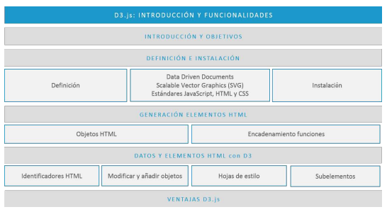

Lo importante es que acabemos este curso siendo capaces de diseñar e implementar
nuestras propias visualizaciones, ya sea desde cero o modificando una existente. En
concreto este tema introducirá los conceptos básicos de D3.js. para ir
profundizando en temas posteriores

> ENLACE
- https://github.com/d3/d3
- https://www.tutorialsteacher.com/d3js/what-is-d3js
- https://www.tutorialsteacher.com/d3js
- https://github.com/NickQiZhu/d3-cookbook
- https://github.com/NickQiZhu/d3-cookbook/tree/master/src => practicas 

**Tipos de graficas que existen**

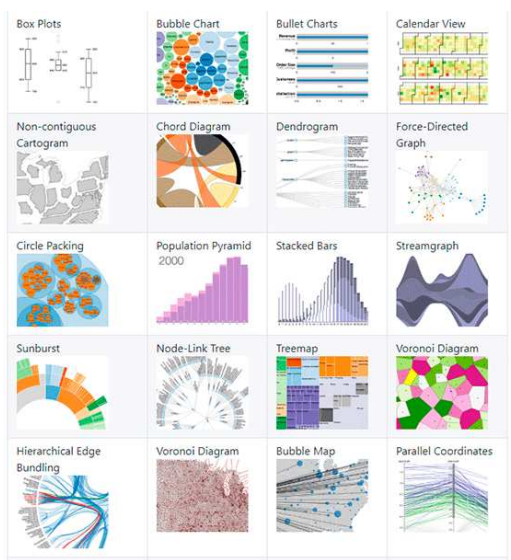

<Puedes aprender cosas nuevas en cualquier momento de tu vida si estás dispuesto a ser un principiante. Si realmente aprendes a que te guste ser un principiante, el mundo entero se abre ante ti>


## 3.2. Definición e instalación

> D3.js (Data-Driven Documents) es una librería JavaScript que utiliza datos digitales para impulsar la creación y control de gráficas dinámicas e interactivas en los navegadores.

**Data driven documents**
Este concepto es bastante importante si lo que estamos pensando es en reutilizar
visualizaciones existentes. Hasta ahora, debíamos adaptar nuestra estructura de
datos a las visualizaciones, mientras que aquí hay algo más de libertad.
Podemos adaptar nuestros datos o bien podemos cambiar la forma en la que D3 está
leyendo los datos y es lo que se denomina documentos orientados a datos. D3 se
creó con la intención de tener control absoluto sobre la visualización.


**Scalable Vector Graphics (SVG).**
No importa dónde mostremos nuestra visualización: pantallas y formatos grandes
como un monitor o soportes más pequeños como los de un móvil. Nuestra
visualización se puede adaptar a diferentes resoluciones.

**Compatible con estándares**
Es compatible con estándares como JavaScript, HTML5 y Cascading Style
Sheets (CSS3), por lo que funciona en diferentes exploradores y diferentes
dispositivos

**Caracteristicas**
- Loading: carga información en la memoria de tu explorador.
- Binding: añade información a elementos existentes en tu HTML, vinculando los datos y los objetos HTML.
- Transforming: es capaz de leer datos y dar una respuesta visual basada en los datos. Para ello puede transformar el código HTML.
- Transitioning: basándose en la entrada del usuario, puede reaccionar y dar una respuesta diferente

**Instalación Dos formas** 

1. Incluir la librería D3 desde nuestro ordenador: descargamos la última versión
disponible en d3js.org a través del fichero d3.zip. Lo descomprimimos y extraemos la
librería, ubicándola en el directorio local que queramos para poder llamarla desde
nuestro código en JavaScript.

2. Incluir la librería D3 desde CDN (Content Delivery Network): enlazamos a la última
versión de la librería con el siguiente código:  (<script src="https://d3js.org/d3.v5.min.js"></script>)


## 3.3. Elementos básicos de D3.js. Generando elementos HTML

La sintaxis de D3 sigue el concepto de encadenamiento o chaining. Se trata de
concatenar varias funciones una seguida de otra, también es habitual utilizarla en
Java


```JavaScript
<html>
<head>
<script language="javascript" type="text/javascript"
src="http://d3js.org/d3.v3.min.js"></script>
<script type="text/javascript">
function draw(){
  d3.select("body").append("p").text("Párrafo nuevo");

  /*
   Misma forma mismo resultado  
  var body = d3.select("body");
  var p = body.append("p");
  p.text("Párrafo nuevo");

  */
}
</script>
</head>
<body onload="draw()">
</body>
</html>


``` 
## 3.4. Trabajando con datos reales y elementos en el HTML


**Modificar elementos HTML y atributos**
```JavaScript
function draw(){
  d3.select("p#target").text("Contenido: ");
  // Establece atributo "descr" con el valor "primer descriptor" en el elemento p
  d3.select("p").attr("descr", "primer_descriptor");
  // Obtiene el atributo "descr" en el elemento p
  d3.select("p#target").text(d3.select("p").text()+d3.select("p").attr("descr"));
}
``` 

**Uso de estilos**
```JavaScript
d3.select("p#target").style("font-size", function(){return"40px";});
```

**Modificar varios elementos HTML al mismo tiempo**

```JavaScript
<html>
<head>
<link rel="stylesheet" type="text/css" href="styles.css"/>
<script language="javascript" type="text/javascript"
src="http://d3js.org/d3.v3.min.js"></script>
<script type="text/javascript">
function draw(){
  d3.selectAll("div").attr("class", "red box");
}
</script>
</head>
<body onload="draw()">
<div></div>
<div></div>
<div></div>
</body>
</html>
```

**Si queremos iterar**
> La función itera sobre los diferentes elementos, siendo d el elemento en sí, es decir, el elemento div referenciado dentro de la función como . Y lo que hacemos es añadir un elemento con el número de la iteración

```JavaScript
d3.selectAll("div").attr("class", "red box")
  .each(function (d, i) {
      //d -> Div 
      //i -> indice 
      d3.select(this).append("h1").text(i);
  });

```

**Subelementos**


```JavaScript

<section id="section1">
<div>
<p>blue box</p>
</div>
</section>
<section id="section2">
<div>
<p>red box</p>
</div>
</section>

d3.select("#section1 > div").attr("class", "caja azul");

// ó 

d3.select("#section2").select("div").attr("class", "caja roja");

```

## 3.5. Ventajas de D3.js


- D3.js es una biblioteca de JavaScript. Por lo tanto, puede ser usada con cualquier marco JS de su elección como Angular.js, React.js, etc…
- D3 se centra en los datos, por lo que es la herramienta más apropiada y especializada para la visualización de datos.
- D3 es de código abierto, te permite trabajar con el código fuente y añadir tus propias características.
- Funciona con estándares web, por lo que no se necesita ninguna otra tecnología o plugin que no sea un navegador para hacer uso de D3.
- D3 trabaja con estándares web como HTML, CSS y SVG, no se requiere ninguna nueva herramienta de aprendizaje o depuración para trabajar en D3.
- D3 proporciona un control completo sobre su visualización para personalizarla de la manera que se desee. Esto le da una ventaja sobre otras herramientas populares como Tableau o QlikView para usos específicos.
- Dado que D3 es ligero y funciona directamente con los estándares web, es extremadamente rápido y funciona bien con grandes conjuntos de datos.

# Tema 4. D3.js. Datos, SVG y gráficas


La gestión de datos es fundamental para modificar futuras visualizaciones de manera ágil, por lo que se recomienda asimilar el contenido sobre estructuras de datos.


## 1. Manejo de Estructuras de Datos (JSON y CSV)

D3 permite trabajar con estructuras de datos externas como CSV y JSON para la creación de visualizaciones.

- Archivos CSV (Comma-separated values):
    - La función utilizada por D3 es d3.csv(),.
    - Esta función acepta dos atributos: la ruta al archivo y una función de callback que se llama solo si el archivo se encuentra,.
    - D3 accede a los valores iterando por las filas y llamando a los datos basándose en las cabeceras del archivo, a diferencia de una matriz de valores tradicional,.

- Archivos JSON:
    - D3 utiliza la función d3.json() para leer ficheros en formato JSON,.
    - Estos archivos permiten estructurar datos, como coordenadas, para ser leídos y procesados por D3,.

Ejercicio 1: Lectura de Archivo CSV (comida.csv)
Este ejemplo ilustra cómo cargar y mostrar los datos de un archivo CSV en el cuerpo del HTML,.
Archivo comida.csv (Ejemplo)
Comida,Preferencia.
Manzana,9.
Huevos fritos,10.
Ensalada,5.
Galleta,2.
Leche,8.

Pasos de implementación:
- 1. Llamar a la función d3.csv(): Se utiliza la función y se le pasa la ruta del archivo ("comida.csv") y una función anónima (el callback) que recibe los datos (data).
- 2. Iterar los datos: Dentro del callback, se usa data.forEach(function(d){...}) para recorrer las filas.
- 3. Acceder a los valores por cabecera: Para imprimir los datos, se accede a los campos por el nombre de la cabecera (ej: d.Comida, d.Preferencia) y se insertan como párrafos en el body del HTML,.

Ejercicio 2: Lectura de Archivo JSON (coordenadas.json)
Este ejemplo es similar al CSV, pero utiliza la función d3.json() para leer un archivo JSON que contiene coordenadas,.
Pasos de implementación:
- 1. Crear el archivo JSON: Contiene una estructura con campos como x_axis, y_axis, radius, etc..
- 2. Llamar a la función d3.json(): Se utiliza d3.json("coordenadas.json", function(data) { ... }).
- 3. Iterar y mostrar: Se usa data.forEach(function(d){...}) para recorrer los elementos y se accede a los valores por el nombre del campo (ej: d.x_axis).
- 2. Generación y Dibujo con SVG

  Se recomienda utilizar elementos SVG (Scalable Vector Graphic) en lugar de elementos div para crear visualizaciones, ya que son más efectivos y aseguran la máxima compatibilidad en distintos dispositivos y navegadores,.
    - Definición: Los elementos SVG se definen dentro del body del HTML.
    - Dimensiones: Siempre se deben especificar los atributos width y height,.
    - Sistema de Coordenadas: La posición (0,0) se ubica en la esquina superior izquierda de la pantalla,.
    - Elementos Gráficos SVG: Incluyen <circle> (círculos, definidos por coordenadas cx, cy y radio r), <rect> (rectángulos, definidos por posición x, y, width y height), <ellipse>, <line> y <text>,,.
    - Estilos: El estilo puede definirse mediante atributos como fill (relleno), stroke (color de la línea), stroke-width (anchura de la línea) u opacity (transparencia),.

- 3. Creación de Gráficas desde Cero

Bar Chart (Gráfico de Barras)
Aunque se puede dibujar con elementos div, el ejemplo se centra en la creación usando SVG. Se utiliza un dataset simple (ej., ).
Pasos de implementación (Usando SVG):
- 1. Definir dimensiones y dataset: Se definen variables para el ancho (w), el alto (h), y se inicializa el array de datos.
- 2. Crear el elemento SVG: Se selecciona el body y se añade el elemento SVG, definiendo sus atributos width y height.
- 3. Generar Rectángulos: Se enlazan los datos con los elementos rect:
- 4. Configurar la posición X y el ancho: Se usa el índice (i) para posicionar cada barra y calcular su ancho, dejando una separación (-1),.
- 5. Corregir la inversión y configurar la posición Y y altura: Dado que el origen (0,0) está arriba, es necesario desplazar la coordenada Y para que el dibujo se alinee en la parte inferior del gráfico, y luego definir la altura,.
- 6. Aplicar estilo (Opcional): Se puede añadir color, incluso un gradiente, basándose en el valor del dato (ej., d * 10).
- 7. Añadir el valor de texto (Opcional): Se añade el elemento <text> usando svg.selectAll("text")... y se configura su posición X e Y para que aparezca encima de la barra.
Scatter Plot (Gráfico de Dispersión)

Este gráfico utiliza círculos en lugar de rectángulos, a partir de un dataset que contiene pares de coordenadas (X, Y).
Pasos de implementación:
- 1. Definir dataset: Se utiliza un array de arrays, donde cada sub-array contiene la coordenada [X, Y] (ej: [,, ...]).
- 2. Generar Círculos: Se enlazan los datos con los elementos circle:
- 3. Configurar la posición y radio:
    - La coordenada X se asigna al atributo cx utilizando el primer valor del sub-array (d).
    - La coordenada Y se asigna al atributo cy utilizando el segundo valor del sub-array (d).
    - Se define un radio (r) fijo para todos los puntos.
- 4. El resultado es un gráfico de dispersión (Scatter Plot) con los puntos ubicados según el dataset.


<div align="left">
  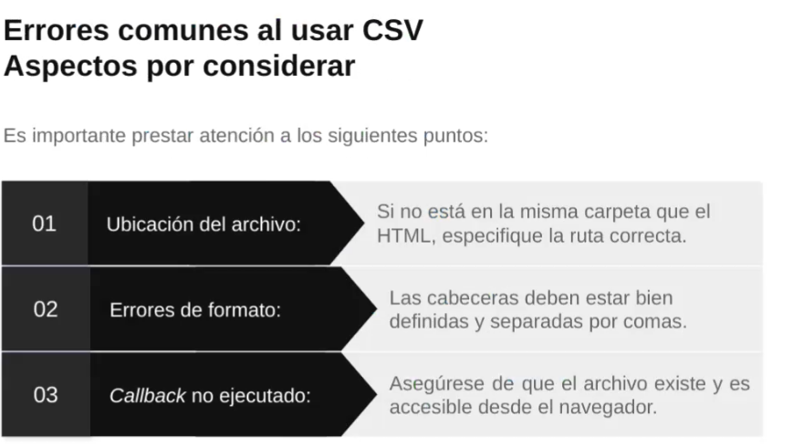
</div>

# Tema 5. D3.js. Escalando y dibujando ejes de un gráfico


<div align="center">
  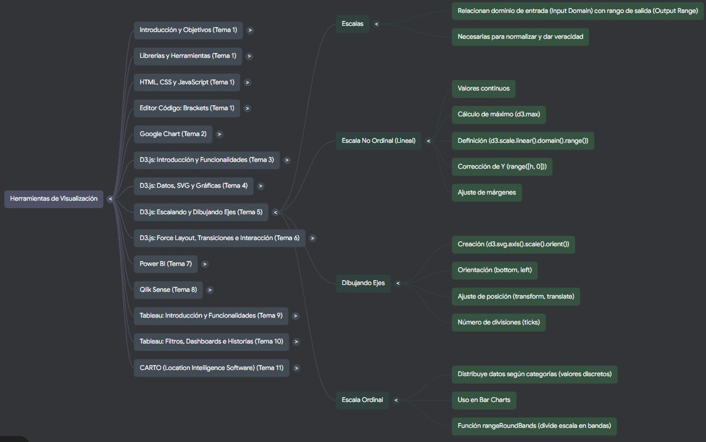
</div>

> Las escalas son funciones que relacionan un dominio de entrada con
un rango de salida» (Coch, 2013)


## 5.2. Escala no ordinal o logarítmica

Conceptos Clave: Escalas (Scaling)
Las escalas son definidas como funciones que establecen una relación entre un dominio de entrada y un rango de salida. Para aplicar estas escalas eficazmente, se manejan dos conceptos fundamentales:

1. Dominio de Entrada (Input Domain): Se refiere a los valores que se tienen como entrada, es decir, la fuente o los datos crudos. Estos valores de entrada no pueden ser limitados.

2. Rango de Salida (Output Range): Se refiere a los límites definidos por el usuario para la presentación visual (por ejemplo, las dimensiones en píxeles). Este rango se elige en función del diseño deseado para la visualización.

El proceso de escalar es comparable a la normalización, que busca distribuir los datos entre los valores de 0 a 1 para que puedan operar en la misma escala.

**Tipos de escalas:**
- Escalas lineales: transforman datos numéricos de manera proporcional. Son ideales para valores continuos.

- Escalas logarítmicas: utilizadas cuando los datos abarcan varios órdenes de magnitud, como en aplicaciones científicas.

- Escalas ordinales: para datos categóricos, asignan valores discretos a categorías específicas.


**Tipos de Escalas en D3.js**

> El tema se concentra principalmente en dos tipos de escalas:


1. Escalas Lineales
Son consideradas las escalas más comunes y las más sencillas de comprender .
    - Creación: Se utilizan mediante la función d3.scale.linear() .
    - Definición del Dominio: Es posible emplear funciones de ayuda como d3.max() para calcular automáticamente el valor máximo del conjunto de datos (dataset), evitando así tener que definirlo manualmente.

> Aspectos Cruciales y Ejemplos de Implementación:
    - Orientación del Eje Y (Inversión): En el formato SVG, el punto de origen (0,0) se ubica en la esquina superior izquierda . Para evitar una inversión visual donde los valores más altos de la variable "y" se muestren en la parte inferior del gráfico, la función de escala del eje Y debe ajustarse invirtiendo el rango . Esto se logra con el formato .range([h, 0]) (donde h representa la altura), asegurando la correcta representación visual .
    - Márgenes: Para evitar que los elementos ubicados en el límite de la visualización se vean cortados, se pueden ajustar los márgenes (marginx, marginy) dentro del rango de salida , .

2. Escalas Ordinales

A diferencia de las escalas lineales, que utilizan una distribución continua, las escalas ordinales distribuyen los datos basados en categorías: 

  - Uso: Se emplean para valores discretos, como categorías de cuestionarios o notas académicas. 
  - Funciones de Apoyo: Estas escalas soportan funciones como rangeRoundBands(), la cual divide la escala en bandas discretas según la longitud del dominio, lo que simplifica los cálculos matemáticos para la creación de gráficos de barras. 

## 5.3. Ejes
Para dibujar los ejes utilizando D3.js, es necesario pasar la escala previamente definida al objeto eje .
- Mecanismo de Creación: Esto se realiza usando, por ejemplo, d3.svg.axis().scale(xScale) .
- Orientación: La posición del eje se define mediante la función .orient("bottom") .
- Dibujo Final: El eje se dibuja finalmente utilizando la función .call(xAxis) dentro de un elemento contenedor .

**¿Cómo funcionan los ejes en D3.js?**

D3.js proporciona una API sencilla para crear y personalizar ejes. Básicamente, se sigue este proceso:

- Crear una escala: se define una escala que mapeará los datos a las coordenadas del gráfico.
- Crear un eje: se crea un objeto de eje, especificando su orientación (superior, inferior, izquierda o derecha) y la escala asociada.
- Añadir el eje al SVG: se agrega el eje al elemento SVG, definiendo su posición y otros atributos visuales.


**¿Por qué son importantes las escalas?**

- Normalización: 	ajustan los datos a un rango específico para una mejor comparación visual.
- Precisión: 	garantizan que las relaciones entre los datos se representen de manera fiel.
- Comunicación	facilitan la interpretación de los datos por parte de la audiencia.


**¿Por qué las escalas ordinales son ideales para gráficos de barras?**

- Categorías discretas: los gráficos de barras suelen representar datos categóricos, donde cada categoría es independiente y no tiene un orden numérico inherente. Las escalas ordinales son perfectas para mapear estas categorías a posiciones específicas en el eje.

- Espaciado uniforme: las funciones como rangeRoundBands en D3.js aseguran que cada categoría tenga un espacio asignado de manera uniforme, evitando superposiciones y mejorando la legibilidad del gráfico.

- Orden personalizado: puedes definir el orden de las categorías en el eje de acuerdo con tus necesidades, lo que te permite resaltar patrones o tendencias específicas en los datos.


<div align="center">
  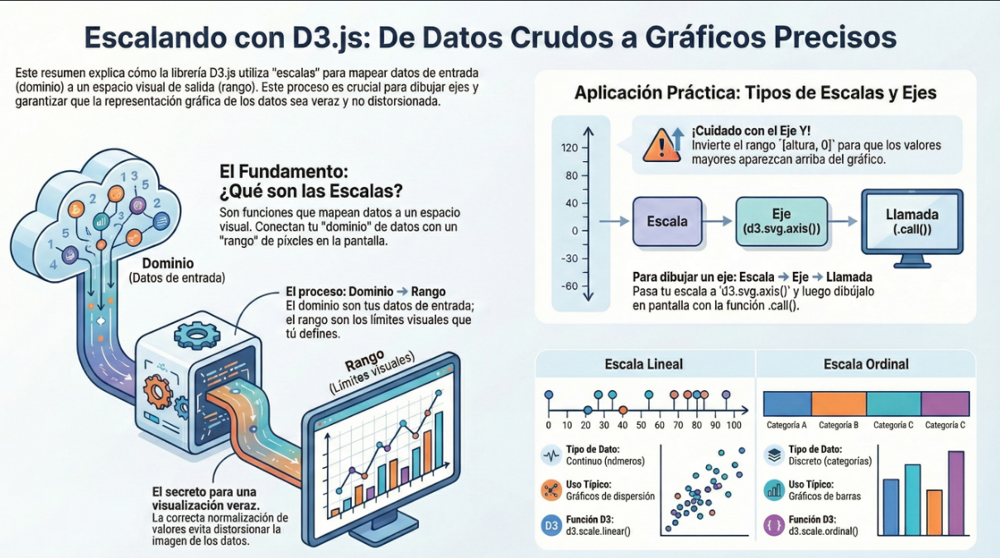
</div>


# Tema 06. Force Layout, transiciones, movimiento e interacción


## 6.5. Añadiendo interacción a los gráficos


El Tema 6 de la Maestría se titula "Force Layout, transiciones, movimiento e interacción", y su enfoque principal es dotar de movimiento e interacción a las visualizaciones de D3, además de dominar los principios básicos comunes a todas sus gráficas,,,,.
Los aspectos clave que se abordan en este tema son:

## 6.2. Force Layout
> Es un modelo visual que está orientado a representar las relaciones entre entidades mediante grafos.  
> Este tipo de gráfica es especialmente útil en el ámbito de las redes sociales para reflejar las conexiones entre diferentes usuarios. 
> Usa una simulación fisica para posicionar los elementos.  

- Algoritmo y Componentes: 
  - El algoritmo principal se define mediante d3.layout.force()
  - Se utiliza para definir tanto los nodos (puntos) como los enlaces (líneas de conexión)

- Ajuste y Adaptación: 
  - El algoritmo se ajusta mediante atributos como charge y linkDistance
  - La función force.on("tick", function() { ... }) se encarga de adaptar los valores del dataset a los requerimientos del algoritmo.

- Interacción Típica: 
  - Es común en este tipo de gráficos permitir al usuario arrastrar los nodos por la pantalla con un simple clic. 

**Elementos claves**
- 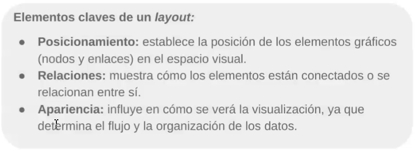

- Posicionamiento
- Relaciones 
- Apariencia:

**Aplicaciones Comunes**
- Redes Sociales. 
- Mapas conceptuales
- Interacciones de grafos en datos complejos 

**Estrcutrura html y pasos**
- 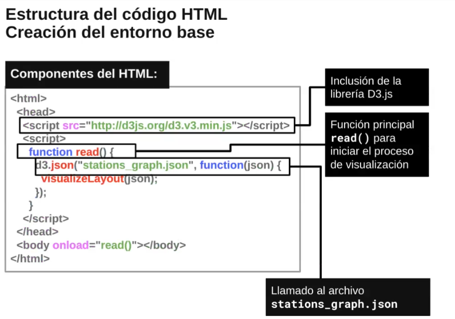
- 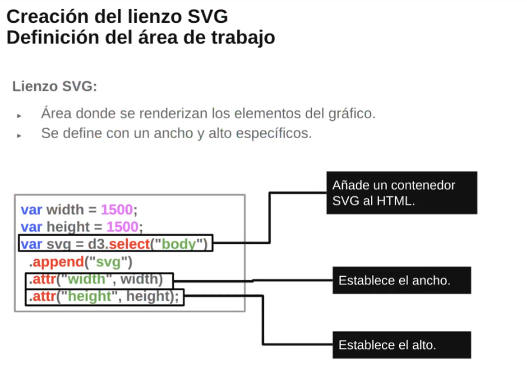
- 
- 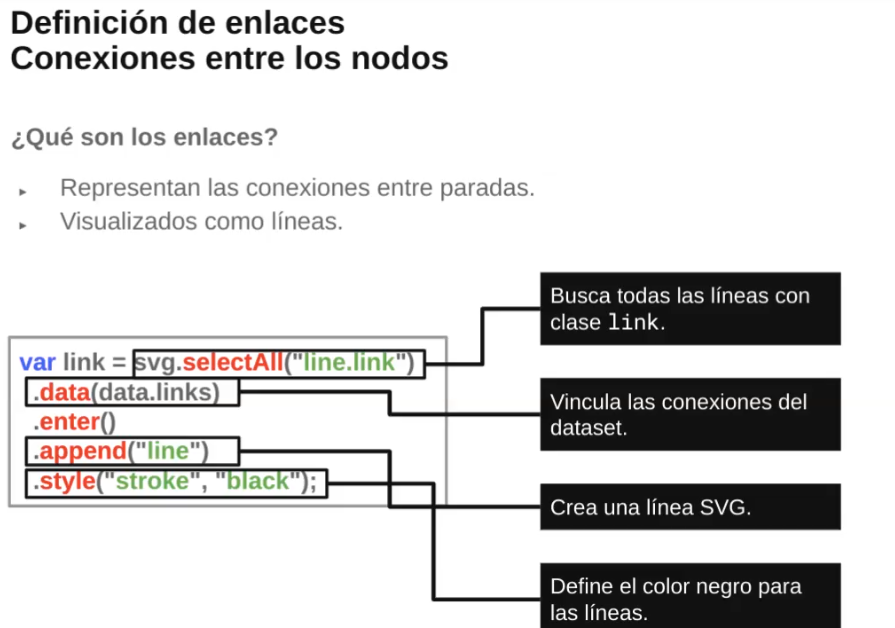
- 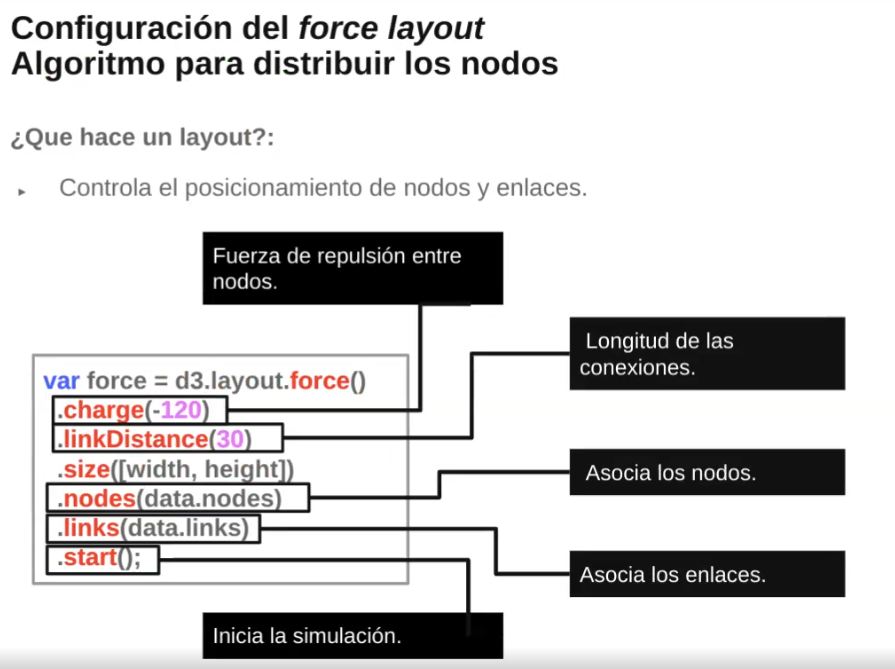
- 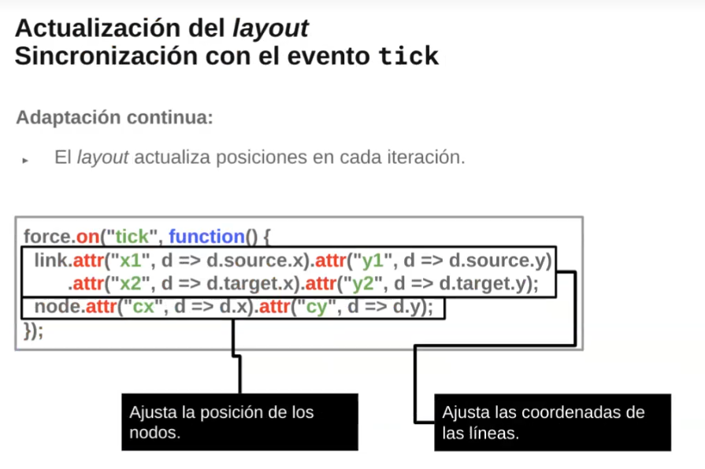
- 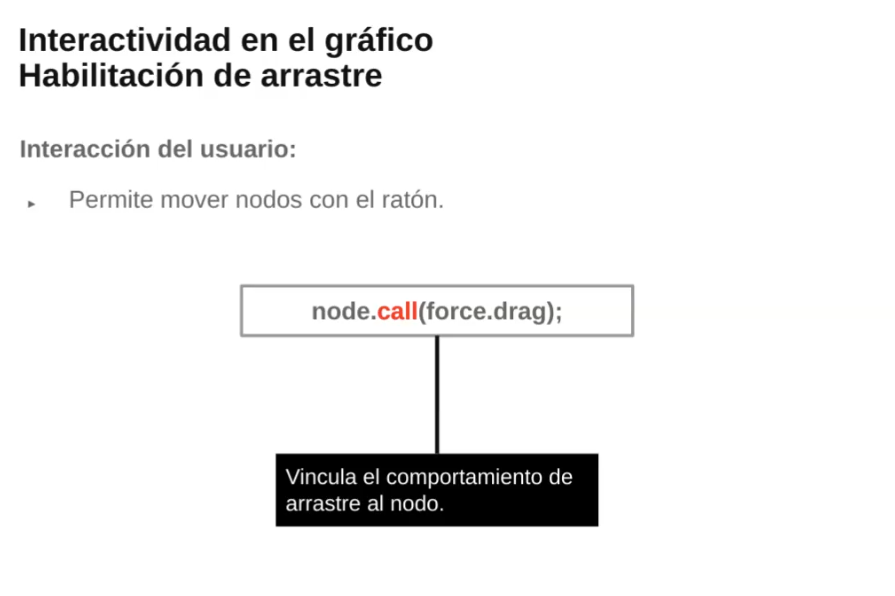


## 6.3. Actualización de gráficos con base en eventos
> Todas las visualizaciones en D3 tienen eventos que pueden ser gestionados fácilmente con unas pocas líneas de código, una vez que se entienden los conceptos básicos,,. > El movimiento es fundamental en las visualizaciones, ya que reflejan ideas y sugieren caminos,.

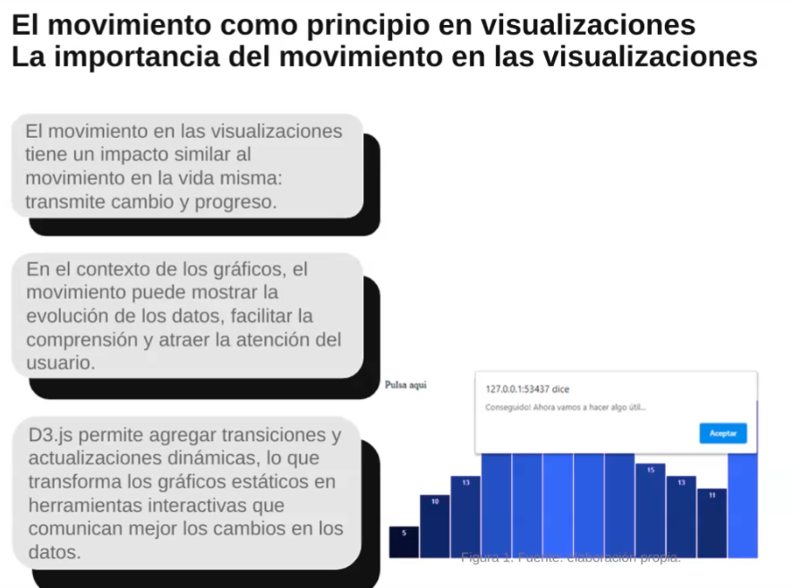

- Generación de Eventos: Cualquier elemento en D3.js puede generar eventos, por ejemplo, usando la función .on("click", function(){...}) para crear una interacción al hacer clic,.
- Actualización Dinámica: Es posible actualizar una gráfica en tiempo real (por ejemplo, con un nuevo dataset) al ocurrir un evento,. Esto implica actualizar los valores de la gráfica y adaptar sus dimensiones y texto al nuevo dataset,,.
- Interacción con Elementos: Se pueden definir interacciones específicas como mostrar el valor de una barra al hacer clic en ella usando alert(d),, o hacer que las barras cambien de color al pasar el ratón por encima (mouseover) y recuperen su color original al salir (mouseout),,.

**PASOS METODICO**
- 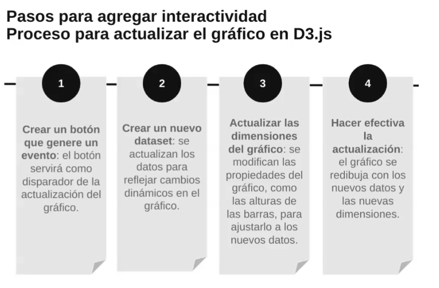


**PASOS TECNICOS**
- PASO 1: 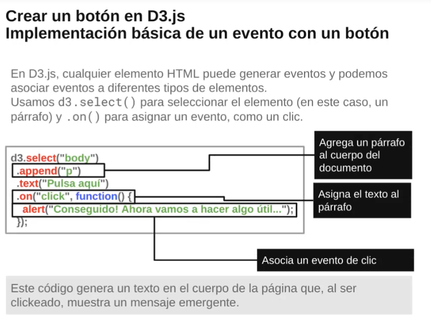
- PASO 2: 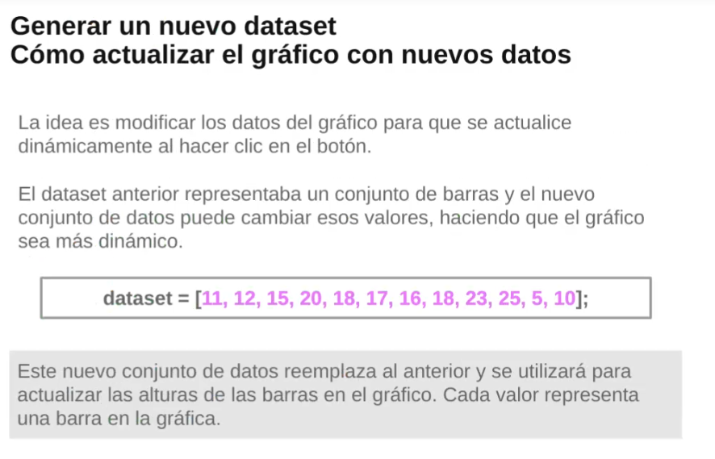
- PASO 3: 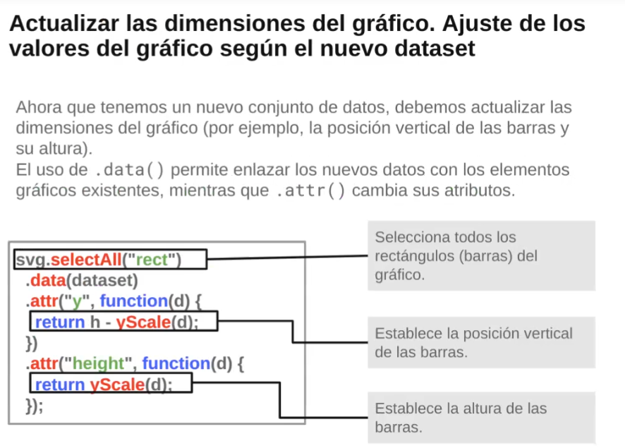
- PASO 4: 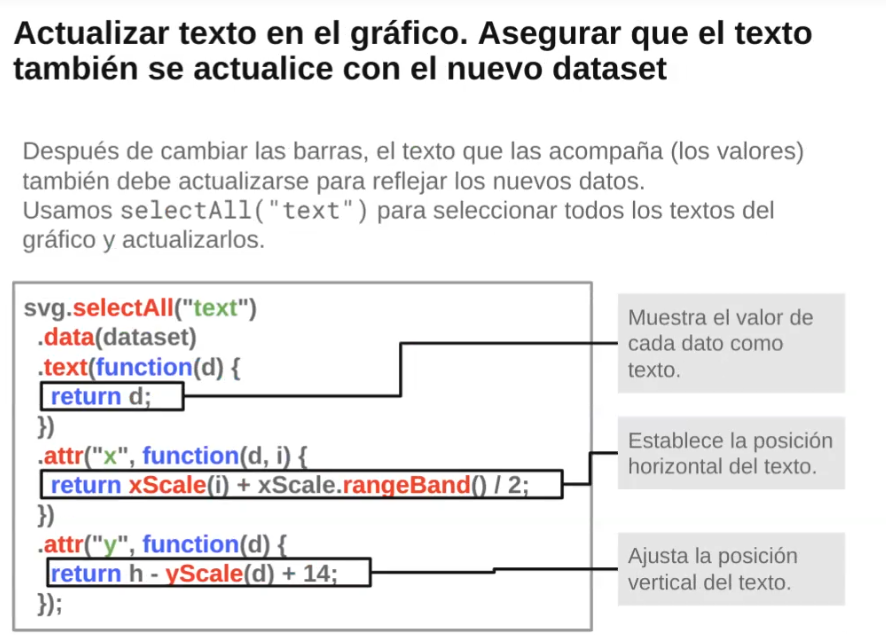
- PASO 5: 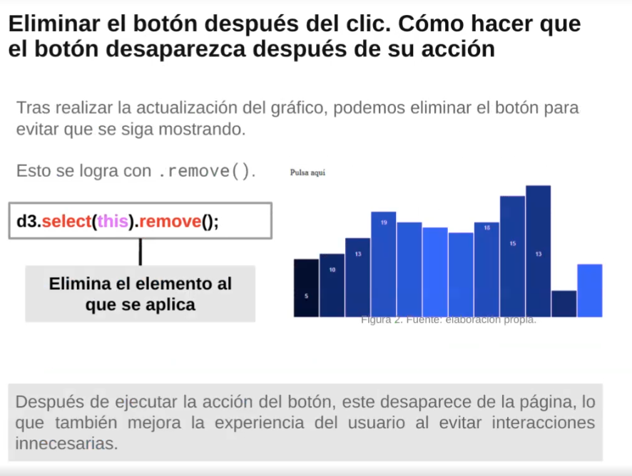
- PASO 6: 
- PASO 7: 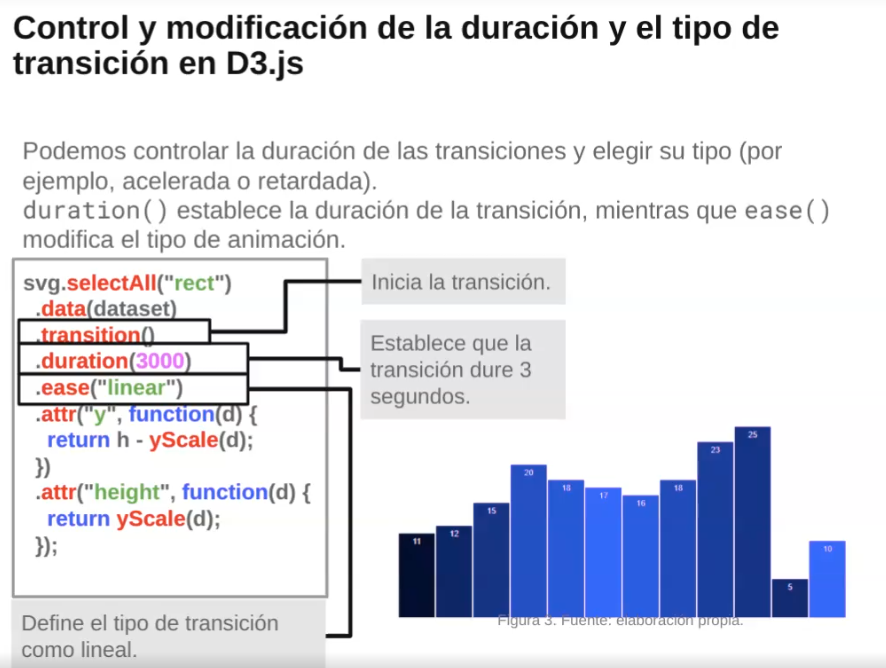

## 6.4. Transiciones y movimiento
Las transiciones son el movimiento que da dinamismo y vida a los objetos del gráfico,.
- Implementación: Se implementan con la simple línea de código transition(),,.
- Control de Duración: Se puede controlar la duración de la animación usando duration(milisegundos),, haciendo que, por ejemplo, una animación dure tres segundos.
- Comportamiento de la Animación: El comportamiento de la animación, como su aceleración o desaceleración, se puede regular con la función ease() (ejemplo: ease("linear")),,.
- Retraso: Es posible retrasar el inicio de la animación con la función delay(),.

**PASOS TECNICO**
- 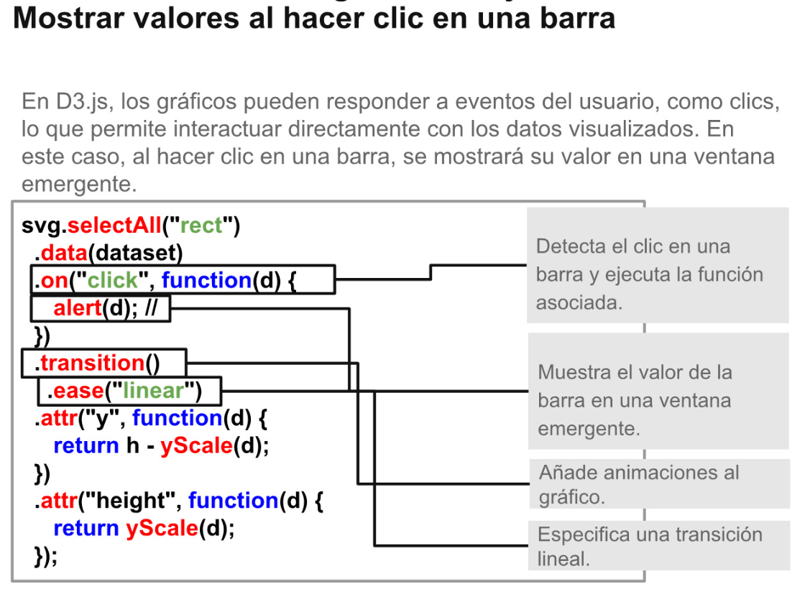
- 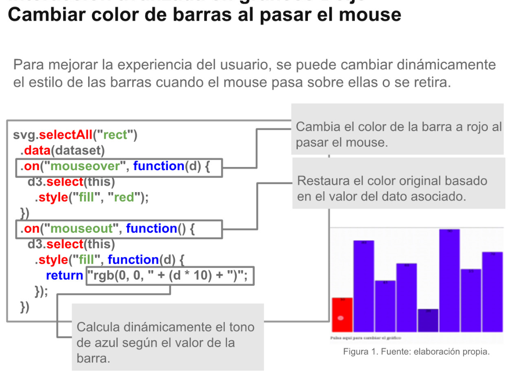

## 6.6. Exportando el resultado a PDF, Bitmaps y SVG

Aunque esta sección no está directamente relacionada con D3.js, el tema aborda la utilidad de exportar el gráfico a diferentes formatos,.
- Formatos Básicos (Baja Calidad): La captura de pantalla (Print Screen o Command ⌘ + Shift + 3 en MAC) genera archivos Bitmap o PNG de baja calidad, y también se puede imprimir a PDF seleccionando el formato en las opciones de impresión,.
- Formato Vectorial (Alta Calidad): La opción más interesante es exportar a SVG,. Esto se logra inspeccionando el elemento en el navegador, copiando el código fuente ubicado entre las etiquetas <svg> ... </svg>,, y guardándolo en un archivo con extensión .svg,. Este formato vectorial permite modificar la imagen y escalarla sin pérdida de calidad en programas como Photoshop,.

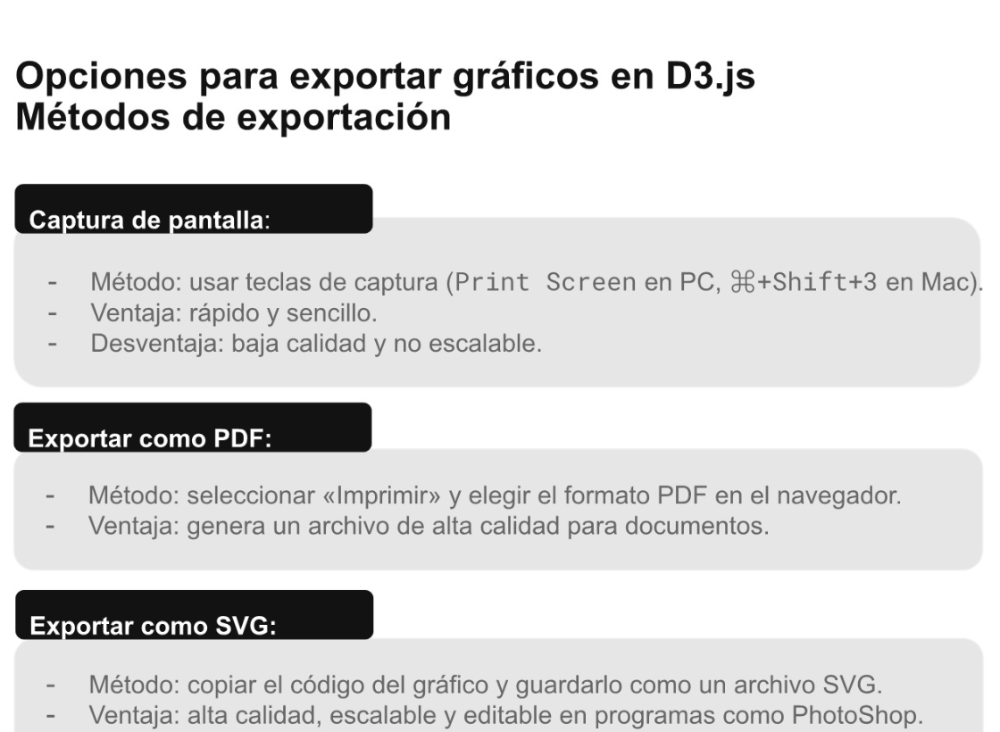


# Tema 07. 


# Tema 08. 


# Tema 09. 


# Tema 10. 

