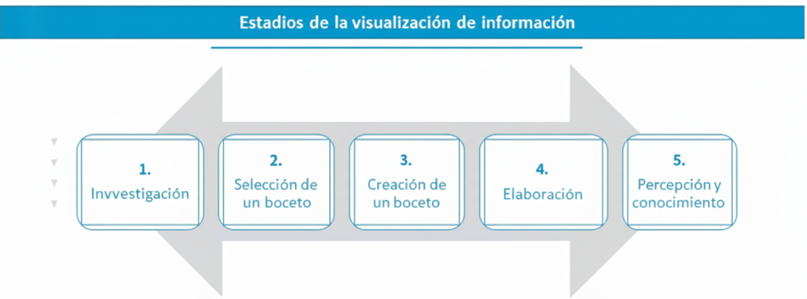
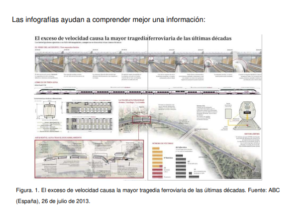
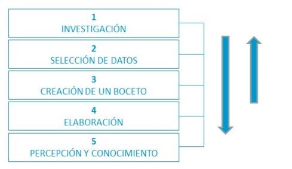

# Visualización Interactiva de la Información

## Tema 01. Introducción a la visualización de datos

## 1.3. Concepto de infografía y visualización de datos

**infografía**

A priori, una infografía sería una manera de representar información a
través de la combinación de gráficos (ilustraciones, diagramas, mapas y
otros recursos) y texto

- 

**una visualización de datos**

Por otro lado, una visualización de datos sería un término
tradicionalmente más cercano a la comunidad científica con el que
referirse a la creación de representaciones visuales (realizadas
informáticamente y normalmente dotadas de interactividad) de datos
abstractos con el fin de que el público pueda analizarlos y ampliar su
conocimiento.

- https://viz.ged-project.de 

Visualización es aquella tecnología plural (esto es, disciplina) que consiste en
transformar datos en información semántica –o en crear las herramientas para que
cualquier persona complete por sí sola dicho proceso- por medio de una sintaxis de
fronteras imprecisas y en constante evolución basada en la conjunción de signos de
naturaleza icónica (figurativos) con otros de naturaleza arbitraria y abstracta (no
figurativos: textos, estadísticas, etc.).»
(Cairo, 2011, p.38)

## 1.4. Importancia de la infografía y la visualización de datos

- Tanto el término infografía como visualización de datos responden a un objetivo
común: ayudar a comprender una información e invitar al análisis y la reflexión
sobre el mismo. De este modo, el público puede descubrir patrones y relaciones
hasta ahora desconocidas

- Uno de los grandes beneficios de la visualización es la cantidad de información pura
que puede ser interpretada en décimas de segundo. 

## 1.5. Estadios de la visualización

Uno de los grandes beneficios de la visualización es la cantidad de información pura
que puede ser interpretada en décimas de segundo. 

> Investigación

Una vez seleccionado el tema sobre la que va a trabajar y realizar la visualización,
comienza el proceso de investigación.
Una buena investigación parte siempre de la búsqueda y recopilación de fuentes de
información sólidas. Es necesario identificar qué fuente o fuentes pueden
proporcionar la información más precisa para elaborar la infografía y para dar
respuesta a la pregunta o preguntas planteadas inicialmente

> Selección de datos

Con el material recopilado, el periodista tendrá que realizar una selección de aquella
información que sea susceptible de formar parte del gráfico. Para ello, organizará la
información de manera que pueda ser transformada en algo fácil de manipular

> Creación de un boceto

Un boceto es un esquema previo a la ejecución de la visualización. Es una
materialización embrionaria de nuestras imágenes mentales, representaciones muy
rápidas, simples y con poco detalle pero que para el periodista visual suponen una
guía orientativa del trabajo

Normalmente el boceto contiene la estructura primaria y algunos apuntes básicos, en
cualquier momento modificables, de lo que será el proyecto visual. En él ubicamos
las partes esenciales que compondrán el trabajo final

> Elaboración

El proceso de elaboración de una visualización da como resultado una
representación en la que mostramos las ideas que ya han sido completamente
desarrolladas. En este estadio los datos son transformados en una representación
comprensible por el público.

> Percepción y conocimiento

El último estadio del proceso de visualización es la percepción y el conocimiento
una vez ha sido publicada en un medio. En el momento en que la retina del ojo humano ve una imagen, el cerebro percibe parte de lo observado e inicia el proceso
cognitivo a través del cual asimila y procesa los datos. 

## Tema 2. Historia de la visualización de datos

## Tema 03. 

## Tema 04. 

## Tema 05. 

## Tema 06. 

## Tema 07. 

## Tema 08. 

## Tema 09. 

## Tema 10. 

