# Visualización Interactiva de la Información

# Tema 01. Introducción a la visualización de datos

**Mapa Copnceptual**

  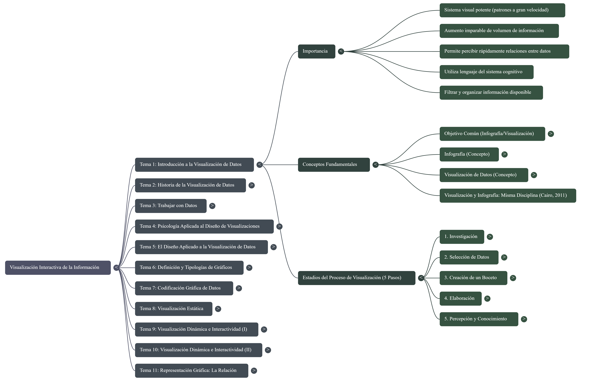

## 1.3. Concepto de infografía y visualización de datos

**infografía**

A priori, una infografía sería una manera de representar información a
través de la combinación de gráficos (ilustraciones, diagramas, mapas y
otros recursos) y texto

- 

**una visualización de datos**

Por otro lado, una visualización de datos sería un término
tradicionalmente más cercano a la comunidad científica con el que
referirse a la creación de representaciones visuales (realizadas
informáticamente y normalmente dotadas de interactividad) de datos
abstractos con el fin de que el público pueda analizarlos y ampliar su
conocimiento.

- https://viz.ged-project.de 

Visualización es aquella tecnología plural (esto es, disciplina) que consiste en
transformar datos en información semántica –o en crear las herramientas para que
cualquier persona complete por sí sola dicho proceso- por medio de una sintaxis de
fronteras imprecisas y en constante evolución basada en la conjunción de signos de
naturaleza icónica (figurativos) con otros de naturaleza arbitraria y abstracta (no
figurativos: textos, estadísticas, etc.).»
(Cairo, 2011, p.38)

## 1.4. Importancia de la infografía y la visualización de datos

- Tanto el término infografía como visualización de datos responden a un objetivo
común: ayudar a comprender una información e invitar al análisis y la reflexión
sobre el mismo. De este modo, el público puede descubrir patrones y relaciones
hasta ahora desconocidas

- Uno de los grandes beneficios de la visualización es la cantidad de información pura
que puede ser interpretada en décimas de segundo. 

## 1.5. Estadios de la visualización

Uno de los grandes beneficios de la visualización es la cantidad de información pura
que puede ser interpretada en décimas de segundo. 

> Investigación

Una vez seleccionado el tema sobre la que va a trabajar y realizar la visualización,
comienza el proceso de investigación.
Una buena investigación parte siempre de la búsqueda y recopilación de fuentes de
información sólidas. Es necesario identificar qué fuente o fuentes pueden
proporcionar la información más precisa para elaborar la infografía y para dar
respuesta a la pregunta o preguntas planteadas inicialmente

> Selección de datos

Con el material recopilado, el periodista tendrá que realizar una selección de aquella
información que sea susceptible de formar parte del gráfico. Para ello, organizará la
información de manera que pueda ser transformada en algo fácil de manipular

> Creación de un boceto

Un boceto es un esquema previo a la ejecución de la visualización. Es una
materialización embrionaria de nuestras imágenes mentales, representaciones muy
rápidas, simples y con poco detalle pero que para el periodista visual suponen una
guía orientativa del trabajo

Normalmente el boceto contiene la estructura primaria y algunos apuntes básicos, en
cualquier momento modificables, de lo que será el proyecto visual. En él ubicamos
las partes esenciales que compondrán el trabajo final

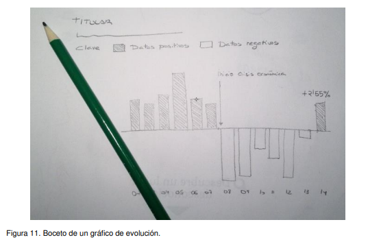

> Elaboración

El proceso de elaboración de una visualización da como resultado una
representación en la que mostramos las ideas que ya han sido completamente
desarrolladas. En este estadio los datos son transformados en una representación
comprensible por el público.

> Percepción y conocimiento

El último estadio del proceso de visualización es la percepción y el conocimiento
una vez ha sido publicada en un medio. En el momento en que la retina del ojo humano ve una imagen, el cerebro percibe parte de lo observado e inicia el proceso
cognitivo a través del cual asimila y procesa los datos. 

# Tema 2. Historia de la visualización de datos

**Mapa Copnceptual**

  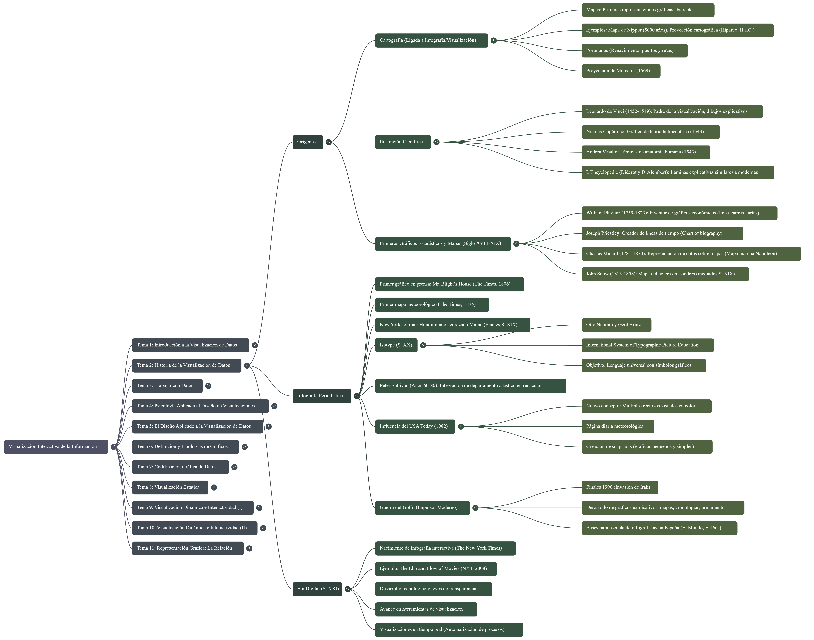

## 2.2. Orígenes de la infografía y la visualización de datos

Hablar de los orígenes de la infografía y la visualización es hablar de los primeros
mapas. La historia de esta disciplina en sus comienzos está totalmente ligada a la
historia de la cartografía

> Un poco de cartografía
Los primeros ejemplos cartográficos datan de hace más de cinco mil años. Uno de
ellos es el mapa de Nippur, la antigua ciudad de Sumeria. Está realizado sobre una
tablilla de arcilla y muestra los principales lugares de la urbe. Todavía se conserva

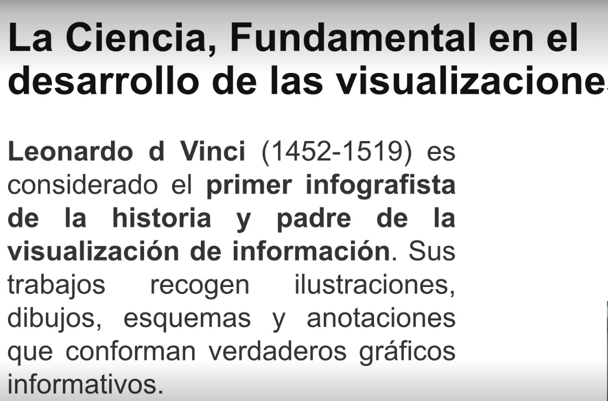

Leonardo d Vinci (1452-1519) es considerado el primer infografista de la historia
y padre de la visualización de información. Sus trabajos recogen ilustraciones,
dibujos, esquemas y anotaciones que conforman verdaderos gráficos informativos.
Su intención no era otra que reflexionar sobre determinadas materias y ampliar sus
conocimientos, objetivo que comparte con nuestra disciplina. 

**Personajes Importantes** 
- Mapa de Nippur
- Geografía de Claudio Ptolomeo,
- Leonardo d Vinci (1452-1519) - El genio (pintor, ingeniero, inventor…) 
- Nicolas Copérnico (1473-1543)
- De Humanis Corporis Fabrica Andrea Vesalio (1514-1564).
- René Descartes, Isaac Newton, Charles Darwin… Infografia Moderna 

**Primeros gráficos y mapas estadísticos**
- William Playfair (1759-1823) The Commercial and
Political Atlas. Su obra destaca por hacer uso de representaciones gráficas para
mostrar información cuantitativa
- Joseph Priestley (1733-1804) fue uno de los creadores de las populares líneas de
tiempo y fuente de inspiración para Playfair
- Charles Minard (1781-1870) -  Este ingeniero francés es conocido por sus representaciones
de datos sobre mapas geográficos.
- 

## 2.3. Introducción a la infografía periodística

- El primer gráfico informativo en prensa al publicado por el diario londinense The Times en 1806. Mr. Blight’s House
- Primer mapa meteorológico también en el diario The Times (1875).
- En el primer cuarto del siglo xx, el filósofo austriaco Otto Neurath (1882-1945) y el
artista gráfico alemán Gerd Arntz desarrollan el Isotype (International System of
Typographic Picture Education).
- Peter Sullivan publicados en The Sunday Times alcanzaron fama mundial
- La influencia del USA Today: introdujo en su dinámica diaria modernos gráficos informativos
- La Guerra del Golfo - A finales de 1990,
- 

## 2.4. Del gráfico impreso a la visualización en tiempo real. La era digital

> La primera década del siglo xxi nos ha dejado magníficos trabajos en el campo de la infografía y la visualización. La creación de la versión digital de las principales cabeceras mundiales trajo consigo el nacimiento de la infografía interactiva, cuyo máximo exponente es The New York Times 

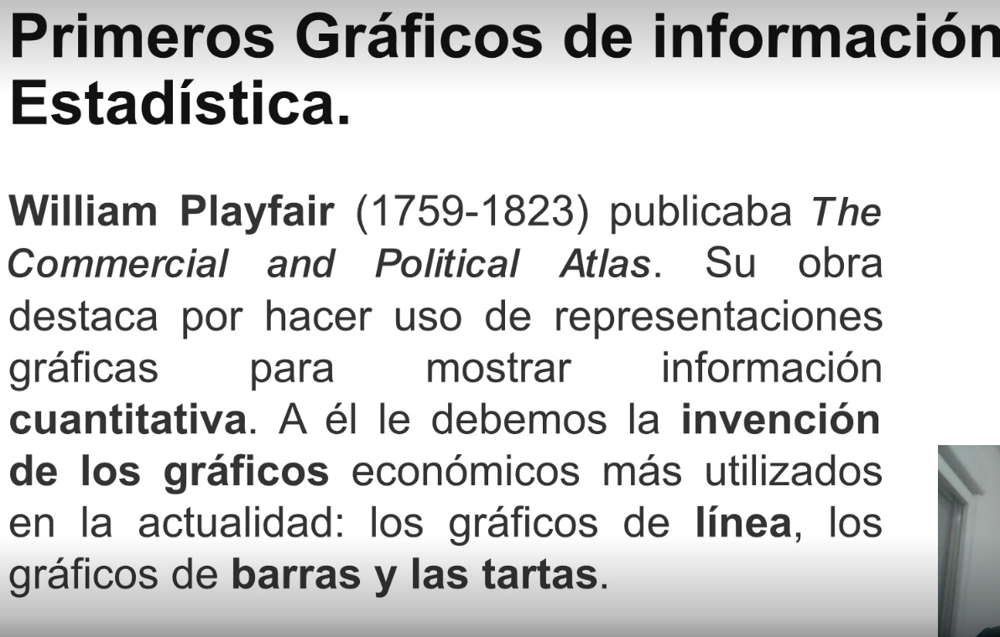

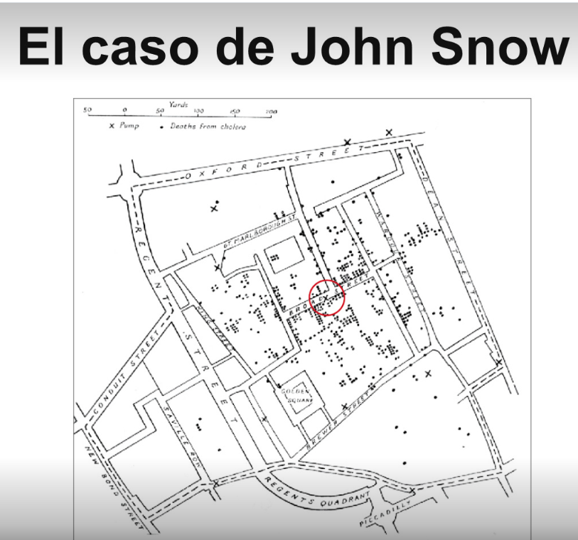

# Tema 3. Trabajar con datos 

**Mapa Copnceptual**

  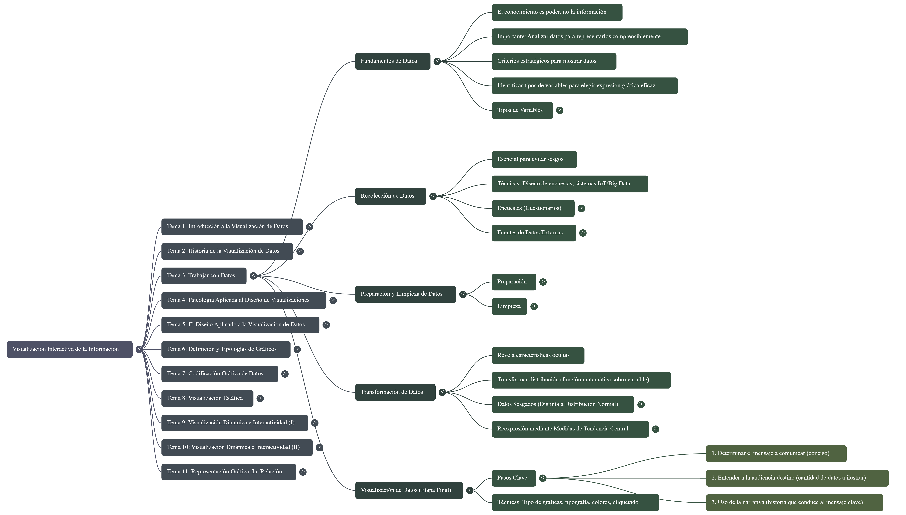

> Una buena encuesta recolecta datos fiables y verificables que nos permitirán realizar afirmaciones concretas

## 3.2. Fundamentos de los datos

• **Información vs. Conocimiento**: Es crucial entender que "el conocimiento es poder, la información no". El volumen abrumador de información disponible (especialmente desde la popularización de Internet) hace que el desafío principal no sea capturar o almacenar datos, sino analizarlos para extraer el conocimiento necesario y representarlo de forma adecuada y comprensible.
• Objetivo Estratégico: Para comunicar una visión gráfica adecuada, los datos deben mostrarse atendiendo a criterios estratégicos, facilitando la comprensión y la toma de decisiones informadas.
• Tipos de Variables: Es imprescindible analizar e identificar los tipos de variables que componen un conjunto de datos, ya que su tipología determina cuál será la expresión gráfica más eficaz. 

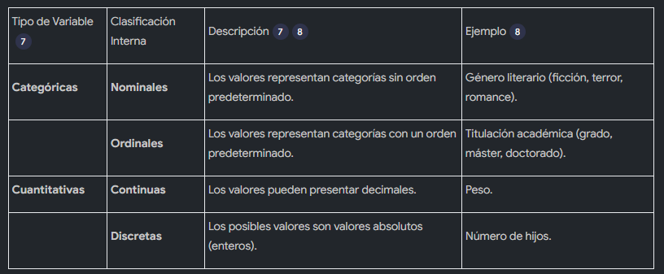

## 3.3. Recolección de datos

• Técnicas de Recolección: Pueden ir desde el correcto diseño de encuestas hasta el uso de sistemas de Big Data y dispositivos de Internet de las Cosas (IoT).

• Cuestionarios: El punto de partida es siempre identificar el propósito. Una buena encuesta recolecta datos fiables y verificables que permiten realizar afirmaciones concretas.

• Usos de una Encuesta: Describir algo, describir cómo se relacionan las cosas, explicar una relación o influenciar sobre algo.

• Preguntas Útiles: ¿Qué deseamos lograr? ¿Qué queremos saber exactamente? ¿Por qué es importante? ¿Hay otra información útil? ¿Es el cuestionario el método adecuado?.

• Motivos Erróneos para Encuestar: Mostrar que tenemos datos sin que importen los resultados, utilizar mal los datos, preocuparse más por la recepción de los hallazgos que por su fiabilidad, o haber predeterminado los resultados.

• Métodos Complementarios: Alternativas o complementos a las encuestas incluyen la medición directa, el grupo focal, la observación y el examen de análisis previos.

• Fuentes de Datos Externas: Se puede trabajar con conjuntos de datos de terceros, que pueden ser:
    ◦ Públicas: Accesibles gracias al movimiento de contenidos abiertos (liberación de datos en pro de la transparencia).
    ◦ Privadas: Acceso especial por estatus o datos comprados con licencia de uso

## 3.4. Preparación y limpieza de datos
• Preparación de Datos: Implica la organización y uniformización para hacer los datos manipulables:
    - Separar campos útiles (ej. dividir direcciones postales).
    - Identificar datos incompletos y vacíos.
    - Uniformizar y realizar conversión de unidades de medida (ej. centímetros y pulgadas)
 
• Limpieza de Datos: Se enfoca en corregir errores e inconsistencias:
    ◦ Identificar datos erróneos o carentes de sentido (ej. un número en un campo de nombre).
    ◦ Eliminar duplicados.
    ◦ Verificar rangos (ej. una temperatura ambiente de 224 ºC en la Tierra).
    ◦ Verificar ortografía y errores tipográficos.
    ◦ Examinar la sintaxis (ej. formato de correos electrónicos)

## 3.5. Transformación de datos

La transformación es un procedimiento clave de manipulación que revela características ocultas en los datos y permite su análisis.

- **Distribución Normal (o Gaussiana)**: Una suposición frecuente en pruebas estadísticas es que los datos tengan una distribución normal (en forma de campana, con datos dispersos alrededor de un valor central). Esta distribución es simétrica, lo que significa que la media, la mediana y la moda coinciden en el punto central. Es fundamental en estadística porque muchos fenómenos naturales y sociales tienden a seguir este patrón, y su conocimiento permite realizar inferencias y predicciones robustas.

    *   **Ejemplos**:
        1.  **Altura de las personas**: Si mides la altura de un gran número de adultos, la mayoría se agrupará alrededor de una altura promedio, con menos individuos muy bajos o muy altos.
        2.  **Puntuaciones de exámenes estandarizados**: En un examen bien diseñado, la mayoría de los estudiantes obtendrán puntuaciones promedio, y habrá menos estudiantes con puntuaciones extremadamente altas o bajas.

    *   **Analogía para memorizar**: Piensa en una **campana**. La parte más alta y ancha de la campana representa la mayoría de los datos (el promedio), mientras que los bordes que se estrechan hacia abajo representan los valores menos frecuentes (los extremos). La forma de la campana es perfectamente simétrica, reflejando cómo los datos se distribuyen equitativamente a ambos lados del centro.

- **Datos Sesgados (Skewed Data)**: A diferencia de la distribución normal simétrica, los datos sesgados presentan una asimetría, donde la "cola" de la distribución se extiende más hacia un lado que hacia el otro. Esto indica que la mayoría de los valores se agrupan en un extremo, mientras que hay menos valores extremos en el otro. El sesgo puede ser positivo (cola a la derecha, la mayoría de los datos están en el lado inferior) o negativo (cola a la izquierda, la mayoría de los datos están en el lado superior). Si los datos están sesgados, se pueden aplicar transformaciones como la logarítmica o la de raíz cuadrada para acercarlos a una distribución más simétrica, lo cual es beneficioso para muchos modelos estadísticos.

    *   **Ejemplos**:
        1.  **Ingresos de la población (Sesgo Positivo/Derecho)**: La mayoría de las personas tienen ingresos medios o bajos, y solo un pequeño número tiene ingresos muy altos. Si graficas esto, la cola se extenderá hacia la derecha (ingresos altos).
        2.  **Tiempo de espera en una cola (Sesgo Positivo/Derecho)**: La mayoría de las personas esperan poco tiempo, pero algunas pueden esperar mucho más debido a circunstancias excepcionales, extendiendo la cola hacia la derecha.
        3.  **Puntuaciones de un examen muy fácil (Sesgo Negativo/Izquierdo)**: La mayoría de los estudiantes obtendrán puntuaciones altas, y solo unos pocos obtendrán puntuaciones bajas, haciendo que la cola se extienda hacia la izquierda (puntuaciones bajas).

    *   **Analogía para memorizar**: Imagina una **rampa o un tobogán**. Si la rampa se inclina hacia la derecha y la mayoría de la gente se agrupa en la parte baja (izquierda) de la rampa, tienes un sesgo positivo. Si la rampa se inclina hacia la izquierda y la mayoría de la gente se agrupa en la parte alta (derecha) de la rampa, tienes un sesgo negativo. La "cola" es la parte extendida de la rampa donde hay menos gente.

- Medidas de Tendencia Central: Resumen una serie de datos en un único valor (media o mediana), lo cual simplifica la realidad. Sin embargo, su desventaja es que este valor único dice muy poco sobre la distribución de los valores resumidos.

| Medida | Palabra Clave | Cuándo usarla |
| :--- | :--- | :--- |
| **Media** | Promedio | Cuando los datos son bastante uniformes y no hay valores extremos locos. |
| **Mediana** | Centro | Cuando hay valores extremos (ej. salarios, precios de casas) que "mienten" en el promedio. |
| **Moda** | Frecuencia | Cuando quieres saber qué es lo más común o popular (ej. talla de camiseta más vendida). |

## 1. Media (Promedio)
**¿Qué es?**
Es el valor que obtendrías si repartieras el total de los datos equitativamente entre todos los elementos. Es la medida más común, pero es sensible a valores extremos (muy altos o muy bajos).

**Fórmula rápida:**
`Suma de todos los valores / Cantidad de valores`

**Ejemplo comprensible:**
Imagina que tú y 4 amigos comparan cuánto dinero traen en la cartera:
- Amigo A: $10
- Amigo B: $15
- Amigo C: $20
- Amigo D: $10
- Tú: $45

**Cálculo:**
1. Suma total: $10 + $15 + $20 + $10 + $45 = $100
2. Dividido entre 5 personas: $100 / 5 = $20

**Resultado:** La media es **$20**. (Aunque tú traías mucho más, el "promedio" del grupo es $20).

---

## 2. Mediana
**¿Qué es?**
Es el valor que se encuentra exactamente en el **centro** de los datos cuando los ordenas de menor a mayor. Divide al grupo en dos partes iguales (50% mayores y 50% menores). Es muy útil cuando hay valores extremos que distorsionan el promedio.

**Cómo encontrarla:**
Ordena los números y elige el del medio.

**Ejemplo comprensible:**
Usando el mismo grupo de amigos y su dinero, ordenamos de menor a mayor:
1. $10
2. $10
3. **$15**  <-- Este es el centro
4. $20
5. $45

**Resultado:** La mediana es **$15**.
*Nota: Si hubiera un número par de datos (ej. 4 personas), se promedian los dos centrales.*

- **Cuarteto de Anscombe**: Este es un conjunto clásico de cuatro conjuntos de datos que, aunque son numéricamente muy similares en sus propiedades estadísticas básicas (media de X, media de Y, varianza de X, varianza de Y, correlación, e incluso la ecuación de la regresión lineal), son visualmente muy diferentes cuando se grafican. Demuestra de manera contundente la importancia de la visualización de datos antes de realizar cualquier análisis estadístico, ya que las métricas resumidas por sí solas pueden ser engañosas y ocultar patrones, valores atípicos o relaciones subyacentes.

    *   **Ejemplos de similitudes estadísticas (para los cuatro conjuntos)**:
        1.  **Media de X**: Aproximadamente 9.00
        2.  **Varianza de X**: Aproximadamente 11.00
        3.  **Media de Y**: Aproximadamente 7.50
        4.  **Varianza de Y**: Aproximadamente 4.12
        5.  **Correlación de Pearson**: Aproximadamente 0.816
        6.  **Ecuación de regresión lineal**: Y = 3.00 + 0.50X

    *   **Ejemplos de diferencias visuales (cuando se grafican)**:
        1.  **Conjunto I**: Muestra una relación lineal simple y positiva.
        2.  **Conjunto II**: Muestra una relación curvilínea, donde la regresión lineal es inapropiada.
        3.  **Conjunto III**: Muestra una relación lineal fuerte, pero con un valor atípico (outlier) que influye significativamente en la línea de regresión.
        4.  **Conjunto IV**: Muestra una relación donde un único punto de datos extremo (punto de apalancamiento) es el único que define la pendiente de la regresión, mientras que los demás puntos tienen el mismo valor de X.

    *   **Analogía para memorizar**: Imagina que tienes cuatro recetas de cocina diferentes, pero todas te piden exactamente la misma cantidad de los mismos ingredientes (ej. 1 taza de harina, 2 huevos, 1/2 taza de azúcar). Si solo leyeras la lista de ingredientes, pensarías que vas a hacer cuatro cosas idénticas. Sin embargo, cuando "visualizas" el resultado final (horneando y viendo el plato terminado), te das cuenta de que una es un pastel, otra es una galleta, otra es un soufflé fallido y la última es una tortilla dulce. La "lista de ingredientes" son las estadísticas resumidas, y el "plato terminado" es la visualización. Sin ver el plato, las similitudes en los ingredientes te engañarían sobre la verdadera naturaleza de cada receta.

## 3.6. Visualización de datos

La etapa final donde los datos se presentan visualmente:
• Determinar el Mensaje: Se debe establecer claramente el mensaje a comunicar. Es útil preguntarse: ¿Qué sé? ¿Qué significa? ¿Por qué es importante? El mensaje clave debe poder resumirse en una frase concisa.

• Audiencia Destino: Es esencial considerar la audiencia para determinar cuáles y cuántos datos se deben ilustrar. Más no siempre es mejor si no apoya el mensaje principal.

• Uso de la Narrativa: Se puede utilizar una narrativa o historia que presente una serie de hechos que conduzcan gradualmente a la audiencia hacia el mensaje clave.

• Ciencia y Arte: La representación visual implica el uso de técnicas como la selección de gráficos (barras, tarta), el uso de tipografía y colores, y el etiquetado.

# Tema 4. Psicología aplicada al diseño de visualizaciones

> Introduce el proceso de percepción visual humana, siendo fundamental para lograr una comunicación gráfica natural y efectiva dirigida al público. 

**Mapa Copnceptual**

  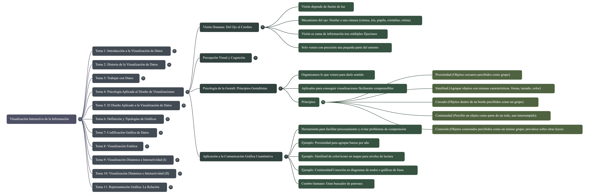

## 4.2. Visión humana. Del ojo al cerebro
> Comprender el proceso de percepción visual es crucial en la comunicación visual, ya que el modo en que el ojo ve,  está íntimamente relacionado con la forma en que representamos gráficamente la información. 

1. Mecanismo del Ojo: El ojo funciona de manera similar a una cámara. La luz, que es la sustancia mediante la cual el hombre da forma e imagina lo que reconoce, atraviesa la córnea, pasa por el iris (que ajusta la pupila para la cantidad adecuada de luz), y el cristalino, proyectándose finalmente sobre la retina.

2. Procesamiento: En la retina, células nerviosas (conos y bastones) absorben la luz y la convierten en impulsos nerviosos que viajan al cerebro, donde las imágenes son percibidas. La fóvea es la parte de la retina responsable de proporcionar la nitidez y el color en la visión.

3. Naturaleza de la Visión: La visión no es un proceso regular; nuestros ojos se fijan y retienen la información en un punto durante un breve tiempo, repitiendo esta acción constantemente. Nuestra visión es la suma de la información obtenida tras múltiples fijaciones, aunque solo vemos con precisión una pequeña parte de lo que nos rodea

## 4.3. Percepción visual y cognición

> Para visualizar información adecuadamente, es esencial comprender nuestras limitaciones y capacidades de percepción visual y cognición

**Tipos de Memoria**

1. Memoria Icónica: Es el almacén donde las señales nerviosas se recogen muy brevemente. Este procesamiento es inconsciente y automático (fase "preatentiva") y ocurre en décimas de segundo. En esta fase se detectan atributos como el color y la localización de los objetos.

2. Memoria a Corto Plazo (Memoria de Trabajo): Aquí, el cerebro selecciona partes específicas de la información que considera útiles (fase "atentiva"). Tiene una capacidad limitada, por lo que la nueva información puede desplazar o eliminar lo que ya está almacenado.

3. Memoria a Largo Plazo: Se accede a ella por procesos de repetición y aprendizaje, con una capacidad de almacenamiento casi ilimitada. Es la que nos permite reconocer y detectar patrones con significado.

**Etapas del Proceso de Percepción y Conocimiento**

> El cerebro lleva a cabo el proceso de percepción y conocimiento en tres etapas:

1. Procesamiento Inicial (Memoria Icónica): Se extraen velozmente las características básicas (color, movimiento, orientación), almacenándose muy brevemente.

2. Percepción de Patrones: Se organiza y clasifica lo visualizado en áreas con las mismas características (color, textura).

3. Reconocimiento: Se da contenido a la información seleccionada. En la memoria a corto plazo, la información visual se relaciona con los conocimientos de la memoria a largo plazo. Si coinciden, se identifica lo que se está viendo.

**Procesamiento Preatentivo**

El procesamiento preatentivo se produce de manera inconsciente y es crucial para el diseño de visualizaciones eficaces. Los atributos preatentivos ayudan a llamar la atención del lector y a sortear las limitaciones de la memoria a corto plazo. Estos atributos, como el color (utilizado en la Figura 3 para destacar el número 8), pueden ser usados para agrupar y resaltar objetos con claridad.

Otros atributos preatentivos incluyen la forma, la orientación, el tamaño, la longitud, y el ancho. Sin embargo, la eficacia de estos atributos tiene límites, ya que el uso de varios a la vez puede provocar el efecto contrario, dificultando la detección de patrones.

## 4.4. Psicología de la Gestalt. Principios gestaltistas

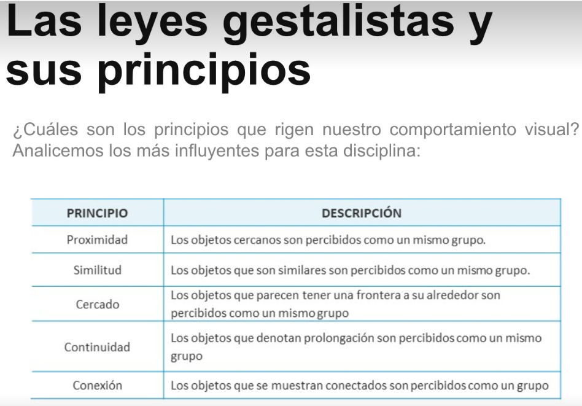

**Psicología de la Gestalt: Principios de Percepción**

La escuela de la Gestalt, fundada por psicólogos alemanes a principios del siglo XX, descubrió que organizamos lo que vemos para darle sentido. Aplicar las leyes gestaltistas a la visualización asegura que sean fácilmente comprensibles.

Los principios más influyentes para el diseño de visualizaciones son:

1. Principio de Proximidad: Los objetos cercanos se perciben como si fueran un grupo, de manera inmediata.

2. Principio de Similitud: Existe una tendencia a agrupar objetos que comparten las mismas características, como forma, tamaño o color.

3. Principio del Cercado (Closure): Los objetos encerrados dentro de un borde o límite se perciben como un grupo.

4. Principio de Continuidad: Se percibe un objeto como parte de un todo, agrupando elementos que denotan continuidad incluso si están interrumpidos.

5. Principio de Conexión: Este principio, propuesto por Rock y Palmer en 1994, establece que los objetos conectados se perciben como miembros de un mismo grupo. La ley de la conexión es muy potente, ya que se impone sobre otras leyes como el color, la forma o la proximidad, y conectar objetos gráficos mediante líneas es un modo muy efectivo de expresar una relación entre ellos.

## 4.5. Aplicación a la comunicación gráfica de información cuantitativa

Los principios gestaltistas son una herramienta esencial para facilitar el procesamiento de la información al lector y evitar problemas de comprensión: 

• El Principio de Proximidad puede usarse en gráficos de barras para configurar grupos por la cercanía entre ellas (ejemplo: agrupar barras por año).
• El Principio de Similitud es útil en mapas, donde las comunidades del mismo color forman un conjunto, o los iconos similares forman un grupo.
• El Principio del Cercado permite destacar grupos de datos, por ejemplo, usando una trama o borde alrededor de un conjunto de barras para asociarlas a una categoría específica (ejemplo: un año).
• El Principio de Continuidad se aplica en diagramas para mostrar relaciones, ya que es más fácil percibir las conexiones si estas son suaves y sin interrupciones.
• El Principio de Conexión es evidente en gráficas de línea, donde los puntos señalados se convierten en una evolución al estar unidos, prevaleciendo la conexión sobre otros atributos como el color y la forma.

En resumen, dado que el cerebro humano es un gran buscador de patrones, presentar la información mediante estructuras que sigan las normas "preatentivas" y los principios de la Gestalt facilita el proceso cognitivo y asegura el éxito de la visualización.

# Tema 5. El diseño aplicado a la visualización de datos

**Mapa Copnceptual**

  

>  El diseño aplicado a la visualización de datos, sentando las bases de los aspectos cruciales del diseño que intervienen en la creación de una infografía.

## 5.2. Tipografía. Eficacia y legibilidad

1. Tipografía: Eficacia y Legibilidad
- La elección de fuentes tipográficas está íntimamente ligada a la claridad del mensaje y es determinante en la forma en que el cerebro percibe la información.
- La selección de la tipografía adecuada debe cumplir con dos premisas: la eficacia y la legibilidad, por lo que se deben elegir tipografías simples y evitar las muy recargadas.

**Las familias tipográficas se dividen en dos tipos principales:**

- Serif o romanas: Muestran remates en sus extremos, los cuales guían la lectura del ojo. Son idóneas para textos largos e impresos.
- Sans serif o de palo seco: No presentan remates, resultando más limpios. Son las más adecuadas para la lectura en pantallas o para la redacción de titulares en prensa.

Para infografías impresas, es preferible escoger fuentes sans serif para mayor claridad, dado que el cuerpo de letra utilizado suele ser pequeño (entre 8,5 y 9,5 puntos). Para soportes digitales, se seleccionan tipografías de palo seco debido a la baja resolución en pantalla, con un cuerpo mínimo de 13 píxeles para asegurar la legibilidad

## 5.3. Color
El color es una herramienta esencial que funciona como un excelente instrumento de categorización, y su buen uso puede lograr que uno o varios elementos destaquen taxativamente sobre el resto.

Existen dos modelos de color principales basados en la salida final de la visualización:

- CMYK: Modelo sustractivo (color pigmento) utilizado para visualizaciones impresas en cuatricromía. De la mezcla de cian, magenta y amarillo se obtiene el negro.
- RGB: Modelo aditivo usado para visualizaciones de salida digital. De la suma de luz roja, verde y azul se obtiene la luz blanca.

El color es un atributo visual "preatentivo" que impacta inmediatamente en el lector. Se utiliza para destacar elementos, jerarquizar objetos y expresar valor, como diferentes tonos de un mismo color que indican mayor o menor valor. Sin embargo, un exceso o mala selección de colores puede dificultar la percepción y la correcta función de la visualización.

**Ejemplo**

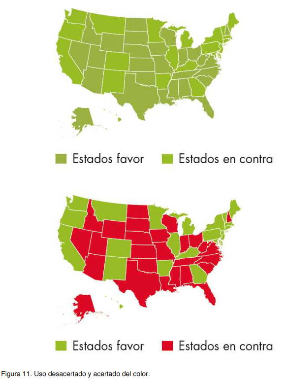

## 5.4. Dimensiones y resolución: milímetros y píxeles

- La dimensión hace referencia al área que ocupará la representación. 
- La unidad de medida varía según el soporte:
    - Visualización impresa: La unidad habitual es el milímetro, y la resolución ideal de la imagen es de aproximadamente 300 ppp (píxeles por pulgada).
    - Visualización digital: La unidad de medida por excelencia es el píxel. Una resolución de 72 ppp es suficiente, lo que evita que se suban elementos muy pesados que dificulten la carga de la información.
    - La resolución es la cantidad de detalle que ofrece la imagen, siendo el número de píxeles existentes por unidad de superficie

## 5.5. Composición gráfica. Uso adecuado del espacio

La organización de la infografía debe guardar un equilibrio y primar la simetría. Los elementos deben encajar respetando los márgenes y manteniendo una relación adecuada entre las zonas "manchadas" y los espacios en blanco. El peso que tenga cada elemento en la composición debe estar estrechamente ligado a su relevancia.

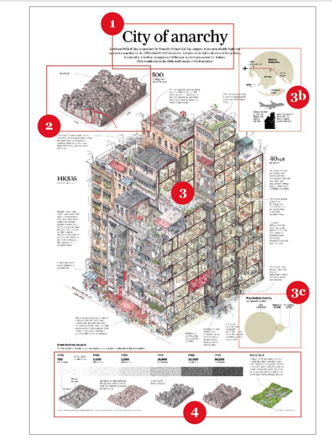

## 5.6. Principales formatos de imagen

Los formatos de imagen se distinguen entre impresos y digitales:
- **Impresos:**
    - TIFF: Ideal para imágenes de elevada resolución, aunque genera archivos pesados.
    - JPEG/JPG: Ofrece visualización aceptable con compresión.
    - EPS: Formato ideal para guardar imágenes vectoriales.

- **Digitales:**
    - JPEG/JPG: El formato más usado para introducir imágenes en la web.
    - PNG: Permite fondos transparentes y es un buen sustituto de JPG.
    - SVG (Scalable Vector Graphic): El formato ideal en la visualización de gráficos interactivos. Su principal ventaja es que las imágenes vectoriales se pueden escalar ilimitadamente sin pérdida de calidad.

## 5.7. Importancia de lo icónico

> Un icono es un signo gráfico que mantiene una relación de semejanza con el objeto representado y son reproducciones simplificadas de objetos o conceptos. El uso de recursos icónicos ayuda a simplificar datos complejos y hacerlos fácilmente comprensibles. La repetición de un icono es un método sencillo para mostrar datos cuantitativos visualmente.

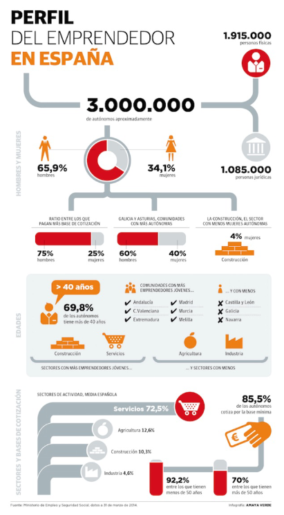

## 5.8. De lo estético a lo funcional en la infografía

En toda visualización, la funcionalidad es el valor primario. Aunque los elementos de diseño tienen una función estética, esta debe entenderse como un valor secundario que complementa y refuerza a la funcionalidad. Es fundamental que las formas gráficas seleccionadas se correspondan con el objetivo final de la visualización. Si se olvida la finalidad última (funcionalidad), se habrá cometido un error.

**Ejemplo Funcional**
> Mal Diseño 
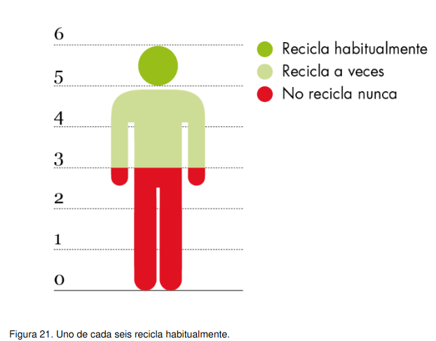

**Ejemplo Funcional**
> Buen Diseño 

# Tema 6. Definición y tipologías de gráficos

**Mapa Copnceptual**

  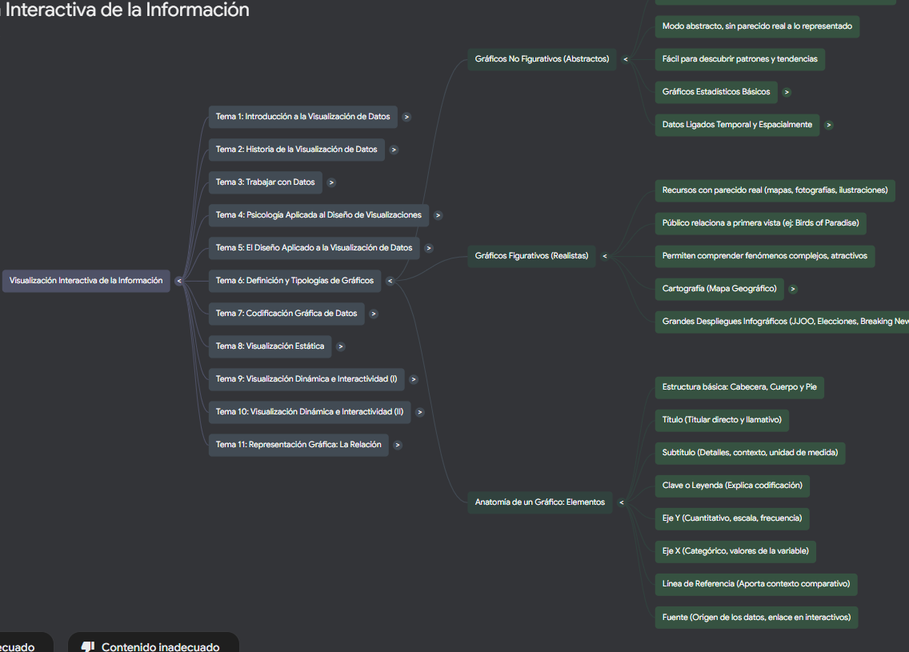

## 6.2. Gráficos no figurativos
- Los gráficos no figurativos son una representación visual de información. Su modo de visualizar los datos es abstracto y no guarda parecido real con lo que se representa, pero son reconocidos por una amplia mayoría de personas.

- Son una forma fácil y sencilla de descubrir y reflejar patrones y tendencias, así como las relaciones que se pueden establecer entre conjuntos de valores cuantitativos.

**Gráficos Estadísticos Básicos**

Los gráficos no figurativos por excelencia son los gráficos estadísticos. William Playfair (1759-1823) es el creador de los tipos de gráficos más utilizados para mostrar información cuantitativa: los gráficos de barras, los gráficos de línea y las tartas.

> **Gráficos de barras**: Son representaciones de datos mediante rectángulos paralelos, donde la extensión (longitud) de la barra es igual al valor reflejado. Se utilizan para realizar comparaciones entre valores, mostrar la evolución en el tiempo (histograma), reflejar rankings, visualizar desviaciones, representar subdivisiones de un valor entero o ver las relaciones entre dos conjuntos de valores. La escala cuantitativa debe acortarse de manera que comience, normalmente, por el valor 0.

**Cuando Usarlas**

- Realizar comparaciones entre valores.
- Mostrar cómo un valor ha ido evolucionando en el tiempo (histograma).
- Reflejar un ranking de valores de mayor a menor o viceversa.
- Visualizar la desviación entre dos conjuntos de valores.
- Representar las subdivisiones de un valor entero.
- Ver las relaciones entre dos conjuntos de valores

**Ejemplo** 

  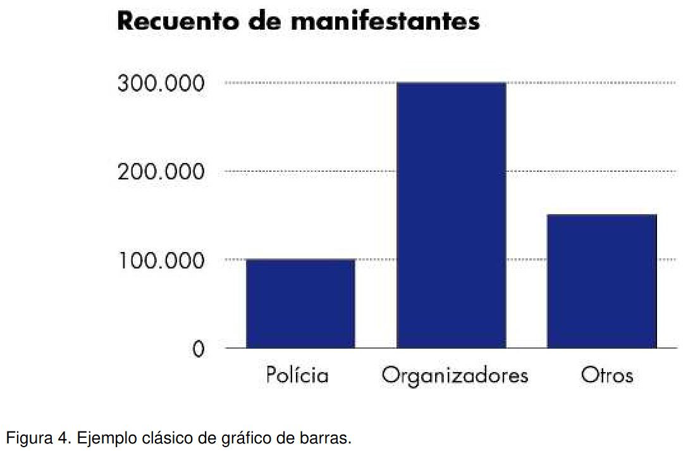

> **Gráficos de línea:** Son representaciones de datos mediante puntos conectados por una línea. Son los más adecuados para mostrar la evolución de un valor cuantitativo a lo largo de una línea temporal. Sus funciones principales son mostrar la evolución de un valor en el tiempo, visualizar la desviación o representar subdivisiones de un valor entero.

**Cuando Usarlas**
- Mostrar cómo un valor ha ido evolucionando en el tiempo.
- Visualizar la desviación entre dos conjuntos de valores.
- Representar las subdivisiones de un valor entero.

**Ejemplo** 

  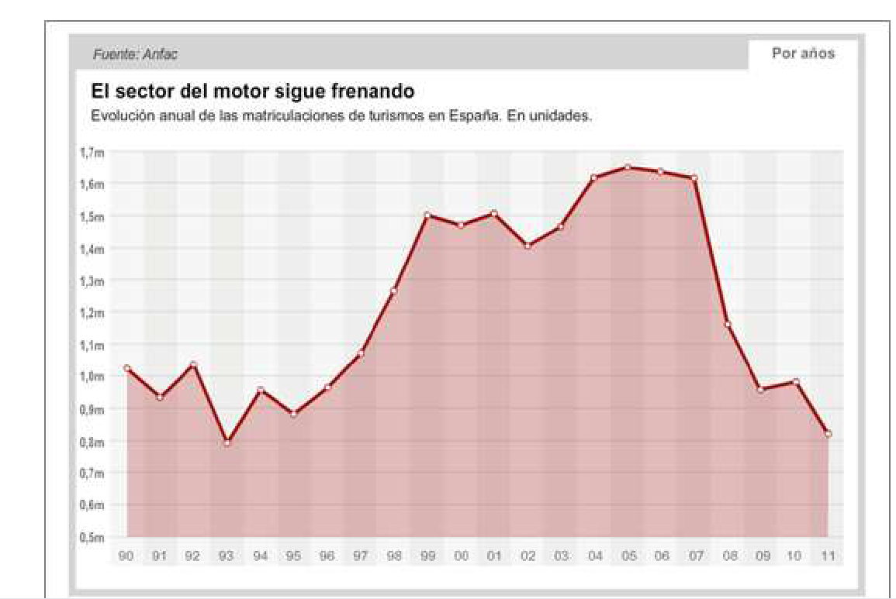

> **Tartas:** Gráficos circulares donde las particiones corresponden a cada parte de un valor total que equivale al 100%. Su función es representar las subdivisiones de un valor entero. Se recomienda, en ocasiones, utilizar un gráfico de barras en su lugar si hay más de cuatro o cinco particiones para una lectura más directa y una mejor comparación.

**Cuando Usarlas**
- Representar las subdivisiones de un valor entero
- Visualizar la desviación entre dos conjuntos de valores.
- Representar las subdivisiones de un valor entero.

**Ejemplo** 

  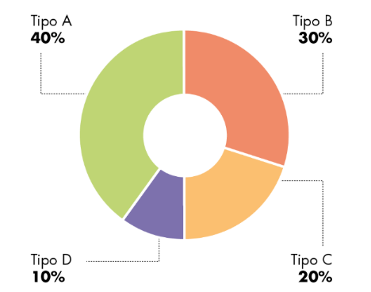

**Cuando se manejan conjuntos de datos con relaciones temporales o espaciales, se utilizan:**

- **Líneas de tiempo:** Representan datos a lo largo de un eje cronológico para identificar la conexión de un dato con un punto temporal y revelar posibles tendencias y patrones.

**Ejemplo** 

  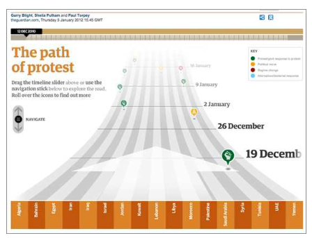

- Mapas de flujo: Representan el movimiento y la conexión existente entre puntos. La relación se establece mediante una línea cuyo ancho es proporcional al valor a representar.

**Ejemplo** 

  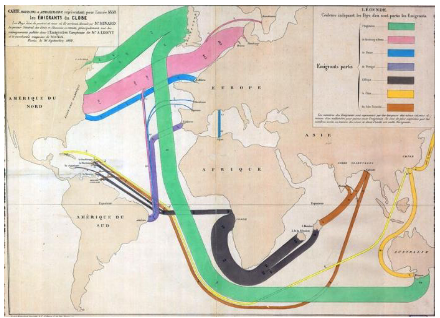

- **Mapas de coropletas:** Modo de representar datos estadísticos acotando áreas (regiones), codificándolas con diferentes colores, gradaciones de un mismo color, formas o texturas. Deben ir acompañados de una clave que especifique la codificación seleccionada

**Ejemplo** 

  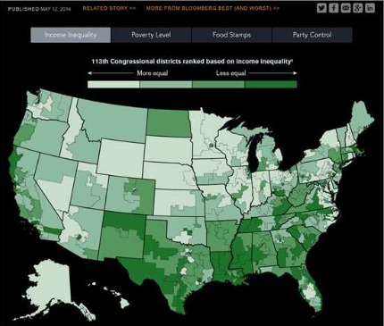

## 6.3. Gráficos figurativos

Los gráficos figurativos muestran la información mediante recursos que guardan parecido real con lo que representan. Estos recursos pueden ser mapas, fotografías o ilustraciones.
Son muy cercanos para el lector y permiten comprender de una manera sencilla fenómenos complejos.
Cartografía

Los mapas son recursos imprescindibles en muchos casos, ya que un mapa geográfico constituye a menudo la escena central de una visualización. Para su elaboración, es importante manejar conceptos como:

- Proyección cartográfica: Representación de la esfera terrestre sobre una superficie plana. La Proyección de Mercator es la más utilizada.

- Escala: Línea recta dividida en partes iguales que sirve de medida para dibujar proporcionadamente las distancias y dimensiones en un mapa o plano.

- Clave o leyenda: Pequeña explicación que especifica a qué corresponde cada código utilizado en la representación.

Grandes Despliegues Infográficos
Se caracterizan por ocupar una extensión mayor y tener un lugar destacado en los periódicos, tanto impresos como digitales. Son trabajos que abordan acontecimientos de fuerte repercusión internacional (como Juegos Olímpicos o elecciones) o información de actualidad inmediata (breaking news), que requieren que los periodistas visuales trabajen contrarreloj. A menudo son fruto del trabajo en equipo.

## 6.4. Anatomía de un gráfico: elementos

Todos los gráficos comparten elementos básicos, cuya estructura general se puede extrapolar a cualquier visualización (cabecera, cuerpo y pie). Los componentes esenciales de un gráfico estadístico son:

| Elemento | Función principal |
| :--- | :--- |
| **Título** | Encabezado directo que llama la atención e introduce el tema. |
| **Subtítulo** | Incluye detalles importantes de contexto, como el periodo de referencia de los datos y la unidad de medida (porcentaje, euros, etc.). |
| **Clave o Leyenda** | Explica el modo en que se ha codificado el gráfico. |
| **Eje Y** | Eje cuantitativo; indica la frecuencia con la que se produce cada valor. |
| **Eje X** | Eje categórico; expresa los valores de la variable. |
| **Línea de referencia** | Aporta información contextual para ayudar a la comparación de datos. |
| **Fuente** | Origen de los datos mostrados, que se incluye en el pie. |

**Ejemplo**

     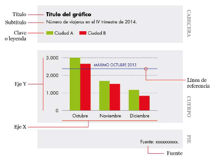

# Tema 7. Codificación gráfica de datos

**Mapa Copnceptual**

  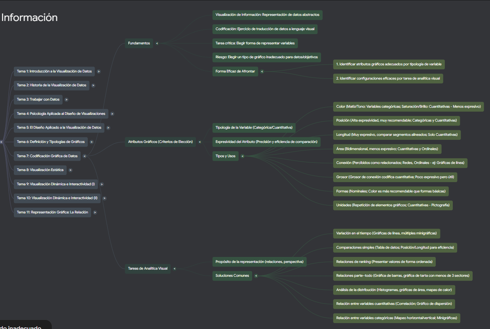

## 7.2. Fundamentos de la codificación gráfica

La codificación gráfica de datos se refiere específicamente a la representación de datos abstractos mediante atributos gráficos básicos como la longitud, la posición, el color o el área.

Esta codificación es fundamentalmente un ejercicio de traducción de los datos a lenguaje visual y constituye la tarea más crítica en el proceso general de visualización.

  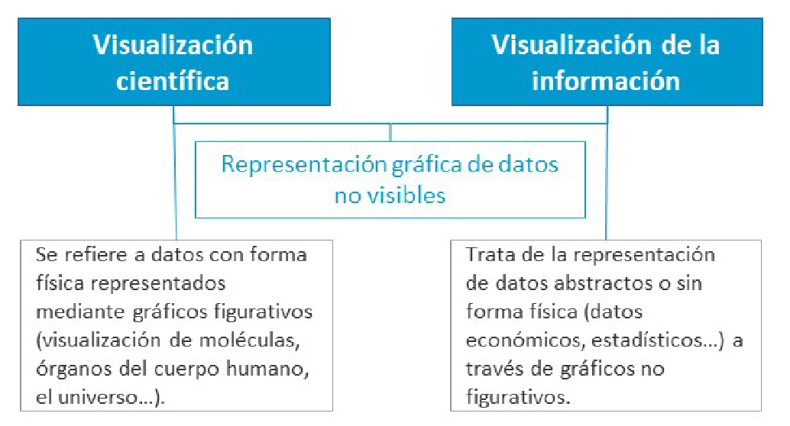

Para una codificación gráfica eficaz, es crucial:

1. Identificar qué atributos gráficos son más adecuados según la tipología de cada variable.
2. Identificar qué configuraciones gráficas serán más eficaces según la tarea de analítica visual que se busque facilitar al usuario.

## 7.3. Atributos gráficos

  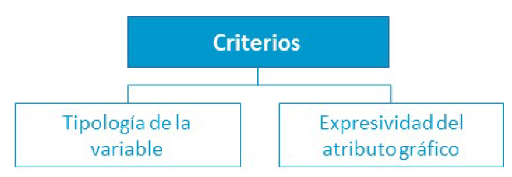

La elección del atributo gráfico se basa en dos criterios esenciales: 

- La tipología de la variable: Existen variables categóricas
(nominales y ordinales) y variables cuantitativas (discretas y continuas). Algunos
atributos gráficos se pueden utilizar para unos tipos de variables, y otros atributos
para otros tipos de variables.

- La expresividad del atributo gráfico: los posibles atributos gráficos presentan
diferentes niveles de expresividad, es decir, permiten al usuario decodificar los
valores representados y realizar comparaciones visuales de forma más o menos
precisa y eficiente. 

**Tipos de Atributos**
- **Color**: El color es un poderoso recurso gráfico que permite destacar visualmente elementos aprovechando su gran capacidad preatentiva, pero también permite expresar y codificar variables y sus valores
  - Puede utilizarse para codificar variables categóricas a través de su matiz o tono
  - Al utilizarlo con variables categóricas debemos asegurarnos de que los diferentes colores escogidos son clara e inequívocamente diferenciables. 
  - Las variables cuantitativas también pueden codificarse mediante la variación de la saturación y brillo de un color. 
  - cualidades preatentivas
  - Gráficos de Pastel 

- **Posición**:  La posición es un atributo gráfico con una alta expresividad,  por tanto muy recomendable. 
  - Podemos estimar visualmente distancias y relaciones entre posiciones en un mismo plano (horizontal o vertical) de forma muy precisa y eficiente. 
  - Podemos usarlas para variables categoricas o cuantitativas. 
  - Gráficos de dispersión 

- **Longitud**: Es un atributo gráfico muy expresivo, siempre y cuando estemos comparando segmentos en un mismo plano (horizontal o vertical) y estén alineados. 
  - Esta mas relacionado con graficos tipo barras ya que por su longitud expresa visualmente la magnitud de un valor.
  - Podemos usarlas para variables cuantitativas. 
  - Gráficos de barras 

- **Área** :el área no es un atributo gráfico unidimensional, sino bidimensional, lo que reduce su expresividad, ya que resulta mucho más sencillo y preciso estimar visualmente diferencias o relaciones de proporción entre dos longitudes o posiciones que entre dos áreas 
  - **NO** es un atributo gráfico que debamos utilizar por defecto 
  - El área puede utilizarse para codificar variables cuantitativas y ordinales, pero no variables nominales
  - Gráficos de burbuja 
  - Gráficos de dispersión 
  - Gráficos de puntos  
  - Gráficos de sectores (Mapas)

- **Conexión**: En visualización de datos la conexión es un atributo gráfico que se suele utilizar para representar estructuras de red, pero también para codificar variables ordinales
  - Trata con las leyes de la Gestalt (principios de la psicología visual) (Poximidad, Similitud, Cercano, Conexión, Continuidad)
  - Nuestra atención visual tiende a seguir instintivamente la dirección espacial que forman estas conexiones.
  - Un malentendido muy extendido es creer que las gráficas de línea solo se pueden utilizar con variables temporales tambien aplica con nominales.
  - Gráficos de red 
  - Gráficos de línea

- **Grosor**: está muy relacionado con el de conexión, ya que se refiere al grosor de dichas conexiones como medio para codificar una variable cuantitativa adicional. 
  - Atributo gráfico muy poco expresivo
  - Es una forma útil para enriquecer con información cuantitativa adicional
  - Un Ejemplo de grafo en el que las conexiones varían de grosor en base a los valores de una variable cuantitativa asociada
  - Gráficos de red
  
- **Formas**: Otro atributo gráfico con el que podemos codificar variables nominales son las formas, que pueden ser básicas o complejas. 
  - La variable nominal no debería tener demasiados valores o categorías diferentes. 
  - Se recomienda que no sean más de diez.
  - En términos generales, el color, por sus cualidades preatentivas, resulta más recomendable que el uso de formas básicas
  - No obstante, forma y color pueden utilizarse conjuntamente en una misma representación gráfica para codificar variables diferentes. 
  - Gráficos de Formas (área)

- **Unidades**: para representar variables cuantitativas es la repetición de unidades o elementos gráficos. Cada elemento puede equivaler a una unidad de la variable cuantitativa codificada, o a un número determinado de ellas, que se indicará en la leyenda correspondiente. 
  - Utilizar formas complejas figurativas como elementos gráficos da lugar a lo que se conoce como gráfica de pictogramas o pictografía. 
  - Lo correcto es representar la variable cuantitativa mediante la repetición de las forma. 
  - Gráficos con pictogramas
  
## 7.4. Tareas de analítica visual 

> La idoneidad de una solución gráfica de visualización no solo estará determinada por la expresividad y adecuación de los atributos gráficos utilizados para codificar cada una de las variables, **sino también por el propósito de esta representación**: 

**Se Formula algunas interrogantes para determinar su propósito**: 
- ¿Qué tareas de analítica visual pretende facilitar?
- ¿Qué tipo de relaciones entre las variables representadas permite analizar?
- ¿Cuál es la perspectiva visual que ofrece de los datos?
- ¿Encaja esta perspectiva con los objetivos y necesidades de sus usuarios?

**TAREAS**

- **Variación en el tiempo**: 
  - Son tareas para analizar los cambios o variaciones de una o más variables a lo largo del tiempo.
  - Permite identificar tendencias, ciclos, patrones y excepciones. 
  - Se puede usar animaciones para esos casos que requieran mostrar la evolución de datos a lo largo del tiempo. 
  - Si no se decea usar animaciones, podemos usar small multiples ó minigraficos multiples.   
  - **Solución**: graficas lineales, gráficos de formas. 
  

**Ejemplo**

  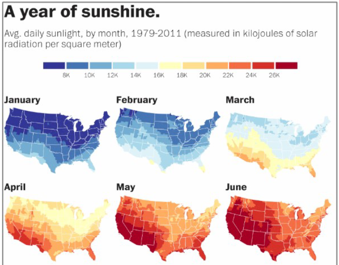

- **Comparaciones simples**
  - La tarea más básica que puede soportar una representación gráfica es la comparación simple entre pares de valores. 
  - Uso de gráficos altamente expresivos.   
  - **Solución**: graficas barras.
**Ejemplo**

  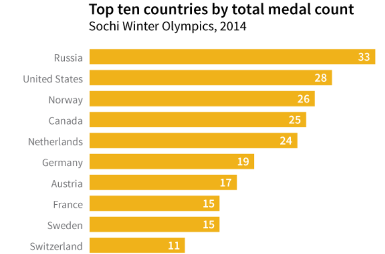

- **Relaciones de ranking**
  - Una tarea muy relacionada con las comparaciones simples es la de poder identificar eficientemente posiciones de ranking entre valores. 
  - La solución en estos casos es tan sencilla como presentar los diferentes valores, o su representación gráfica de forma ordenada.   
  - **Solución**: graficas barraS
**Ejemplo**

  

- **Relaciones parte–todo**
  - ¿Qué proporción del total representa un valor concreto? Esta es una pregunta a laque suele ofrecerse respuesta gráfica en forma de gráfica de tarta. 
  - La solución en estos casos es tan sencilla como presentar los diferentes valores, o su representación gráfica de forma ordenada. 
  - Se disminuye la eficacian si existe mas de 2 categorias en la gréfica de pastel.
  - Cuando existen muchas muchas categorias, como alternativa podemos usar barras solo hay que pasar el valor original a porcentuales 
  - **Solución**: gráficos de pastel. Caso Excepcional Barras 
**Ejemplo**

  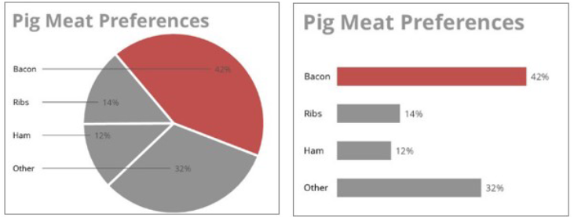

- **Relación entre variables cuantitativas**
  - Este tipo de relación se denomina correlación, cuyos componentes son la fuerza (fuerte o débil), el sentido (positiva o negativa) y la forma (lineal o curva). 
  - **Solución**: gráfico de dispersión
**Ejemplo**

  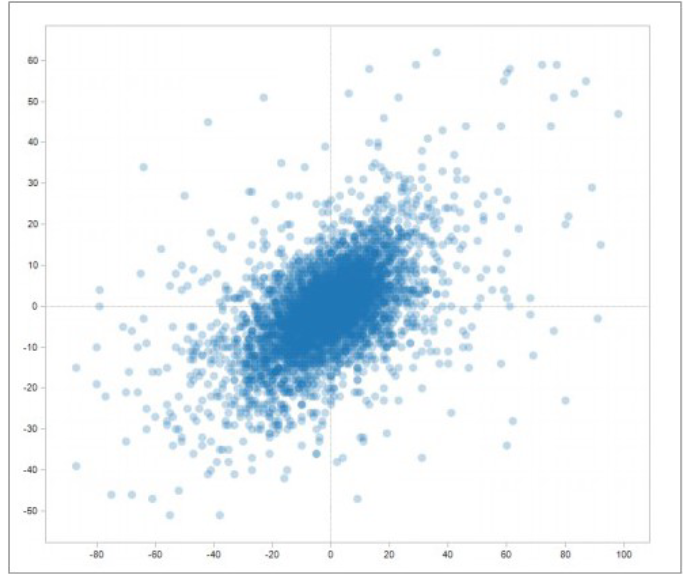

- **Relación entre variables categóricas**
  - Resolver esta tarea de analítica visual implica visualizar cómo dos (o más) variables categóricas se relacionan entre sí a partir de su relación compartida con una o más variables cuantitativas 
  - **Solución**: minigráficas
**Ejemplo**

  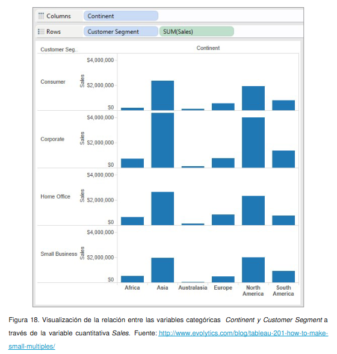

**Analogía para Solidificar la Comprensión**

Piense en la codificación gráfica de datos como si fuera una caja de herramientas de un artesano, donde cada herramienta (atributo gráfico) tiene un propósito específico y una eficacia probada:
• La Posición y la Longitud son como el calibrador o la regla de precisión: son las herramientas más fiables para medir y comparar valores con exactitud.
• El Área es como usar una regla de plástico flexible: puede funcionar, pero la medición será menos precisa y se deforma fácilmente con valores irregulares.
• El Color es como la pintura de advertencia: es excelente para llamar la atención inmediata (preatentiva) y para separar grupos (categorías), pero es terrible para medir cantidades exactas (cuánto más brillante es 25 que 20).
• La Conexión es como un hilo conductor: une elementos para contar una historia secuencial (ordinal) o estructural (red), imponiéndose sobre las diferencias individuales.

# Tema 8. Visualización estática

## 8.2. Concepto
## 8.3. Formatos de salida
## 8.4. Principales herramientas. Adobe Illustrator

# Tema 09. 

# Tema 10. 

