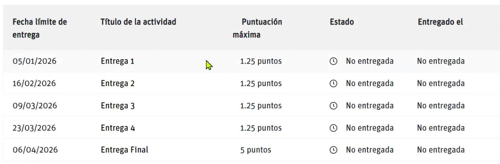
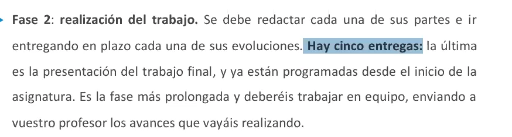
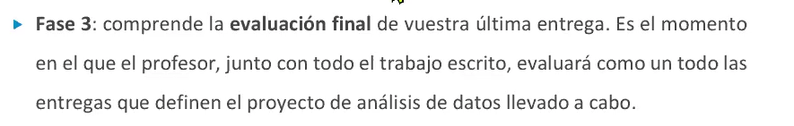
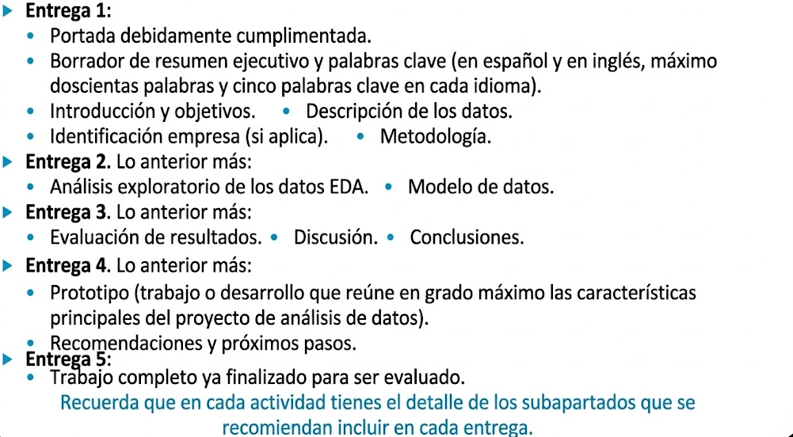
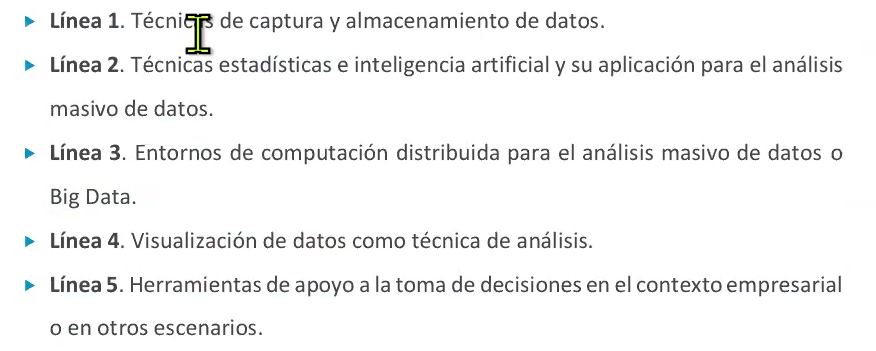

# SEMINARIO de Innovación en Análisis y Visualización de Datos (MEXAVM) - Noviembre 2025 3Q

**PUNTOS**
- SI ES UNA ESPECIE DE TESIS 
- SOLO QUE LA ENTREGA ES UN VIDEO Y EL PDF 
- CONSTA DE 6 FASES 
- ES UN FLUJO DE TRABAJO QUE SE DEBE REALIZAR EN FASES 
- HAY CINCO ENTREGAS FINALES 
- TODO SE VA ACUMULANDO POR FASES 
- EL PDF DEBE TEBER MAS DE 50 Y 120 PAGINAS 
- SE DEBE REALIZAR CADA ENTREGA EN UNA FECHA DETERMINADA 
- VIDEO MENOS DE 15 MINUTOS 

**PREGUNTAS**
- ¿CUANDO ES EL TIEMPO DE ENTREGA DE CADA FASE? 
- Respuesta: 

## FASE 0 
- LEER LAS REGLAS 
- VALIDAR LAS REGLAS 

## FASE 1 : 05 ENERO 2026 
- CREAR EL EQUIPO DE TRABAJO 
- ELEGIR EL TEMA A DESARROLAR 
    - (TIENE QUE SER UN TEMA SE PUEDA APLICAR LO APRENDIDO EN LA MAESTRIA) 
    - HAY LIBERTAD PARA ESCOGER 
    - SE RECOMIENDA USAR DATOS DE LA EMPRESA PARA GENERAR UNA HERRAMIENTA QUE APOYE EN EL TRABAJO
    - SE NECESITA QUE RESUELVA UN PROBLEMA REAL 

## FASE 2 : 16 ENERO 2026 
- CREAR Y REALIZAR EL TRABAJO
- 

## FASE 3 :  29 MARZO 2026 
- Elaboración final de última entrega 
- se evalua como un todo todas las entregas 
- 

## FASE 4 : 23 MARZO 2026 
- Desarrollo del prototipo funcional 
- la entrega es realizar una presentación video mostrando los resultados y los conocimientos adquiridos 
- lo bueno no debe ser presencial es grabar presentación + video + pdf + proyecto funcional 

## FASE 5 : 13 ABRIL 2026 
- trabajo final 
- presentación final 
- video 
- prototipo 

**ESQUEMA**
- 

**importante**
- 