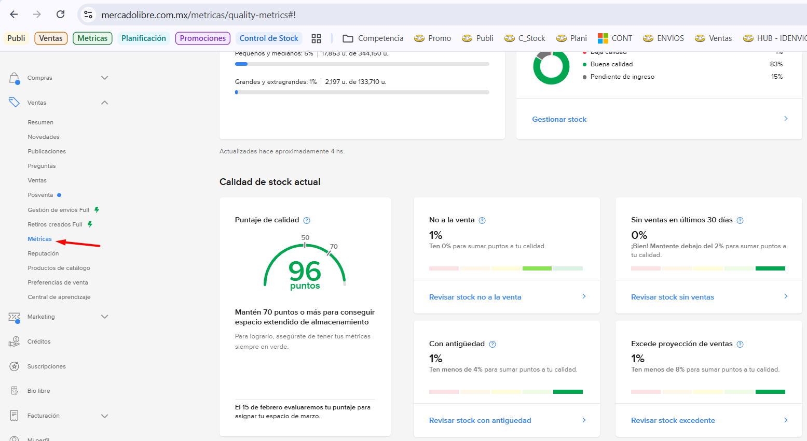
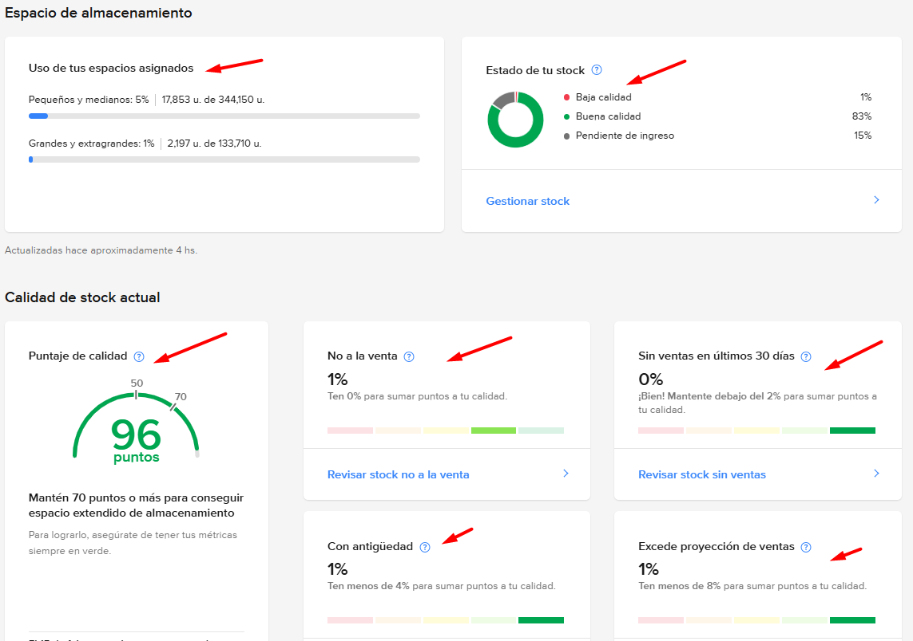
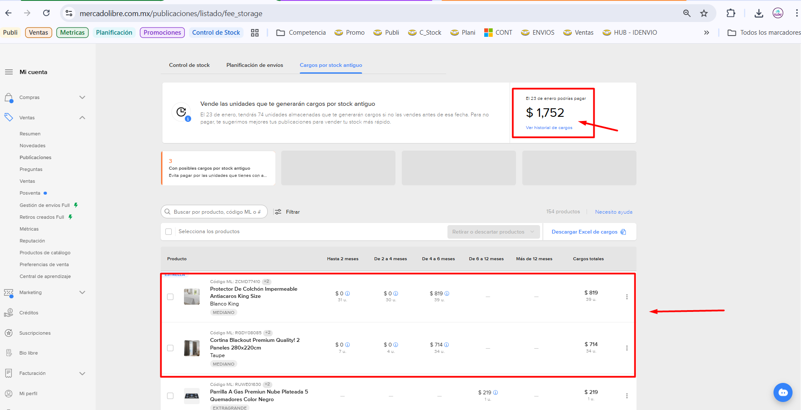

# Manual de Evaluación de Métricas de Stock

> Este manual tiene como objetivo guiar en la validación y monitoreo de los niveles de stock. Nos basamos en la validación de la gráfica en forma de aguja; es crucial evitar que este indicador **NO** baje del 30%, ya que esto afectaría la reputación de la marca y disminuiría los valores de credibilidad.

## 1. Acceso a las Métricas

Para acceder al panel de métricas, siga estos pasos:

1.  **Menú Principal**: En el menú del lado izquierdo de la pantalla, haga clic en **Métricas**.
    

2.  **Visualización del Gráfico**: En la parte central de la pantalla se desplegará un gráfico que mide los niveles actuales. Si existe algún problema, el sistema lo indicará mediante un porcentaje.
    

## 2. Interpretación de Indicadores

Al evaluar las métricas, se deben validar los siguientes puntos clave:

*   **Uso de espacios asignados**: Es fundamental validar este punto, ya que sin espacio disponible no será posible ingresar nuevos envíos *Full*.
*   **Estado del Stock**: Resumen rápido que permite evaluar la salud del inventario. Indica el porcentaje de productos con:
    *   Baja calidad
    *   Buena calidad
    *   Pendiente de ingreso
*   **Puntaje de Calidad**: Gráfica crítica que evalúa el puntaje general de calidad de la cuenta.
*   **No a la Venta**: Mide la cantidad de productos que actualmente no están disponibles para la venta.
*   **Sin ventas en últimos 30 Días**: Indica los productos que no han registrado ventas en el último mes.
*   **Con antigüedad**: Señala los productos que no se han vendido en más de 4 semanas.
*   **Excede proyección de ventas**: Valida el excedente de productos en el almacén en relación con la proyección de ventas.

## Enlaces para consultar Metricas:
*   [Métricas de Calidad - Mercado Libre](https://www.mercadolibre.com.mx/metricas/quality-metrics#!)

## 3. Cargos por Stock Antiguo

> Esta sección permite evaluar los cargos generados por stock antiguo. Indica aquellos productos que no se han logrado vender en más de 4 semanas y los montos a pagar por concepto de multa por no cumplir con el plazo. El objetivo es reducir este valor final, aprovechando el mes de plazo para maximizar las ventas.

### Pasos para consultar cargos:

1.  Acceda a la ruta: **Publicaciones > Gestión de stock Full > Cargos por stock antiguo**.
2.  Visualice el detalle de los cargos y productos afectados:
    

3.  **Puntos a visualizar**:
    *   **Fecha de vencimiento**: Es necesario monitorear constantemente la fecha límite de los productos para evitar cargos, tal como se muestra en la imagen.

## Enlaces para consultar cargos:
*   [Métricas de Calidad - Mercado Libre](https://www.mercadolibre.com.mx/publicaciones/listado/fee_storage)