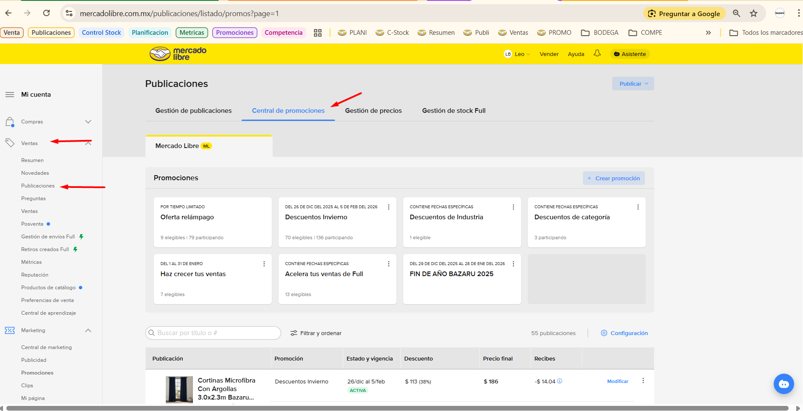
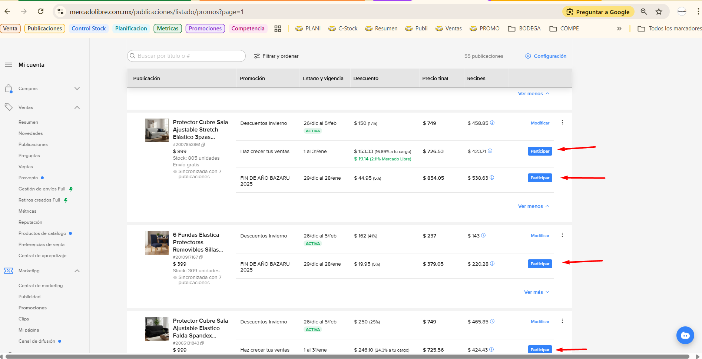
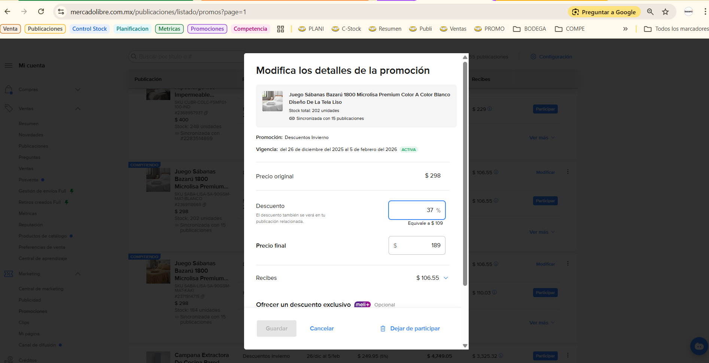
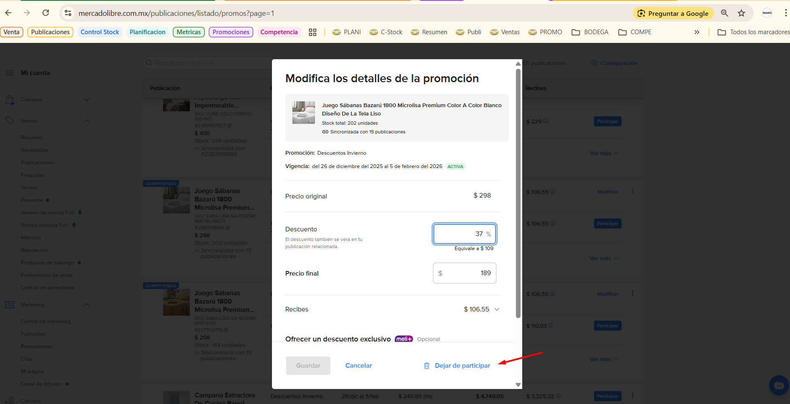
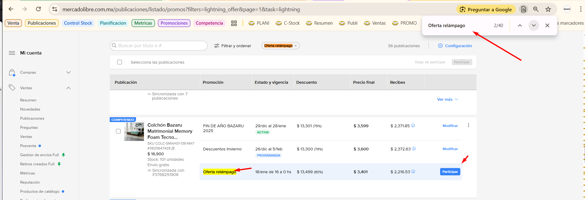
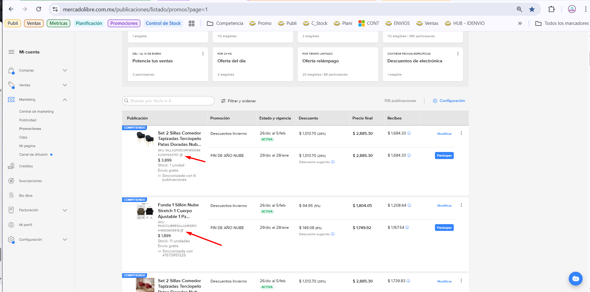
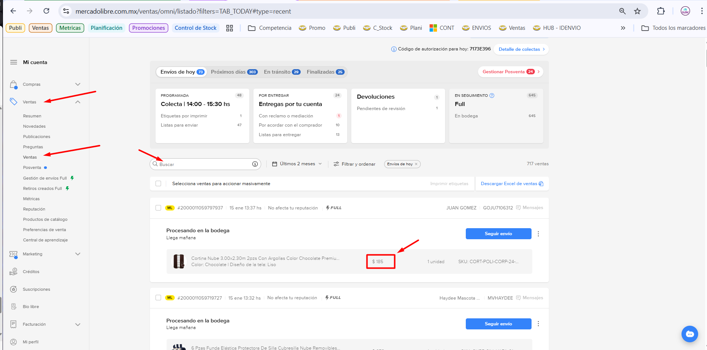

# Manual de Validación de Promociones  

> Propósito: Proporcionar una guía clara para la validación, programación y monitoreo de ofertas en Mercado Libre, garantizando que cada publicación cuente con los precios y campañas autorizados. 

## Objetivos 
* Asegurar la cobertura: Verificar que cada publicación elegible tenga asignada una Oferta Relámpago o Campaña.

* Garantizar la exactitud: Validar que los precios programados coincidan con los autorizados por supervisión.

* Control de exclusiones: Identificar productos que, por estrategia, no deben participar en promociones (ej. mobiliario de alto volumen como el Pack de Sillas Plegables).

## Requisitos y Pasos Previos
> Antes de iniciar la programación en la plataforma, es obligatorio cumplir con lo siguiente:

* Validación de Precios: Confirmar que los precios de Campaña, Relámpago y Extra estén autorizados por el supervisor. Sin el precio correcto, el sistema podría rechazar la oferta o afectar el margen de utilidad.

* Consulta de Exclusiones: Revisar el grupo de WhatsApp o los comentarios del supervisor para identificar productos que deben permanecer sin oferta programada.

## Pasos 

- **Paso 1**: Acceso a la Central de Promociones
    - En el menú lateral izquierdo, dirígete a Ventas > Publicaciones.
    - En el menú superior (debajo del banner principal), selecciona Central de Promociones.
    - Se desplegará el listado completo de tus publicaciones activas.
    -  

- **Paso 2**: Activación de ofertas de Campañas, Relampago y ofertas Especiales  
    - **Programación de Relampagos**: Ubica el botón azul de acción. Al dar clic, podrás gestionar los bloques de horas disponibles. Debes activar el botón y seleccionar cada bloque programado según la estrategia del día.
    - **Programación de Campañas**: Sigue el mismo procedimiento utilizando el botón azul para adherir la publicación a la campaña vigente.
    -  

- **Paso 3**: Validación de Precios y Confirmación 
    - Al accionar el botón azul, se abrirá una ventana emergente con el **precio final y el porcentaje de descuento**.
    - **Verificación Crucial**: Cruza esta información con tu lista de precios autorizados. 
    - Luego de dar clic al boton azul, se levantara una ventana emergente indicando el precio y porcentaje de la oferta, se debe validar que sea el correcto y si es asi se debe dar clic en **guardar**
    -    

- **Paso 4**: Correcciones y Validación Final 
    - En caso de equivocarnos si aun no se cumple la hora de activación, podemos dar clic en la palabra **Modificar** levantará una ventana emergente y en la parte inferior ubicar el boton **"Dejar de participar"**   
    -  

- **Paso 5**: Validación de la programación 
    - Un tip para validar nos podemos apoyar con el buscador del navegador (Ctrl + F) y buscar la palabra **"Oferta relámpago"**
    - Como lo indica la imagen se muestra el boton azul de acción, esto indica que la oferta **NO** se encuentra programada correctamente.  
    -  

## Auditoría e Historial de Ofertas

> Podemos tambien validar el historial de ofertas de una publicación en especifico, para ello debemos seguir los siguientes pasos: 

- **Paso 1**: Podemos iniciar busncado la id de la publicación en la sección de promociones o publicaciones se indica en la siguiente imagen: 
    - 

- **Paso 2**: Podemos validar usando la ID de la publicación este mostrara el historial de ventas del producto. podemos acceder dando clic en el menu lateral izqueirdo en Ventas/ventas, como lo indica la imagen. 
    - 
    