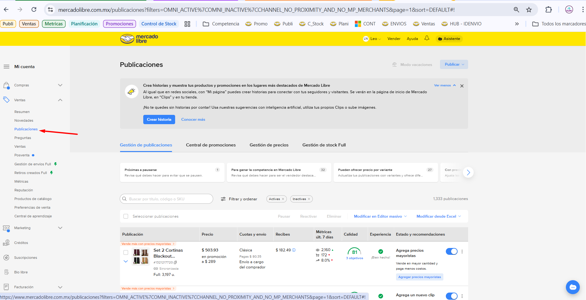
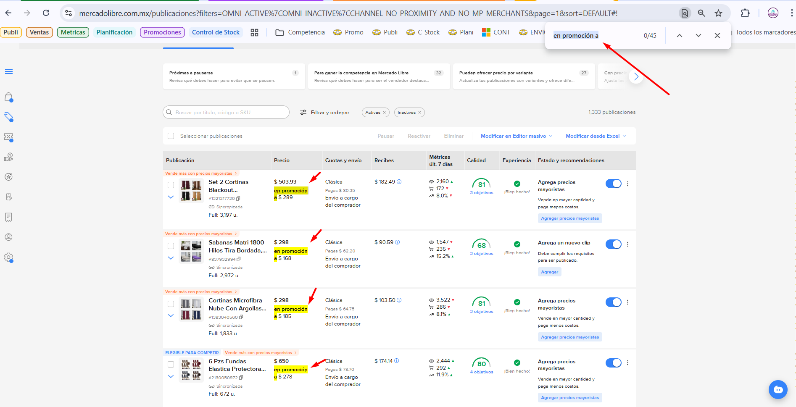

# Manual de Validación de Publicaciones

> Este manual tiene como objetivo guiar en la validación y monitoreo de las publicaciones de productos en Mercado Libre, asegurando que cada una cuente con las ofertas programadas correctamente.

## Requisitos de la Publicación

Toda publicación debe cumplir con la siguiente información:
*   **Oferta de Temporada**: Relacionadas con épocas específicas (Invierno, Verano, Primavera, etc.).
*   **Ofertas Relámpago**: En caso de estar programadas.
*   **Ofertas Extras**: Condicionadas a algún evento especial.

## Objetivos de la Validación

*   Validar que cada publicación tenga las ofertas correspondientes programadas.
*   Detectar publicaciones que carezcan de ofertas.
*   Identificar productos nuevos o enviados a Full que requieran una oferta.
*   Validar el **Nivel de Calidad** de la publicación; si el porcentaje está en rojo, investigar las causas.

## Proceso de Validación

### Paso 1: Acceso al Listado de Publicaciones
Ingrese al listado general de publicaciones a través del siguiente enlace o navegando en el menú lateral izquierdo:
*   **Enlace directo**: [Listado de Publicaciones Mercado Libre](https://www.mercadolibre.com.mx/publicaciones?filters=OMNI_ACTIVE%7COMNI_INACTIVE%7CCHANNEL_NO_PROXIMITY_AND_NO_MP_MERCHANTS&page=1&sort=DEFAULT)
*   **Ruta gráfica**: Menú Lateral Inzquierdo> **Publicaciones**

### Paso 2: Revisión de Ofertas Activas
En el listado, verifique que cada publicación muestre el indicador de oferta activa.
*   **Tip**: Utilice el buscador del navegador (`Ctrl + F`) con la frase clave **"Lo vendes a $"**. Esto resaltará en amarillo las publicaciones con precio de oferta visible.
*   **Indicador visual**: Las publicaciones correctas mostrarán el precio de oferta destacado.

### Paso 3: Acciones Correctivas
Si detecta publicaciones sin oferta asociada:
1.  Consulte el [Manual de Promociones](MANUAL_PROMOCIONES.MD) para aplicar la corrección.
2.  Si son múltiples casos, genere un reporte para el supervisor y valide los pasos a seguir.