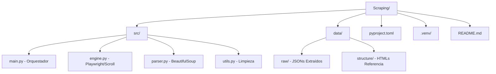

# Scraper Pro: Truth Social (Periodo 2025-2026)

Este proyecto es un motor de extracción dinámica de alto rendimiento diseñado para capturar la comunicación de Donald Trump en Truth Social.

## 🚀 Instalación y Uso Rápido (uv)

Este proyecto utiliza **`uv`** para una gestión de dependencias ultra-rápida.

1.  **Sincronizar el entorno**:
    ```bash
    python3 -m uv sync
    ```

> [!IMPORTANT]
> **Tip de Ejecución**: Si tu terminal dice que `uv` no se encuentra, usa siempre **`python3 -m uv`**. Esto asegura que el sistema use el módulo instalado directamente.

2.  **Instalar navegadores de Playwright** (Solo la primera vez):
    ```bash
    python3 -m uv run playwright install chromium
    ```

3.  **Ejecutar la Gran Extracción (2000 posts)**:
    ```bash
    python3 -m uv run src/main.py --limit 1000 --target_year 2025 --batch_size 50
    ```

## 📂 Estructura del Proyecto

-   `src/main.py`: Punto de entrada y orquestación.
-   `src/engine.py`: Motor Playwright, manejo de scroll y popups.
-   `src/parser.py`: Clase de extracción (BeautifulSoup4).
-   `src/utils.py`: Herramientas de limpieza de texto y fechas.
-   `data/raw/`: Destino de los archivos JSON generados.

## 🛡️ Características Pro
-   **Anti-Popup**: Bypass automático de banners de cookies y anuncios.
-   **Virtuoso Scroll**: Algoritmo que captura "chunks" de HTML para no perder posts en listas virtuales.
-   **Deduplicación**: Evita mensajes repetidos entre diferentes scrolls.
-   **Memory Optimized**: Procesa los datos sobre la marcha para manejar miles de registros sin agotar la RAM.

## 🧪 Pruebas (Tests)
El proyecto incluye un entorno de pruebas en la carpeta `tests/` para validar los componentes de forma aislada:
- **`tests/test_utils.py`**: Valida la limpieza de texto y fechas.
- **`tests/test_parser.py`**: Valida los selectores contra el HTML de referencia.

Ejecución: `python3 -m uv run tests/test_utils.py`


## 📁 Desglose de archivos:
- src/main.py: El archivo que ejecutas. Aquí vive la configuración del límite (ej: 2000) y la ruta de salida.
- src/engine.py: Contiene la lógica "sucia" de navegación: cómo abrir el navegador, cómo saltarse los anuncios y cómo hacer el scroll infinito.
- src/parser.py: El cerebro que analiza el HTML. Sabe dónde está la fecha y dónde el mensaje.
- src/utils.py: El "limpiador". Quita espacios extra, emojis rotos y formatea las fechas para el dashboard.
- data/raw/: Es la carpeta donde el scraper deposita los resultados finales en archivos .json.
- pyproject.toml: El archivo de identidad de tu proyecto para uv, donde están anotadas todas las librerías necesarias.

---

## 📂 Estructura del Proyecto

