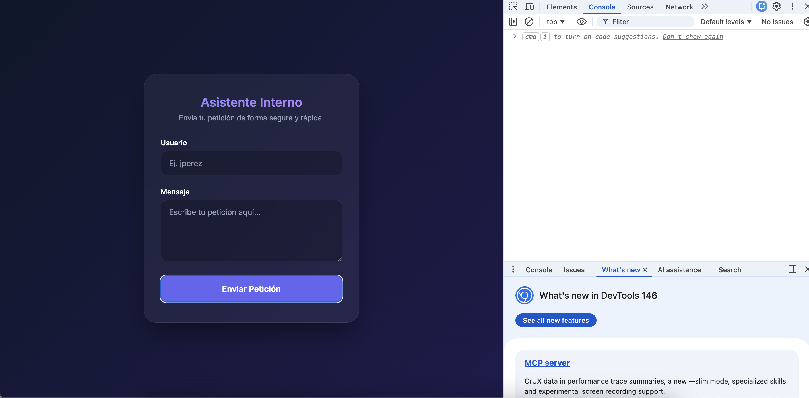
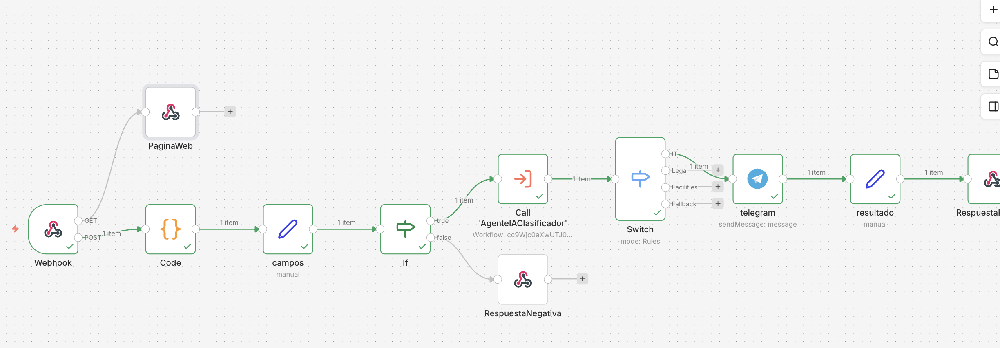

# Curso de Workflows Profesionales con n8n

| Detalle | Información |
| :--- | :--- |
| **Publicado el** | 21 Agosto 2025 |
| **Profesor** | Idir Ouhab |
| **Fecha de Inicio** | 01/003/2026 |
| **Fecha de Fin** |  |

> En este curso aprenderás a construir automatizaciones profesionales en n8n, dominando expresiones avanzadas, subworkflows, lógica de enrutamiento, conexiones con IA y casos prácticos de integración con herramientas externas

<div align="center">
  
</div>

| Curso | Certificado |
| :--- | :---: |
| Curso de Automatizaciones con n8n | [Ver PDF](./diploma-n8n-lowcode.pdf) |


---

## Clase 1: Automatización profesional con n8n: estructura y mantenibilidad

**¿Qué es automatizar con n8n de forma profesional?**

Automatizar bien no es solo lograr que corra hoy. Es construir con criterio para volver sin miedo y mejorar. Si “da miedo tocarlo”, no está bien hecho. La diferencia está en cómo nombras, estructuras y validas cada paso para que el flujo sea claro a primera vista.

**¿Qué errores revelan un flujo mal hecho?**

Nodos sin nombre.
Todo mezclado.
Sin validaciones.
Es una bomba de tiempo.

**¿Qué define un flujo profesional en n8n?**

Nombres claros en cada nodo.
Estructura limpia y legible.
Uso de set para organizar datos.
Subflujos que separan responsabilidades.
Validaciones que previenen fallos.
¿Cómo será el proyecto del asistente interno inteligente?

Construirás un asistente interno inteligente que orquesta tareas clave con claridad y registro. La propuesta combina análisis con inteligencia artificial y control operativo para no perder nada en el camino.

**¿Qué hace el asistente de principio a fin?**

Recibe solicitudes.
Analiza con IA y entiende qué se pide.
Detecta si una solicitud es urgente.
Avisa a quien corresponda.
Deja registro de lo que pasó.

**¿Por qué la base técnica importa antes de avanzar?**

Porque “nada de eso sirve si la base es un caos”. Antes de construir, afianza lo esencial: nombres, estructura, set, subflujos y validaciones. Así podrás mantenerlo y escalarlo sin miedo a romper nada cuando vuelvas más adelante.

**¿Qué habilidades y conceptos practicarás para mantener y escalar?**

Te enfocarás en lo que hace que un flujo sea confiable a largo plazo. La consigna es que funcione hoy y que puedas mantenerlo, escalarlo e integrarlo después sin fricción.

**¿Qué desarrollarás paso a paso?**

- Nombrado claro de nodos.
- Estructura limpia del flujo.
- Validaciones en puntos críticos.
- Uso de set para preparar y ordenar datos.
- Subflujos para modular procesos.
- Análisis con inteligencia artificial.
- Detección de urgencia.
- Notificaciones al responsable correcto.
- Registro consistente de eventos.

## Clase 3: Configuración de webhook básico en n8n

Resumen
Un workflow simple pero bien estructurado en n8n puede ser tu base para automatizaciones sólidas: recibe una petición, valida los datos y responde de forma controlada. Aquí se explica cómo crear un webhook, configurar su método HTTP, probar con JSON, extraer campos con set o edit fields, validar con if y responder con respond to webhook. Además, verás trucos como pin data y el uso de expresiones JavaScript para añadir lógica.

**¿Qué es un webhook y cómo configurarlo en n8n?**

Un webhook es una URL que expone tu workflow al exterior. Al recibir una petición HTTP, se ejecuta como punto de entrada del asistente. El proceso comienza creando el workflow, renombrándolo con un nombre claro y añadiendo el trigger tipo webhook.

**¿Cómo elegir método HTTP y path en el webhook?**

Selecciona método según la operación. Para enviar datos: POST.
Define el path legible. Cambia el que viene aleatorio por uno como “Asistente Interna”.
Observa la composición de la URL: dominio, segmento de webhook test y tu path.

**¿Cuándo usar test URL o production URL?**

En desarrollo usa test URL. Se activa al pulsar listen for test events o execute workflow.
En producción activa el workflow con el botón hasta que esté en verde.
Mantén producción apagado durante desarrollo para evitar ejecuciones no deseadas.

**¿Qué modos de respuesta y streaming existen?**

Acción por defecto: inmediata. Responde al instante.
Cuando el último nodo haya acabado: espera al final del flujo.
Usar otro nodo para contestar: selecciona respond to webhook para responder desde un nodo específico.
Streaming: envía datos a medida que se generan, útil con un agente de IA.

**¿Cómo probar y responder solicitudes HTTP con control?**

Probar de forma segura evita errores comunes. Puedes usar Postman o la app RequestBin para enviar un JSON con campos como usuario y mensaje.

**¿Cómo escuchar eventos de test y evitar errores 4xx?**

Copia la URL del webhook en tu herramienta de pruebas.
Antes de enviar, activa listen for test events o ejecuta el workflow.
Si ves “The request of hook is not registered”: no estaba escuchando el modo test.

**¿Qué revisar en esquema y body del request?**

Abre el nodo y usa la vista esquema para ver cabeceras y datos recibidos.
Identifica el body con los campos usuario y mensaje.
Si no hay respuesta inicial, agrega respond to webhook y vuelve a ejecutar.

**¿Cómo responder con JSON y usar expresiones?**

Configura respond to webhook para enviar un JSON con claves como estado y usuario.
Para el caso exitoso: estado “recibido” y el usuario insertado con expresiones.
Para el caso de error: estado “error” y detalle “el mensaje está vacío”.
Duplica nodos con botón derecho o atajos control C y control V.

**¿Cómo validar y transformar datos antes de responder?**

Convertir y validar datos te permite controlar el flujo. Usa set o edit fields para extraer solo lo necesario y if para decidir la ruta.

**¿Cómo extraer y renombrar campos con set o edit fields?**

Arrastra desde body los campos usuario y mensaje.
Define el tipo de cada campo: string, number, booleano, objeto o array.
Renombra eliminando el prefijo “body.” para quedarte con “usuario” y “mensaje”.
Ejecuta y valida que el output contenga solo esos dos datos.

**¿Cómo congelar datos con pin data para iterar más rápido?**

Usa pin data para fijar datos en un nodo y evitar reenviar peticiones.
Activa o desactiva con clic derecho en el nodo y opción pin.
Atajo rápido: tecla P para congelar o descongelar.

**¿Cómo validar con if que el mensaje no esté vacío?**

Añade el nodo if y arrastra el campo mensaje.
Selecciona la condición de texto “no está vacío”.
Rama verdadera: continúa y responde con éxito.
Rama falsa: responde con error y un detalle claro.

**¿Listo para un reto rápido?**

Vuelve a edit fields y crea un campo prioridad.
Usa expresiones JavaScript: si el mensaje contiene “urgente”, asigna “alta”; de lo contrario, “baja”.
Prueba, toma una captura y compártela en los comentarios.

## Clase 4: Expresiones de sistema en n8n para flujos profesionales

**Resumen**
Domina las expresiones de sistema de n8n para construir flujos profesionales y fiables. Con ellas puedes leer datos del nodo actual, identificar cada ejecución, incorporar el nombre del workflow o usar la fecha actual. Todo con doble llave {{ }}, expresiones de JavaScript y con previsualización del resultado en tiempo real.

**¿Qué son y por qué importan las expresiones de sistema de n8n?**

Las expresiones de sistema te permiten inyectar datos dinámicos en cualquier campo. Así evitas valores fijos y documentas mejor cada paso.

Acceder a datos del nodo con $json.
Identificar la ejecución con $execution.id para auditorías y errores.
Obtener metadatos con $workflow.name.
Usar fecha y hora actuales con $now.
Referenciar nodos por nombre con $node['Nombre'] y la sintaxis moderna $item.json.

**¿Cómo acceder a los datos del nodo con $json?**

Cuando abres un campo en edit fields, activa "expressions" y usa doble llave.

Ejemplos usando los campos mensaje y prioridad definidos en edit fields:


{{ $json.mensaje }}
{{ $json.prioridad }}

$json apunta al nodo previo conectado.
Útil para leer los valores actuales sin configurar nada extra.

**¿Cómo identificar la ejecución con $execution?**

Necesitas un identificador único por corrida del flujo. Úsalo para logs, auditorías o rastreo de errores.


{{ $execution.id }}
Genera un ID único por ejecución.
Ideal para adjuntar en respuestas o en registros.

**¿Cómo obtener metadatos y la fecha actual con $workflow y $now?**

Incluye el nombre del workflow en mensajes o logs.


{{ $workflow.name }}
Trabaja con la fecha y hora actual. Puedes mostrarla en ISO o aplicar format.


{{ $now.toIso }}
{{ $now.format }}
Son expresiones de JavaScript, por lo que puedes encadenar métodos.
Visualiza a la derecha la previsualización del valor antes de guardar.

**¿Cómo referenciar nodos por nombre sin romper el flujo?**

Cuando insertas un nodo intermedio (por ejemplo, un set que añade categoría: IT), $json puede cambiar porque apunta al nodo directamente anterior. En cambio, $node['Nombre'] apunta por nombre y no se rompe al reordenar.

**¿Por qué $json puede fallar al insertar nodos intermedios?**

Si agregas un set entre el nodo "Editar" y tu campo actual, $json ya no es el mismo.

$json se actualiza al nodo inmediatamente anterior.
Un cambio en la cadena de nodos puede romper referencias como {{ $json.prioridad }}.

**¿Cómo usar $node['Editar'] y la sintaxis moderna con $item.json?**

Para apuntar al nodo "Editar" por nombre y leer prioridad:


{{ $node['Editar'].json.prioridad }}
En la sintaxis más moderna, se trabaja con $item y luego con json:


{{ $item.json.prioridad }}
En ambos casos verás el mismo valor cuando no hay nodos intermedios.
Con nodos añadidos, $node['Editar'] mantiene la referencia estable.


**¿Qué práctica recomiendan para flujos estables?**

Preferir $node['NombreDelNodo'] para datos críticos.
Usar $json cuando el orden de nodos no cambiará.
Documentar con $execution.id y $workflow.name en tus logs.
Normalizar fechas con $now.toIso.

**¿Cómo replicar el ejercicio y consolidar el aprendizaje?**

Configura un trigger manual, un edit fields con mensaje y prioridad, y un set final para ver valores. Luego:

Prueba {{ $json.prioridad }} y {{ $node['Editar'].json.prioridad }} en el set.
Inserta un set intermedio que añada categoría: IT.
Ejecuta el workflow y observa cómo $json se rompe mientras $node sigue correcto.
Añade {{ $execution.id }}, {{ $workflow.name }} y {{ $now.toIso }} a tus campos.


## Clase 5: Validación de mensajes y respuestas estructuradas con JavaScript


**Resumen**
Mejora la calidad de tus automatizaciones con expresiones de sistema y JavaScript: valida el contenido, clasifica la prioridad y devuelve una respuesta estructurada por webhook con trazabilidad. Verás cómo combinar el nodo IF, funciones como length e includes, la condición ternaria y campos del workflow para un flujo más dinámico y claro.

**¿Cómo validar mensaje y longitud con JavaScript en el nodo IF?**

Para evitar respuestas pobres, se comprueba que el mensaje no esté vacío y que tenga al menos 10 caracteres. Se elige la condición Y en el nodo IF y se aplica la función de JavaScript para medir la longitud con autocompletado al pulsar el punto.

Activa la condición Y: mensaje no vacío y longitud mínima.
Usa la función: mensaje.length para contar caracteres.
Compara como número: mayor que 10.
Ejecuta y verifica que la condición se cumple.
Ejemplo de lógica en la condición:


mensaje !== '' && mensaje.length > 10
Así te aseguras de filtrar mensajes demasiado cortos antes de seguir.

**¿Cómo detectar y asignar prioridad con condición ternaria?**

En Edit Fields, añade el campo Prioridad como expresión. Inserta el mensaje y aplica includes para detectar si contiene la palabra “urgente”. Luego usa la condición ternaria para etiquetar: alta o normal.

Convierte el campo a expresión con “=”.
Inserta el mensaje y aplica includes: busca “urgente”.
Devuelve “alta” o “normal” con la ternaria.
Ejemplo:


mensaje.includes('urgente') ? 'alta' : 'normal'
Si el texto no contiene “urgente”, la prioridad resultará normal.

**¿Cómo enriquecer la respuesta con fecha, flujo y ejecución para el webhook?**

Suma contexto a la respuesta agregando Fecha, Flujo y Ejecución_id. Trabaja con expresiones del sistema y devuelve un objeto claro. Esto aporta trazabilidad y mejora la lectura.

**¿Cómo generar la fecha con NOW y formato ISO?**

Crea el campo Fecha como texto y usa la variable de sistema NOW. Dale un formato legible con toISO.

Escribe “=” y abre llaves para activar la expresión.
Inserta NOW y convierte con toISO.
Ejemplo:


{{ $now.toISO() }}
Obtendrás la fecha actual en formato estándar, fácil de interpretar.

**¿Cómo identificar workflow y execution id en la respuesta?**

Añade el nombre del workflow y el identificador de ejecución. Cuando se ejecute, el id aparecerá automáticamente.

Campo Flujo: toma el nombre del workflow.
Campo ejecución_id: usa execution.id y define el tipo correcto.
Ejemplos:


{{ $workflow.name }}
{{ $execution.id }}
Si ves que ejecución_id sale como texto, cambia a número para mantener consistencia.

**¿Cómo construir el cuerpo JSON y probar con pin?**

Puedes mapear manualmente o devolver todo con JSON desde el nodo anterior. Si no dominas JavaScript, arrastra campo por campo y previsualiza.

Construye el objeto con: mensaje, prioridad, fecha, flujo, ejecución_id.
Alternativa avanzada: devolver el JSON completo del nodo anterior.
Usa botón derecho: pin para congelar datos y probar sin reenviar.
Luego unpin para volver a datos en vivo.
Activa Execute workflow para escuchar en modo test.
Observa que ejecución_id se incrementa en cada petición.
Maneja errores: indica cuando el mensaje está vacío o demasiado corto.
Ejemplo de respuesta estructurada para el webhook:


{
  "mensaje": "Crear tarea en proyecto del backend",
  "prioridad": "normal",
  "fecha": "2024-01-01T12:00:00.000Z",
  "flujo": "NombreDelWorkflow",
  "ejecucion_id": 270
}
Puntos clave que aplicarás de inmediato:

Expresiones de sistema para enriquecer datos.
Funciones de JavaScript: length, includes, toISO.
Condición ternaria para clasificar prioridad.
Campos de contexto: workflow.name y execution.id.
Buenas prácticas: prueba con pin/unpin, ajusta tipos y valida entradas.


```javascript
{{$json}}

{{ $execution }}

{{ $workflow }}

{{ $workflow.name }}

{{ $now }}

{{ $now.toISO() }}

{{ $now.format('dd-MM-yyyy') }}


{{ $nodeVersion }}

{{ $('Code').item.json.mensaje  }}
{{ $node['Code'].json.mensaje }}

{{ $('Webhook').item.json.body.mensaje }}

{{ $workflow.name }}
{{ $workflow.id }}

``` 

## Clase 6: Subworkflows en n8n para organizar flujos complejos

**Resumen**
Aprende qué es un subworkflow en N8N y cómo aplicarlo para mantener tu flujo principal limpio y legible. Entiende su lógica equivalente a una función: recibe un input, ejecuta una lógica y devuelve una respuesta. Además, conoce cómo se ejecuta con el nodo Execute to workflow y qué datos retorna para integrarlos sin fricción.

**¿Qué es un subworkflow en N8N y para qué sirve?**

Un subworkflow es simplemente otro workflow que se ejecuta desde uno principal. En la práctica, funciona como una función: recibe un input, ejecuta una lógica y devuelve una respuesta. Al aplicarlos, se pasa “de esto a esto otro”, es decir, el diseño se aclara y el flujo principal queda más limpio y legible.

**¿Cómo pensar en un subworkflow: como una función?**

Recibe un input claro.
Ejecuta una lógica definida.
Devuelve una respuesta concreta.


**¿Cómo se ejecuta y qué datos devuelve en N8N?**

En N8N, un subworkflow se ejecuta mediante el nodo Execute to workflow. Este nodo devuelve los datos del último nodo del subworkflow, lo que facilita encadenar resultados sin pasos intermedios innecesarios.

Nodo de ejecución: Execute to workflow.
Salida disponible: datos del último nodo.
Beneficio directo: el flujo principal se mantiene limpio y legible.


**¿Qué palabras clave y habilidades se destacan?**

Subworkflows: otro workflow que se ejecuta desde el principal.
Flujo principal limpio y legible: objetivo de organización.
N8N: plataforma donde se orquesta la ejecución.
Nodo Execute to workflow: ejecuta el subworkflow y expone la salida.
Datos del último nodo: respuesta consumible del subworkflow.
Automatización más profesional: resultado esperado al implementarlos.

## Clase 07: Subworkflows reutilizables con IA para clasificar mensajes


Resumen
Impulsa tu automatización en n8n creando un subworkflow reutilizable que integra inteligencia artificial para clasificar mensajes y devolver una salida JSON consistente. Aquí verás, paso a paso, cómo definir entradas, configurar un AI Agent, normalizar datos con Set y consumir el subworkflow desde el flujo principal para responder por webhook.

¿Cómo crear un subworkflow en n8n y definir entradas?

Un subworkflow es parte clave de la arquitectura del workflow: encapsula lógica reutilizable y se ejecuta desde otro flujo. El proceso es similar a crear un workflow normal, con la diferencia de su trigger.

Crea un Workflow y añade el nodo Subworkflow como primer paso.
Elige el trigger: when executed by another workflow.
Define las entradas con add fields: crea el campo mensaje como tipo texto.
Guarda para asegurar la configuración inicial.
¿Qué trigger usar para subworkflow reusable?

Usa el trigger “when executed by another workflow”.
Esto permite que otro flujo invoque el subworkflow con datos.
¿Cómo definir el campo mensaje como texto?

En add fields, selecciona “texto”.
Aceptar “cualquier cosa” no es necesario: aquí es un string claro.
¿Cómo probar con datos congelados en el trigger?

Doble clic en el trigger y entra a la opción json.
Edita el valor de “mensaje” con el lápiz y guarda.
Verás el nodo en morado: hay dato congelado para testear.
¿Cómo integrar un agente de IA para clasificar mensajes?

Añade un AI/EI Agent para decidir si el mensaje va a IT, legal, facilities u otro. Configurar bien la fuente, el system message y el modelo evita errores y hace la salida predecible.

Fuente de datos: selecciona “define below” para usar el valor dinámico.
Mensaje dinámico: referencia el campo del trigger con una expresión.
Prompt de sistema: instrucción clara con categorías y formato de salida.
Modelo y credenciales: conecta OpenAI y elige GPT-4.1 mini.
¿Qué expresión usar para pasar el mensaje dinámico?

Utiliza la expresión que apunta al campo de entrada “mensaje”:


{{ $json.mensaje }}
Asegura que exista el valor al testear: usa el dato congelado en el trigger.
¿Cómo redactar el system message para categorías?

Indica la tarea, el conjunto de clases y la restricción de formato:


clasifica el siguiente mensaje según su tema: it, legal, facilities u otro. devuelve solo una palabra en minúscula.
Si el nodo está en rojo, falta el modelo: selecciona credenciales y modelo.
Conectar OpenAI y elegir GPT-4.1 mini deja el nodo en gris: sin error.
¿Cómo asegurar salida consistente con Require Specific Output Format?

Activa Require Specific Output Format y añade un Output Parser. Define un ejemplo de JSON con las claves deseadas para guiar la respuesta del modelo.


{
  "Categoría": "it",
  "confianza": "alta"
}
Esto fuerza una estructura de salida estable.
Verifica con Ejecutar: el agente debe devolver ambas claves.
¿Cómo consumir el subworkflow desde el flujo principal y responder por webhook?

Una vez probado, integra el subworkflow en tu flujo principal. Así podrás clasificar en caliente y responder desde el webhook con los datos limpios.

Añade el nodo Subworkflow como acción tras la lógica que decide si clasificar.
Origen: database y selección by ID para apuntar al subworkflow correcto.
Usa Execute previous nodes y envía una petición para generar datos.
Mapea el campo mensaje hacia la entrada del subworkflow.
Normaliza la salida con Set/Edit Fields: elimina prefijos como “output.” y conserva “Categoría” y “confianza”.
¿Cómo vincular por ID y mapear el campo mensaje?

Copia el ID del subworkflow y pégalo en el nodo Subworkflow del flujo principal.
Tras ejecutar nodos previos, arrastra el campo mensaje hacia el parámetro “mensaje”.
¿Cómo normalizar con set y construir la respuesta?

En Set, arrastra “Categoría” y “confianza”; elimina “output.” del path.
En el nodo de webhook/función de respuesta, agrega ambas claves al JSON de salida mediante arrastrar y soltar desde “edit fields”.
Ejemplo de respuesta esperada:


{
  "Categoría": "it",
  "confianza": "alta"
}
Prueba con una nueva petición: deberías ver Categoría y confianza como parte de la respuesta.

## Clase 08: Enrutamiento de solicitudes con switch por categorías

**Resumen**
Aprende a enrutar solicitudes por categoría con un flujo claro y eficiente. Desde el uso de un switch hasta las notificaciones en Slack, el registro en Notion y el envío de correos con Gmail. Verás cómo nombrar salidas, configurar Fallback Output, fijar datos con el pin y crear mensajes dinámicos con Expressions para no perder contexto.

**¿Cómo enrutar con switch y categorías?**

Configura un switch justo después de obtener la categoría en el subflujo. Crea salidas para IT, legal y Facilities (con F mayúscula). Renombra cada output para identificar su función con claridad.

Añade una opción por defecto con Fallback Output. Puedes elegir: ninguna salida, usar una existente o una Extra Output.
Desconecta temporalmente el nodo de response to webhook para probar sin ruido.
Ordena y guarda antes de ejecutar. Evita confusiones.
Depura con método. Si el flujo cae en fallback, revisa que la condición no esté en blanco. Usa Execute step para reintentar solo el paso corregido. Fija datos con el pin (hacer “P” en cada nodo) y ejecuta con Execute workflow para evitar cambios inesperados durante las pruebas.

**¿Cómo validar la categoría y evitar errores?**

Verifica que la categoría recibida coincide exactamente: IT, legal o facilities.
Comprueba mayúsculas/minúsculas en “Facilities”.
Si no hay categoría, confirma que la IA clasificadora está conectada antes del switch.
Define siempre un fallback para no perder solicitudes.

**¿Qué acciones ejecuta cada categoría: Slack, Notion y Gmail?**

Cada ruta realiza una acción concreta y trazable. Usa credenciales, recurso y operación correctos en cada nodo. Mantén los mensajes y registros con campos consistentes: usuario, mensaje, prioridad, fecha y categoría.

**¿Cómo notificar en Slack con mensaje dinámico?**

Crea un nodo de Slack con la operación “enviar un mensaje”. Elige destino: canal o usuario. En el ejemplo, se usa el canal “Soporte”.

Activa Expressions para construir un texto dinámico.
Incluye campos: usuario, categoría, mensaje y prioridad.
Ejemplo de formato: “Solicitud de {usuario}. Categoría: {categoría}. Mensaje: {mensaje}. Prioridad: {prioridad}”.
Verifica en Slack que llega el aviso tras ejecutar el flujo.
Claves prácticas:

Elige bien el canal o usuario destinatario.
Amplía el editor de Expressions para leer mejor.
Revisa que “categoría” lleve acento si tu esquema lo usa.

**¿Cómo registrar en Notion la categoría legal?**

Usa Notion con la operación Create para “crear una página en una base de datos”. Selecciona la base “Legal Request”. Añade propiedades: Estado, Fecha, Mensaje y Usuario.

Asigna “en trámite” al campo Estado.
Mapea Fecha, Mensaje y Usuario desde Edit Fields arrastrando los valores.
Deja el Título vacío al principio y constrúyelo con una concatenación: ejecución - usuario.
Ejecuta y verifica que se creó un registro como página dentro de la base “Legal Request”.
Buenas prácticas:

Mantén nombres idénticos entre propiedades y campos fuente.
Usa Execute step tras corregir condiciones en el switch para no repetir todo.
Pin de datos activo al probar rutas largas.


**¿Cómo enviar correo con Gmail para facilities?**

Configura Gmail con la operación “Enviar mensaje” (Send Message). Define el destinatario responsable con un correo real para validar el envío.

Asunto: “Nueva petición: {usuario}”.
Cuerpo con Expressions: usuario, mensaje, prioridad y fecha.
Ejecuta, revisa el Inbox y confirma el correo “Nueva petición: {usuario}”.
Consejos:

Ordena y guarda el flujo antes de cada prueba.
Verifica credenciales activas y permisos de envío.
Mantén el formato del mensaje breve y claro.


**¿Qué buenas prácticas y errores comunes evitar?**

Trabaja con una estructura mínima y predecible para reducir retrabajos.

Renombra todas las salidas del switch: IT, legal, Facilities y Fallback.
Define y documenta el Fallback Output: sin salida, usar existente o Extra Output.
Usa pin de datos antes de ejecutar pruebas encadenadas.
Cambia el contenido del mensaje para forzar rutas (IT, legal, facilities) al testear.
Corrige condiciones en blanco: es la causa típica de desvío a fallback.
Desconecta el response to webhook durante pruebas y vuelve a conectarlo al finalizar.
Para el fallback, conecta a Google Sheet con columnas: usuario, mensaje, fecha, estado y categoría. Tómalo como reto y comparte evidencia.


**Resumen Pasos para conectar telegram** 

📋 Requisitos Previos
Cuenta de Telegram activa.

Instancia de n8n (Desktop, Cloud o Self-hosted) funcionando.

🛠️ Paso 1: Creación del Bot (Telegram Side)
Para que n8n pueda interactuar con Telegram, necesitamos un API Token.

Busca al usuario @BotFather en Telegram (es el bot oficial para crear otros bots).

Inicia una conversación y envía el comando /newbot.

Sigue las instrucciones:

Nombre del bot: Un nombre visible (ej. Mi Automatizador).

Username: Debe ser único y terminar en bot (ej. Leonard_roa_3478_bot).

Guardar el Token: BotFather te entregará un HTTP API Token.

⚠️ Seguridad: No compartas este token. Es la llave de acceso a tu bot.

🔑 Paso 2: Configuración de Credenciales en n8n
Ahora debemos darle a n8n el permiso para usar ese bot.

En n8n, abre el nodo de Telegram.

En la sección Credential, selecciona Create New Credential.

Elige el tipo Telegram API.

Pega tu token en el campo Access Token.

Deja el campo Base URL vacío (por defecto usa https://api.telegram.org).

Haz clic en Save.

🆔 Paso 3: Obtención del Chat ID
Telegram requiere un ID numérico único para saber a qué chat específico enviar el mensaje.

Busca el bot @myidbot o @IDBot en Telegram.

Envía el comando /getid.

Copia el número que te devuelva (ej. 123456789).

IMPORTANTE: Antes de probar, busca tu propio bot recién creado (@Leonard_roa_3478_bot) y presiona el botón "Iniciar" o escribe /start. Los bots no pueden hablarte si no los inicias primero.

🚀 Paso 4: Configuración del Nodo en n8n
Configura el nodo de Telegram con los siguientes parámetros:

Resource: Message

Operation: Send Message

Chat ID: Pega el ID numérico obtenido en el paso anterior.

Text: El contenido del mensaje.

Tip: Puedes usar Expressions para insertar datos dinámicos provenientes de un Webhook o una base de datos.

Reply Markup: (Opcional) Puedes configurar botones o respuestas rápidas.

🧪 Paso 5: Pruebas y Ejecución
Haz clic en Execute Step en el nodo de Telegram.

Verifica en tu aplicación de Telegram si recibiste el mensaje.

Si todo es correcto, el panel Output en n8n mostrará un JSON con el estado ok: true.

💡 Notas Técnicas (Best Practices)
Variables de Entorno: Si usas n8n en Docker, considera manejar el Token como una variable de entorno para mayor seguridad.

Manejo de Errores: Añade un nodo de Error Trigger en tu flujo para recibir una notificación en Telegram si alguna parte de tu automatización falla.

Parsing Mode: Si quieres enviar negritas, cursivas o enlaces, asegúrate de seleccionar HTML o MarkdownV2 en las opciones adicionales del nodo.


## Clase 09: Finalización de workflow con respuestas unificadas en n8n

Resumen
Completamos un workflow en n8n listo para uso real: unificamos respuestas, renombramos nodos para trazabilidad, devolvemos una respuesta por webhook en json y encapsulamos la lógica en un subworkflow modular. Todo apoyado en una expresión del sistema que identifica el nodo de origen de forma dinámica y sencilla.

**¿Cómo unificar respuestas y nombrar nodos en n8n?**

Para devolver un solo mensaje consolidado, se conectan todos los caminos al mismo punto usando el nodo set o edit fields. El orden y el nombre de cada salida importan para leer el flujo con claridad.

Conecta todos los nodos al mismo punto con set o edit fields.
Renombra cuatro nodos: Slack, Notion, Gmail y Google Sheet.
Para renombrar: clic derecho y rename, o usa la barra espaciadora.
Mantén nombres claros para identificar el canal de salida al instante.

**¿Qué expresión usar en edit fields para el origen?**

En edit fields se añade un campo para saber, de forma automática, qué nodo ejecutó la rama anterior. Así evitamos escribir nombres manualmente y hacemos la ejecución dinámica.

En el valor del campo, selecciona la expresión del sistema y usa: pref node inane.
Crea el atributo "Origen" para guardar el nombre del nodo anterior.
Nota: al inicio puede verse en gris; al ejecutar, mostrará el valor correcto.

**¿Cómo responder por webhook en formato json?**

La salida se configura con un nodo webhook en modo respuesta, enviando un payload en json para verificar rápidamente que todo llega como se espera.

Añade el nodo de salida webhook en opción: in respond to webhook.
Selecciona json como tipo de respuesta.
Guarda y ejecuta el flujo.
Envía la petición y confirma que la aplicación responde.
Valida que el recorrido del flujo sea el esperado.


**¿Cómo convertir la lógica en subworkflows y testear?**

Para reducir complejidad, la lógica se empaqueta en un subworkflow. Esto facilita el mantenimiento y la reutilización sin alterar el comportamiento.

Desconecta la salida antes de convertir. Es imprescindible para que lo permita.
Selecciona todo el bloque a encapsular.
Clic derecho y elige: convert six nodes to subworkflows.
Asigna un nombre temporal: "enrutado" y confirma.
Reconecta la respuesta y prueba con execute workflow enviando la misma petición.
Abre el subflujo con doble clic: n8n añadió el trigger y el output es el mismo.
Resultado: subflujo modular que ahorra tiempo y ordena el diseño.

## Nota importante

´´´javascript

{{$prevNode.name}} // nombre del nodo anterior muy usado para validar y hacer logs 

{
  "estado": {{ $json.ok }},
  "usuario":"{{ $json.usuario }}", 
  "prioridad":"{{ $json.prioridad }}",
  "fecha": "{{ $json.fecha }}",
  "flujo":"{{ $json.flujo }}", 
  "executive":"{{ $json.executive }}",
  "mensaje_telegram":"{{ $json.mensaje_telegram }}"
}  

´´´

## Clase 10: Cómo hostear una página web completa en n8n con un solo nodo

Resumen
**¿Sabías que puedes hostear una página completa en n8n usando un solo nodo? **

Con el nodo webhook y un ajuste clave, el método GET sirve el HTML y el POST envía la petición. A continuación verás los pasos, las opciones que marcar y cómo probarlo para que funcione de punta a punta.

**¿Cómo hostear una web en n8n con un solo nodo?**

La idea central es simple: un único nodo webhook puede manejar varios métodos HTTP. Así, el GET devuelve la interfaz en HTML y el POST procesa el envío del formulario dentro del mismo flujo.

Hasta ahora se usó el webhook con método POST.
El cambio: activar varios métodos para que GET sirva el HTML y POST reciba la petición.
El resultado: una web completa alojada en n8n, con formulario y lógica de servidor en el flujo.
¿Qué cambiar en Settings para usar GET y POST?

Abrir el nodo webhook y entrar a Settings.
Activar la opción Allow multiple HTTP methods.
Volver a Parámetros y seleccionar ambos: GET y POST.
Salir y reconectar el POST como estaba antes.
¿Cómo responder con HTML desde el flujo?

Añadir un nodo de respuesta: Respond to Webhook.
Elegir la opción de responder con texto.
Pegar el HTML que servirá como interfaz del formulario.
Recordar: antes, copiar la URL del webhook porque será el backend al que el formulario hará la petición.

**¿Cómo generar el formulario con ChatGPT?**

Preparar un prompt para crear un formulario en HTML.
Incluir donde corresponda la URL del webhook como acción del formulario.
Puedes añadir CSS y JavaScript para un diseño más completo.
Copiar y pegar el código en la parte de GET del nodo de respuesta.
¿Qué pasos seguir para pegar, guardar y ejecutar?

Una vez tengas el HTML, solo resta integrarlo y probarlo en n8n. El flujo queda listo para servir interfaz y procesar envíos.

Pegar el HTML en la sección de GET del nodo Respond to Webhook.
Cerrar y guardar el flujo.
Copiar la URL pública del webhook.
Pulsar Execute workflow para ponerlo a escuchar.
Abrir la URL en una pestaña del navegador: verás un formulario totalmente diferente, servido por el GET.

**¿Cómo validar que la petición entra por la rama correcta?**

Enviar el formulario para probar el POST (ejemplo usado: ivi@test.com).
Comprobar en el editor que el flujo sigue la rama del GET al servir la página y la del POST al enviar la petición.
Mensaje esperado: se envió correctamente y el flujo continuó como estaba previsto.

**¿Qué habilidades y conceptos refuerzas con este flujo?**

Este enfoque potencia tu dominio de n8n y de la web. Entiendes el rol de cada método y cómo integrarlo de forma práctica.

Métodos HTTP: GET para servir interfaz, POST para procesar datos.
Nodo webhook: flexibilidad para manejar múltiples métodos en un mismo endpoint.
Configuración clave: Allow multiple HTTP methods en Settings.
Respuesta con texto: uso de Respond to Webhook para enviar HTML al navegador.
Integración frontend–backend: formulario en HTML que apunta con su acción a la URL del webhook como backend.
Herramientas de apoyo: ChatGPT para generar estructura de formulario, con posibilidad de CSS y JavaScript.
Pruebas end-to-end: ejecutar con Execute workflow, abrir la URL, verificar ramas GET y POST y confirmar el envío.





NOTA: Como vemos en la imagen si podemos crear una pagina html como tambien lo indica la imagen no es necesario conectar el nodo llamado PaginaWeb para que funcione. 


## Clase 11: Configuración de agente de soporte con Google Calendar e IA

¿Cómo iniciar el flujo con MCP Server y MCP Client?

Para empezar, se construye un subflujo que notifica a distintos departamentos y se enfoca en la rama de IT con prioridad alta. La lógica se apoya en nodos como trigger, switch y filter, permitiendo rutas paralelas y condiciones precisas.

¿Qué datos de prueba usar con el trigger?

Usa el trigger y pulsa en “Execute step”.
Se genera un objeto JSON con campos vacíos: categoría, prioridad, usuario, mensaje, ejecución y fecha.
Edita con el lápiz y rellena valores falsos para desarrollo.
Escribe un mensaje de ejemplo: "No me funciona el mouse. ¿Qué debo de hacer?".
Guarda para tener pin data y facilitar las pruebas.
¿Cómo filtrar por IT y prioridad alta?

En switch, enruta a la rama IT.
Mueve el nodo filter para que se aplique solo a IT y no bloquee otras acciones.
Arrastra el campo prioridad al filter y ejecuta cuando sea “alto”.
Mantén acciones paralelas: por ejemplo, que Slack se envíe siempre, aunque no sea alta la prioridad.
¿Cómo mantener Slack en paralelo?

Desconecta el filter de la ruta principal si interfiere.
Conecta la rama IT al filter como acción paralela.
Así, Slack se envía siempre y el filtro solo controla la lógica crítica de IT.
¿Cómo diseñar el AI Agent y su prompt?

Se añade un AI Agent genérico con “Define Below” para controlar el comportamiento. El system message orquesta tareas encadenadas, y el user message pasa el contexto completo en texto.

¿Qué poner en el system message y user message?

System message con objetivos claros:
Agendar un evento en el calendario para ayudar al usuario.
Enviar un correo con la fecha del evento.
Buscar solución con “Serve API” en Google, según el mensaje del usuario.
Formatear la respuesta en HTML.
Responder en español.
User message con contexto completo usando Expressions y el objeto de entrada.
Código recomendado para pasar todo el contexto del nodo anterior:


{{ JSON.stringify($json) }}
Ventajas:

Evita arrastrar campo por campo.
El agente lee todo el estado de entrada.
¿Cómo conectar OpenAI y Google Calendar?

Selecciona tu proveedor (OpenAI) y credenciales.
Añade la herramienta Google Calendar con credenciales válidas.
Escribe una descripción clara de la herramienta para el agente: “Agendar una reunión con el usuario a partir de la fecha de hoy en adelante y añade un título descriptivo al evento.”
Consejos clave:

Elige el calendario correcto.
Deja que el agente rellene la fecha final si aplica.
Desactiva “use default reminders” si no los necesitas.
¿Qué campos configurar en el evento?

Attendees: arrastra el email del usuario para invitarlo.
Description: permite que el agente lo rellene.
Summary: define que el agente cree un título corto y descriptivo (mejor da límites claros).
Conference data: “Add conference” para generar enlace de Google Meet.
Nota sobre lenguaje del prompt: “corto” y “descriptivo” son vagos para una IA. Mejor especifica límites, por ejemplo, 40 caracteres para el título y pautas para el contenido.

¿Cómo depurar fechas y mejorar el resultado?

Durante la prueba se detectó la creación de dos eventos y rangos de fechas excesivos. La causa: el agente no conocía la fecha actual y el prompt no indicaba duración ni cuándo agendar.

¿Por qué se crearon dos eventos y con fechas erróneas?

Falta de contexto temporal: el modelo no sabe “hoy”.
Prompt ambiguo: sin duración ni ventanas claras.
Resultado: eventos duplicados y rangos incoherentes.
¿Cómo corregir con date and time tool y un prompt específico?

Añade la herramienta date and time tool para que el agente consulte el día actual.
Reescribe el prompt con criterios precisos. Ejemplo usado:
“Agenda un evento en el calendario con el usuario para resolver su problema con una duración máxima de quince minutos lo antes posible.”

Repite la prueba y valida en el calendario: título, descripción y horario correctos.
¿Qué buenas prácticas aplicar para estabilidad?

Define tareas del system message en pasos concretos.
Pasa el contexto completo con JSON.stringify($json).
Especifica duración, ventana temporal y límites de formato.
Usa logs del flujo para inspección rápida.
Acepta la no determinación del modelo: el mismo prompt puede variar.
Ajusta y vuelve a probar con datos anclados y credenciales validadas.

## Clase 12: Protocolo MCP para conectar herramientas con agentes de IA

Resumen
MCP se ha vuelto un término esencial en inteligencia artificial. Aquí entenderás, de forma clara y práctica, cómo este protocolo coordina clientes y servidores para unir recursos, datos y herramientas, potenciando agentes de IA en entornos como N8N, Cloud o Cursor. Todo explicado con lenguaje directo y enfocado en valor real.

¿Qué es MCP y cómo funciona el protocolo?

MCP es un protocolo donde el usuario interactúa con un cliente que puede correr en un dispositivo o en la nube. Ese cliente se comunica con servidores MCP, que actúan como intermediarios para acceder a servicios y fuentes que el cliente necesita.

El cliente inicia la interacción con el usuario a través de un chat o interfaz.
El servidor MCP conecta con recursos, herramientas y datos.
Ambos coordinan para que agentes de IA ejecuten acciones con contexto.
¿Qué hace el cliente MCP en N8N, Cloud o Cursor?

El cliente puede ser un chat en N8N, Cloud o Cursor. Su rol es recibir instrucciones y enviar solicitudes a los servidores MCP. Puede ejecutarse localmente o en la nube, facilitando accesos flexibles según necesidad.

¿Qué conectan los servidores MCP: APIs, datos y LangGraph?

Los servidores MCP hacen de puente hacia distintos sistemas y componentes de IA. Conectan lo que el cliente y los agentes requieren para trabajar con contexto y acciones útiles.

Recursos, archivos y datos: información operativa y documentación.
Herramientas y APIs: funciones externas listas para invocar.
Prompts predefinidos: plantillas de instrucciones reutilizables.
Componentes de IA como LangGraph: piezas específicas para flujos de IA.
Bases de datos y plataformas en la nube: fuentes persistentes y escalables.
Otros agentes MCP: colaboración entre agentes para tareas encadenadas.
¿Cómo se coordinan múltiples herramientas con agentes de IA?

MCP permite conectar múltiples herramientas con agentes de IA para que interactúen e intercambien información entre ellas. Así, los agentes pueden tomar decisiones y ejecutar pasos con datos de varias fuentes, todo bajo un mismo flujo.

Intercambio de información entre servicios.
Ejecución coordinada de acciones.
Acceso unificado a recursos y componentes de IA.
¿Para qué sirve MCP con agentes de inteligencia artificial?

Un caso práctico: en soporte técnico, un agente de IA, mediante MCP, puede organizar la agenda del equipo y apoyar en labores de soporte básico. Esto alinea disponibilidad, datos y tareas, reduciendo fricción en la operación diaria.

Organización de agendas con base en solicitudes reales.
Respuestas y asistencia de primer nivel automatizadas.
Coordinación entre agentes y sistemas conectados.
¿Qué herramientas y próximos pasos recomienda el instructor?

N8N hostea de forma nativa tanto el cliente como el servidor, simplificando la puesta en marcha. A continuación, se presentará un caso de uso práctico. Quien desee profundizar puede seguir el curso de MCP de Platzi.

Para asentar los conceptos que aparecen:

MCP (protocolo): define cómo cliente y servidor se comunican.
Cliente: interfaz que el usuario usa para interactuar con el sistema.
Servidores MCP: intermediarios hacia APIs, datos y herramientas.
Herramientas y APIs: capacidades externas que el agente invoca.
Prompts predefinidos: instrucciones listas para reutilizar.
LangGraph: componente específico para flujos de IA.
Bases de datos y nube: orígenes de información y ejecución escalable.
Agentes MCP: agentes que colaboran entre sí mediante el protocolo.
N8N, Cloud, Cursor: entornos donde corre el cliente y se integra el servidor.
