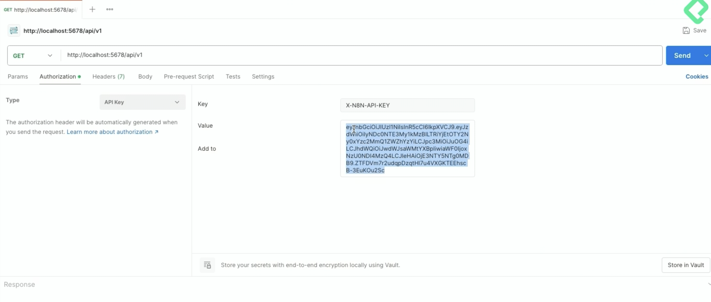

# Curso de n8n Self-Hosted para Empresas

| Detalle | Información |
| :--- | :--- |
| **Publicado el** | 21 Agosto 2025 |
| **Profesor** | Idir Ouhab |
| **Fecha de Inicio** | 28/03/2026 |
| **Fecha de Fin** | 15/04/2026 |

> En este curso aprenderás a desplegar, configurar y operar tu propia instancia de n8n self-hosted, obteniendo control total sobre la infraestructura, seguridad y rendimiento de tus automatizaciones. Avanzaremos desde la instalación en Docker y Kubernetes, hasta el uso del CLI y la API REST de n8n, lo que te permitirá gestionar flujos, usuarios y credenciales de manera programática.

<div align="center">
  
</div>

| Curso | Certificado |
| :--- | :---: |
| Curso de n8n Self-Hosted para Empresas| [Ver PDF]() |

- Document => https://docs.n8n.io/hosting/cli-commands/#change-the-active-status-of-a-workflow

---

## Clase 01: Cómo crear nodos personalizados y escalar infraestructura de n8n

Resumen
Evita perder horas por una instancia de n8n sin capacidad. Aprende a crear nodos personalizados y a alojar y escalar n8n con Docker, Docker Compose y Kubernetes para una operación estable, flexible y preparada para crecer. Con control de la infraestructura y expansión mediante nodos, n8n se vuelve una pieza estratégica para tu negocio.

¿Por qué planificar la infraestructura de n8n evita pérdidas de tiempo?

Una empresa de logística perdió 12 horas de trabajo porque su instancia se quedó sin capacidad y no podían acceder a los workflows. El fallo no fue de n8n: fue una mala planificación de la infraestructura. La lección es clara: anticipar capacidad, escalado y alta disponibilidad evita interrupciones costosas.

Dimensiona recursos: CPU, memoria y almacenamiento según carga esperada.
Asegura acceso continuo a workflows críticos.
Define mecanismos de escalado y recuperación.
Diseña pensando en crecimiento: hoy y a futuro.
¿Qué aprenderás para adaptar y escalar n8n a tu negocio?

Te enfocarás en dos frentes clave: nodos personalizados y alojamiento/escala de la instancia. El objetivo: que n8n haga exactamente lo que tu negocio necesita y que funcione sin caídas cuando crezca la demanda.

¿Cómo crear y publicar nodos personalizados en n8n?

Dominarás el ciclo completo para ampliar capacidades de n8n y convertir tus integraciones en activos reutilizables.

Crear nodos básicos y avanzados que resuelvan necesidades concretas.
Empaquetar nodos con buenas prácticas para distribuirlos.
Publicar como recurso reutilizable para tu equipo o múltiples proyectos.
Integrar los nodos con el método de instalación que elijas para despliegue uniforme.
Elegir tipos de nodos según casos de uso: entradas, transformaciones y acciones específicas.
¿Cómo alojar y escalar tu instancia de n8n?

Aprenderás métodos de instalación y escenarios de arquitectura para alcanzar estabilidad y flexibilidad en producción.

Instalación vía de comandos para control fino y pruebas rápidas.
Despliegue con Docker para entornos consistentes.
Orquestación con Docker Compose para servicios y dependencias.
Escalado y resiliencia con Kubernetes para necesidades de crecimiento.
Evaluación de tipos de arquitectura y sus casos de uso: simple, distribuida y orientada a crecimiento.
¿Cómo convertir n8n en una pieza estratégica y no solo una herramienta?

Cuando combinas control sobre la infraestructura con la capacidad de ampliar n8n con tipos de nodos, dejas de usarlo como algo genérico. Obtienes una plataforma adaptada a tu proyecto, lista para evolucionar con tus objetivos.

Automatizaciones alineadas al negocio: nodos a medida.
Despliegue estable: sin caídas por capacidad.
Escalabilidad preparada: crecimiento sin fricciones.
Reutilización: nodos empaquetados que aceleran nuevos proyectos.

## Clase 02: Requisitos técnicos para curso avanzado de n8n e infraestructura

Resumen
Prepárate para un reto real: este es un curso avanzado de n8n y, al mismo tiempo, una práctica avanzada de infraestructura. Aquí se trabaja con experiencia previa, integrando TypeScript, JSON, APIs, Docker, docker-compose y Kubernetes, con uso intensivo de la terminal. Si buscas llevar tus habilidades al siguiente nivel, este es el camino.

¿Qué exige este curso avanzado de n8n e infraestructura?

Este entrenamiento va más allá de flujos básicos. No es solo aprender una herramienta: es ensamblar piezas complejas y operar en entornos profesionales. Se espera que domines conceptos clave y que te sientas cómodo resolviendo problemas desde la terminal.

Dominio de TypeScript con soltura.
Comprensión práctica de JSON.
Trabajo con APIs: autenticación y procesamiento de respuestas.
Control de Docker y docker-compose para algo más que levantar contenedores.
Despliegue en Kubernetes.
Mucho trabajo en la terminal.
¿Qué herramientas y conceptos debes dominar?

Para avanzar sin fricción, necesitas control técnico sobre cada pieza mencionada. La combinación de estas tecnologías es lo que permite construir automatizaciones robustas y desplegarlas a escala.

¿Para qué usar TypeScript, JSON y APIs?

TypeScript: escribir y mantener lógica con seguridad y precisión.
JSON: comprender y manipular estructuras de datos en intercambios.
APIs: ir desde la autenticación hasta procesar respuestas con criterio.
¿Cómo aplicar Docker y docker-compose más allá de levantar contenedores?

Controlar servicios de forma reproducible.
Configurar contenedores a medida según necesidades del proyecto.
¿Qué implica desplegar en Kubernetes y usar la terminal?

Preparar y ejecutar despliegues en Kubernetes.
Resolver y automatizar tareas con uso intensivo de la terminal.
¿Cuándo conviene prepararte con Platzi antes de seguir?

Si algún concepto te suena raro, la recomendación es clara: toma primero los cursos en Platzi para dominar la base. Aquí se necesita que todos hablemos el mismo idioma para avanzar sin frenos.

Identifica qué término no controlas aún.
Refuerza con cursos de Platzi enfocados en cada tema.
Vuelve con una base sólida para ensamblar piezas complejas.
Asegura que el equipo comparta lenguaje y expectativas.

## Clase 03: Comandos esenciales del CLI de n8n para automatización 

Resumen
Administrar n8n sin abrir el navegador es rápido y confiable con su CLI oficial. Con el Command Line Interface podrás ejecutar workflows, exportarlos, importar credentials y resetear usuarios desde la terminal. Ideal para automatizar tareas administrativas, hacer backups, integrarlo con GitHub Actions o acelerar despliegues.

¿Qué es el CLI de n8n y para qué sirve?

Permite operar n8n desde la terminal, tanto si instalas con NPM como si corres en Docker. No necesitas la interfaz gráfica para acciones clave.

Ejecutar y listar workflows.
Exportar e importar workflows y credentials.
Reiniciar el owner en emergencias con user-management.
Integrar con scripts y procesos de CI/CD.
¿Qué diferencia hay entre usar NPM y Docker?

Con NPM: instalas n8n de forma global en tu máquina y lo ejecutas con un único comando.
Con Docker: levantas un contenedor mapeando el puerto por defecto de n8n, 5678, y accedes desde tu navegador.
Si cierras Docker y luego arrancas con NPM, verás una instancia “nueva”. n8n guarda datos en la carpeta oculta .n8n por defecto; ahí viven configuración, base de datos SQLite, nodos y conexión por SSH.
¿Cómo instalar n8n con NPM o Docker?

Instala por el método que prefieras y valida que todo corre bien antes de crear workflows de prueba.

Verificar Node:

node --version

Instalar n8n con NPM de forma global:

npm install -g n8n n8n --version n8n

Verificar Docker:

docker version

Ejecutar n8n en Docker (modo interactivo y puerto por defecto 5678):

docker run -it -p 5678:5678 n8n.io/n8n

Completar el registro en la URL local. Puedes saltar la licencia de prueba si no la necesitas.

Crear un workflow simple: un trigger manual y un node tipo Set o Edit Fields. Guardar con un nombre claro.

Crear un credential genérico para pruebas.

¿Cómo crear y reutilizar un workflow con JSON?

Todos los flujos en n8n son JSON.
Puedes copiar un JSON válido y pegarlo en el canvas para crear el workflow.
Útil cuando generas el JSON con herramientas de IA y lo pegas directamente.
¿Qué comandos del CLI son imprescindibles?

Con el CLI puedes consultar, exportar y recuperar el acceso a tu instancia. Estos son los comandos demostrados paso a paso.

Ayuda general:

n8n --help

Listar workflows:

n8n list:workflow

Exportar un workflow por su ID a un archivo JSON. Si no indicas ID, exporta todos.

n8n export:workflow --id=TU_ID --output=workflow.json

Verificar el archivo exportado y abrir su contenido. Si el JSON contiene un arreglo y necesitas un solo flujo, copia solo el objeto del flujo y pégalo en el canvas.

Resetear el owner en caso de olvidar correo o contraseña:

n8n user-management reset

Después del reset: detener y reiniciar el servidor de n8n. Al recargar, crea un usuario nuevo. Importante: los workflows y credentials permanecen.

Buenas prácticas sugeridas: exportar workflows y credentials de una instancia y luego importarlos en otra. Útil para migraciones y pruebas.

´´´Bash
docker run -it --rm \
  --name n8n \
  -p 5678:5678 \
  -v n8n_data:/home/node/.n8n \
  docker.n8n.io/n8nio/n8n

docker run -d --name n8n \
-p 5678:5678 \
-v ~/n8n_data:/home/node/.n8n \
n8nio/n8n


Este comando hará lo siguiente:

docker run -d: Ejecutará n8n en segundo plano (detached).
--name n8n: Le asignará el nombre n8n al contenedor.
-v ~/n8n_data:/home/node/.n8n: Creará la carpeta ~/n8n_data en tu Mac y guardará tus workflows y credenciales allí.
n8nio/n8n: Usará la imagen oficial correcta.
3. Comandos de Control

Una vez que el comando anterior se ejecute con éxito (la primera vez puede tardar un poco mientras descarga la imagen), podrás acceder y controlar tu instancia de forma fiable:

Tarea

Comando

Acceder a n8n

Ve a http://localhost:5678 en tu navegador.

Detener el contenedor

docker stop n8n

Iniciar el contenedor

docker start n8n

Ver logs (para ver si hay errores)

docker logs n8n

Eliminar todo (solo si quieres borrarlo)

docker rm n8n

Con esta configuración, tu instancia de n8n tendrá persistencia de datos y podrás controlarla con comandos simples de docker start y docker stop.

´´´


## Clase 04: API REST de n8n para controlar workflows desde sistemas externos

Resumen
Controla n8n sin usar la interfaz ni abrir la terminal con su API REST. Podrás crear, leer, actualizar y eliminar workflows; activarlos o desactivarlos; y gestionar ejecuciones, usuarios y credenciales. Funciona en cloud y self-hosted, está activa por defecto y se integra con Postman y herramientas como Curve. Aquí verás cómo autenticarte con una API key, configurar la Base URL y probar endpoints como /users o el listado de workflows.


Documentacion => https://docs.n8n.io/api/api-reference/#tag/user


¿Qué puedes hacer con la API REST de n8n?

La API permite operar tu instancia como un motor programático para integrarla con otros sistemas o scripts externos.

Crear, leer, actualizar y eliminar workflows.
Activar o desactivar workflows.
Gestionar ejecuciones, usuarios y credenciales.
Lanzar flujos desde fuera de n8n.
Integrar con un bot o tu CI/CD.
¿Cómo crear y usar una API key en n8n?

Primero, genera una API key desde la interfaz para autenticar tus llamadas. Luego, úsala en un nodo o en un cliente HTTP.

¿Dónde crear la API key?

Inicio, tres puntos, Settings.
Sección n8n API.
Create an API key y nómbrala (por ejemplo, Platzi n8n).
Define la duración: 7 días, 3 días, 30 días, 2 meses o que no expire (no recomendado).
Revisa el scope y deja solo lo imprescindible.
¿Cómo probar “Get Many Workflows” desde un nodo?

Añade un trigger manual.
Botón de más, busca n8n y elige la acción Get Many Workflows.
Crea credenciales: pega tu API key en “API key”.
En Base URL, usa la URL de tu instancia (ejemplo: localhost:5678) y añade /API-v1.
Guarda y ejecuta: verás workflows como myworkflow-2 y myworkflow si todo está bien.
¿Cómo probar endpoints en Postman y gestionar usuarios?

Configura la URL, la autenticación y realiza llamadas GET y POST a /API/v1 para validar permisos y flujos de creación de usuarios.

¿Cómo configurar la autenticación en Postman?

URL base: localhost:5678 + /API/v1.
En Headers > Type: API key.
Nombre de cabecera según documentación: x-n8n-api-key.
Valor: el token que generaste.
¿Cómo obtener y crear usuarios con /users?

Obtener usuarios: método GET a /users.
Crear usuarios: método POST a /users con Body > raw > JSON.
Formato: array de objetos con dos campos: email y role.
Nota de licencia: con n8n Enterprise se admite global admin; con licencia gratuita usa member.
Tras crear, verifica en la interfaz: Settings > users mostrará el correo (por ejemplo, user@ejemplo.com) en estado pending hasta que confirme por email.



## Clase 05: Creación de custom nodes en n8n con TypeScript para validar emails

Resumen
Impulsa tus automatizaciones en n8n con un custom node hecho a tu medida: aprende a construirlo en TypeScript para validar correos con una API externa, configurar sus propiedades, manejar credenciales y definir el enrutamiento por query string. Todo, paso a paso y sin atajos.

**Pasos** 
- https://github.com/n8n-io/n8n-nodes-starter

¿Qué es un custom node en n8n y cuándo crearlo?

Un custom node es la forma de extender n8n cuando los nodos existentes no alcanzan. Permite conectar con un servicio concreto, aplicar lógica específica o cubrir casos no contemplados. Se escribe en TypeScript y defines todo: qué datos espera, qué devuelve, cómo se comporta y cómo aparece en el editor.

En este caso, se construye un nodo para verificar la validez de un correo usando la API de Emailable. Así, controlas entradas y salidas, asignas credenciales y determinas el formato de la petición.

Se programa en TypeScript y se integra en el editor de n8n.
Se configura con ícono propio en formato SVG.
Usa credenciales para autenticar llamadas a la API externa.
Envía el email como query string con QS.
¿Cómo preparar el entorno y clonar n8n-nodes-starter?

Primero, clona el repositorio base para nodos: n8n-nodes-starter. Desde el botón Code puedes elegir HTTPS o SSH y clonar con tu editor preferido, por ejemplo IntelliJ o Visual Studio Code usando la opción Get from VCS. Luego instala dependencias.

Clonar el repositorio con HTTPS o SSH.
Abrir el proyecto en IntelliJ y usar la terminal integrada.
Verificar la herramienta de paquetes.
Comandos clave:


pnpm --version
pnpm install
Notas importantes:

Las nuevas versiones de n8n usan pnpm: es como npm pero más rápido.
La estructura principal del proyecto incluye las carpetas credentials y nodes. Ahí vivirán tus ficheros.
Puedes eliminar ejemplos existentes para empezar desde cero.
¿Cómo construir el nodo, las credenciales y el ícono en TypeScript?

Dentro de la carpeta del proyecto, crea los archivos base:

En nodes: verificar_email.node.ts y verificar_email.node.json.
En credentials: el archivo de credenciales con sufijo Credentials en plural y en mayúscula.
Copia tu icono, por ejemplo email.svg, en las carpetas credentials y nodes.
¿Qué importar y cómo nombrar la clase?

Desde la documentación oficial, importa la librería necesaria y crea la clase con el mismo nombre lógico del nodo. Asegúrate de coherencia entre nombres de archivo, clase y propiedades.


import { INodeType, INodeTypeDescription, NodeConnectionType } from 'n8n-workflow';

export class VerificarEmail implements INodeType {
  description: INodeTypeDescription = {
    displayName: 'Verificar email',
    name: 'verificarEmail', // primera letra en minúscula.
    icon: 'file:email.svg',
    group: ['transform'],
    version: 1,
    description: 'Verifica la validez de un correo electrónico usando emailable.com.',
    inputs: [NodeConnectionType.Main],
    outputs: [NodeConnectionType.Main],
    // credentials y requestDefaults se añaden más abajo.
    properties: [],
  };
}
Claves de configuración:

displayName y name coherentes con el fichero. La propiedad name empieza en minúscula.
icon apunta a tu SVG: email.svg.
group como transformación: 'transform'.
inputs/outputs con NodeConnectionType.Main para una entrada y salida.
¿Cómo declarar credenciales y la base de la API?

Genera tu API key en Emailable y añade el nombre de credencial que coincida con el archivo de credenciales. Define la URL base de la API en la descripción del nodo.


// dentro de description
credentials: [
  {
    name: 'verificarEmailApi',
    required: true,
  },
],

requestDefaults: {
  baseURL: '',
},
Puntos finos:

El nombre de credencial debe coincidir con el fichero de credenciales.
La URL base se pega desde el panel de Emailable.
¿Cómo definir la propiedad de entrada y el routing por query string?

El nodo recibe un único valor: la dirección de email. Se define como texto, con un placeholder útil y sin opciones.


// dentro de properties
{
  displayName: 'Dirección de email',
  name: 'email',
  type: 'string',
  placeholder: 'test@domain.com',
  default: '',
  routing: {
    request: {
      qs: {
        email: '={{$value}}',
      },
    },
  },
},
Detalles que marcan la diferencia:

type: 'string' en lugar de options.
placeholder para guiar el uso.
default como cadena vacía.
routing.request.qs envía el email como query string en la URL.
Conceptos clave y habilidades aplicadas:

Uso de pnpm para instalar dependencias de forma eficiente.
Estructura de nodos en n8n: carpetas credentials y nodes.
Nomenclatura estricta de archivos y clases en TypeScript para evitar errores.
Importación de n8n-workflow y empleo de NodeConnectionType.Main.
Creación y referencia de API key en Emailable.
Definición de propiedades del nodo: displayName, name, icon, group, version, description.
Enrutamiento declarativo con routing y envío del parámetro por QS.

## Clase 06: Configuración de credenciales con API key para custom nodes en n8n

Resumen
Crear un custom node en n8n para verificar correos es más sencillo de lo que parece. Aquí verás cómo configurar las credenciales con una API key, ajustar el JSON de la interfaz y compilar con pnpm para probarlo en local. Se enfatiza el uso de expresiones, nombres que coincidan y pequeñas correcciones de tipado que evitan errores.

No me gusto como explico el profesor: 

realice mi propia receta gracias a Geminis -> [Mi Receta Crear Nodo Personalizado](Crear_Nodo_n8n.md)

## Clase 07: Creación de nodos programáticos con execute en n8n

**Resumen**
Crear nodos personalizados en n8n puede ser rápido y claro si eliges bien el enfoque. Aquí verás cómo pasar del estilo declarativo al programático con JavaScript y la función execute, gestionar credenciales, construir la petición HTTP y preparar un output consistente. Ideal para quienes quieren control total sobre la lógica y el formato de datos.

**¿Qué diferencia hay entre el estilo declarativo y el programático en n8n?**

El enfoque declarativo es como completar un formulario: defines entradas, salidas y comportamiento sin código. Es perfecto para conectar con una API o transformaciones simples. En cambio, el enfoque programático te da control total: escribes JavaScript, manejas condicionales, errores y formatos particulares. En pocas palabras: si buscas rapidez y estructura, usa declarativo; si necesitas flexibilidad y lógica avanzada, toca picar código con execute.

Declarativo: ideal para conexiones directas y transformación simple de datos.
Programático: control total con execute, bucles, manejo de errores y formatos complejos.
Consejo clave: elimina de la parte declarativa lo que ya resuelves en execute.

Realice mi propia receta gracias a Geminis -> [Mi Receta Crear Nodo Personalizado](Receta_Nodo_Programatico.md)

## Clase 08: Publicación de custom nodes de n8n en npmjs para compartir

**Resumen**
Publicar un custom node de n8n en npmjs te permite compartirlo con tu equipo y con la comunidad, con un flujo claro: preparar el repository, ajustar el package.json, autenticarte en npmjs y finalizar con la instalación como community node en n8n. Aquí verás los comandos clave, los requisitos mínimos y las decisiones importantes (SSH vs HTTPS, nombre del paquete, y verificación en n8n) explicadas paso a paso.

**¿Cómo preparar el repositorio en GitHub o GitLab?**

Para compartir el código, primero súbelo a un repository propio. Si partiste de una plantilla clonada, desvincúlalo del origen anterior.

Crea un repositorio en GitHub o GitLab. Añade descripción, .gitignore y README.
Si tu proyecto ya tiene referencias a otro remoto, borra la carpeta .git para romper el vínculo.
Inicializa y versiona el proyecto con la rama principal en main.
Comandos utilizados:

```bash
git init
git add .
git commit -m "initial commit"
git branch -M main
```

Conecta el remoto que GitHub/GitLab te ofrece. Puedes usar SSH o HTTPS.
Con HTTPS te pedirá usuario y contraseña.
Con SSH usarás tu clave configurada.
Verifica en el navegador que los cambios aparecen en el repository. Copia la URL: la necesitarás más tarde.
Conceptos y habilidades practicadas: control de versiones con git init, commit con mensaje claro, gestión de rama principal con git branch -M main, y autenticación por SSH/HTTPS. Buenas prácticas: mensajes de commit descriptivos y revisión final antes de publicar.

**¿Cómo publicar en npmjs con package.json correcto?**

Publicar en npmjs exige un package.json completo y una sesión activa de login. Además, la comunidad de n8n requiere un nombre con prefijo específico.

En package.json añade el objeto repository apuntando a tu repositorio.
Asegura los campos requeridos: author, name y description.
Ajusta el nombre del paquete para la comunidad: el nodo debe llevar el prefijo n10-nodes y, en el ejemplo, se usa n8n-node-verificar-email tras renombrar en Settings.
Autenticación y publicación:

```bash
npm login
npm run build
npm publish
```

Durante npm login, sigue el enlace del terminal y completa la verificación (2FA si procede).
Ejecuta npm run build para garantizar el build más reciente.
Ejecuta npm publish. Si falla por campos faltantes, completa author, email y description en package.json y vuelve a publicar.
Si el nombre ya existe, cámbialo (por ejemplo, añadiendo un guion) y repite la publicación.
Conceptos y habilidades: configuración de package.json, autenticación en npmjs con login y 2FA, ciclo de build y publish, y resolución de conflictos por nombres duplicados.

**¿Cómo instalar el community node en n8n y validarlo?**

Una vez publicado, puedes instalarlo como community node en n8n para usarlo en remoto y compartirlo.

En n8n, ve a community nodes e instala el paquete por su nombre.
Disponible en self-hosted; en cloud solo bajo la versión Enterprise.
Acepta el aviso de nodo no verificado por n8n.
Verifica la instalación: en el canvas, agrega el nodo. Verás un icono que indica que es community node.
Añádelo al workflow, conéctalo a un trigger y ejecuta una prueba (por ejemplo, con un correo de prueba).
Observa la respuesta en la ejecución: si aparece, el nodo remoto funciona.

## Clase 09: Tipos de arquitectura de n8n y cuándo usar cada una

Resumen
Elegir la arquitectura correcta de n8n impacta directamente en rendimiento, escalabilidad y operación. Desde una instancia única con SQLite hasta un clúster con NGINX o el servicio gestionado n8n.cloud, aquí encontrarás cuándo usar cada opción, sus ventajas y límites, y qué habilidades técnicas demanda cada etapa. Lo mejor: puedes empezar simple y escalar cuando haga falta.

¿Qué opciones de arquitectura de n8n existen y cuándo usarlas?

La evolución no es solo técnica: también responde al tamaño del equipo, el volumen de ejecuciones y necesidades operativas. Estas son las alternativas y su momento ideal.

Instancia única con SQLite: pruebas, desarrollo local o proyectos personales. Rápida de desplegar y mínimo mantenimiento. No escala con mucha carga o varios usuarios.
Instancia única con PostgreSQL externa: mejora de persistencia y manejo de concurrencia. Útil en entornos pequeños o primeras fases productivas. Más robusta que la básica, pero no distribuida.
Arquitectura distribuida en queue mode: instancia principal para interfaz y triggers, uno o varios workers para ejecutar workflows, y Redis como cola de tareas. Escala añadiendo workers. Requiere más configuración y supervisión.
Clúster con balanceador: varias instancias main detrás de NGINX, múltiples workers, tareas grandes dedicadas para el node code, base de datos y Redis centralizados. Orientado a empresas, plataformas SaaS o alta disponibilidad. Pide experiencia en DevOps y licencia enterprise para múltiples main.
Servicio gestionado n8n.cloud: elasticidad sin gestionar servidores. Menos personalización y coste mensual, a cambio de cero operación.
Guía rápida para decidir:

Si empiezas: básica o con base de datos externa.
Si ya tienes producción: queue mode distribuido.
Si eres empresa o SaaS: clúster o híbrida.
Si no quieres tocar servidores: n8n.cloud.
¿Cómo escalar de básico a distribuido en n8n?

El escalado ocurre por etapas: primero robustez de datos, luego separación de responsabilidades y, finalmente, alta disponibilidad. Cada paso añade capacidad y complejidad.

¿Qué ofrece la instancia única con SQLite?

Una sola instalación ejecuta interfaz, lógica de workflows y almacenamiento.
Perfecta para pruebas, desarrollo local y proyectos personales.
Ventajas: despliegue rápido y poco mantenimiento.
Límite: no escala con alta carga ni múltiples usuarios.
¿Por qué pasar a base de datos externa PostgreSQL?

Separas el almacenamiento usando PostgreSQL.
Beneficios: mejor persistencia y mejor concurrencia.
Ideal para entornos pequeños o primeras fases productivas.
Aún no es distribuida: no escala como una arquitectura con workers.
¿Qué implica la arquitectura distribuida con workers y Redis?

Una instancia principal gestiona la interfaz y los triggers.
Uno o varios workers ejecutan los workflows.
Redis orquesta la cola de tareas.
Ventajas: escala horizontal añadiendo workers según la carga.
Requisitos: más configuración y mayor supervisión operativa.
¿Cuándo elegir clúster o n8n.cloud para alta disponibilidad?

Cuando necesitas alta concurrencia, muchos usuarios simultáneos o resiliencia, el siguiente paso es distribuir el plano de control y ejecución, o delegar la infraestructura a un servicio gestionado.

¿Qué ventajas da un clúster con balanceador NGINX?

Varias instancias main detrás de un balanceador como NGINX.
Múltiples workers y tareas grandes dedicadas para ejecutar el node code por separado.
Base de datos central y Redis centralizado.
Beneficios: alta disponibilidad, escalado horizontal y estrategias avanzadas de seguridad.
Requisitos: experiencia en infraestructura y DevOps, y licencia enterprise para múltiples main.
¿Qué aporta el servicio gestionado n8n.cloud?

No gestionas servidores: n8n ya está desplegado como servicio.
Ventajas: agilidad y elasticidad.
Contras: menos personalización y coste mensual.
Ideal si quieres enfocarte en los workflows y olvidarte de la operación.

## Clase 10: Instalación de n8n con PostgreSQL usando Docker Compose

Resumen
Instala y configura n8n con un PostgreSQL externo usando Docker Compose de forma clara y segura. Aquí verás cómo definir variables de entorno, crear los services de docker-compose.yml, ajustar puertos y volúmenes para persistencia, y validar que los datos se guardan en la base de datos con la contraseña encriptada.

¿Cómo preparar el entorno con Docker Compose?

Empieza con un directorio (por ejemplo, n8n-docker-compose). Crea un archivo .env para centralizar credenciales y luego un docker-compose.yml con dos services: uno para postgres y otro para n8n. La idea es que n8n dependa de postgres y almacene todo en esa base de datos.

¿Qué variables de entorno usar en .env?

Define credenciales simples para la prueba y el nombre de la base de datos. Se usan luego con env_file y en environment.

Usuario y contraseña para PostgreSQL.

Nombre de la base de datos de n8n.

DB_POSTGRES_USER=admin DB_POSTGRES_PASSWORD=admin POSTGRES_DB=n8n_db

Claves y conceptos: - env_file: referencia al archivo .env para no exponer credenciales en el manifiesto. - environment: mapea variables a la imagen en tiempo de ejecución.

¿Cómo definir los servicios postgres y n8n?

Configura dos services en el docker-compose.yml.

Postgres. - Imagen: postgres 16. - container_name: postgres. - restart: recomendado para que se reinicie si falla. - env_file: .env con las credenciales. - environment: POSTGRES_USER, POSTGRES_PASSWORD y POSTGRES_DB desde .env. - Puertos: mapeo host: 5432 → container: 5432. - Volumen: db_data para persistir datos.

n8n. - Imagen: latest, o fija una versión concreta (por ejemplo, 1.106.1). - container_name: n8n. - restart: igual que postgres. - depends: espera a que postgres esté arriba antes de iniciar. - Variables de entorno clave: - timezone general y de la app: Europa/Berlín. - nodeenv: production. - Tipo de base de datos: Postgres DB. - Host: postgres. - Puerto: 5432. - Database, user y password: tomado de .env. - Puertos: expón 5678 para acceder a n8n. - Volumen: n8n_data para la configuración de n8n.

Ideas esenciales. - Mapeo de puertos: primero el puerto del host, luego el del container (ej.: 5678:5678 en n8n y 5432:5432 en postgres). - Volúmenes: db_data y n8n_data aseguran persistencia de datos más allá del ciclo de vida del container.

¿Cómo arrancar y acceder a n8n?

Lanza los servicios y valida que todo arranca bien.


docker compose up
Verás logs de postgres y n8n ejecutándose.
Copia la URL que muestre la consola. El puerto es 5678.
Aparecerá la pantalla para crear un usuario inicial.
¿Cómo verificar PostgreSQL y n8n están conectados?

Abre tu interfaz gráfica de Postgres en el IDE. Conecta al puerto 5432 con usuario admin, contraseña admin y la base de datos n8n_db. En el esquema public verás tablas que n8n necesita. Al inicio la tabla de usuarios está vacía.

Crea un usuario en n8n desde la pantalla inicial: correo, nombre, apellido y una contraseña segura.
Vuelve a la base de datos y refresca la tabla de usuarios: ahora verás el registro creado y la contraseña encriptada 

## clase 11:

## clase 12: Instalación de n8n en Kubernetes con PostgreSQL y Redis

aqui podeas ver un manual para instalar [n8n en Kubernetes con PostgreSQL y Redis](../04_CursoN8NSelfHostedEmpresas/04_Instalacion_n8n_Kubernetes_Postgres_Redis.md)

## Clase 13: Configuración completa de n8n Enterprise para organizaciones

Aquí puedes ver el manual detallado para: [Instalación de n8n Escalable (KubeMode) con K3D](../04_CursoN8NSelfHostedEmpresas/05_Instalacion_n8n_Kubernetes_KubeMode_K3D.md)

### Recursos Adicionales de Vanguardia
- [Guía: Model Context Protocol (MCP) - Integrando IA con tus herramientas](../04_CursoN8NSelfHostedEmpresas/06_Model_Context_Protocol_MCP_Guia.md)
- [Guía: Técnicas Avanzadas de Prompting - Maximizando los LLMs](../04_CursoN8NSelfHostedEmpresas/07_Tecnicas_Prompting_Avanzadas.md)

Resumen
Domina n8n Enterprise para crear automatizaciones a gran escala con colaboración, seguridad y auditoría integradas. Aquí verás cómo verificar tu licencia, organizar proyectos con roles, depurar ejecuciones con datos reales, centralizar variables, versionar workflows, transmitir logs, monitorear workers, integrar LDAP/SSO y sincronizar con Git mediante environments.

¿Qué ofrece n8n Enterprise para equipos y seguridad?

n8n Enterprise está orientado a organizaciones que requieren flujos robustos y gobernables. Permite separar equipos y recursos, controlar accesos y observar la plataforma en detalle.

Proyectos ilimitados: cada equipo con sus workflows, credenciales y ejecuciones, sin interferencias.
Roles por instancia y por proyecto: miembro en la instancia; en cada proyecto: viewer, editor o admin según permisos.
Autenticación corporativa: LDAP y SSO para ingreso sin usuario/contraseña locales.
Auditoría con log streaming: envío de eventos vía webhook por HTTP (GET, POST o PUT). Útil con Datadog o Elasticsearch. Eventos de workflow, nodos y acciones auditables: crear/borrar usuarios, crear credenciales, instalar paquetes y borrar workflows.
Observabilidad de ejecución: eventos de queue mode, colas y runner task que ejecutan el code node. Métricas de AI: memoria de mensajes, embeddings y errores del LLM.
Panel de workers: visión de workers disponibles, cargas, memoria libre, versiones y trabajos en ejecución; puedes entrar al workflow desde un job.
Environments con Git: sincronización automática de workflows entre instancias, copias de seguridad y separación test/producción.
¿Cómo se configuran proyectos y se depuran ejecuciones con datos reales?

Primero, valida la edición instalada: ve a los tres puntos > Settings > Usage & Plan. Si tienes licencia, verás you are on the Enterprise License Edition. Para activarla: Enter Activation Key y pega la clave.

Crear proyectos: añade “mi proyecto 1”, “mi proyecto 2”… incluso cambia el ícono. Asigna workflows, credenciales y usuarios con rol específico.
Flujo simple: Add First Step con webhook + nodo Set. Guarda, renombra (p. ej., “Workflow Simple”) y activa. Copia la URL de producción; al invocarla verás “Workflow was started” y una ejecución en “Ejecuciones”.
Copy to Editor: desde “Ejecuciones”, lleva los datos exactos de la corrida al lienzo con “Copy to Editor”. Los nodos con pinned data aparecen en violeta; podrás ver cabeceras, parámetros y cuerpo tal como llegaron.
Depuración de errores: si agregas Stop and Error (o un error trigger), usa “Debug in Editor” para reproducir el fallo con los mismos datos sin reabrir el webhook. Ahorra horas de pruebas y facilita el análisis de por qué falló.
¿Cómo optimizar mantenimiento con variables, historial y administración?

Para operar a gran escala hace falta reutilizar valores, recuperar versiones y administrar integración/observabilidad desde un solo lugar.

¿Cómo reutilizar variables globales en todos los workflows?

Variables: crea una con Add First Variable (ej.: “URL base” con el dominio corporativo).
Sintaxis: en el nodo (ej. Edit Fields), cambia a modo expresión y usa doble llave {{ }} con la referencia que muestra la interfaz. Si el campo estaba en fixed, pulsa “=” para pasar a expresión.
Ventajas: actualización centralizada para todos los workflows y proyectos. Ideal si la URL cambia o si trabajas con múltiples entornos.
¿Cómo recuperar cambios con workflow history?

Workflow History: el ícono abre una lista de cada modificación del workflow.
Acciones: clonar como workflow nuevo, abrir esa versión en otra pestaña o descargarla. Útil si borraste un nodo por error y necesitas volver a una versión previa.
¿Cómo sincronizar con environments y gestionar accesos?

Environments + Git: configura la URL del repositorio (GitHub, GitLab, Bitbucket u otro compatible), añade la clave si aplica y copia las instrucciones. Podrás subir workflows desde una instancia y bajarlos en otra, mantener backups y separar test/producción para proteger flujos de negocio.
Accesos: agrega usuarios por correo, asígnales rol a nivel de instancia (p. ej., miembro) y, dentro de cada proyecto, define viewer, editor o admin según necesidades.
Además, desde el panel de administración puedes configurar log streaming y observar workers en queue mode. En la demo, un trigger cada segundo y un wait de 15 segundos muestran trabajos activos; al hacer clic en el job accedes directamente al workflow. Así validas rendimiento y estado del sistema en tiempo real.

https://docs.n8n.io/source-control-environments/understand/environments/