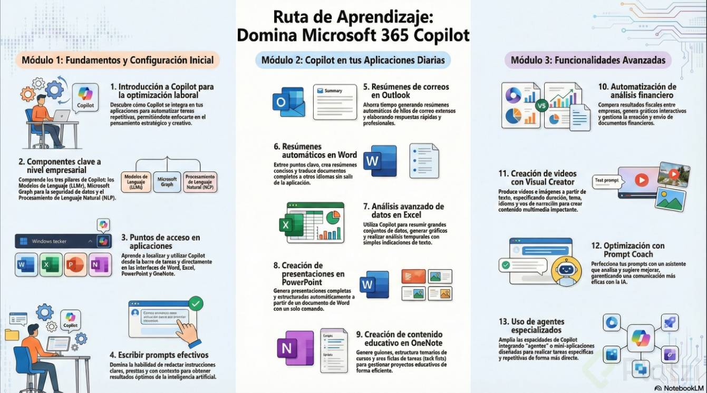

# Curso Microsoft 365 Copilot

| Detalle | Información |
| :--- | :--- |
| **Publicado el** | Publicado el 05 de Marzo de 2021 |
| **Profesor** | ADMIN ESPONOZA  |
| **Fecha de Inicio** | 01/06/2026 |
| **Fecha de Fin** |  |

> Microsoft 365 Copilot es un asistente inteligente impulsado por inteligencia artificial que potencia tu productividad al integrarse de forma fluida con las principales aplicaciones de Microsoft, como Word, Excel, PowerPoint, Outlook y Teams. Te ayuda a redactar documentos, analizar datos, crear presentaciones, gestionar correos electrónicos y colaborar en equipo de manera más eficiente y creativa.
---

  

| Curso | Certificado |
| :--- | :---: |
| Curso Microsoft 365 Copilot | [Ver PDF]() |

--- 

# Clase 1: 

**¿Cómo impacta Copilot tus actividades laborales?**

> Microsoft 365 Copilot no es simplemente una herramienta tecnológica más, sino un verdadero compañero digital que se integra perfectamente con aplicaciones fundamentales como Word, Excel, Outlook y Teams, ofreciendo asistencia continua en tareas específicas.

Con Copilot puedes:

- Redactar informes de manera más rápida y eficiente.
- También resumir correos electrónicos extensos.
- Analizar grandes volúmenes de datos.
- Preparar presentaciones completas.
- Todo esto sucede mientras tú te enfocas en aspectos estratégicos y creativos, delegando en Copilot las tareas más repetitivas y rutinarias.

**¿En qué consiste el ahorro de tiempo con Copilot?**

> Diversos estudios avalan que utilizar Copilot puede ahorrarte hasta seis horas de trabajo semanalmente. Esto se logra eliminando la necesidad de estar copiando y pegando información entre aplicaciones o buscando datos específicos en numerosos documentos distintos.

> Cada minuto de tiempo ahorrado se convierte en una oportunidad para tomar decisiones más acertadas o desarrollar ideas mejor ejecutadas.

**¿Qué tan relevante es la privacidad con Copilot?**

> La seguridad y privacidad constituyen elementos esenciales en la oferta de Microsoft 365. Con Copilot, tus datos permanecen completamente resguardados:

- No se emplean para entrenar modelos de inteligencia artificial.
- Todo se gestiona bajo estrictas normas de cumplimiento.

## Clase 02: Componentes clave de Microsoft 365 Copilot

**Cuáles son los componentes de Microsoft Copilot a nivel empresarial**

- LLMs (Large Language Models): son los modelos largos de lenguaje que dan a Copilot la capacidad de responder a preguntas, generar texto y razonar sobre información, igual que cualquier otra inteligencia artificial moderna.

- Graph: la capa de seguridad que conecta a Copilot con tu cuenta de Microsoft y limita su acceso únicamente a los documentos y datos que tú, como usuario, tienes permitido ver.

- NLP (Natural Language Processing): el procesamiento de lenguaje natural que permite a Copilot entender si le hablas en español, inglés o cualquier otro idioma y responderte en el mismo.

**¿Qué es Microsoft Graph en Copilot?** 
- Es el componente de seguridad que valida tus credenciales corporativas y restringe el acceso de la IA solo a los archivos y contactos a los que tu usuario está autorizado.

**Por qué Graph es la pieza de seguridad más importante**

Graph es lo que hace que Copilot empresarial sea distinto a una IA pública. Copilot usa tus credenciales para acceder única y exclusivamente a los documentos que tú puedes ver, ni un archivo más. 

Esto significa que si en tu organización no tienes permiso para abrir un reporte, Copilot tampoco lo verá ni lo usará para responderte.

Puedes explorar cómo funciona Graph con una herramienta llamada Graph Explorer, donde te autenticas con tus credenciales corporativas y consultas datos como tu perfil de trabajo, contactos, correos o personas con las que interactúas en tu compañía. 

Es útil para entender el alcance, aunque en la práctica vas a prescindir de ella porque Copilot ya hace ese trabajo por ti con solo preguntarle.

**Cómo funciona el procesamiento de lenguaje natural en Copilot**

El NLP es el que se encarga de interpretar tu intención sin importar el idioma. Aunque tu interfaz aparezca en inglés, puedes escribirle a Copilot en español y te responderá en español. 

Esto importa porque elimina la fricción de cambiar de idioma entre la herramienta y tu forma natural de pensar y trabajar.

**Cómo distingo Copilot personal de Microsoft 365 Copilot**

En una computadora con Windows vas a ver dos íconos distintos de Copilot, y confundirlos es uno de los errores más comunes al empezar. Cada uno tiene un alcance muy diferente.

> Copilot de Windows: el ícono por defecto del sistema. Lo usas para preguntas personales, búsquedas generales o curiosidades, como pedir datos sobre los Hutts de Star Wars. No accede a archivos de tu empresa.

> Microsoft 365 Copilot: el ícono que dice 365. Aquí encuentras barra lateral con historial de chats, herramientas adicionales y acceso directo a los archivos corporativos de tu cuenta.

**¿Cuál es la diferencia entre Copilot de Windows y Microsoft 365 Copilot?**

> El primero responde a preguntas personales sin acceso a tu empresa. El segundo trabaja con tus archivos corporativos, respeta tus permisos y vive dentro del ecosistema de tu organización.

**Qué pasa con la privacidad de tus datos en Copilot empresarial**

> Una duda recurrente: ¿el modelo aprende con la información de mi empresa? La respuesta es no. Todo lo que se encuentra dentro de Copilot y Microsoft 365 se queda dentro de tu compañía. El modelo no asimila ni copia los datos que utiliza para responderte, lo que te permite usarlo para generar y editar documentos sensibles con tranquilidad.

> Si estás usando Microsoft 365 Copilot es porque tu organización te dio acceso empresarial. Esa diferencia es la que te abre la puerta a productividad real: redactar correos con contexto de tu bandeja, resumir reuniones, crear presentaciones a partir de documentos internos y mucho más.

## CLASE 03: Puntos de acceso a Microsoft 365 Copilot en aplicaciones

**¿Dónde puedo acceder a Copilot desde mi equipo?**

> Acceder a Microsoft 365 Copilot es sencillo gracias a múltiples puntos de entrada integrados en tu área laboral digital. El acceso más habitual se encuentra directamente en la barra de tareas mediante un ícono identificable con el número de "m365". Al abrirlo, visualizarás una interfaz amigable que te facilita moverte rápidamente hacia documentos específicos, páginas creadas previamente o a tus diferentes organizaciones.

> Además de realizar búsquedas sobre calendarios o actividades generales desde este punto, Copilot está integrado de manera específica en aplicaciones clave del paquete Microsoft 365 como Word, Excel, PowerPoint y OneNote.

**¿Cómo aprovecho Copilot en Word, Excel y PowerPoint?**

> Dentro de Microsoft Word, Copilot aparece claramente en la esquina superior derecha al crear un nuevo documento. También puedes acceder directamente desde los íconos ubicados en la parte inferior del área principal, desde donde puedes rescatar documentos almacenados en tu nube personal o indicar tareas específicas al programa, mejorando sustancialmente tu interacción.

> En Excel, la integración también es intuitiva. Al crear una nueva hoja, el ícono de Copilot está visible en la interfaz y, al abrirlo, aparece una ventana de chat cuyas interacciones se reflejan directamente en tu hoja de trabajo. Además, Copilot permanece accesible todo el tiempo que trabajes en Excel, manteniéndose siempre junto a la celda que estés utilizando.

> PowerPoint muestra a Copilot claramente en la esquina superior izquierda de cada diapositiva y en la esquina superior derecha en la barra de actividades. En ambos puntos puedes iniciar conversaciones rápidas y recibir asistencia inmediata para crear presentaciones atractivas de manera sencilla.

**¿De qué manera interactúa Copilot en OneNote?**

> El uso de Copilot dentro de OneNote también facilita manejar tu información de manera eficiente. Al iniciar una nueva nota, Copilot acompaña tu trabajo apareciendo claramente en cada sección creada. Un clic derecho sobre cualquier documento activa funciones avanzadas como:

- Realización de un resumen automático para agilizar la lectura.
- Creación de listas de tareas asistidas por inteligencia artificial.

**¿Cómo aprovecho Copilot en Teams?**

> Dentro de Microsoft Teams, Copilot aparece de forma muy prominente en la esquina superior derecha de todas las conversaciones. Desde aquí puedes abrir un chat y solicitarle que resuma una reunión reciente o prepare una presentación con base en la información que hayas compartido.

## CLASE 04: Cómo guardar y reusar prompts en Copilot

¿Cómo consultar tu agenda con un prompt en Copilot?

Uno de los usos más frecuentes es pedirle a Copilot que muestre tu lista de actividades. Aunque la interfaz esté en inglés, puedes escribir en español sin problema.

Un ejemplo directo es: Muéstrame mi lista de actividades para el resto de la semana. Copilot devuelve la agenda del día y de los días restantes, con hipervínculos a cada reunión [01:30]. Desde esos enlaces puedes abrir el detalle de cada junta para saber qué se espera de ti y cómo llegar mejor preparado.

¿Qué hace un prompt en Copilot? Le indica a la herramienta qué información buscar o generar dentro de tus recursos corporativos, como calendario, correos o contactos, devolviendo resultados accionables con enlaces directos.

¿Cómo encontrar tu última reunión con un compañero?

Otro prompt útil es revisar cuándo fue tu última interacción con alguien. Por ejemplo: cuándo fue mi última reunión con Hannes Nell.

Copilot responde con la fecha del último encuentro y un resumen de las conversaciones recientes. Eso te da contexto antes de retomar el diálogo, lo que vuelve más eficiente abrir una nueva conversación con esa persona [02:30].

¿Cómo obtener información de contacto de un colega?

Si necesitas datos de un compañero, basta con pedir: Dame información de Eduardo Sánchez. El resultado incluye:

Las formas de contactarlo dentro de la organización.
El país en el que se encuentra, útil en equipos globales para identificar zonas horarias.
Un enlace al perfil corporativo completo.
Esto resulta clave cuando trabajas en estructuras distribuidas y necesitas coordinar con personas de distintas regiones [03:30].

¿Cómo guardar prompts en Copilot para reutilizarlos?

Muchos de estos prompts se repiten una o dos veces por semana, así que guardarlos ahorra tiempo. Junto a cada prompt aparece un ícono para salvarlo, que abre una ventana modal donde defines un título, por ejemplo prompt lunes, para recordar que lo usas al inicio de la semana.

Una vez guardado, ya no tienes que volver a escribirlo: lo invocas con un clic y obtienes el mismo resultado de forma directa.

¿Para qué sirve guardar un prompt? Permite reutilizar instrucciones frecuentes sin reescribirlas, acelerando tareas repetitivas como revisar agenda, buscar contactos o preparar reuniones.

¿Dónde está la Prompt gallery de Copilot?

En un chat nuevo, al presionar el botón ver más aparecen sugerencias adicionales y, más abajo, la opción Prompt gallery. Esa galería organiza los prompts en tres categorías:

Microsoft prompts: sugerencias oficiales de Copilot para aprovechar sus herramientas de forma eficiente.
Tus propios prompts: los que tú has diseñado y guardado, listos para reutilizar.
Prompts de equipo: instrucciones que tus compañeros han compartido contigo.
Los prompts compartidos dependen de los permisos que asigne el autor, que pueden elevarse a nivel equipo, área, organización o compañía completa. Así puedes aprovechar el conocimiento de toda la empresa, no solo el de tu círculo inmediato [05:30].

¿Por qué practicar con prompts mejora tus resultados en Copilot?

Al principio, tus búsquedas pueden salir difusas por falta de experiencia. Con la práctica, refinas la forma de escribir y aprendes a anticipar qué tipo de respuesta dará la inteligencia artificial.

Cada iteración te acerca a usos más avanzados:

Preparar reuniones con contexto previo.
Redactar y responder correos más rápido.
Coordinar agendas con compañeros en distintas zonas horarias.
Documentar conversaciones recurrentes con clientes o equipos internos.

notas 

Para escribir prompts efectivos para Copilot empresarial, considera estos aspectos clave:

Claridad: Sé específico y directo en tus instrucciones. Esto ayuda a Copilot a entender mejor lo que necesitas.
Práctica: Experimenta con diferentes enfoques y ajusta tus prompts según los resultados obtenidos.
Contexto: Proporciona información relevante para que la herramienta pueda ofrecer respuestas más precisas.
Reutilización: Guarda tus prompts útiles para acceder a ellos rápidamente en el futuro.
Exploración: Aprovecha la galería de prompts y las sugerencias de la herramienta.
Recuerda, la habilidad de escribir buenos prompts se mejora con la práctica constante.

## CLASE 05: Resumen de correos electrónicos con Copilot en Outlook

**¿Cómo resumir correos electrónicos con Copilot?**

Copilot se integra en Outlook a través de un icono ubicado en la esquina superior derecha, permitiendo realizar actividades específicas, como el resumen de conversaciones largas. Para ello, basta con hacer clic sobre dicho icono, y la herramienta automáticamente presenta un resumen destacando los puntos clave:

Identifica temas centrales como propuestas o fechas importantes.
Resume expresiones de entusiasmo y acuerdos entre participantes.
Señala fechas concretas relacionadas con proyectos.
Este proceso evita la necesidad de recorrer manualmente grandes bloques de texto para obtener información relevante.

**¿Cómo elaborar respuestas rápidas con Copilot?**

Otra función valiosa de Copilot es la creación de respuestas rápidas. Al seleccionar el correo para responder, basta con redactar una frase breve indicando la idea principal, por ejemplo, disponibilidad o ausencia en reuniones. Copilot convierte esto en una respuesta diplomática y adecuada profesionalmente:

Redacta mensajes diplomáticos y bien estructurados en segundos.
Facilita disminuir el tiempo requerido para comunicarse claramente.
Esto permite ahorrar tiempo en la gestión diaria del correo electrónico, mejorando así la eficiencia laboral.

**¿En qué situaciones es ideal usar Copilot?**

Copilot es especialmente útil al interactuar con personas externas mediante correo electrónico, especialmente cuando la cantidad de mensajes en conversación aumenta rápidamente. Su uso es ideal en situaciones como:

Gestión colaborativa de proyectos.
Coordinación de cursos o eventos especiales.
Comunicaciones multiplataforma cuando no se emplea herramientas como Teams.

> NOTAS 

Es probable que la falta de conexión a la red de la empresa limite el acceso a algunas funciones de Copilot en Office 365. Muchas de estas herramientas dependen de servicios en la nube que requieren una buena conexión a Internet. Asegúrate de estar conectado a la red adecuada y de tener acceso a las actualizaciones necesarias para que todas las funciones se activen correctamente.